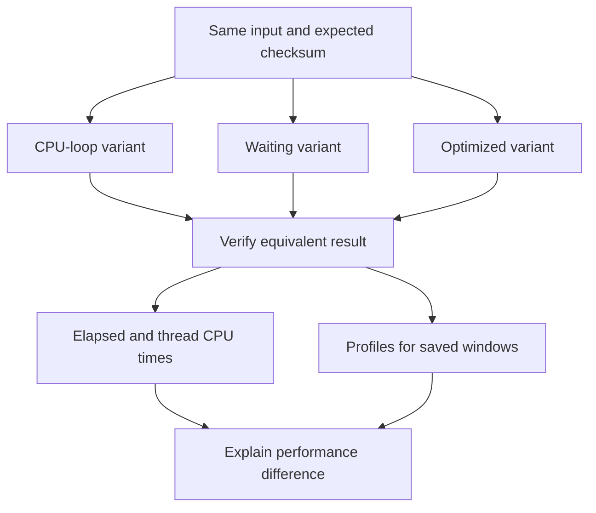

# Lab 43: CPU Work, Waiting, and Differential Profiling

## 1. Purpose and Learning Outcomes

You will compare three ways to return the same result: a CPU-intensive loop, an operation that waits, and an optimized calculation. Fixed inputs and checksum checks keep the comparison fair. Use client elapsed time, worker CPU time, and profiles together to explain improvements and waiting that a CPU profile may barely show.

> **Primary Objective:** Compare equivalent CPU-heavy, waiting-heavy, and optimized operations using elapsed time, worker-thread CPU time, and differences between profiles.

Lab 42 proved that CPU samples reach Pyroscope. Now control the work so those samples support a meaningful comparison. Add a limited learning endpoint with three implementations, verify identical checksums, and distinguish elapsed time, workload volume, and CPU consumption when comparing profiles.

The endpoint extends the current app without replacing CRUD, changing the database schema, or adding a service. Its worker-thread design also provides an explicit profiling scope for Lab 44.

## 2. Starting Point and Lab Map

Open the complete application repository before using this guide. Unless a step says otherwise, run commands in Bash from the repository's top-level folder. Follow the starting checks in order because later commands depend on the helper functions and running services they prepare.

Read each explanation before running its commands. Run one complete code block, check the result, and then continue. In your notebook, save the commands, what happened, why you think it happened, and anything that differed from the expected result.

### Key Terms

| **Term**             | **Explanation**                                                                            |
| -------------------- | ------------------------------------------------------------------------------------------ |
| Elapsed time         | Time from start to finish, including intervals when the operation is waiting.              |
| Thread CPU time      | CPU execution time used by the particular worker thread being measured.                    |
| Differential profile | A comparison of sampled stack weight between a chosen baseline and comparison workload.    |

### Lab Map

The arrows show how the parts connect and where a request can take different paths. Use this map to understand the design. It is not a recording of a request that actually ran.



## 3. Guided Walkthrough

### Step 01. Inherited State and Starting Checks

**What You Are Doing:** Begin with a known visible CPU profile and stop unrelated load. Keep inputs, configuration, and evidence windows controlled across comparisons.

**Practical Walkthrough:** Verify the baseline profile, then stop competing workloads. Use the same work size and settings for each implementation. Save separate intervals so one variant's samples are not silently included in another's result.

Preserve a known profile and hold workload size and configuration constant. Separate the measurement intervals and account for query margins. Otherwise, mixed baseline, waiting, and optimized work could create a misleading comparison.

```bash
source lab-notes/session.sh
source lab-notes/evidence.sh
source lab-notes/metrics-session.sh
source lab-notes/platform-session.sh
source lab-notes/traces-session.sh
source lab-notes/profiling/session.sh
load_app_settings
start_lab 43
dp config --quiet
wait_ready
wait_backend pyroscope:4040 /ready
wait_backend tempo:3200 /ready
test -s lab-notes/profiling/profile-type.txt
cp app/app/main.py "$LAB_DIR/main.before.py"
dp exec -T app python - <<'CHECK'
from app.config import Settings
s=Settings()
assert s.demo_enabled and s.pyroscope_enabled and s.trace_sample_ratio==1.0
CHECK
```

Complete [Lab 42](Lab-42.md), including retrieval of a nonzero profile. Use the same repository root and `dp` helper, keep one Uvicorn worker, and stop unrelated generators. Save each run to a new file; the loader refuses to overwrite existing evidence.

Tail sampling may discard ordinary successful traces, while independently collected CPU profiles still arrive. This lab compares workload windows and response measurements. Lab 44 adds deterministic retention for the span-specific comparison.

**Understanding the Result:** Fixed inputs and known intervals make results interpretable. Unrelated work can change both latency and sample weight.

### Step 02. Learning Objectives and Experimental Controls

**What You Are Doing:** Verify equal checksums before comparing speed. A faster implementation is not the intended optimization if it changes or skips the required result.

**Practical Walkthrough:** Give every variant the same bounded input and check its checksum. Baseline, waiting, and optimized paths must preserve the specified output. Pair performance measurements with that correctness proof.

Check input equality, completed work, and returned checksums first. Then compare timing and profiles. This prevents an implementation that simply does less required work from being mistaken for a valid improvement.

Each variant calculates the sum of squared integers from zero through `n-1`, then takes the result modulo 1,000,000,007. Their returned checksums must match.

| **Variant** | **Implementation**                                     | **Predicted Elapsed Time**                          | **Predicted Thread CPU** |
| ----------- | ------------------------------------------------------ | --------------------------------------------------- | ------------------------ |
| `cpu`       | A Python loop using modular arithmetic                 | Substantial, with duration depending on the machine | Substantial              |
| `wait`      | A 300 ms sleep followed by the closed-form calculation | At least about 300 ms inside the worker             | Small                    |
| `optimized` | A closed-form integer calculation                      | Small                                               | Small                    |

The formula is `n(n-1)(2n-1)/6`, and its integer division is exact here. It preserves the required result for nonnegative integers. This is a clear teaching example, not a claim that every business loop can be replaced by a formula.

**Prediction Checkpoint:** A slow request need not create a wide CPU stack. The waiting variant should show a large gap between elapsed and CPU time. Use equal completed counts and equal `n` to compare equal logical work. Equal wall-clock windows alone would let the faster variant complete more work and distort the result.

**Understanding the Result:** Correctness comes before performance claims. Retain the checksum assertions alongside the timing evidence.

### Step 03. Implement the Bounded Worker Endpoint

**What You Are Doing:** Run the limited workload off the event-loop thread. Keep its concurrency guard held by the worker until the underlying work actually finishes.

**Practical Walkthrough:** Dispatch the worker to another thread and keep the guard there through completion. If the awaiting request is cancelled, the still-running worker must not release its protection early. This keeps workload concurrency bounded while leaving the asynchronous request loop responsive.

Follow dispatch, guard acquisition, completion, and release. A cancelled caller can leave thread work running. The worker must retain the guard so another request cannot accidentally overlap that unfinished CPU work.

Create the following module. `asyncio.to_thread()` moves calculation and blocking sleep off the event-loop thread and carries context variables with it. A synchronous semaphore remains held by the executing worker until completion, even if the waiting caller disconnects. This avoids releasing protection while cancelled thread work continues.

The semaphore permits one learning workload at a time per process; competing requests receive 429. Query validation limits iterations. Profile tags use only three workload values and their corresponding implementation values. Keep request IDs and arbitrary user input out of general profile tags.

```bash
cat > app/app/profile_work.py <<'PYTHON'
"""Synchronous bounded work in a worker thread; safe thread-local profiling scopes."""
import asyncio
import logging
import threading
import time
from contextlib import nullcontext
from typing import Annotated, Literal

from fastapi import APIRouter, HTTPException, Query, Request
from opentelemetry.trace import Tracer

router=APIRouter(prefix='/api/v1/demo',tags=['learning'])
logger=logging.getLogger(__name__)
_RUNNING=threading.BoundedSemaphore(1)
MODULUS=1000000007


def sum_squares_loop(iterations: int) -> int:
    total=0
    for value in range(iterations):
        total=(total+value*value)%MODULUS
    return total


def sum_squares_formula(iterations: int) -> int:
    return (iterations*(iterations-1)*(2*iterations-1)//6)%MODULUS


def run_work(tracer: Tracer, enabled: bool, variant: str, iterations: int, request_id: str) -> dict[str,object]:
    if not _RUNNING.acquire(blocking=False):
        raise HTTPException(429,'Learning workload already running')
    try:
        with tracer.start_as_current_span('demo.profile_work',attributes={
            'app.operation':'sum_squares','app.workload':variant},record_exception=False) as span:
            tags={'workload':variant,'implementation':'formula' if variant=='optimized' else variant}
            # PROFILE_LINK_POINT: Lab 44 adds a reserved span sample label here.
            if enabled:
                import pyroscope
                scope=pyroscope.tag_wrapper(tags)
            else:
                scope=nullcontext()
            with scope:
                started,cpu_started=time.perf_counter(),time.thread_time()
                span.add_event('work.started',{'app.workload':variant})
                if variant=='wait':
                    time.sleep(0.3)
                    checksum=sum_squares_formula(iterations)
                elif variant=='optimized':
                    checksum=sum_squares_formula(iterations)
                else:
                    checksum=sum_squares_loop(iterations)
                cpu_ms=(time.thread_time()-cpu_started)*1000
                wall_ms=(time.perf_counter()-started)*1000
                span.set_attribute('app.outcome','success')
                span.add_event('work.completed',{'app.workload':variant})
                context=span.get_span_context()
                logger.info('profile_work_completed',extra={'operation':variant,'duration_ms':round(wall_ms,3)})
                return {'request_id':request_id,'variant':variant,'iterations':iterations,'checksum':checksum,
                    'wall_ms':round(wall_ms,3),'thread_cpu_ms':round(cpu_ms,3),
                    'trace_id':f'{context.trace_id:032x}','span_id':f'{context.span_id:016x}',
                    'trace_sampled':context.trace_flags.sampled,'profiler_started':enabled}
    finally:
        _RUNNING.release()


@router.get('/profile-work')
async def profile_work(request: Request,
        variant: Literal['cpu','wait','optimized']='cpu',
        iterations: Annotated[int,Query(ge=1000,le=3000000)]=2000000) -> dict[str,object]:
    if not request.app.state.settings.demo_enabled:
        raise HTTPException(404,'Not found')
    return await asyncio.to_thread(run_work,request.app.state.tracer,
        request.app.state.telemetry.profile_started,variant,iterations,request.state.request_id)
PYTHON
```

**Command Note:** `<<'PYTHON'` writes the block exactly as shown until the closing `PYTHON`. Its quotes prevent Bash from expanding `$variables` inside the file. Creation and execution are separate actions.

```bash
python3 - <<'PYTHON'
from pathlib import Path
p=Path('app/app/main.py'); text=p.read_text()
assert 'app.state.telemetry' in text, 'Complete the Lab 35 lifespan/state integration first'
if 'from app.profile_work import router as profile_router' not in text:
    assert text.count('from app.api import router')==1
    text=text.replace('from app.api import router',
        'from app.api import router\nfrom app.profile_work import router as profile_router')
    assert text.count('    app.include_router(router)')==1
    text=text.replace('    app.include_router(router)',
        '    app.include_router(router)\n    app.include_router(profile_router)')
p.write_text(text)
PYTHON
dp up -d --no-deps --build app
wait_ready
dp exec -T app python - <<'CHECK'
from app.profile_work import sum_squares_loop, sum_squares_formula
assert sum_squares_loop(0)==sum_squares_formula(0)==0
assert sum_squares_loop(4)==sum_squares_formula(4)==14
for n in [1,2,10,1000,10001]:
    assert sum_squares_loop(n)==sum_squares_formula(n)
print('Independent implementations agree on boundary and representative inputs')
CHECK
api -fsS "$APP_URL/api/v1/demo/profile-work?variant=cpu&iterations=2000000" \
  -H 'X-Request-ID: lab43-smoke' > "$LAB_DIR/smoke.json"
jq -e '.request_id=="lab43-smoke" and .profiler_started==true and .trace_sampled==true' \
  "$LAB_DIR/smoke.json"
jq '{variant,iterations,checksum,wall_ms,thread_cpu_ms,trace_id,span_id}' "$LAB_DIR/smoke.json"
```

The response reports worker elapsed time separately from worker-thread CPU time. These values exclude some HTTP queueing, serialization, and transport. Client end-to-end timing and the native HTTP histogram cover different intervals, so label them clearly in your evidence.

Python threads still share the GIL. Offloading avoids directly blocking the event-loop thread, but sustained Python computation can still compete with other threads for the GIL. This endpoint is a measurement exercise, not a production CPU scheduler. Keep the application's existing configured tracer provider rather than adding a global one.

**Understanding the Result:** Wall time and thread CPU time measure different quantities. Moving work to another thread changes scheduling, not automatically the amount of computation.

### Step 04. Install a Fixed-Work Load Generator

**What You Are Doing:** Install a sequential client that records request identities and timings for fixed work. Correctness checks keep the exercise from becoming an uncontrolled concurrency test.

**Practical Walkthrough:** Use the client to run fifty requests per variant with the bounded two-million-work input. Record IDs, timing, and checksum results. Sequential execution keeps the workload finite and comparable across implementations.

Read the client's input, count, timeout, and checksum assertions before running it. Use exclusive output files for each variant. Adding uncontrolled concurrency would introduce resource contention and change the question being measured.

```bash
cat > lab-notes/profiling/profile_load.py <<'PYTHON'
"""One sequential caller, fixed work size and exclusive evidence file."""
import argparse
import json
import time
import uuid
from urllib.parse import urlencode
from urllib.request import ProxyHandler, Request, build_opener

parser=argparse.ArgumentParser()
parser.add_argument('base_url');parser.add_argument('output')
parser.add_argument('--variant',choices=['cpu','wait','optimized'],required=True)
parser.add_argument('--count',type=int,default=50)
parser.add_argument('--iterations',type=int,default=2000000)
args=parser.parse_args()
assert 1<=args.count<=100 and 1000<=args.iterations<=3000000
opener=build_opener(ProxyHandler({}))
with open(args.output,'x') as output:
    for number in range(args.count):
        request_id='profile-'+str(uuid.uuid4())
        request=Request(args.base_url.rstrip('/')+'/api/v1/demo/profile-work?'+urlencode({
            'variant':args.variant,'iterations':args.iterations}),headers={'X-Request-ID':request_id})
        start=time.time_ns()
        with opener.open(request,timeout=8) as response:
            body=json.load(response);status=response.status
        assert status==200 and body['request_id']==request_id
        expected=(args.iterations*(args.iterations-1)*(2*args.iterations-1)//6)%1000000007
        assert body['checksum']==expected
        output.write(json.dumps({'start_ns':start,'end_ns':time.time_ns(),'status':status,'response':body})+'\n')
        output.flush();time.sleep(0.2)
print(json.dumps({'variant':args.variant,'requests':args.count,'output':args.output}))
PYTHON
```

The loader sends one request at a time, validates its checksum and request ID, saves timestamps and response measurements, and pauses between calls. Defaults are fifty requests per variant and two million iterations. It does not force incoming trace sampling or create unlimited concurrency.

Predict the ranking of median elapsed time, median thread CPU, and profile weight before the main run. Exact times depend on the VM, interpreter, scheduling, and profiler overhead. Use observed measurements rather than treating example timings as performance promises.

**Understanding the Result:** The ledger records each attempt's correctness and timing. Profiles add sampled execution context across the workload; they do not replace that ledger.

### Step 05. Run Comparable Work and Preserve Query Windows

**What You Are Doing:** Run each variant with its own interval and labels. Wider query margins help retrieve uploads but do not make profile samples exact accounting for each request.

**Practical Walkthrough:** Save each variant's active interval and workload labels. Use the specified margins for profile queries and keep them distinct from request duration. Faster work can yield fewer samples simply because it spends less time executing.

Compare measured equal-work timing with sample weight. Keep active request intervals and broader upload windows separately recorded. An optimized calculation may finish between samples, so reduced profile visibility must be interpreted alongside its completed work.

```bash
for variant in cpu wait optimized; do
  python3 lab-notes/profiling/profile_load.py "$APP_URL" "$LAB_DIR/$variant.jsonl" \
    --variant "$variant" --count 50 --iterations 2000000
  sleep 12
done
sleep 15
python3 - "$LAB_DIR" <<'PYTHON'
import json,math,statistics,sys
from pathlib import Path
root=Path(sys.argv[1]); summaries=[]
for variant in ['cpu','wait','optimized']:
    rows=[json.loads(line) for line in (root/(variant+'.jsonl')).read_text().splitlines()]
    assert len(rows)==50 and all(r['status']==200 for r in rows)
    wall=[r['response']['wall_ms'] for r in rows]
    cpu=[r['response']['thread_cpu_ms'] for r in rows]
    client=[(r['end_ns']-r['start_ns'])/1e6 for r in rows]
    window={'start':rows[0]['start_ns']//1000000-10000,
            'end':rows[-1]['end_ns']//1000000+10000}
    (root/(variant+'-window.json')).write_text(json.dumps(window))
    summaries.append({'variant':variant,'requests':len(rows),
      'worker_wall_median_ms':statistics.median(wall),
      'thread_cpu_median_ms':statistics.median(cpu),
      'client_p95_ms':sorted(client)[math.ceil(.95*len(client))-1],
      'worker_cpu_total_ms':round(sum(cpu),3)})
(root/'comparison.json').write_text(json.dumps(summaries,indent=2))
print(json.dumps(summaries,indent=2))
PYTHON
PROFILE_TYPE=$(cat lab-notes/profiling/profile-type.txt)
for variant in cpu wait optimized; do
  SELECTOR="{service_name=\"$LAB_SERVICE\",environment=\"$LAB_ENVIRONMENT\",workload=\"$variant\"}"
  QUERY=$(jq --arg selector "$SELECTOR" --arg type "$PROFILE_TYPE" \
    '.+{labelSelector:$selector,profileTypeID:$type}' "$LAB_DIR/$variant-window.json")
  printf '%s\n' "$QUERY" > "$LAB_DIR/$variant-query.json"
  pquery SelectMergeStacktraces "$QUERY" > "$LAB_DIR/$variant-profile.json"
done
jq -e '(.flamegraph.total // 0 | tonumber)>0' "$LAB_DIR/cpu-profile.json"
```

**Command Note:** `jq --arg` passes a shell value as a string variable rather than inserting it into query text. Where used, `-e` makes a final false or null result fail the command.

Ten-second query margins cover upload aggregation around short request intervals. The `workload` tag separates variants even when upload buckets overlap. These wider intervals still do not provide exact per-request sample accounting.

The CPU case must produce work samples. Waiting and optimized cases may contain little or no selected CPU weight because their calculation can finish between samples. Compare that result with completed-request counts and measured CPU time. An empty waiting profile alone does not mean the endpoint never ran.

`thread_cpu_ms` uses `time.thread_time()`, excluding time when the worker is not executing on a CPU. Statistical sampling and GIL restrictions mean profile weight need not exactly equal summed response CPU measurements. Very small response values can also round to zero.

**Understanding the Result:** Sample density and request count are different. Interpret equal work, timing, and profiles together.

### Step 06. Perform Differential Profiling

**What You Are Doing:** Compare baseline and optimized profiles using the interface's stated comparison direction. Connect changed sample weight with checksum and timing evidence.

**Practical Walkthrough:** Select the saved baseline and optimized populations, then read the legend before interpreting colors. A visual difference supports an improvement only when the work is equivalent and the timing evidence agrees.

Inspect a changed frame's weight on both sides. Compare it with request count, input size, checksum, and timing from the ledger. State whether the view shows absolute or normalized values; otherwise, a shorter window could look like an improvement without a fair workload comparison.

```bash
DIFF_QUERY=$(jq -n --slurpfile left "$LAB_DIR/cpu-query.json" \
  --slurpfile right "$LAB_DIR/optimized-query.json" '{left:$left[0],right:$right[0]}')
pquery Diff "$DIFF_QUERY" > "$LAB_DIR/cpu-vs-optimized-diff.json"
jq 'keys' "$LAB_DIR/cpu-vs-optimized-diff.json"
```

In Grafana's Pyroscope view, select the baseline and optimized windows using their saved times and workload labels. Open the diff view and read its legend for baseline direction and increase/decrease colors. Do not assume a remembered color scheme applies.

Expect a large reduction in `sum_squares_loop` work on the optimized path. Check absolute totals as well as relative width. A function's percentage may rise merely because another function became cheaper. If the optimized side has no sampled CPU, percentage normalization may be undefined or misleading; report absolute change and response timings instead.

Next compare `cpu` and `wait`. The waiting case can take longer while using less CPU. Use retained span duration and `work.started`/`work.completed` events to investigate that elapsed interval. If the trace was sampled out, keep the gap explicit and use a known retained case in Lab 44. A CPU flamegraph alone cannot explain the full wait.

Save query JSON, request counts, `n`, measured CPU totals, profile units, and observed stacks. This supports a checkable claim about CPU per completed operation. A sequential fixed-work test does not establish improved throughput; that needs a separate controlled load experiment.

**Understanding the Result:** State which population is baseline and which is comparison. Reversing them reverses the meaning of a signed difference.

### Step 07. Check Bounds and Concurrent Rejection

**What You Are Doing:** Test validation limits and rejection of overlapping requests. Before diagnosing a missing rejection, confirm that the calls actually overlapped.

**Practical Walkthrough:** Run the prescribed invalid inputs and concurrency check. Two requests that finish one after the other do not test the guard. After the expected rejection, run valid work to confirm that the worker remains usable.

Verify input rejection within the stated bounds and establish real overlap. Then send a normal valid request. This checks that protection works without leaving the worker permanently locked after the test.

```bash
STATUS=$(api -sS -o "$LAB_DIR/invalid.json" -w '%{http_code}' \
  "$APP_URL/api/v1/demo/profile-work?variant=cpu&iterations=3000001")
test "$STATUS" = 422
python3 - "$APP_URL" <<'PYTHON'
import concurrent.futures,threading,sys
from urllib.error import HTTPError
from urllib.request import ProxyHandler,build_opener
barrier=threading.Barrier(2)
def call():
    opener=build_opener(ProxyHandler({})); barrier.wait()
    try:
        with opener.open(sys.argv[1]+'/api/v1/demo/profile-work?variant=wait',timeout=5) as r:
            return r.status
    except HTTPError as e:
        return e.code
with concurrent.futures.ThreadPoolExecutor(max_workers=2) as pool:
    results=list(pool.map(lambda _:call(),range(2)))
print('Concurrent statuses:',sorted(results))
assert sorted(results)==[200,429], 'Repeat once if host scheduling serialized both callers'
PYTHON
wait_ready
```

The concurrency test uses the 300 ms waiting path so requests should overlap under normal scheduling. If both return 200, inspect their timing before blaming the guard. The assertion checks the setup as well as the implementation. Do not increase thread count to force a result. This endpoint changes no database or cache data.

**Understanding the Result:** A concurrency negative test requires real overlap. The worker-held guard should protect the operation until its underlying work ends.

## 4. Troubleshooting and Diagnosis

Begin with the first result that differed from your prediction. Save the exact error or symptom and identify which service or command produced it. Use the checks below, make the needed fix, and repeat the original check to confirm the problem is resolved.

### Troubleshooting and Evidence Limits

| **Observation**                              | **Explanation to Test**                                                                                                           |
| -------------------------------------------- | --------------------------------------------------------------------------------------------------------------------------------- |
| Route returns 404                            | Check `DEMO_ENABLED`, router registration, and the rebuilt application image.                                                     |
| `profiler_started=false`                     | Inspect startup logs and the profiling overlay before calling an empty profile low CPU usage.                                     |
| `wait` latency is large but profile is small | Compare elapsed and thread CPU time; off-CPU sleep should produce this difference.                                                |
| CPU work appears under another variant       | Check tag lifetime, selectors, and overlapping processes. The context manager must wrap synchronous work on the executing thread. |
| CPU timing worsens with unrelated load       | Isolate the same bounded run again; VM scheduling or GIL contention changed the conditions.                                       |
| Diff looks dramatic but work counts differ   | Compare equal completed work or normalize appropriately. Unequal workload totals do not establish a per-operation improvement.    |
| Profile shows no source line                 | Detail depends on configuration and available source. Function-level evidence can still be useful.                                |

Keep the endpoint, loader, and tags for Lab 44. To undo only this application change, restore this run's `main.py`, remove `profile_work.py`, rebuild the app, and verify existing routes. After Lab 44, review its dependent correlation settings before using this rollback.

See [Python thread CPU clocks](https://docs.python.org/3/library/time.html#time.thread_time), [asyncio thread execution](https://docs.python.org/3/library/asyncio-task.html#asyncio.to_thread), [Pyroscope comparison view](https://grafana.com/docs/pyroscope/latest/view-and-analyze-profile-data/), and Lab 42's query API reference.

## 5. Review and Practice

Answer the questions in your own words before reading the answers. For the scenario, say what you would inspect and exactly what each result would tell you.

### Knowledge Check

1. Why use thread CPU time instead of process CPU time here?
2. Why hold the semaphore inside the synchronous worker?
3. Why is a faster implementation’s percentage share insufficient evidence?
4. Does asyncio.to_thread remove the GIL?

#### Answer Guide

1. Thread CPU time isolates this worker's CPU use rather than adding work done by unrelated threads in the process.
2. Cancelling the awaiting task does not necessarily stop its thread. The actual worker must hold the guard until it finishes.
3. A percentage depends on the total being compared. Check absolute weight and equal completed work to support a per-operation claim.
4. No. It moves blocking work away from the event-loop thread, while Python computation can still compete for the GIL.

### Professional Scenario Exercise

An endpoint takes 320 ms elapsed time but uses under 2 ms of measured thread CPU. A teammate proposes optimizing arithmetic because the handler appears in the flamegraph. Explain the alternative hypothesis that it is waiting, identify the span evidence needed, and design a limited experiment whose result could disprove your explanation.

## 6. Completion Checklist

Tick an item only when you can show its result or saved evidence. Finish the cleanup instructions before starting the next lab.

### Observable Completion Criteria

- [ ] All three variants return the same verified checksum.
- [ ] The worker is bounded, and competing work can return 429 while unrelated health checks remain responsive.
- [ ] Each variant completes fifty requests with saved timing and query evidence.
- [ ] The CPU stack is visible, and the optimized path removes the loop work.
- [ ] The waiting case shows elapsed delay without matching CPU weight.
- [ ] Conclusions distinguish per-operation CPU, elapsed latency, throughput, and sampling uncertainty.

## 7. Production Context and Next Lab

### Production Implications

Use representative inputs and equal work before choosing an optimization. Sampling suggests candidates; correctness checks and controlled measurements show whether changes help. Real waits may involve networks, locks, queues, or storage and need matching trace and dependency evidence. The demo semaphore is local to one process and does not control admission across a fleet.

### End State and Transition

Keep `/api/v1/demo/profile-work`, its workload tags, and the loader. Fourteen services and nine scrape jobs remain. Profiles still describe service/workload populations rather than proven individual-request links. [Lab 44](Lab-44.md) connects a sampled worker span with its own profile samples.
