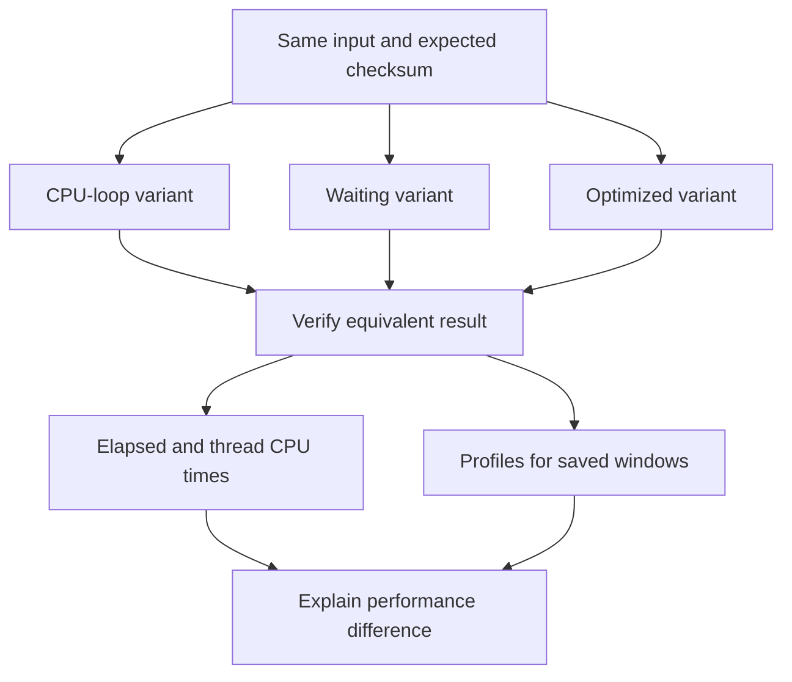

# Lab 43: CPU Work, Waiting, and Differential Profiling

## 1. Purpose and Learning Outcomes

**In Plain Language:** You will compare three ways to produce the same result: a CPU loop, a waiting operation, and an optimized calculation. Fixed work and checksum checks keep the comparison fair. Combine client elapsed time, worker CPU time, and profiles to explain both the improvement and the waiting that a CPU profile may barely show.

> **Primary Objective:** Compare equivalent CPU-heavy, waiting-heavy and optimized operations using elapsed time, thread CPU time and differential profiles.

Lab 42 proved that sampled CPU stacks reach Pyroscope. This lab makes those samples interpretable by controlling the work being measured. You will add one bounded learning endpoint with three implementations, preserve correctness with deterministic checksums, and compare profiles without confusing elapsed time, workload volume and CPU consumption.

The endpoint extends the existing app. It does not replace CRUD, alter database schema or create another service. Its worker-thread design also prepares a safe, explicit profiling scope for Lab 44.

## 2. Starting Point and Lab Map

Use this guide inside the complete application repository. Run commands from the repository root in Bash unless a step says otherwise. Work through the starting checks in order; they load the helpers and state this lab needs.

Read the explanation before each step, run one complete code block at a time, and compare the actual result with the stated expectation. Save commands, observations, explanations, and unexpected results in your notebook.

### Key Terms

| **Term**             | **Plain-Language Meaning**                                                                 |
| -------------------- | ------------------------------------------------------------------------------------------ |
| Elapsed time         | Total time from an operation's start to finish, including waiting.                         |
| Thread CPU time      | Processor execution time consumed by the measured worker thread.                           |
| Differential profile | A comparison of sampled stack weight between selected baseline and comparison populations. |

### Lab Map

The arrows show the flow or dependency being studied. Branches identify paths to compare; this is a conceptual map, not a captured runtime trace.



## 3. Guided Walkthrough

### Step 01. Inherited State and Starting Checks

**What You Are Doing:** Start with a visible CPU profile and stop unrelated load. Controlled comparisons need stable work, configuration, and evidence windows.

**Practical Walkthrough:** Start with a known visible CPU profile and stop competing load before comparing implementations. Keep configuration and workload size constant across variants. Separate evidence windows so a profile from one variant does not silently contribute to another's comparison.

Stop competing load and preserve one known visible baseline profile before comparison. Keep work size and configuration fixed across variants. Save separate intervals so query margins do not silently mix baseline, waiting, and optimized work into one apparent result.

```bash
source lab-notes/session.sh
source lab-notes/evidence.sh
source lab-notes/metrics-session.sh
source lab-notes/platform-session.sh
source lab-notes/traces-session.sh
source lab-notes/profiling/session.sh
load_app_settings
start_lab 43
dp config --quiet
wait_ready
wait_backend pyroscope:4040 /ready
wait_backend tempo:3200 /ready
test -s lab-notes/profiling/profile-type.txt
cp app/app/main.py "$LAB_DIR/main.before.py"
dp exec -T app python - <<'CHECK'
from app.config import Settings
s=Settings()
assert s.demo_enabled and s.pyroscope_enabled and s.trace_sample_ratio==1.0
CHECK
```

Complete [Lab 42](Lab-42.md), including a nonzero CPU profile. Use the same repository root and stage-aware `dp` helper. Keep one Uvicorn worker and stop unrelated load generators. Save each run to a fresh evidence file; the loader refuses to overwrite previous observations.

The inherited tail policies can discard ordinary successful traces. That does not suppress independently collected CPU profiles. This lab compares profile windows and response measurements; deterministic span-specific retention is added in Lab 44.

**Understanding the Result:** Controlled input and timing make the comparison interpretable. An unrelated workload can change both latency and sampled stack weight.

### Step 02. Learning Objectives and Experimental Controls

**What You Are Doing:** Verify that every variant computes the same checksum before comparing speed. A faster operation that does less or different work would not demonstrate the intended optimization.

**Practical Walkthrough:** Verify the variants compute the same checksum for the same bounded input before considering speed. The baseline, waiting, and optimized cases must preserve the intended result. A faster function that skips work or changes output would not demonstrate the claimed optimization.

Check identical inputs and checksum outputs before interpreting performance. The optimization claim requires equivalent work, not merely a faster response. Pair timings and profile differences with that correctness evidence so skipped computation cannot be mistaken for an improvement.

All variants compute the sum of squared integers from zero through `n-1`, modulo 1,000,000,007. They return the same checksum.

| **Variant** | **Implementation**                    | **Predicted Elapsed Time**              | **Predicted Thread CPU** |
| ----------- | ------------------------------------- | --------------------------------------- | ------------------------ |
| `cpu`       | Python loop with modular arithmetic   | Substantial and hardware-dependent      | Substantial              |
| `wait`      | Sleep 300 ms, then closed-form result | At least about 300 ms inside the worker | Small                    |
| `optimized` | Closed-form integer arithmetic        | Small                                   | Small                    |

The formula is `n(n-1)(2n-1)/6`; integer division is exact for this expression. This optimization preserves the specified result for nonnegative integers. It is a deliberately understandable example, not a claim that arbitrary business loops can be replaced with a formula.

**Prediction Checkpoint:** a slow request does not necessarily contain a wide CPU stack. The waiting variant should have a large wall/CPU gap. Equal completed request counts and equal `n` establish equal logical work; equal wall-clock windows alone would allow a faster implementation to process more work and distort the comparison.

**Understanding the Result:** Correctness is the prerequisite for performance comparison. Keep checksum assertions in the workload evidence.

### Step 03. Implement the Bounded Worker Endpoint

**What You Are Doing:** Implement the bounded worker endpoint with work off the event-loop thread. The concurrency guard remains held by the actual worker until its work is finished.

**Practical Walkthrough:** Implement the worker off the event-loop thread and keep the concurrency guard held by the actual worker until it finishes. Cancellation of the awaiting request must not prematurely permit overlapping work. This preserves the bounded resource model while allowing the app's asynchronous request loop to remain responsive.

Follow worker dispatch, concurrency-guard acquisition, actual worker completion, and release. The guard must remain held if the awaiting request is cancelled while work continues. This preserves the bounded experiment and prevents an apparently abandoned request from allowing unintended overlapping CPU work.

Create the module below. `asyncio.to_thread()` keeps the calculation and blocking sleep off the event-loop thread and propagates context variables. A synchronous semaphore is held by the actual worker until completion, including if its awaiting caller disconnects. This avoids releasing a concurrency guard while cancelled thread work is still running.

The semaphore allows one learning workload at a time per process; a competing request receives 429. Query validation bounds iteration count. Profiling tags are restricted to three workload values and the corresponding implementation values. Do not add request IDs or user input as general profile tags.

```bash
cat > app/app/profile_work.py <<'PYTHON'
"""Synchronous bounded work in a worker thread; safe thread-local profiling scopes."""
import asyncio
import logging
import threading
import time
from contextlib import nullcontext
from typing import Annotated, Literal

from fastapi import APIRouter, HTTPException, Query, Request
from opentelemetry.trace import Tracer

router=APIRouter(prefix='/api/v1/demo',tags=['learning'])
logger=logging.getLogger(__name__)
_RUNNING=threading.BoundedSemaphore(1)
MODULUS=1000000007


def sum_squares_loop(iterations: int) -> int:
    total=0
    for value in range(iterations):
        total=(total+value*value)%MODULUS
    return total


def sum_squares_formula(iterations: int) -> int:
    return (iterations*(iterations-1)*(2*iterations-1)//6)%MODULUS


def run_work(tracer: Tracer, enabled: bool, variant: str, iterations: int, request_id: str) -> dict[str,object]:
    if not _RUNNING.acquire(blocking=False):
        raise HTTPException(429,'Learning workload already running')
    try:
        with tracer.start_as_current_span('demo.profile_work',attributes={
            'app.operation':'sum_squares','app.workload':variant},record_exception=False) as span:
            tags={'workload':variant,'implementation':'formula' if variant=='optimized' else variant}
            # PROFILE_LINK_POINT: Lab 44 adds a reserved span sample label here.
            if enabled:
                import pyroscope
                scope=pyroscope.tag_wrapper(tags)
            else:
                scope=nullcontext()
            with scope:
                started,cpu_started=time.perf_counter(),time.thread_time()
                span.add_event('work.started',{'app.workload':variant})
                if variant=='wait':
                    time.sleep(0.3)
                    checksum=sum_squares_formula(iterations)
                elif variant=='optimized':
                    checksum=sum_squares_formula(iterations)
                else:
                    checksum=sum_squares_loop(iterations)
                cpu_ms=(time.thread_time()-cpu_started)*1000
                wall_ms=(time.perf_counter()-started)*1000
                span.set_attribute('app.outcome','success')
                span.add_event('work.completed',{'app.workload':variant})
                context=span.get_span_context()
                logger.info('profile_work_completed',extra={'operation':variant,'duration_ms':round(wall_ms,3)})
                return {'request_id':request_id,'variant':variant,'iterations':iterations,'checksum':checksum,
                    'wall_ms':round(wall_ms,3),'thread_cpu_ms':round(cpu_ms,3),
                    'trace_id':f'{context.trace_id:032x}','span_id':f'{context.span_id:016x}',
                    'trace_sampled':context.trace_flags.sampled,'profiler_started':enabled}
    finally:
        _RUNNING.release()


@router.get('/profile-work')
async def profile_work(request: Request,
        variant: Literal['cpu','wait','optimized']='cpu',
        iterations: Annotated[int,Query(ge=1000,le=3000000)]=2000000) -> dict[str,object]:
    if not request.app.state.settings.demo_enabled:
        raise HTTPException(404,'Not found')
    return await asyncio.to_thread(run_work,request.app.state.tracer,
        request.app.state.telemetry.profile_started,variant,iterations,request.state.request_id)
PYTHON
```

**Command Note:** `<<'PYTHON'` writes the following block literally until `PYTHON`. Quoting the delimiter prevents Bash from expanding `$variables` inside the generated file; creation and execution are separate steps.

```bash
python3 - <<'PYTHON'
from pathlib import Path
p=Path('app/app/main.py'); text=p.read_text()
assert 'app.state.telemetry' in text, 'Complete the Lab 35 lifespan/state integration first'
if 'from app.profile_work import router as profile_router' not in text:
    assert text.count('from app.api import router')==1
    text=text.replace('from app.api import router',
        'from app.api import router\nfrom app.profile_work import router as profile_router')
    assert text.count('    app.include_router(router)')==1
    text=text.replace('    app.include_router(router)',
        '    app.include_router(router)\n    app.include_router(profile_router)')
p.write_text(text)
PYTHON
dp up -d --no-deps --build app
wait_ready
dp exec -T app python - <<'CHECK'
from app.profile_work import sum_squares_loop, sum_squares_formula
assert sum_squares_loop(0)==sum_squares_formula(0)==0
assert sum_squares_loop(4)==sum_squares_formula(4)==14
for n in [1,2,10,1000,10001]:
    assert sum_squares_loop(n)==sum_squares_formula(n)
print('Independent implementations agree on boundary and representative inputs')
CHECK
api -fsS "$APP_URL/api/v1/demo/profile-work?variant=cpu&iterations=2000000" \
  -H 'X-Request-ID: lab43-smoke' > "$LAB_DIR/smoke.json"
jq -e '.request_id=="lab43-smoke" and .profiler_started==true and .trace_sampled==true' \
  "$LAB_DIR/smoke.json"
jq '{variant,iterations,checksum,wall_ms,thread_cpu_ms,trace_id,span_id}' "$LAB_DIR/smoke.json"
```

The response separates worker elapsed time from worker-thread CPU time. It does not include all HTTP queueing, serialization or transport overhead. The client's end-to-end duration and the existing HTTP histogram cover different boundaries; keep their names distinct in evidence.

Python threads still share the GIL. Moving work to a worker prevents a direct event-loop block, but sustained Python CPU work can still contend with other Python threads. This endpoint is an observation exercise, not a production CPU job scheduler. The application tracer is the existing explicitly configured provider; do not introduce a second global provider.

**Understanding the Result:** Thread CPU time and wall time measure different things. Offloading work changes scheduling, not the amount of computation automatically.

### Step 04. Install a Fixed-Work Load Generator

**What You Are Doing:** Install a sequential fixed-work client that records identity and timing. It checks correctness and avoids turning the comparison into an uncontrolled concurrency test.

**Practical Walkthrough:** Install the sequential client with fixed work size, identity capture, timing, and checksum verification. It runs comparable work without introducing uncontrolled concurrency. Use the documented fifty requests per variant and bounded two-million-work input so the comparison remains finite and repeatable.

Read the sequential client's fixed input, request count, timeout, and checksum assertions before running it. Preserve exclusive output files for each variant. Fifty equal-work requests per variant provide a controlled comparison; uncontrolled concurrency would introduce a different resource-contention experiment.

```bash
cat > lab-notes/profiling/profile_load.py <<'PYTHON'
"""One sequential caller, fixed work size and exclusive evidence file."""
import argparse
import json
import time
import uuid
from urllib.parse import urlencode
from urllib.request import ProxyHandler, Request, build_opener

parser=argparse.ArgumentParser()
parser.add_argument('base_url');parser.add_argument('output')
parser.add_argument('--variant',choices=['cpu','wait','optimized'],required=True)
parser.add_argument('--count',type=int,default=50)
parser.add_argument('--iterations',type=int,default=2000000)
args=parser.parse_args()
assert 1<=args.count<=100 and 1000<=args.iterations<=3000000
opener=build_opener(ProxyHandler({}))
with open(args.output,'x') as output:
    for number in range(args.count):
        request_id='profile-'+str(uuid.uuid4())
        request=Request(args.base_url.rstrip('/')+'/api/v1/demo/profile-work?'+urlencode({
            'variant':args.variant,'iterations':args.iterations}),headers={'X-Request-ID':request_id})
        start=time.time_ns()
        with opener.open(request,timeout=8) as response:
            body=json.load(response);status=response.status
        assert status==200 and body['request_id']==request_id
        expected=(args.iterations*(args.iterations-1)*(2*args.iterations-1)//6)%1000000007
        assert body['checksum']==expected
        output.write(json.dumps({'start_ns':start,'end_ns':time.time_ns(),'status':status,'response':body})+'\n')
        output.flush();time.sleep(0.2)
print(json.dumps({'variant':args.variant,'requests':args.count,'output':args.output}))
PYTHON
```

The loader sends one request at a time, validates the returned checksum and request ID, records timestamps and response measurements, and pauses between requests. The default is fifty requests per variant with two million iterations. It neither forces incoming trace sampling nor creates unbounded concurrency.

Before the main run, predict the ranking of median elapsed time, median thread CPU and profile weight. Exact milliseconds depend on the VM, interpreter, scheduling and profiling overhead; compare your measurements rather than treating example timing as a service promise.

**Understanding the Result:** The ledger provides per-attempt correctness and timing evidence. Profile samples add aggregate execution context rather than replacing that ledger.

### Step 05. Run Comparable Work and Preserve Query Windows

**What You Are Doing:** Run the comparable variants and preserve their query intervals and workload labels. Upload margins aid retrieval without making profile samples exact per-request accounting.

**Practical Walkthrough:** Run each variant in its own recorded interval and keep the labels identifying the workload. Allow the specified upload margins when querying profiles, but do not treat those wider intervals as exact request accounting. Faster work may produce fewer samples simply because it runs for less time.

Record each variant's active interval and use the documented upload margins when querying. Keep those broader profile windows distinct from exact request durations. An optimized implementation can produce fewer samples because it finishes sooner, so compare sampling weight with measured equivalent-work timing.

```bash
for variant in cpu wait optimized; do
  python3 lab-notes/profiling/profile_load.py "$APP_URL" "$LAB_DIR/$variant.jsonl" \
    --variant "$variant" --count 50 --iterations 2000000
  sleep 12
done
sleep 15
python3 - "$LAB_DIR" <<'PYTHON'
import json,math,statistics,sys
from pathlib import Path
root=Path(sys.argv[1]); summaries=[]
for variant in ['cpu','wait','optimized']:
    rows=[json.loads(line) for line in (root/(variant+'.jsonl')).read_text().splitlines()]
    assert len(rows)==50 and all(r['status']==200 for r in rows)
    wall=[r['response']['wall_ms'] for r in rows]
    cpu=[r['response']['thread_cpu_ms'] for r in rows]
    client=[(r['end_ns']-r['start_ns'])/1e6 for r in rows]
    window={'start':rows[0]['start_ns']//1000000-10000,
            'end':rows[-1]['end_ns']//1000000+10000}
    (root/(variant+'-window.json')).write_text(json.dumps(window))
    summaries.append({'variant':variant,'requests':len(rows),
      'worker_wall_median_ms':statistics.median(wall),
      'thread_cpu_median_ms':statistics.median(cpu),
      'client_p95_ms':sorted(client)[math.ceil(.95*len(client))-1],
      'worker_cpu_total_ms':round(sum(cpu),3)})
(root/'comparison.json').write_text(json.dumps(summaries,indent=2))
print(json.dumps(summaries,indent=2))
PYTHON
PROFILE_TYPE=$(cat lab-notes/profiling/profile-type.txt)
for variant in cpu wait optimized; do
  SELECTOR="{service_name=\"$LAB_SERVICE\",environment=\"$LAB_ENVIRONMENT\",workload=\"$variant\"}"
  QUERY=$(jq --arg selector "$SELECTOR" --arg type "$PROFILE_TYPE" \
    '.+{labelSelector:$selector,profileTypeID:$type}' "$LAB_DIR/$variant-window.json")
  printf '%s\n' "$QUERY" > "$LAB_DIR/$variant-query.json"
  pquery SelectMergeStacktraces "$QUERY" > "$LAB_DIR/$variant-profile.json"
done
jq -e '(.flamegraph.total // 0 | tonumber)>0' "$LAB_DIR/cpu-profile.json"
```

**Command Note:** `jq --arg` passes a shell value as a JSON-query string variable without inserting it into the query text. Where used, `-e` turns a false or null final result into a failing exit status.

The ten-second query margins account for profile upload aggregation around short request intervals. The `workload` tag separates variants even when upload buckets overlap. These margins do not turn a profile into exact request accounting.

The CPU profile must contain work samples. The waiting and optimized profiles can legitimately contain very little or no selected CPU weight: they may finish their actual computation between samples. Inspect that outcome alongside nonzero completed-request counts and the per-request CPU measurements. An empty waiting profile does not prove the endpoint failed to run.

The response's `thread_cpu_ms` uses `time.thread_time()`, which excludes time when the worker is not executing on CPU. CPU sampling has its own statistical and GIL limitations, so do not require exact equality between summed response CPU and estimated profile weight. Sub-millisecond values can round to zero in the response.

**Understanding the Result:** Sampling density and request count differ. Compare equivalent work, timing, and profile evidence together.

### Step 06. Perform Differential Profiling

**What You Are Doing:** Compare baseline and optimized profiles using the tool's displayed sign convention. Relate reduced CPU stack weight to the equivalent-work checks and timing ledger.

**Practical Walkthrough:** Select baseline and optimized windows in the differential view and read its displayed sign convention before interpreting colors. Relate reduced stack weight to the unchanged checksum and measured CPU or elapsed time. A visual difference alone cannot establish that the implementations performed equivalent work.

Choose a changed stack frame and inspect its weight in both selected windows before interpreting the overall picture. Then compare that observation with the ledger's request count, input size, checksum, and timing. Record whether you are comparing absolute work or a normalized display; otherwise a shorter workload window can appear to be a code improvement without an equivalent comparison.

```bash
DIFF_QUERY=$(jq -n --slurpfile left "$LAB_DIR/cpu-query.json" \
  --slurpfile right "$LAB_DIR/optimized-query.json" '{left:$left[0],right:$right[0]}')
pquery Diff "$DIFF_QUERY" > "$LAB_DIR/cpu-vs-optimized-diff.json"
jq 'keys' "$LAB_DIR/cpu-vs-optimized-diff.json"
```

In Grafana's Pyroscope view, select the CPU baseline and optimized comparison using their saved time windows and workload labels. Open the comparison/diff view and inspect the legend to establish which side is baseline and which colors represent increases or decreases; never infer the sign from a remembered color scheme.

The expected result is a large reduction in `sum_squares_loop` work for the optimized path. Check absolute totals as well as relative flamegraph width. A function's percentage can rise because another function became cheaper even when its own absolute CPU did not increase. If the optimized side has zero sampled CPU, percentage normalization may be undefined or unhelpful; report the absolute reduction and response measurements instead.

Then compare `cpu` with `wait`. The waiting variant may take longer in elapsed time while consuming less CPU. A CPU flamegraph cannot explain the full waiting interval. Use the span duration and `work.started`/`work.completed` milestones if that trace was retained; otherwise repeat a known retained diagnostic case in Lab 44. Lack of a sampled trace must remain visible as missing evidence.

Save the query JSON, request counts, `n`, measured CPU totals, selected profile units and observed stacks. This makes a claim such as “the optimization reduced CPU per completed operation” assessable. Do not claim a throughput improvement from this sequential fixed-work test; throughput requires a separately controlled load experiment.

**Understanding the Result:** Keep the comparison direction explicit. Reversing baseline and comparison can reverse the meaning of a positive difference.

### Step 07. Check Bounds and Concurrent Rejection

**What You Are Doing:** Test input bounds and overlapping-request rejection. If the expected rejection is absent, first establish whether the requests actually overlapped.

**Practical Walkthrough:** Run the bounded invalid-input cases and overlapping-request test. Verify the calls actually overlap before interpreting the absence of the expected rejection; fast sequential completions cannot test concurrency protection. Confirm normal work still succeeds after these checks.

Verify invalid inputs are rejected within the stated bounds and establish actual overlap in the concurrency test. Sequentially completed calls cannot test the guard. After expected rejection, send valid normal work to prove the protection did not leave the worker permanently unavailable.

```bash
STATUS=$(api -sS -o "$LAB_DIR/invalid.json" -w '%{http_code}' \
  "$APP_URL/api/v1/demo/profile-work?variant=cpu&iterations=3000001")
test "$STATUS" = 422
python3 - "$APP_URL" <<'PYTHON'
import concurrent.futures,threading,sys
from urllib.error import HTTPError
from urllib.request import ProxyHandler,build_opener
barrier=threading.Barrier(2)
def call():
    opener=build_opener(ProxyHandler({})); barrier.wait()
    try:
        with opener.open(sys.argv[1]+'/api/v1/demo/profile-work?variant=wait',timeout=5) as r:
            return r.status
    except HTTPError as e:
        return e.code
with concurrent.futures.ThreadPoolExecutor(max_workers=2) as pool:
    results=list(pool.map(lambda _:call(),range(2)))
print('Concurrent statuses:',sorted(results))
assert sorted(results)==[200,429], 'Repeat once if host scheduling serialized both callers'
PYTHON
wait_ready
```

The concurrency check uses the 300 ms waiting path so the lock should overlap on a normally scheduled machine. If both complete with 200, first inspect whether the requests actually overlapped; the assertion is testing the experiment as well as the guard. Do not increase thread count to force rejection. No database or cache data is modified by this diagnostic endpoint.

**Understanding the Result:** A negative concurrency test needs real overlap. The worker-held guard should remain effective until the underlying work ends.

## 4. Troubleshooting and Diagnosis

Start with the first unexpected result. Record the exact symptom, identify which component produced it, and use the checks below before repeating the experiment. After a fix, repeat the original check and confirm recovery.

### Troubleshooting and Evidence Limits

| **Observation**                              | **Explanation to Test**                                                                                                          |
| -------------------------------------------- | -------------------------------------------------------------------------------------------------------------------------------- |
| Route returns 404                            | Check `DEMO_ENABLED`, router registration and whether the app image was rebuilt.                                                 |
| `profiler_started=false`                     | Review startup logs and the profiles overlay; do not reinterpret an empty profile as low CPU.                                    |
| `wait` latency is large but profile is small | Expected off-CPU sleep; compare thread CPU and elapsed time.                                                                     |
| CPU work appears under another variant       | Check tag lifetime, overlapping processes and selectors. The context manager must wrap synchronous work on the executing thread. |
| CPU timing worsens with unrelated load       | VM scheduling/GIL contention changed the environment; isolate and repeat the same bounded run.                                   |
| Diff looks dramatic but work counts differ   | Normalize by completed equal work or repeat; total CPU from unequal workloads is not a per-operation comparison.                 |
| Profile shows no source line                 | Symbol/source detail depends on profiler configuration and available code; function-level evidence can still be useful.          |

Keep the endpoint, loader and profile tags for Lab 44. To undo only the application change, restore `main.py` from this run, remove the added `profile_work.py` module, rebuild app and verify the existing routes. Do not use that rollback after Lab 44 without also reviewing its dependent correlation configuration.

Technical references: [Python thread CPU clocks](https://docs.python.org/3/library/time.html#time.thread_time), [asyncio thread execution](https://docs.python.org/3/library/asyncio-task.html#asyncio.to_thread), [Pyroscope comparison view](https://grafana.com/docs/pyroscope/latest/view-and-analyze-profile-data/), and the query API referenced in Lab 42.

## 5. Review and Practice

Answer the knowledge questions in your own words before reading the answer guide. For the scenario, name the evidence you would collect and the conclusion each observation would support.

### Knowledge Check

1. Why use thread CPU time instead of process CPU time here?
2. Why hold the semaphore inside the synchronous worker?
3. Why is a faster implementation’s percentage share insufficient evidence?
4. Does asyncio.to_thread remove the GIL?

#### Answer Guide

1. It measures CPU for this worker thread rather than summing unrelated process threads.
2. An awaiting task can be cancelled while thread work continues; the worker must retain the guard until it finishes.
3. Percentages depend on the denominator; compare absolute weight and equal completed work.
4. No. It moves blocking work off the event-loop thread but Python CPU execution can still contend for the GIL.

### Professional Scenario Exercise

A slow endpoint has 320 ms elapsed time but under 2 ms measured thread CPU. A teammate recommends micro-optimizing arithmetic because the handler appears in the flamegraph. Explain the competing waiting hypothesis, which additional span evidence you need, and a bounded experiment that could falsify your explanation.

## 6. Completion Checklist

Mark each item only after you can point to its result or evidence file. Complete any cleanup shown here before moving on.

### Observable Completion Criteria

- [ ] All three implementations return the same verified checksum.
- [ ] The worker is bounded and competing work can return 429 without blocking unrelated health checks.
- [ ] Each variant has fifty completed requests and saved timing/query evidence.
- [ ] The CPU stack is visible and the optimized implementation removes the loop work.
- [ ] The waiting case demonstrates elapsed time without equivalent CPU weight.
- [ ] Conclusions distinguish per-operation CPU, elapsed latency, throughput and sampling uncertainty.

## 7. Production Context and Next Lab

### Production Implications

Use representative inputs and comparable work before optimizing. CPU sampling identifies candidates; correctness tests and controlled measurements establish whether a change helps. Real waiting can include network, locks, queues and storage, requiring appropriate traces and dependency metrics. The demo semaphore is process-local and does not implement fleet-wide admission control.

### End State and Transition

The bounded `/api/v1/demo/profile-work` route, workload tags and loader remain. Fourteen services and nine scrape jobs are unchanged. Profiles are still service/workload views rather than proven exact-request links. Continue to [Lab 44](Lab-44.md) to connect a sampled worker span to its own profile samples.
