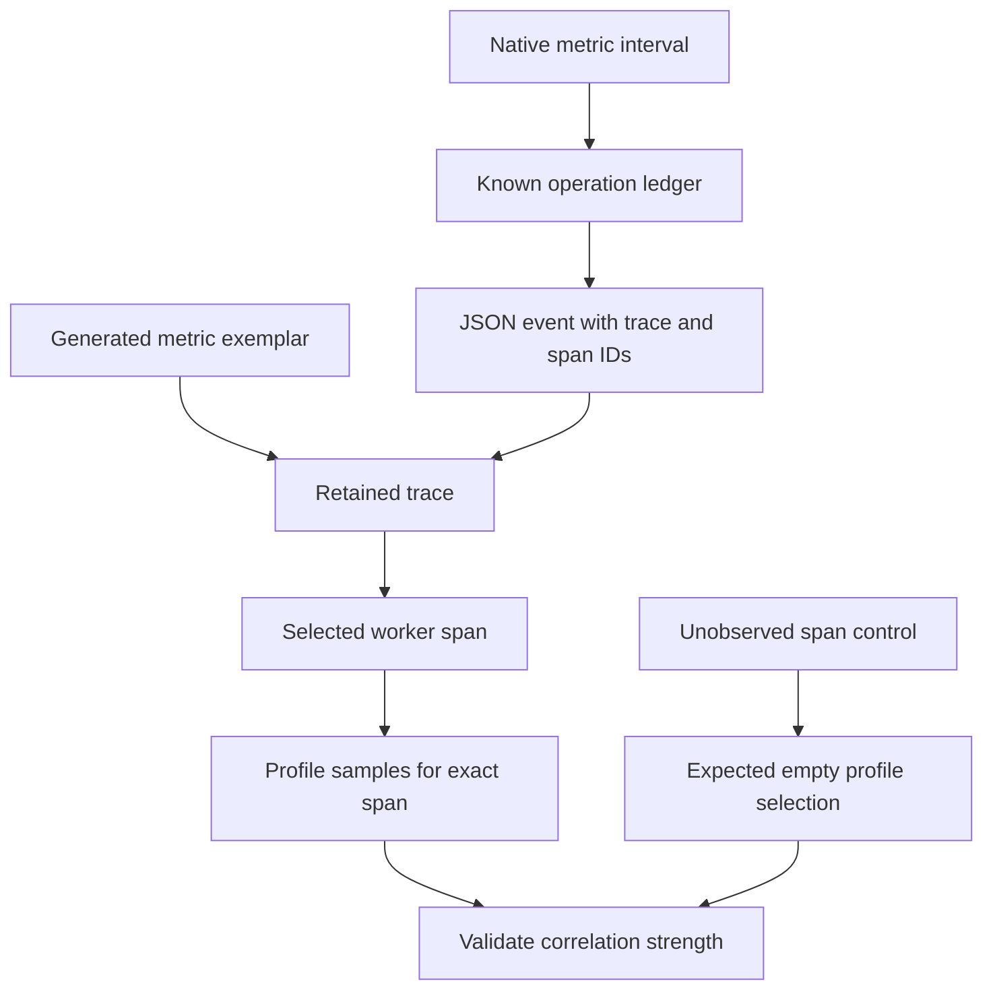

# Lab 44: Trace-to-Profile and Four-Signal Correlation

## 1. Purpose and Learning Outcomes

**In Plain Language:** You will connect the four signals around one known diagnostic operation. Metrics identify the population and interval, logs and traces supply exact operation identities, and span-tagged profile samples show CPU work within the selected worker span. A negative-control lookup checks that the profile query really uses that identity rather than returning the entire service profile.

> **Primary Objective:** Follow one diagnostic operation across aggregate metrics, JSON log/event records, a retained trace with span events, and profile samples selected by the exact worker span ID.

The earlier labs established each signal independently. This lab joins them while being precise about the strength of each link. Shared service identity and time provide context; request and trace IDs link discrete records; a reserved span sample label selects CPU samples from one explicitly instrumented worker operation.

A service-wide profile covering the same time as a request is useful context, but it is not automatically that request's profile. You will prove the stronger link with the Pyroscope query API before trusting a Grafana navigation button.

## 2. Starting Point and Lab Map

Use this guide inside the complete application repository. Run commands from the repository root in Bash unless a step says otherwise. Work through the starting checks in order; they load the helpers and state this lab needs.

Read the explanation before each step, run one complete code block at a time, and compare the actual result with the stated expectation. Save commands, observations, explanations, and unexpected results in your notebook.

### Key Terms

| **Term**              | **Plain-Language Meaning**                                                                   |
| --------------------- | -------------------------------------------------------------------------------------------- |
| Correlation contract  | The identities, fields, and time boundaries that make a link between two observations valid. |
| Span-selected profile | Profile samples selected using the exact worker span identifier.                             |
| Negative control      | A comparison deliberately chosen not to match the expected evidence.                         |

### Lab Map

The arrows show the flow or dependency being studied. Branches identify paths to compare; this is a conceptual map, not a captured runtime trace.



## 3. Guided Walkthrough

### Step 01. Inherited State and Starting Checks

**What You Are Doing:** Verify equivalent-work profiling and retain the existing tracer provider and data-source UIDs. Correlation should extend those identities rather than create parallel telemetry ownership.

**Practical Walkthrough:** Verify equivalent-work profiling and retain the existing tracer provider, log schema, and data-source UIDs. The correlation changes should extend those established identities rather than initialize parallel telemetry owners. Keep a known profile and trace as controls before adding links.

Preserve existing provider ownership, event schema, and data-source UIDs when adding correlation. Keep a known trace and profile as independent controls. A new navigation link should connect established evidence rather than introduce a second telemetry owner or change signal identity.

```bash
source lab-notes/session.sh
source lab-notes/evidence.sh
source lab-notes/metrics-session.sh
source lab-notes/platform-session.sh
source lab-notes/traces-session.sh
source lab-notes/profiling/session.sh
load_app_settings
start_lab 44
dp config --quiet
wait_ready
wait_backend loki:3100 /ready
wait_backend tempo:3200 /ready
wait_backend pyroscope:4040 /ready
test -s lab-notes/profiling/profile-type.txt
cp app/app/profile_work.py "$LAB_DIR/profile_work.before.py"
cp lab-notes/tracing/collector.yml "$LAB_DIR/collector.before.yml"
cp config/grafana/learning/provisioning/datasources/tempo.yml "$LAB_DIR/tempo-datasource.before.yml"
```

Complete [Lab 43](Lab-43.md), including equivalent-work checks and a visible CPU-loop profile. Fourteen services and nine scrape jobs remain. Keep the existing datasource UIDs, resource attributes, log-derived trace link and stage-aware Compose helper.

The app already owns its `TracerProvider` through `app.state.telemetry.provider`. Do not initialize another provider, add a second profiler, or enable duplicate auto-instrumentation. Continue using the existing pinned Python SDK and `pyroscope-io==1.2.3`.

**Understanding the Result:** Stable identity makes cross-signal navigation reliable. A new provider or source UID would change the baseline being linked.

### Step 02. Learning Objectives and Correlation Contracts

**What You Are Doing:** State the strength of each link before following it. Shared time and service provide broad context, while exact trace and span IDs support narrower connections.

**Practical Walkthrough:** Classify each planned connection by its evidence strength. Shared service and time provide aggregate context, while exact request, trace, and span IDs can narrow the relationship to one operation. State that distinction before following links so navigation is not mistaken for proof of causation.

Label every connection as broad context or exact identity before using it. Service and time can suggest related activity; request, trace, and span IDs provide narrower linkage. Opening another view successfully does not itself establish causation or prove it selected the same operation.

| **Link**                          | **Join Information**                           | **Strength and Limitation**                         |
| --------------------------------- | ---------------------------------------------- | --------------------------------------------------- |
| Native metric → incident interval | Service, normalized route, time window         | Aggregated population; no per-request identity      |
| Generated metric exemplar → trace | Exemplar `traceID`                             | One representative retained observation             |
| Log → trace                       | JSON `trace_id` and Grafana derived field      | Exact trace identity if that trace was retained     |
| Log → worker span                 | JSON `span_id`                                 | Exact active span at log emission                   |
| Worker span → profile samples     | `pyroscope.profile.id` equals sample `span_id` | Samples captured while that worker scope was active |
| Span event → operation            | Event attached to the span                     | Discrete milestone, not a periodic sample           |

The SDK's `tag_wrapper()` tags the executing **thread**. An async function can yield while another request runs on the same event-loop thread. Leaving a request-specific thread tag active across `await` could attribute another request's work incorrectly.

Here the tag wrapper lives entirely inside the synchronous worker from Lab 43. That scope contains no `await`, and its context manager removes tags before the thread returns to the pool. `asyncio.to_thread()` propagates the active trace context and request-ID context to the worker. This deliberate scope avoids claiming automatic correlation for every ASGI span.

Pyroscope recognizes `span_id` as reserved sample metadata. It is not a new Prometheus label or a Loki index label. `pyroscope.profile.id` contains the 16-character hexadecimal **span ID**, despite its name. A profile-capable span can still have zero samples if it runs too briefly or spends its time waiting.

**Understanding the Result:** A nearby metric spike and one trace are contextual evidence. An exact span-filtered profile supports a narrower association.

### Step 03. Connect the Worker Scope and Provision Grafana

**What You Are Doing:** Tag the existing worker scope and configure Grafana's field mappings. The scoped retention rule makes this bounded diagnostic operation available without retaining all ordinary traffic.

**Practical Walkthrough:** Tag the existing worker scope and configure the Grafana field mappings using its actual trace and span identifiers. Apply the scoped tail-retention exception for this bounded diagnostic operation. This makes the test operation available without changing all ordinary traffic to full retention.

Apply tags only inside the synchronous worker's intended scope and verify mappings use actual identifiers. Keep the tail-retention exception limited to this bounded diagnostic operation. Validate the Collector configuration so useful profile correlation does not accidentally change retention policy for all ordinary traffic.

The editor adds the supported SDK tag at the existing synchronous scope, marks the OTel span, and preserves every existing Collector policy. A narrowly scoped tail rule retains traces containing `app.operation="sum_squares"`, making this bounded diagnostic path repeatable. It does not retain all ordinary API traffic.

Grafana maps OTel `service.name` to Pyroscope `service_name`, and `deployment.environment.name` to `environment`. It uses the profile type actually discovered in Lab 42. This is intentional resource-to-label mapping, not an assumption that all backends use identical field names.

```bash
cat > lab-notes/profiling/link_profiles.py <<'PYTHON'
"""Tag only a synchronous worker span, never an async event-loop lifetime."""
from pathlib import Path
import yaml

path=Path('app/app/profile_work.py');text=path.read_text()
old='            # PROFILE_LINK_POINT: Lab 44 adds a reserved span sample label here.'
new='''            # span_id is reserved sample metadata for span profiles, not a metric label.
            if enabled and span.is_recording():
                profile_span_id=f'{span.get_span_context().span_id:016x}'
                span.set_attribute('pyroscope.profile.id',profile_span_id)
                tags['span_id']=profile_span_id'''
if new not in text:
    assert text.count(old)==1,'Expected Lab 43 profiling scope'
    text=text.replace(old,new)
path.write_text(text)
path=Path('lab-notes/tracing/collector.yml');config=yaml.safe_load(path.read_text())
policies=config['processors']['tail_sampling']['policies']
if not any(p['name']=='keep-profile-work' for p in policies):
    policies.append({'name':'keep-profile-work','type':'string_attribute',
                     'string_attribute':{'key':'app.operation','values':['sum_squares']}})
path.write_text(yaml.safe_dump(config,sort_keys=False))
path=Path('config/grafana/learning/provisioning/datasources/tempo.yml')
config=yaml.safe_load(path.read_text())
entry=next(d for d in config['datasources'] if d['uid']=='tempo')
# Read the actual CPU profile type selected from the ProfileTypes response in Lab 42.
profile_type=Path('lab-notes/profiling/profile-type.txt').read_text().strip()
assert profile_type and ':' in profile_type
entry.setdefault('jsonData',{})['tracesToProfiles']={
    'datasourceUid':'pyroscope','tags':[{'key':'service.name','value':'service_name'},
    {'key':'deployment.environment.name','value':'environment'}],
    'profileTypeId':profile_type,'customQuery':False}
path.write_text(yaml.safe_dump(config,sort_keys=False))
PYTHON
```

**Command Note:** `<<'PYTHON'` writes the following block literally until `PYTHON`. Quoting the delimiter prevents Bash from expanding `$variables` inside the generated file; creation and execution are separate steps.

```bash
lab-notes/.tools/bin/python lab-notes/profiling/link_profiles.py
dp run --rm -T --no-deps otel-collector validate --config=/etc/otelcol-contrib/config.yaml
dp up -d --no-deps --force-recreate otel-collector grafana
wait_backend otel-collector:13133 /
wait_grafana
dp up -d --no-deps --build app
wait_ready
```

This implementation uses the existing SDK's public `tag_wrapper` API and Pyroscope's documented span-profile metadata contract. It does not invent a profiler API or install a global span processor with unexamined async/thread behavior. A broader automatic integration should be evaluated separately against its language runtime and concurrency model.

The profiler remains independently sampled. Keeping every trace for this operation cannot manufacture profile samples that were never captured. It also does not make the generated span metrics an unbiased SLI for all other operations.

**Understanding the Result:** The retention exception is specific to the diagnostic scope. Verify it and the field mapping independently.

### Step 04. Capture a Known Operation and Verify Its Span

**What You Are Doing:** Run known operations and choose a CPU-heavy example for investigation. Label that selection as diagnostic rather than representative of the entire latency population.

**Practical Walkthrough:** Run the twenty known operations and preserve their identities and CPU observations. Choose the documented CPU-heavy example to make stack inspection useful, and label that choice as diagnostic selection. It is deliberately chosen for visibility, not randomly sampled to represent overall latency.

Retain the twenty-operation ledger and choose the documented CPU-heavy example with its IDs. State that the selected request is intentionally useful for diagnosis. Its visible profile should not be generalized into a random or representative sample of overall application latency.

```bash
api -fsS "$APP_URL/metrics" > "$LAB_DIR/metrics.before.prom"
python3 lab-notes/profiling/profile_load.py "$APP_URL" "$LAB_DIR/correlated.jsonl" \
  --variant cpu --count 20 --iterations 3000000
api -fsS "$APP_URL/metrics" > "$LAB_DIR/metrics.after.prom"
jq -s 'max_by(.response.thread_cpu_ms)' "$LAB_DIR/correlated.jsonl" > "$LAB_DIR/chosen.json"
TRACE_ID=$(jq -r '.response.trace_id' "$LAB_DIR/chosen.json")
SPAN_ID=$(jq -r '.response.span_id' "$LAB_DIR/chosen.json")
REQUEST_ID=$(jq -r '.response.request_id' "$LAB_DIR/chosen.json")
for ((attempt=1; attempt<=15; attempt++)); do
  fetch_trace "$TRACE_ID" "$LAB_DIR/chosen-trace.json"
  python3 lab-notes/tracing/inspect_trace.py "$LAB_DIR/chosen-trace.json" > "$LAB_DIR/chosen-spans.json"
  if jq -e --arg sid "$SPAN_ID" \
    'any(.[]; .span_id==$sid and .attributes["pyroscope.profile.id"]==$sid and (.events|length)>=2)' \
    "$LAB_DIR/chosen-spans.json" >/dev/null; then break; fi
  sleep 1
done
jq -e --arg sid "$SPAN_ID" \
  'any(.[]; .name=="demo.profile_work" and .span_id==$sid and .attributes["pyroscope.profile.id"]==$sid)' \
  "$LAB_DIR/chosen-spans.json"
jq --arg sid "$SPAN_ID" '.[] | select(.span_id==$sid)' "$LAB_DIR/chosen-spans.json"
```

**Command Note:** `jq --arg` passes a shell value as a JSON-query string variable without inserting it into the query text. Where used, `-e` turns a false or null final result into a failing exit status.

The loader creates twenty known operations. Selecting the largest measured CPU operation improves the chance of multiple useful samples; it is explicitly a diagnostic selection, not a representative latency statistic.

Verify `work.started` and `work.completed`, successful application outcome, the worker's server-span parent and the same trace ID across the tree. The worker span encloses the calculation; its duration need not equal the full HTTP request duration. If the first trace fetch is partial, the bounded loop allows late pieces to arrive. Do not apply Lab 38's five-span downstream topology audit to this different route.

**Understanding the Result:** A selected heavy example explains its own work. Do not generalize its cost to every request without population evidence.

### Step 05. Retrieve Samples for the Exact Span and Test a Negative Control

**What You Are Doing:** Retrieve profile samples for the chosen span and for an unobserved random span. Positive and negative results together verify that the identity filter is effective.

**Practical Walkthrough:** Query profile samples for the chosen worker span, then repeat with an unobserved random span ID. The positive case proves useful data exists, while the negative case checks that the identity filter actually narrows selection. Keep service and time bounds identical between them.

Use identical service, profile type, and time bounds for the known-span query and random-ID control. The positive result establishes available samples; the negative result tests whether span filtering actually narrows them. Without the control, broad aggregate data could be mistaken for exact-span correlation.

```bash
PROFILE_TYPE=$(cat lab-notes/profiling/profile-type.txt)
SELECTOR="{service_name=\"$LAB_SERVICE\",environment=\"$LAB_ENVIRONMENT\",workload=\"cpu\"}"
QUERY=$(jq --arg selector "$SELECTOR" --arg type "$PROFILE_TYPE" --arg sid "$SPAN_ID" \
  '{start:((.start_ns/1000000|floor)-10000),end:((.end_ns/1000000|floor)+10000),
    labelSelector:$selector,profileTypeID:$type,spanSelector:[$sid]}' "$LAB_DIR/chosen.json")
printf '%s\n' "$QUERY" > "$LAB_DIR/span-profile-query.json"
for ((attempt=1; attempt<=12; attempt++)); do
  pquery SelectMergeStacktraces "$QUERY" > "$LAB_DIR/span-profile.json"
  if jq -e '(.flamegraph.total // 0 | tonumber)>0' "$LAB_DIR/span-profile.json" >/dev/null; then break; fi
  sleep 5
done
jq -e '(.flamegraph.total // 0 | tonumber)>0' "$LAB_DIR/span-profile.json"
jq '.flamegraph | {total,names}' "$LAB_DIR/span-profile.json"
WRONG_SPAN=$(python3 -c 'import secrets; print(secrets.token_hex(8))')
WRONG_QUERY=$(printf '%s' "$QUERY" | jq --arg sid "$WRONG_SPAN" '.spanSelector=[$sid]')
pquery SelectMergeStacktraces "$WRONG_QUERY" > "$LAB_DIR/negative-control.json"
jq -e '(.flamegraph.total // 0 | tonumber)==0' "$LAB_DIR/negative-control.json"
```

The positive query must contain the CPU-loop stack and nonzero weight. The randomly generated, unobserved span must return zero selected sample weight. This pair checks that the query is using span identity rather than silently returning the service-wide profile.

If the chosen CPU span has no samples after delivery has settled, inspect actual sample metadata and SDK support before assuming that adding a span attribute completed the integration. Repeat a bounded CPU run once if the operation was too short on the host. Do not replace the exact selector with a time-only query and report success.

The interval includes upload-bucket margins, but `spanSelector` narrows the result to that worker's samples. Other request CPU outside this synchronous scope is not included. An empty profile for `wait` or `optimized` can be valid and should not be confused with a broken CPU positive control.

**Understanding the Result:** Positive and negative controls together validate the join more strongly than one populated profile view.

### Step 06. Join the JSON Event Record to the Same Trace

**What You Are Doing:** Find the worker's JSON record and match its request, trace, and span identities. Allow delivery time before treating a missing early lookup as a broken correlation contract.

**Practical Walkthrough:** Find the worker's structured JSON record and compare request, trace, and span IDs with the chosen operation. If its envelope uses the generic application event name, use the documented message field to identify the worker record. Allow delivery time before declaring correlation broken.

Start with the chosen operation's saved request ID, then check its trace ID and worker span ID in the parsed record. Also inspect the message field used to distinguish the worker event from the request-completion event. Both may share request context, so selecting the completion record alone would not prove that the CPU worker's specific span was logged.

```bash
START_NS=$(jq -r '.start_ns-5000000000|floor' "$LAB_DIR/chosen.json")
END_NS=$(python3 -c 'import time; print(time.time_ns())')
LOG_QUERY="{service_name=\"$LAB_SERVICE\",deployment_environment_name=\"$LAB_ENVIRONMENT\"} | json | request_id=\"$REQUEST_ID\""
backend loki:3100 /loki/api/v1/query_range query "$LOG_QUERY" \
  start "$START_NS" end "$END_NS" direction forward limit 100 > "$LAB_DIR/chosen-logs.json"
jq -e --arg tid "$TRACE_ID" --arg sid "$SPAN_ID" \
  '[.data.result[].values[][1] | fromjson | \
    select(.message=="profile_work_completed" and .trace_id==$tid and .span_id==$sid)] | length>0' \
  "$LAB_DIR/chosen-logs.json"
```

Allow ordinary log-delivery delay and retry this query within a sixty-second deadline if necessary. The application emits `profile_work_completed` inside the active worker span. The existing formatter includes request ID, trace ID, span ID, operation and elapsed duration. Depending on the logging lab's event-name normalization, this new message can remain in the generic `application_log` event class; query its actual message rather than inventing an indexed event label.

In Grafana Loki Explore, open the matching record and follow its existing Tempo derived field. In Tempo, select `demo.profile_work`, inspect its two span events and open the profile action. Confirm the configured service/environment mappings and profile type. If the UI action yields a wider service profile, inspect the query and use the explicit `spanSelector` API result as the correctness check.

A span event is stored with its trace and follows trace sampling. The JSON completion event uses the independent stdout → Docker fluentd driver → Collector → Loki path. One can survive when the other is missing. Neither is the same as the periodic stack samples in Pyroscope.

**Understanding the Result:** Match explicit fields rather than similar text alone. The worker span may differ from the outer server span and must be selected deliberately.

### Step 07. Start from Metrics and Walk the Four-Signal Evidence

**What You Are Doing:** Walk from metric interval to a known request, its trace, and selected profile samples. Explain which transition uses aggregate context and which uses exact identity.

**Practical Walkthrough:** Walk through the metric interval, known request, stored trace, and span-selected profile in the documented order. At each transition, state whether you used broad time/service context or an exact identity. Keep aggregate metric labels bounded rather than adding request IDs to imitate the other signals.

State the matching evidence at each transition from metrics to request, logs, trace, and profile. Preserve bounded metric dimensions while using exact IDs in the richer signals. The final explanation should distinguish a population-level symptom from the individually verified operation used to investigate it.

```promql
sum(rate(application_http_requests_total{route="/api/v1/demo/profile-work"}[5m]))
```

```promql
histogram_quantile(0.95,
  sum by (le) (rate(application_http_request_duration_seconds_bucket{route="/api/v1/demo/profile-work"}[5m]))
)
```

```promql
traces_spanmetrics_latency_bucket{source="tempo",span_name="demo.profile_work",span_kind="SPAN_KIND_INTERNAL"}
```

Use the native metric panels to identify the request population and time interval. A metric point alone cannot identify `REQUEST_ID` because IDs are deliberately absent from labels. Use the incident interval plus the saved ledger to choose the known operation, or use a generated histogram exemplar for a representative retained trace as in Lab 41.

For the exemplar route, click a marker in the internal-work histogram, locate that trace ID in `correlated.jsonl`, and repeat the exact span/log/profile checks for that ledger row. If the exemplar points outside the ledger interval, choose a matching interval rather than forcing the current chosen ID onto a different observation.

Write one evidence chain:

1. Native request metrics show that the diagnostic route received traffic in the interval.
2. The selected log record identifies the request, trace and active worker span.
3. The stored trace establishes parentage, elapsed duration and operation milestones.
4. The exact span-profile query identifies sampled CPU work within that worker.
5. The negative control rejects an unrelated span identity.

This explains one path and its surrounding population. It does not prove every request had identical behavior or that the profile accounts for every millisecond of trace duration.

**Understanding the Result:** The combined explanation should preserve each signal's scope. Exact and contextual links provide different levels of evidence.

## 4. Troubleshooting and Diagnosis

Start with the first unexpected result. Record the exact symptom, identify which component produced it, and use the checks below before repeating the experiment. After a fix, repeat the original check and confirm recovery.

### Troubleshooting, Recovery and Correlation Limits

| **Symptom**                                | **Distinction to Investigate**                                                                                                 |
| ------------------------------------------ | ------------------------------------------------------------------------------------------------------------------------------ |
| Profile samples exist but trace is missing | Head/tail policy, transport and trace retention are independent of profile delivery.                                           |
| Trace has profile attribute but no samples | Short/off-CPU operation, missing sample tags, upload delay or wrong type/selector. The attribute is only eligibility metadata. |
| Wrong-span query returns nonzero work      | Inspect query handling and reserved label ingestion; do not claim exact correlation until this is resolved.                    |
| Log's span differs from worker             | Check which log record was selected and whether emission happened outside the active scope.                                    |
| Grafana opens a service-wide profile       | Verify datasource mappings, profile type and span-aware UI support; compare the API selector.                                  |
| Cross-request attribution looks mixed      | Inspect thread-tag lifetime and worker concurrency; never leave tags active across an async yield.                             |
| Metric error ratio shifts                  | The diagnostic keep rule changes the retained population, not the native request denominator.                                  |

To undo only this lab, restore the saved worker module, Collector file and Tempo datasource file; validate Collector, rebuild app and recreate Collector/Grafana. Normal completion keeps the narrow diagnostic policy and scoped profile link for later investigation.

Technical references: [Pyroscope span profiles](https://grafana.com/docs/pyroscope/latest/configure-client/trace-span-profiles/), [Python client tag API](https://github.com/grafana/pyroscope-python), [Grafana Tempo configuration](https://grafana.com/docs/grafana/latest/datasources/tempo/configure-tempo-data-source/), and [Pyroscope query API](https://grafana.com/docs/pyroscope/latest/reference-server-api/).

```bash
wait_ready
wait_backend loki:3100 /ready
wait_backend tempo:3200 /ready
wait_backend pyroscope:4040 /ready
dp ps -a
```

## 5. Review and Practice

Answer the knowledge questions in your own words before reading the answer guide. For the scenario, name the evidence you would collect and the conclusion each observation would support.

### Knowledge Check

1. Why are thread tags unsafe across an arbitrary await?
2. Does pyroscope.profile.id guarantee a nonempty profile?
3. Why keep native metrics even with exemplars?
4. Why test a wrong span ID?

#### Answer Guide

1. Another async task can run on the same tagged thread and contaminate attribution.
2. No. It identifies a profile-capable span; samples still depend on execution, timing and delivery.
3. They retain the unsampled request population and are the appropriate SLI denominator.
4. It verifies that the profile query actually filters by identity instead of returning the whole service window.

### Professional Scenario Exercise

An incident screenshot shows a slow span next to a CPU flamegraph from the same minute. Build the evidence needed to say whether that CPU work belongs to the span: resource mappings, request/trace/span IDs, sample filtering, positive and negative controls, and remaining off-CPU uncertainty.

## 6. Completion Checklist

Mark each item only after you can point to its result or evidence file. Complete any cleanup shown here before moving on.

### Observable Completion Criteria

- [ ] A retained worker span contains its own span ID in pyroscope.profile.id.
- [ ] A matching JSON log record contains the same request, trace and worker span identities.
- [ ] The worker trace contains the expected milestones and parent relationship.
- [ ] A positive span-filtered CPU query and zero-weight wrong-span control are saved.
- [ ] Grafana navigation is checked against the explicit query, not trusted from its label alone.
- [ ] The four-signal explanation states which evidence is aggregate, discrete, causal and sampled.

## 7. Production Context and Next Lab

### Production Implications

Reserved sample identities have backend-specific support and retention costs. Verify concurrency semantics before deploying automatic bridges. Protect raw traces/logs/profiles, align retention windows and document sampling. Exact IDs strengthen correlation, but distributed clocks, incomplete instrumentation and statistical sampling still limit causal claims.

### End State and Transition

The scoped worker/profile link, Grafana mapping and narrow diagnostic retention rule remain. No metric IDs or extra log collector were added. Continue to [Lab 45](Lab-45.md) for a Redis-only incident that tests business behavior, dependency telemetry and recovery together.
