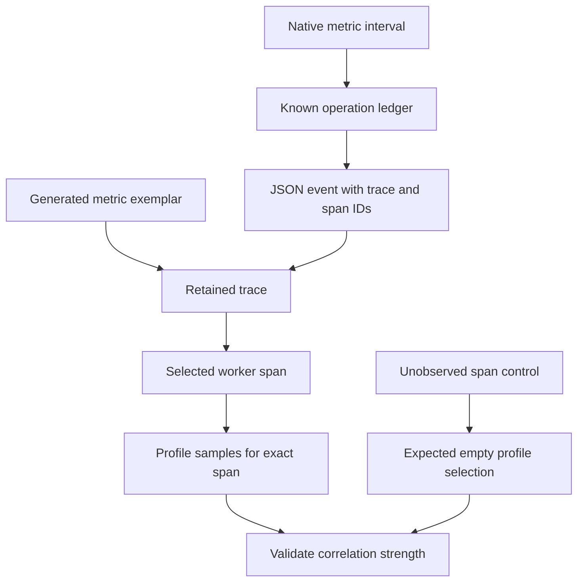

# Lab 44: Trace-to-Profile and Four-Signal Correlation

## 1. Purpose and Learning Outcomes

You will connect four signals around one known diagnostic operation. Metrics describe the request population and interval; logs and traces provide exact operation IDs; profile samples tagged with a span ID show CPU work within the chosen worker. A lookup using an unrelated ID checks that the profile query really selects that worker rather than returning the entire service profile.

> **Primary Objective:** Follow one operation through aggregate metrics, JSON records, a retained trace with events, and CPU samples selected using the exact worker span ID.

Earlier labs verified each signal independently. Now connect them while stating what each link proves. Service identity and time provide context. Request and trace IDs connect individual records. A reserved sample label narrows profiling evidence to one explicitly instrumented worker span.

A service-wide profile from the same time as a request is useful context, but it is not automatically that request's profile. Prove the more specific match through the Pyroscope API before relying on a Grafana button.

## 2. Starting Point and Lab Map

Open the complete application repository before using this guide. Unless a step says otherwise, run commands in Bash from the repository's top-level folder. Follow the starting checks in order because later commands depend on the helper functions and running services they prepare.

Read each explanation before running its commands. Run one complete code block, check the result, and then continue. In your notebook, save the commands, what happened, why you think it happened, and anything that differed from the expected result.

### Key Terms

| **Term**              | **Explanation**                                                                                 |
| --------------------- | ----------------------------------------------------------------------------------------------- |
| Correlation contract  | The IDs, fields, and time boundaries that must agree for two observations to be validly linked. |
| Span-selected profile | Profile samples filtered using the exact identifier of the worker span.                         |
| Negative control      | A deliberately nonmatching case used to check that the selection or test behaves correctly.     |

### Lab Map

The arrows show how the parts connect and where a request can take different paths. Use this map to understand the design. It is not a recording of a request that actually ran.



## 3. Guided Walkthrough

### Step 01. Inherited State and Starting Checks

**What You Are Doing:** Verify the equal-work profiling setup and keep the existing tracer and data-source identities. Add correlation without creating parallel telemetry ownership.

**Practical Walkthrough:** Confirm the known trace and profile controls. Preserve the tracer provider, log schema, and data-source UIDs while adding links. These changes should connect established evidence rather than initialize another collection system.

Keep provider ownership, event fields, and data-source UIDs unchanged. A known trace and profile independently prove the source views work before navigation is added. Correlation should connect those identities, not replace them.

```bash
source lab-notes/session.sh
source lab-notes/evidence.sh
source lab-notes/metrics-session.sh
source lab-notes/platform-session.sh
source lab-notes/traces-session.sh
source lab-notes/profiling/session.sh
load_app_settings
start_lab 44
dp config --quiet
wait_ready
wait_backend loki:3100 /ready
wait_backend tempo:3200 /ready
wait_backend pyroscope:4040 /ready
test -s lab-notes/profiling/profile-type.txt
cp app/app/profile_work.py "$LAB_DIR/profile_work.before.py"
cp lab-notes/tracing/collector.yml "$LAB_DIR/collector.before.yml"
cp config/grafana/learning/provisioning/datasources/tempo.yml "$LAB_DIR/tempo-datasource.before.yml"
```

Complete [Lab 43](Lab-43.md), including checksum checks and a visible CPU-loop profile. Keep fourteen services, nine scrape jobs, resource attributes, existing data-source UIDs, the log-to-trace link, and the stage-aware Compose helper.

The app owns its `TracerProvider` through `app.state.telemetry.provider`. Keep that provider and one profiler; do not add duplicate auto-instrumentation. Continue using the pinned Python SDK and `pyroscope-io==1.2.3`.

**Understanding the Result:** Stable identities make navigation dependable. A new provider or data-source UID would change the evidence you are trying to connect.

### Step 02. Learning Objectives and Correlation Contracts

**What You Are Doing:** State what each link can prove. Shared service and time provide broad context, while exact IDs can connect observations from one operation.

**Practical Walkthrough:** Classify each transition before following it. Time and service narrow the surrounding activity. Request, trace, and span IDs can select a particular operation. Successfully opening another view does not itself prove causation or an exact match.

Label each connection as contextual or identity-based. Then verify the fields it uses. A nearby observation can be relevant without belonging to the same request, so navigation alone is not enough.

| **Link**                          | **Join Information**                           | **Strength and Limitation**                                               |
| --------------------------------- | ---------------------------------------------- | ------------------------------------------------------------------------- |
| Native metric → incident interval | Service, normalized route, time window         | Describes an aggregate population without identifying individual requests |
| Generated metric exemplar → trace | Exemplar `traceID`                             | Selects one representative retained observation                           |
| Log → trace                       | JSON `trace_id` and Grafana derived field      | Identifies the exact trace, provided that trace was retained              |
| Log → worker span                 | JSON `span_id`                                 | Identifies the span active when the log was emitted                       |
| Worker span → profile samples     | `pyroscope.profile.id` equals sample `span_id` | Selects samples captured while that worker scope was active               |
| Span event → operation            | Event attached to the span                     | Records a specific milestone rather than a periodic CPU sample            |

The SDK's `tag_wrapper()` applies tags to the executing **thread**. An async function may yield while a different request uses that same event-loop thread. A request-specific tag left active across `await` could wrongly attribute the other request's work.

Place the wrapper entirely inside Lab 43's synchronous worker. There is no `await` in that scope, and the context manager removes tags before the thread returns to the pool. `asyncio.to_thread()` carries trace and request-ID context to the worker. This design provides deliberate worker correlation rather than claiming automatic coverage of every ASGI span.

Pyroscope treats `span_id` as reserved sample metadata, not a Prometheus label or Loki index label. Despite its name, `pyroscope.profile.id` holds the 16-character hexadecimal **span ID**. A correctly marked span may still have no samples if it executes too briefly or mostly waits.

**Understanding the Result:** A metric spike near a trace is contextual evidence. A verified span-filtered profile establishes a narrower link to that worker's sampled CPU activity.

### Step 03. Connect the Worker Scope and Provision Grafana

**What You Are Doing:** Tag the worker scope and configure Grafana field mappings. Add a narrow retention exception so the diagnostic operation remains available without retaining all ordinary traffic.

**Practical Walkthrough:** Use the worker's real IDs in the sample tags and Grafana mappings. Retain only this bounded diagnostic operation through the new tail-policy exception. Keep the existing ordinary-traffic policy intact.

Apply tags only inside the intended synchronous scope and validate the identifiers in the mappings. Check the Collector configuration too. Adding useful profile navigation must not accidentally change retention for all requests.

The editor adds the supported SDK tag in the existing worker, marks its OTel span, and preserves earlier Collector policies. A narrow rule retains traces containing `app.operation="sum_squares"`. This makes the limited diagnostic path repeatable without keeping all ordinary API traffic.

Map OTel `service.name` to Pyroscope `service_name`, and `deployment.environment.name` to `environment`. Use the profile type discovered in Lab 42. These explicit mappings account for different field names across backends.

```bash
cat > lab-notes/profiling/link_profiles.py <<'PYTHON'
"""Tag only a synchronous worker span, never an async event-loop lifetime."""
from pathlib import Path
import yaml

path=Path('app/app/profile_work.py');text=path.read_text()
old='            # PROFILE_LINK_POINT: Lab 44 adds a reserved span sample label here.'
new='''            # span_id is reserved sample metadata for span profiles, not a metric label.
            if enabled and span.is_recording():
                profile_span_id=f'{span.get_span_context().span_id:016x}'
                span.set_attribute('pyroscope.profile.id',profile_span_id)
                tags['span_id']=profile_span_id'''
if new not in text:
    assert text.count(old)==1,'Expected Lab 43 profiling scope'
    text=text.replace(old,new)
path.write_text(text)
path=Path('lab-notes/tracing/collector.yml');config=yaml.safe_load(path.read_text())
policies=config['processors']['tail_sampling']['policies']
if not any(p['name']=='keep-profile-work' for p in policies):
    policies.append({'name':'keep-profile-work','type':'string_attribute',
                     'string_attribute':{'key':'app.operation','values':['sum_squares']}})
path.write_text(yaml.safe_dump(config,sort_keys=False))
path=Path('config/grafana/learning/provisioning/datasources/tempo.yml')
config=yaml.safe_load(path.read_text())
entry=next(d for d in config['datasources'] if d['uid']=='tempo')
# Read the actual CPU profile type selected from the ProfileTypes response in Lab 42.
profile_type=Path('lab-notes/profiling/profile-type.txt').read_text().strip()
assert profile_type and ':' in profile_type
entry.setdefault('jsonData',{})['tracesToProfiles']={
    'datasourceUid':'pyroscope','tags':[{'key':'service.name','value':'service_name'},
    {'key':'deployment.environment.name','value':'environment'}],
    'profileTypeId':profile_type,'customQuery':False}
path.write_text(yaml.safe_dump(config,sort_keys=False))
PYTHON
```

**Command Note:** `<<'PYTHON'` writes the block exactly as shown until the closing `PYTHON`. Its quotes prevent Bash from expanding `$variables` inside the generated file. Creation and execution remain separate.

```bash
lab-notes/.tools/bin/python lab-notes/profiling/link_profiles.py
dp run --rm -T --no-deps otel-collector validate --config=/etc/otelcol-contrib/config.yaml
dp up -d --no-deps --force-recreate otel-collector grafana
wait_backend otel-collector:13133 /
wait_grafana
dp up -d --no-deps --build app
wait_ready
```

Use the SDK's public `tag_wrapper` API and the documented span-profile metadata contract. This avoids an invented API or an unreviewed global span processor. Any broader automatic integration needs separate evaluation against the runtime's thread and concurrency behavior.

Profiling remains independently sampled. Retaining every diagnostic trace cannot create CPU samples that were never captured. The additional retained traces also do not make generated span metrics unbiased SLIs for all other operations.

**Understanding the Result:** Check the narrow retention rule and field mappings independently. They solve different parts of making the diagnostic link usable.

### Step 04. Capture a Known Operation and Verify Its Span

**What You Are Doing:** Run known operations and choose a CPU-heavy example. Describe it as a deliberate diagnostic choice rather than a representative latency sample.

**Practical Walkthrough:** Save identities and CPU measurements for twenty operations. Choose the documented CPU-heavy case so it is likely to have useful stack samples. Its selection favors visibility and is not random sampling of overall latency.

Keep the twenty-row ledger and the chosen request's IDs. State why that request was selected. A clear profile of this heavy operation cannot automatically describe the cost of all requests.

```bash
api -fsS "$APP_URL/metrics" > "$LAB_DIR/metrics.before.prom"
python3 lab-notes/profiling/profile_load.py "$APP_URL" "$LAB_DIR/correlated.jsonl" \
  --variant cpu --count 20 --iterations 3000000
api -fsS "$APP_URL/metrics" > "$LAB_DIR/metrics.after.prom"
jq -s 'max_by(.response.thread_cpu_ms)' "$LAB_DIR/correlated.jsonl" > "$LAB_DIR/chosen.json"
TRACE_ID=$(jq -r '.response.trace_id' "$LAB_DIR/chosen.json")
SPAN_ID=$(jq -r '.response.span_id' "$LAB_DIR/chosen.json")
REQUEST_ID=$(jq -r '.response.request_id' "$LAB_DIR/chosen.json")
for ((attempt=1; attempt<=15; attempt++)); do
  fetch_trace "$TRACE_ID" "$LAB_DIR/chosen-trace.json"
  python3 lab-notes/tracing/inspect_trace.py "$LAB_DIR/chosen-trace.json" > "$LAB_DIR/chosen-spans.json"
  if jq -e --arg sid "$SPAN_ID" \
    'any(.[]; .span_id==$sid and .attributes["pyroscope.profile.id"]==$sid and (.events|length)>=2)' \
    "$LAB_DIR/chosen-spans.json" >/dev/null; then break; fi
  sleep 1
done
jq -e --arg sid "$SPAN_ID" \
  'any(.[]; .name=="demo.profile_work" and .span_id==$sid and .attributes["pyroscope.profile.id"]==$sid)' \
  "$LAB_DIR/chosen-spans.json"
jq --arg sid "$SPAN_ID" '.[] | select(.span_id==$sid)' "$LAB_DIR/chosen-spans.json"
```

**Command Note:** `jq --arg` supplies a shell value as a string variable without inserting it into the query text. Where used, `-e` fails the command if the final result is false or null.

The loader produces twenty known operations. Selecting the one with the largest measured CPU time improves the chance of useful samples. This is a diagnostic selection, not a representative latency statistic.

Verify `work.started`, `work.completed`, successful outcome, the worker's server-span parent, and a consistent trace ID. The worker encloses calculation, so its duration may differ from full HTTP duration. Allow the bounded loop to collect late trace pieces. Do not apply Lab 38's five-span downstream audit to this different route.

**Understanding the Result:** The chosen heavy example explains its own work. Population evidence is needed before generalizing its cost to every request.

### Step 05. Retrieve Samples for the Exact Span and Test a Negative Control

**What You Are Doing:** Query samples for the chosen span and for a random unobserved span. Together, these results check that the identity filter actually narrows selection.

**Practical Walkthrough:** Keep service and time fixed while changing only the span ID between the positive and negative queries. The known ID should return useful work, while the random ID should not. This tests both data availability and filtering.

Use identical service, profile type, and interval for both queries. Without the random-ID control, a populated result might simply be the service-wide profile mistakenly presented as span-specific evidence.

```bash
PROFILE_TYPE=$(cat lab-notes/profiling/profile-type.txt)
SELECTOR="{service_name=\"$LAB_SERVICE\",environment=\"$LAB_ENVIRONMENT\",workload=\"cpu\"}"
QUERY=$(jq --arg selector "$SELECTOR" --arg type "$PROFILE_TYPE" --arg sid "$SPAN_ID" \
  '{start:((.start_ns/1000000|floor)-10000),end:((.end_ns/1000000|floor)+10000),
    labelSelector:$selector,profileTypeID:$type,spanSelector:[$sid]}' "$LAB_DIR/chosen.json")
printf '%s\n' "$QUERY" > "$LAB_DIR/span-profile-query.json"
for ((attempt=1; attempt<=12; attempt++)); do
  pquery SelectMergeStacktraces "$QUERY" > "$LAB_DIR/span-profile.json"
  if jq -e '(.flamegraph.total // 0 | tonumber)>0' "$LAB_DIR/span-profile.json" >/dev/null; then break; fi
  sleep 5
done
jq -e '(.flamegraph.total // 0 | tonumber)>0' "$LAB_DIR/span-profile.json"
jq '.flamegraph | {total,names}' "$LAB_DIR/span-profile.json"
WRONG_SPAN=$(python3 -c 'import secrets; print(secrets.token_hex(8))')
WRONG_QUERY=$(printf '%s' "$QUERY" | jq --arg sid "$WRONG_SPAN" '.spanSelector=[$sid]')
pquery SelectMergeStacktraces "$WRONG_QUERY" > "$LAB_DIR/negative-control.json"
jq -e '(.flamegraph.total // 0 | tonumber)==0' "$LAB_DIR/negative-control.json"
```

The positive query must show the CPU-loop stack with nonzero weight. The generated unobserved ID must return zero selected weight. This pair demonstrates that the query is filtering samples by span identity.

If the chosen span has no samples after uploads settle, inspect sample metadata and SDK support. Adding a trace attribute alone does not prove the profile side is integrated. If work was too brief, repeat one bounded CPU run. Do not substitute a time-only query and call exact-span correlation successful.

Upload margins widen the time interval, but `spanSelector` restricts samples to that worker. CPU work outside the synchronous scope is excluded. Empty `wait` or `optimized` profiles can be valid; distinguish them from a failing CPU positive control.

**Understanding the Result:** A matching positive result and an empty negative result verify the join more strongly than one populated profile view.

### Step 06. Join the JSON Event Record to the Same Trace

**What You Are Doing:** Find the worker's JSON record and compare its request, trace, and span IDs. Allow normal delivery time before treating early absence as a correlation failure.

**Practical Walkthrough:** Locate the structured worker record and verify all three identities. If normalization gives it a generic event class, select its documented message field. Keep delivery delay separate from a wrong-ID result.

Start with the saved request ID, then compare the parsed trace ID and worker span ID. Distinguish the worker message from the outer request-completion record. Both may share context, but only selecting the worker record proves its particular span was logged.

```bash
START_NS=$(jq -r '.start_ns-5000000000|floor' "$LAB_DIR/chosen.json")
END_NS=$(python3 -c 'import time; print(time.time_ns())')
LOG_QUERY="{service_name=\"$LAB_SERVICE\",deployment_environment_name=\"$LAB_ENVIRONMENT\"} | json | request_id=\"$REQUEST_ID\""
backend loki:3100 /loki/api/v1/query_range query "$LOG_QUERY" \
  start "$START_NS" end "$END_NS" direction forward limit 100 > "$LAB_DIR/chosen-logs.json"
jq -e --arg tid "$TRACE_ID" --arg sid "$SPAN_ID" \
  '[.data.result[].values[][1] | fromjson | \
    select(.message=="profile_work_completed" and .trace_id==$tid and .span_id==$sid)] | length>0' \
  "$LAB_DIR/chosen-logs.json"
```

Retry within sixty seconds if normal shipping delay initially hides the record. The app emits `profile_work_completed` inside the worker span, with request, trace, span, operation, and elapsed fields. The formatter may classify it as `application_log`. Query the actual message rather than adding an invented indexed event label.

In Loki Explore, open the matching record and follow its Tempo link. Select `demo.profile_work`, inspect its two events, and open the profile action. Check resource mappings and type. If Grafana returns a service-wide profile, inspect its query and use the explicit `spanSelector` API result as the correctness reference.

Span events travel with traces and follow trace sampling. JSON completion records take the independent stdout → Docker Fluentd driver → Collector → Loki path. Either can survive while the other is missing. Neither is the same as Pyroscope's periodic stack samples.

**Understanding the Result:** Match explicit IDs rather than similar wording. The worker span can differ from the surrounding server span and must be selected intentionally.

### Step 07. Start from Metrics and Walk the Four-Signal Evidence

**What You Are Doing:** Walk from the metric interval to a known request, its trace, and worker profile. Explain which steps use aggregate context and which use exact identity.

**Practical Walkthrough:** Follow the documented sequence and name the matching evidence at every transition. Keep metric labels bounded. Use richer signals' IDs for individual operations instead of adding request IDs to aggregate metrics.

Distinguish the population-level symptom from the individually verified example. State how service/time context led to a request and how exact IDs then connected its log, trace, and profile.

```promql
sum(rate(application_http_requests_total{route="/api/v1/demo/profile-work"}[5m]))
```

```promql
histogram_quantile(0.95,
  sum by (le) (rate(application_http_request_duration_seconds_bucket{route="/api/v1/demo/profile-work"}[5m]))
)
```

```promql
traces_spanmetrics_latency_bucket{source="tempo",span_name="demo.profile_work",span_kind="SPAN_KIND_INTERNAL"}
```

Use native panels to locate the route's population and interval. A metric point cannot identify `REQUEST_ID`, since IDs are deliberately excluded from labels. Select the operation using the interval and ledger, or follow a representative generated-histogram exemplar as in Lab 41.

For the exemplar path, click an internal-work marker, find its trace ID in `correlated.jsonl`, and repeat the checks for that row. If it falls outside the ledger interval, choose matching times. Do not attach your current chosen ID to a different observation.

Record the evidence chain as follows:

1. Native metrics show traffic on the diagnostic route during the chosen interval.
2. The selected log names the request, trace, and active worker span.
3. The stored trace proves the parent relationship and records elapsed time and milestones.
4. The exact span-profile query selects sampled CPU work within that worker.
5. The unrelated-span control returns no selected work.

This explains one operation in its surrounding population. It does not show that every request behaved identically or account for every millisecond of elapsed time with CPU samples.

**Understanding the Result:** Keep each signal's scope clear in the combined explanation. Contextual matches and exact identity matches provide different strengths of evidence.

## 4. Troubleshooting and Diagnosis

Begin with the first result that differed from your prediction. Save the exact error or symptom and identify which service or command produced it. Use the checks below, make the needed fix, and repeat the original check to confirm the problem is resolved.

### Troubleshooting, Recovery and Correlation Limits

| **Symptom**                                | **Distinction to Investigate**                                                                                                 |
| ------------------------------------------ | ------------------------------------------------------------------------------------------------------------------------------ |
| Profile samples exist but trace is missing | Check head/tail selection, transport, and trace retention independently of profile delivery.                                   |
| Trace has profile attribute but no samples | Check brief or off-CPU work, missing sample tags, upload delay, type, and selector. The attribute only marks eligibility.      |
| Wrong-span query returns nonzero work      | Investigate selector handling and reserved metadata ingestion. Do not claim an exact match until this is resolved.             |
| Log's span differs from worker             | Check the selected record and whether it was emitted outside the active worker scope.                                          |
| Grafana opens a service-wide profile       | Inspect resource mappings, profile type, and span-aware interface support, then compare with the explicit API query.           |
| Cross-request attribution looks mixed      | Check thread-tag lifetime and worker concurrency. Tags must not remain active across an async yield.                           |
| Metric error ratio shifts                  | The keep rule changes the retained trace population, not the native request total.                                             |

To undo this lab alone, restore the saved worker module, Collector configuration, and Tempo data-source file. Validate the Collector, rebuild the app, and recreate Collector and Grafana. Normal completion retains the narrow rule and scoped profile link for later investigation.

See [Pyroscope span profiles](https://grafana.com/docs/pyroscope/latest/configure-client/trace-span-profiles/), [Python client tag API](https://github.com/grafana/pyroscope-python), [Grafana Tempo configuration](https://grafana.com/docs/grafana/latest/datasources/tempo/configure-tempo-data-source/), and [Pyroscope query API](https://grafana.com/docs/pyroscope/latest/reference-server-api/).

```bash
wait_ready
wait_backend loki:3100 /ready
wait_backend tempo:3200 /ready
wait_backend pyroscope:4040 /ready
dp ps -a
```

## 5. Review and Practice

Answer the questions in your own words before reading the answers. For the scenario, say what you would inspect and exactly what each result would tell you.

### Knowledge Check

1. Why are thread tags unsafe across an arbitrary await?
2. Does pyroscope.profile.id guarantee a nonempty profile?
3. Why keep native metrics even with exemplars?
4. Why test a wrong span ID?

#### Answer Guide

1. A different async task can use the same thread while the tag remains active, causing its work to be attributed to the wrong request.
2. No. It identifies a span eligible for profile correlation. Actual samples still depend on execution, timing, and delivery.
3. Native metrics preserve the request population independently of trace sampling and provide the appropriate SLI denominator.
4. A wrong-ID query checks that selection uses span identity rather than returning all samples from the service window.

### Professional Scenario Exercise

A screenshot places a slow span beside a flamegraph from the same minute. Explain the evidence required to connect the CPU work to that span: resource mappings, request/trace/span IDs, sample selection, and positive and negative controls. State what uncertainty about off-CPU time still remains.

## 6. Completion Checklist

Tick an item only when you can show its result or saved evidence. Finish the cleanup instructions before starting the next lab.

### Observable Completion Criteria

- [ ] The retained worker span's pyroscope.profile.id contains that worker's own span ID.
- [ ] A JSON worker log has matching request, trace, and span identities.
- [ ] The trace includes the expected milestones and parent relationship.
- [ ] The positive span-filtered query and zero-weight wrong-ID control are saved.
- [ ] Grafana navigation is verified against the explicit query rather than trusted by its label.
- [ ] The explanation distinguishes aggregate, discrete, causal, and sampled evidence across the four signals.

## 7. Production Context and Next Lab

### Production Implications

Reserved sample IDs depend on backend support and have retention costs. Review concurrency behavior before using automatic integrations. Protect raw logs, traces, and profiles, align retention windows, and document sampling. Exact IDs strengthen correlation, while clock differences, incomplete instrumentation, and statistical samples still limit causal conclusions.

### End State and Transition

Keep the worker/profile link, Grafana mappings, and narrow diagnostic retention rule. No unique IDs were added to metrics and no additional log collector was introduced. [Lab 45](Lab-45.md) uses a Redis-only incident to test business behavior, dependency evidence, and recovery together.
