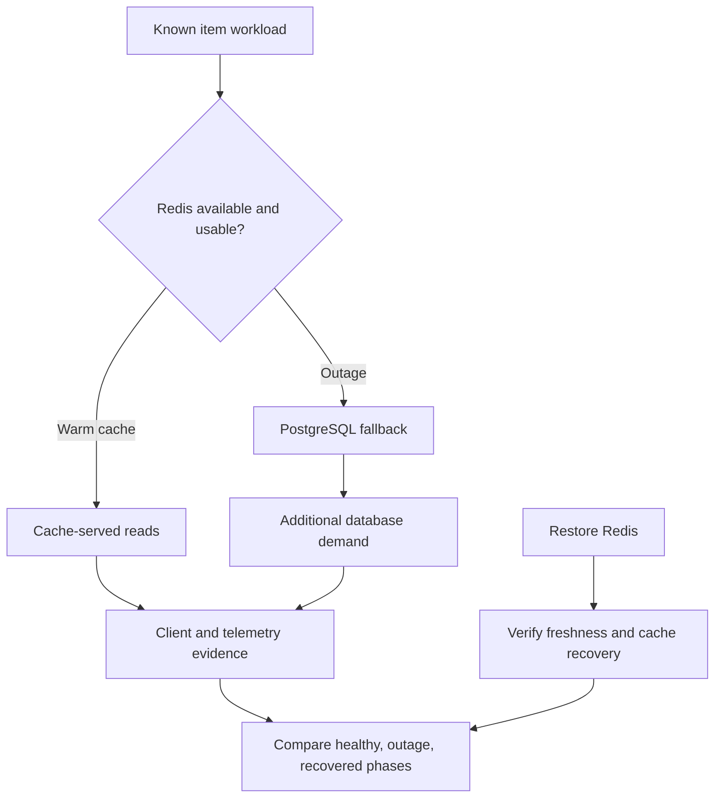

# Lab 45: Redis Failure Incident

## 1. Purpose and Learning Outcomes

**In Plain Language:** You will revisit Redis failure with the full observability stack available. Compare controlled warm-cache, outage, and recovery phases while checking CRUD and freshness. The incident should reveal both continued PostgreSQL-backed availability and the extra database work caused by cache loss, without treating a short successful fallback test as a capacity guarantee.

> **Primary Objective:** Prove that a Redis-only outage preserves PostgreSQL-backed CRUD, reports degraded readiness, changes cache and database demand, emits useful telemetry, and recovers without stale responses.

This is the first dependency incident in the final learning phase. You will stop only Redis, operate on uniquely named lab-owned items, compare healthy/outage/recovered request populations, and build an evidence-based incident timeline.

Redis remains an optimization. PostgreSQL remains authoritative. Successful HTTP responses during the outage are only part of the result: readiness must report the degraded cache, database read demand must be measured, failed invalidation must be handled, and cache hits must return after recovery. PostgreSQL failure and broader observability-backend incidents belong to later labs.

## 2. Starting Point and Lab Map

Use this guide inside the complete application repository. Run commands from the repository root in Bash unless a step says otherwise. Work through the starting checks in order; they load the helpers and state this lab needs.

Read the explanation before each step, run one complete code block at a time, and compare the actual result with the stated expectation. Save commands, observations, explanations, and unexpected results in your notebook.

### Key Terms

| **Term**               | **Plain-Language Meaning**                                                                                  |
| ---------------------- | ----------------------------------------------------------------------------------------------------------- |
| Graceful degradation   | Continuing required business work with reduced capability or efficiency after an optional dependency fails. |
| Database amplification | Additional database work caused by requests that would otherwise use cache.                                 |
| Recovery proof         | Fresh observations that the original business path and relevant telemetry work again.                       |

### Lab Map

The arrows show the flow or dependency being studied. Branches identify paths to compare; this is a conceptual map, not a captured runtime trace.



## 3. Guided Walkthrough

### Step 01. Inherited State and Starting Checks

**What You Are Doing:** Verify the specified TTL, single worker, and fully recovered signal paths before the incident. Changing these during the outage would alter the behavior being compared.

**Practical Walkthrough:** Check the thirty-second cache TTL, single application worker, and fresh evidence from every signal before starting. Keep these controls unchanged during the incident. Different TTLs or process counts would alter cache behavior and counter comparisons, making the later phases harder to compare.

Confirm the configured TTL, single-worker assumption, and fresh signals before capturing the baseline. Keep these controls constant across phases. A different worker count or cache lifetime changes which process owns counters and how long entries survive, so it would alter the meaning of the planned comparisons.

```bash
source lab-notes/session.sh
source lab-notes/evidence.sh
source lab-notes/metrics-session.sh
source lab-notes/platform-session.sh
source lab-notes/traces-session.sh
source lab-notes/profiling/session.sh
load_app_settings
start_lab 45
dp config --quiet
dp ps -a
wait_ready
wait_backend loki:3100 /ready
wait_backend tempo:3200 /ready
wait_backend pyroscope:4040 /ready
test "$LAB_CACHE_TTL" -ge 10
test "$LAB_CACHE_TTL" -le 60
rcli PING
cp lab-notes/tracing/collector.yml "$LAB_DIR/collector.before.yml"
```

Complete [Lab 44](Lab-44.md). Keep one Uvicorn worker, the default 30-second cache TTL, fourteen services and nine scrape jobs. If you changed TTL outside 10–60 seconds, restore the baseline TTL through the app environment and recreate app **before** this incident. The bounds keep the exercise short enough to observe recovery; do not shorten TTL during an outage to bypass a failed correctness check.

Stop other load generators. Keep existing checkpoints, users, credentials, database contents and volumes. Do not run `FLUSHALL`, delete the Redis volume, stop PostgreSQL, or run `docker compose down -v`. The experiment's cleanup removes only the items it creates.

The app's Docker health check uses liveness. Redis failure must not cause an otherwise responding app process to restart. Record the app container ID below and compare it after recovery.

**Understanding the Result:** Record the effective runtime settings, not only source defaults. The experiment needs the specified baseline actually running.

### Step 02. Learning Objectives and Failure Predictions

**What You Are Doing:** Predict HTTP results, dependency observations, cache behavior, and alert timing for each phase. This creates a concrete hypothesis before the dashboard starts changing.

**Practical Walkthrough:** Predict each phase's HTTP outcomes, cache hits or misses, database work, dependency gauges, and alert state. Consider collection intervals and hold times separately from immediate business responses. Writing these predictions first gives the incident a testable explanation rather than a story fitted to the final graphs.

Write predictions for immediate request behavior and delayed monitoring state separately. Dependency sampling, scrape cadence, and alert hold times can postpone visible transitions. Preserve these predictions before injection so the final explanation can distinguish expected timing from a genuinely surprising result.

| **Observation**              | **Healthy Warm Cache**                | **Redis Unavailable**         | **Recovered**                |
| ---------------------------- | ------------------------------------- | ----------------------------- | ---------------------------- |
| `/health/live`               | HTTP 200                              | HTTP 200                      | HTTP 200                     |
| `/health/ready`              | HTTP 200, `ready`                     | HTTP 200, `degraded`          | HTTP 200, `ready`            |
| PostgreSQL dependency        | Up                                    | Up                            | Up                           |
| Redis dependency             | Up                                    | Down                          | Up                           |
| Item reads                   | Usually cache hits                    | PostgreSQL fallback           | Hits after safe repopulation |
| Cache errors                 | Stable                                | Increase on failed operations | Stop increasing once healthy |
| App DB `get` operation count | Near zero for the isolated warm burst | About one per read            | Near zero for the warm burst |

**Prediction Checkpoint:** write your expected latency direction, database amplification, emitted records and recovery conditions before running the fault. Local connection refusal can fail much faster than a network timeout. Do not promise a fixed latency penalty or assume the outage must increase CPU usage.

A failed cache delete after a committed write starts this implementation's process-local cache bypass for one TTL. Reads then use PostgreSQL until a surviving stale cache value must have expired. Redis PING can recover before that bypass ends, so dependency readiness can return before cache-hit behavior returns. This is a bounded mitigation for this single worker; it is not distributed cache coherence across multiple application replicas.

**Understanding the Result:** A short outage can affect requests without producing a firing alert. Timing is part of the prediction.

### Step 03. Install Incident Evidence Helpers

**What You Are Doing:** Install helpers that preserve request and trace identities and compare counters within one process lifetime. Known synthetic parent context makes trace lookups reproducible.

**Practical Walkthrough:** Load the incident helpers and review how they preserve request and trace IDs across phases. Raw counter comparisons must stay within one app lifetime. Known synthetic parent context helps direct trace lookup, but retained trace completeness still needs verification against the sampling and export path.

Read the helpers' phase names, expected IDs, and snapshot scope before using them. Compare raw counters only inside one app lifetime. Synthetic trace context supplies a lookup key, but the retention audit must still establish whether all expected spans reached the backend.

```bash
cat > lab-notes/profiling/item_load.py <<'PYTHON'
"""Read one lab-owned item at a bounded rate; preserve request/trace context evidence."""
import argparse,json,secrets,time,uuid
from urllib.request import ProxyHandler,Request,build_opener

parser=argparse.ArgumentParser()
parser.add_argument('base_url');parser.add_argument('item_id');parser.add_argument('output')
parser.add_argument('--count',type=int,default=20)
args=parser.parse_args();uuid.UUID(args.item_id)
assert 1<=args.count<=60
opener=build_opener(ProxyHandler({}))
with open(args.output,'x') as output:
    for number in range(args.count):
        request_id='redis-incident-'+str(uuid.uuid4());trace_id=secrets.token_hex(16)
        parent_id=secrets.token_hex(8)
        request=Request(args.base_url.rstrip('/')+'/api/v1/items/'+args.item_id,headers={
            'X-Request-ID':request_id,'traceparent':f'00-{trace_id}-{parent_id}-01'})
        start=time.time_ns()
        with opener.open(request,timeout=8) as response:
            item=json.load(response);status=response.status;returned=response.headers.get('X-Request-ID')
        assert status==200 and returned==request_id and item['id']==args.item_id
        output.write(json.dumps({'start_ns':start,'end_ns':time.time_ns(),'request_id':request_id,
            'trace_id':trace_id,'status':status,'item_id':item['id'],'name':item['name']})+'\n')
        output.flush();time.sleep(0.2)
print(json.dumps({'completed':args.count,'output':args.output}))
PYTHON
```

**Command Note:** `<<'PYTHON'` writes the following block literally until `PYTHON`. Quoting the delimiter prevents Bash from expanding `$variables` inside the generated file; creation and execution are separate steps.

```bash
cat > lab-notes/profiling/metric_delta.py <<'PYTHON'
"""Compare process-local counter snapshots. Run inside app using its installed parser."""
import json,sys
from prometheus_client.parser import text_string_to_metric_families

def select(text):
    names={'application_cache_hits_total','application_cache_misses_total','application_redis_errors_total',
           'application_postgres_operation_duration_seconds_count','application_http_requests_total'}
    result={}
    for family in text_string_to_metric_families(text):
        for sample in family.samples:
            if sample.name not in names: continue
            if sample.name=='application_http_requests_total' and sample.labels.get('route')!='/api/v1/items/{item_id}': continue
            key=(sample.name,tuple(sorted(sample.labels.items())))
            result[key]=sample.value
    return result
before,after=select(sys.argv[1]),select(sys.argv[2])
rows=[]
for key,value in sorted(after.items()):
    delta=value-before.get(key,0)
    assert delta>=0,'Process restart/reset: compare a fresh stable interval'
    if delta:rows.append({'metric':key[0],'labels':dict(key[1]),'delta':delta})
print(json.dumps(rows,indent=2))
PYTHON
```

The read loader records one known item, one request ID and one trace ID per call. It uses a synthetic sampled W3C parent so the app honors a known trace identity. That caller's parent span is deliberately not exported; its absence from Tempo is expected, as established in Lab 38.

The metric helper compares cumulative counters from the same running process. It reports real deltas and rejects resets. The database histogram's `_count{operation="get"}` is the count of application-observed database read operations. It is not PostgreSQL's complete SQL statement counter or proof of database saturation.

For this short diagnostic experiment, the next script temporarily bypasses tail sampling so both cache-hit and fallback traces can be compared reliably. It preserves redaction, batching, exporter persistence and the independent logs pipeline. Its exit trap restores the exact Lab 44 configuration. Native request metrics remain the unbiased population throughout.

**Understanding the Result:** The helper's ledger is an independent reference. Keep process boundaries and correlation identities attached to every comparison.

### Step 04. Run the Bounded Incident and Recover Redis

**What You Are Doing:** Run the complete finite incident controller with its recovery trap. It creates only identified fixtures, exercises reads and writes, and preserves evidence if an assertion stops the run.

**Practical Walkthrough:** Run the complete finite controller so its recovery trap is installed before Redis changes. It creates identified fixtures and executes the planned read and write phases. Preserve partial evidence if an assertion fails, and let restoration complete before deciding whether to rerun.

Run the entire controller so recovery is installed before stopping Redis. Keep each fixture ID and phase timestamp with the corresponding request ledger. If an assertion fails, preserve the partial run and verify restoration before creating another attempt that could mix fixtures or overwrite the original evidence.

Read the script once before running it. It creates one main item and one temporary CRUD item, executes three twenty-read bursts, checks persistence during the outage and restores Redis even if an assertion fails. The main item is preserved on failure so you can investigate it; its ID is saved for scoped cleanup.

Run the complete block in the same sourced Bash session. `set -euo pipefail` is scoped to the subshell, so a failed assertion triggers recovery without changing your parent shell settings.

```bash
(
  set -euo pipefail
  recover_infrastructure() {
    dp start redis
    cp "$LAB_DIR/collector.before.yml" lab-notes/tracing/collector.yml
    dp up -d --no-deps --force-recreate otel-collector
  }
  trap recover_infrastructure EXIT
  trap 'exit 130' INT
  trap 'exit 143' TERM
  dp ps -q app > "$LAB_DIR/app-container.before.txt"
  lab-notes/.tools/bin/python - <<'PYTHON'
from pathlib import Path
import yaml
p=Path('lab-notes/tracing/collector.yml'); c=yaml.safe_load(p.read_text())
steps=c['service']['pipelines']['traces']['processors']
assert 'tail_sampling' in steps
c['service']['pipelines']['traces']['processors']=[s for s in steps if s!='tail_sampling']
p.write_text(yaml.safe_dump(c,sort_keys=False))
PYTHON
  dp run --rm -T --no-deps otel-collector validate --config=/etc/otelcol-contrib/config.yaml
  dp up -d --no-deps --force-recreate otel-collector
  wait_backend otel-collector:13133 /
  INCIDENT_TOKEN=$(new_uuid)
  CREATE=$(jq -n --arg name "lab45-$INCIDENT_TOKEN-before" \
    '{name:$name,description:"Redis incident fixture",price:"12.50",is_active:true}')
  STATUS=$(api -sS -o "$LAB_DIR/created.json" -w '%{http_code}' \
    -H 'Content-Type: application/json' -d "$CREATE" "$APP_URL/api/v1/items")
  test "$STATUS" = 201
  INCIDENT_ITEM=$(jq -er '.id' "$LAB_DIR/created.json")
  printf '%s\n' "$INCIDENT_ITEM" > "$LAB_DIR/item-id.txt"
  ITEM_KEY=$(cache_key "$INCIDENT_ITEM")
  api -fsS "$APP_URL/api/v1/items/$INCIDENT_ITEM" > "$LAB_DIR/warm.json"
  test "$(rcli EXISTS "$ITEM_KEY")" = 1
  test "$(rcli TTL "$ITEM_KEY")" -gt 0
  api -fsS "$APP_URL/metrics" > "$LAB_DIR/healthy.before.prom"
  python3 lab-notes/profiling/item_load.py "$APP_URL" "$INCIDENT_ITEM" \
    "$LAB_DIR/healthy.jsonl" --count 20
  api -fsS "$APP_URL/metrics" > "$LAB_DIR/healthy.after.prom"
  date -u +%FT%TZ > "$LAB_DIR/fault-start.txt"
  dp stop redis
  STATUS=$(api -sS -o "$LAB_DIR/outage-live.json" -w '%{http_code}' "$APP_URL/health/live")
  test "$STATUS" = 200
  STATUS=$(api -sS -o "$LAB_DIR/outage-ready.json" -w '%{http_code}' "$APP_URL/health/ready")
  test "$STATUS" = 200
  jq -e '.status=="degraded" and .dependencies.postgres=="up" and .dependencies.redis=="down"' \
    "$LAB_DIR/outage-ready.json"
  api -fsS "$APP_URL/metrics" > "$LAB_DIR/outage.before.prom"
  python3 lab-notes/profiling/item_load.py "$APP_URL" "$INCIDENT_ITEM" \
    "$LAB_DIR/outage.jsonl" --count 20
  api -fsS "$APP_URL/metrics" > "$LAB_DIR/outage.after.prom"
  UPDATE=$(jq -n --arg name "lab45-$INCIDENT_TOKEN-after" \
    '{name:$name,description:"Updated while Redis is down",price:"13.75",is_active:true}')
  api -fsS -X PUT -H 'Content-Type: application/json' -d "$UPDATE" \
    "$APP_URL/api/v1/items/$INCIDENT_ITEM" > "$LAB_DIR/updated.json"
  api -fsS "$APP_URL/api/v1/items/$INCIDENT_ITEM" > "$LAB_DIR/read-after-update.json"
  jq -e --slurpfile updated "$LAB_DIR/updated.json" \
    '.name==$updated[0].name and .price==$updated[0].price' "$LAB_DIR/read-after-update.json"
  dbsql -v incident_id="$INCIDENT_ITEM" > "$LAB_DIR/persisted-row.txt" <<'SQL'
SELECT id, name, price FROM items WHERE id = :'incident_id';
SQL
  SPARE=$(jq -n --arg name "lab45-$INCIDENT_TOKEN-temporary" '{name:$name,price:"1.00"}')
  STATUS=$(api -sS -o "$LAB_DIR/spare-created.json" -w '%{http_code}' \
    -H 'Content-Type: application/json' -d "$SPARE" "$APP_URL/api/v1/items")
  test "$STATUS" = 201
  SPARE_ID=$(jq -er '.id' "$LAB_DIR/spare-created.json")
  STATUS=$(api -sS -X DELETE -o "$LAB_DIR/spare-delete-body.txt" -w '%{http_code}' \
    "$APP_URL/api/v1/items/$SPARE_ID")
  test "$STATUS" = 204
  STATUS=$(api -sS -o "$LAB_DIR/spare-not-found.json" -w '%{http_code}' \
    "$APP_URL/api/v1/items/$SPARE_ID")
  test "$STATUS" = 404
  # Give the ordinary dependency monitor time to emit its state transition.
  sleep 18
  pq 'application_dependency_up{dependency="redis"}' > "$LAB_DIR/redis-dependency-down.json"
  pq 'redis_up' > "$LAB_DIR/redis-exporter-observation.json"
  pq 'up{job="redis"}' > "$LAB_DIR/redis-scrape-health.json"
  api -fsS "$PROM_URL/api/v1/alerts" > "$LAB_DIR/outage-alerts.json"
  dp logs --since 2m --tail 250 app > "$LAB_DIR/outage-app.log"
  date -u +%FT%TZ > "$LAB_DIR/recovery-start.txt"
  dp start redis
  wait_ready
  rcli PING > "$LAB_DIR/recovered-ping.txt"
  api -fsS "$APP_URL/health/ready" > "$LAB_DIR/recovered-ready.json"
  # PING may recover before the failed-invalidation bypass has expired.
  for ((attempt=0; attempt<=LAB_CACHE_TTL+5; attempt++)); do
    api -fsS "$APP_URL/api/v1/items/$INCIDENT_ITEM" > "$LAB_DIR/recovered-read.json"
    jq -e --slurpfile updated "$LAB_DIR/updated.json" \
      '.name==$updated[0].name and .price==$updated[0].price' "$LAB_DIR/recovered-read.json" >/dev/null
    if [[ "$(rcli EXISTS "$ITEM_KEY")" = 1 ]]; then break; fi
    sleep 1
  done
  test "$(rcli EXISTS "$ITEM_KEY")" = 1
  test "$(rcli TTL "$ITEM_KEY")" -gt 0
  rcli GET "$ITEM_KEY" > "$LAB_DIR/recovered-cache-value.json"
  jq -e --slurpfile updated "$LAB_DIR/updated.json" \
    '.name==$updated[0].name and .price==$updated[0].price' "$LAB_DIR/recovered-cache-value.json"
  api -fsS "$APP_URL/metrics" > "$LAB_DIR/recovered.before.prom"
  python3 lab-notes/profiling/item_load.py "$APP_URL" "$INCIDENT_ITEM" \
    "$LAB_DIR/recovered.jsonl" --count 20
  api -fsS "$APP_URL/metrics" > "$LAB_DIR/recovered.after.prom"
  dp ps -q app > "$LAB_DIR/app-container.after.txt"
  cmp "$LAB_DIR/app-container.before.txt" "$LAB_DIR/app-container.after.txt"
  date -u +%FT%TZ > "$LAB_DIR/recovery-complete.txt"
)
wait_ready
wait_backend otel-collector:13133 /
```

**Command Note:** `trap ... EXIT` schedules cleanup when that shell exits. Keep it in the same block as the fault; the explicit recovery checks afterward confirm that restoration actually succeeded.

The script must finish with the original app container, successful readiness and the updated value in both PostgreSQL and cache. Compare process uptime/restart count as well if Docker reported a restart inside the same container; container identity alone does not exclude a process restart.

An old Redis entry may or may not survive until recovery: TTL, stop duration and persistence determine that. This lab does not claim a stale value definitely survived. It verifies failed invalidation, the source-of-truth response during outage, the safe bypass interval and the value actually repopulated after recovery. Do not restart app in the middle to clear the process-local bypass.

**Understanding the Result:** Do not execute isolated fault lines without their recovery wrapper. The controller's sequence defines the intended incident boundaries.

### Step 05. Quantify Cache Fallback and Database Amplification

**What You Are Doing:** Compare cache and database deltas across equivalent read bursts. Explain extra traffic, expiry, or resets before calling a difference exact amplification.

**Practical Walkthrough:** Compare cache and database changes across equivalent twenty-read bursts using matching labels and one process lifetime. Check TTL expiry, extra probes, and unrelated traffic before claiming exact database amplification. The app and server observers can count different operations even during the same burst.

Compare equivalent twenty-read populations and inspect actual cache outcomes before calculating amplification. Keep application database-operation counts distinct from server-wide activity, which includes other clients and probes. Check expiry and concurrent traffic when a delta differs from the planned warm, outage, or recovered path.

```bash
for phase in healthy outage recovered; do
  BEFORE=$(cat "$LAB_DIR/$phase.before.prom")
  AFTER=$(cat "$LAB_DIR/$phase.after.prom")
  dp exec -T app python - "$BEFORE" "$AFTER" \
    < lab-notes/profiling/metric_delta.py > "$LAB_DIR/$phase-deltas.json"
  jq . "$LAB_DIR/$phase-deltas.json"
done
python3 - "$LAB_DIR" <<'PYTHON'
import json,math,statistics,sys
from pathlib import Path
root=Path(sys.argv[1]);result=[]
for phase in ['healthy','outage','recovered']:
    requests=[json.loads(s) for s in (root/(phase+'.jsonl')).read_text().splitlines()]
    deltas=json.loads((root/(phase+'-deltas.json')).read_text())
    n=len(requests);assert n==20 and all(r['status']==200 for r in requests)
    db=sum(r['delta'] for r in deltas if r['metric']=='application_postgres_operation_duration_seconds_count'
           and r['labels'].get('operation')=='get')
    elapsed=sorted((r['end_ns']-r['start_ns'])/1e6 for r in requests)
    result.append({'phase':phase,'requests':n,'db_get_operations':db,'db_gets_per_read':db/n,
                   'client_median_ms':statistics.median(elapsed),'client_p95_ms':elapsed[math.ceil(.95*n)-1]})
(root/'incident-comparison.json').write_text(json.dumps(result,indent=2))
print(json.dumps(result,indent=2))
PYTHON
```

Expected isolated deltas are approximately twenty hits and zero DB gets in each warm burst, versus twenty misses and twenty DB gets during the outage. The extra update/recovery checks happen outside the measured burst snapshots. An unrelated caller, expired TTL or process reset invalidates exact comparisons and must be explained.

Report database amplification as additional operations or DB gets per completed read. Dividing by a healthy DB count of zero does not yield a meaningful finite “times worse” ratio. With a perfect warm baseline, use the increase from roughly 0 to roughly 1 database operation per read.

Redis failures can occur on GET, SET, DELETE and PING, so Redis error increments do not equal failed HTTP requests. The cache bypass counts a read as a miss without attempting Redis; it can reduce Redis error increments while fallback continues. A readiness probe can also increment PING failures.

Client latency can rise because of failed-cache work plus PostgreSQL access, but a local refused connection may be fast. Twenty observations give a coarse empirical p95, not a reliable production tail SLO estimate. Record measured direction and uncertainty.

**Understanding the Result:** Explain measured scope before calculating amplification. A larger server total is not automatically caused only by the twenty app reads.

### Step 06. Correlate Metrics, Logs, Traces and Profiles

**What You Are Doing:** Align dashboards, records, retained traces, and available profiles to the same phases. Each observer measures a different boundary, so use agreement to test a specific explanation.

**Practical Walkthrough:** Align dashboards, known log records, retained traces, and available profiles to the controller's phases. Test a specific explanation, such as database fallback after cache loss, against multiple observations. Keep exact request evidence distinct from resource metrics covering broader work.

Use the controller's phase times as the common reference, then match exact request IDs where available. Test fallback using cache failures, database operations, and retained traces together. Host or server metrics provide broader context, so do not assign every resource change to one identified request without supporting evidence.

```promql
application_dependency_up{dependency="redis"}
```

```promql
sum by (operation) (rate(application_redis_errors_total[5m]))
```

```promql
sum(rate(application_postgres_operation_duration_seconds_count{operation="get"}[5m]))
```

Use the native RED/cache/dependency dashboards and database exporter panels from earlier labs. `up{job="redis"}` answers whether Prometheus scraped the exporter; `redis_up` answers what that exporter observed about Redis. They can be 1 and 0 respectively. The app's `application_dependency_up` is another observer with different timing and credentials. None of these alone measures full database infrastructure saturation.

Search Loki in the incident interval with the actual service/environment values. This query uses existing normalized resource labels; message matching happens after JSON parsing:

```logql
{service_name="items-info",deployment_environment_name="local"}
  | json
  | message=~"cache_operation_failed|dependencies_degraded|dependencies_ready|item_updated"
```

```bash
TRACE_ID=$(jq -rs '.[0].trace_id' "$LAB_DIR/outage.jsonl")
REQUEST_ID=$(jq -rs '.[0].request_id' "$LAB_DIR/outage.jsonl")
fetch_trace "$TRACE_ID" "$LAB_DIR/fallback-trace.json"
python3 lab-notes/tracing/inspect_trace.py "$LAB_DIR/fallback-trace.json" > "$LAB_DIR/fallback-spans.json"
jq '.[] | {name,kind,duration_ms,status,attributes}' "$LAB_DIR/fallback-spans.json"
HEALTHY_TRACE=$(jq -rs '.[0].trace_id' "$LAB_DIR/healthy.jsonl")
fetch_trace "$HEALTHY_TRACE" "$LAB_DIR/cache-hit-trace.json"
python3 lab-notes/tracing/inspect_trace.py "$LAB_DIR/cache-hit-trace.json" > "$LAB_DIR/cache-hit-spans.json"
```

Compare a successful cache-hit trace with the fallback trace. The fallback should include attempted Redis work and the database read, while the HTTP request still succeeds. Redis instrumentation can mark its failing child operation as an error even when the application intentionally recovers. Inspect actual spans/status rather than inventing a `cache.fallback` span event that the code does not emit.

Use `REQUEST_ID` to find corresponding log records and the existing log-to-Tempo link. Background dependency-transition records need not have a request ID or active span; place them by timestamp and observer identity. Preserve event order and state changes rather than treating every warning as a separate customer failure.

In Pyroscope, select the same service/environment and incident interval using the profile type from Lab 42. Compare the CPU paths with the healthy interval. CRUD is not the specially tagged Lab 44 worker, so this is a service-window comparison, not an exact span profile. A Redis connection wait or PostgreSQL wait can raise elapsed time without creating a large CPU flamegraph. Sparse samples are an explicit limit, not proof of zero overhead.

**Understanding the Result:** Agreement strengthens a scoped explanation. Shared timing alone does not prove every resource change came from this incident.

### Step 07. Inspect Alerts and Prove Clean Recovery

**What You Are Doing:** Compare the outage duration with loaded alert hold times and verify current recovery. A short incident can correctly end before a warning reaches firing state.

**Practical Walkthrough:** Compare actual outage duration with loaded alert hold times and evaluation cadence. Verify fresh dependency recovery and business requests even if the warning never fired. Do not weaken thresholds merely to produce a firing screenshot from an incident shorter than the configured policy.

Compare the recorded fault duration with the actual loaded alert policy. A short outage can recover before its hold duration is satisfied. Verify current dependency and business recovery regardless of firing, and preserve that non-firing result rather than changing thresholds to manufacture an alert screenshot.

```bash
jq '.data.alerts[] | {labels,state,activeAt}' "$LAB_DIR/outage-alerts.json"
api -fsS "$PROM_URL/api/v1/alerts" > "$LAB_DIR/recovered-alerts.json"
curl -fsS --connect-timeout 2 --max-time 15 \
  "${ALERTMANAGER_URL:-http://127.0.0.1:9093}/api/v2/alerts" > "$LAB_DIR/alertmanager-alerts.json"
wait_metric 'application_dependency_up{dependency="redis"}' 1
wait_metric 'redis_up' 1
wait_ready
dp logs --since 3m --tail 150 app redis > "$LAB_DIR/recovery.log"
lab-notes/.tools/bin/python - <<'CHECK'
import yaml
c=yaml.safe_load(open('lab-notes/tracing/collector.yml'))
assert 'tail_sampling' in c['service']['pipelines']['traces']['processors']
assert any(p['name']=='keep-profile-work' for p in c['processors']['tail_sampling']['policies'])
CHECK
dp ps -a
```

The bounded outage may be shorter than the alert rule's `for` duration. A pending alert, or no sampled alert yet, can therefore be correct. Only firing alerts are sent to Alertmanager; absence there does not prove routing is broken. Inspect the actual loaded rule, evaluation timing and recorded outage interval. Do not shorten a production-style alert threshold merely to manufacture a firing screenshot.

Recovery requires PostgreSQL and Redis observed up, updated item data preserved, a fresh cache entry with positive TTL, warm-read hit behavior restored, no sustained Redis error growth, and no unintended app restart. A dependency-ready event and a successful cache-hit burst are separate evidence.

**Understanding the Result:** An alert remaining pending or inactive can be correct. Record observed transitions and the timing that explains them.

### Step 08. Clean Up Only the Incident Fixtures

**What You Are Doing:** Delete only the incident's recorded fixture IDs after recovery. Keep the course checkpoint and evidence so cleanup does not erase unrelated data or the incident record.

**Practical Walkthrough:** Remove only fixture IDs recorded by this incident and restore any temporary cache-bypass setting. Keep the course checkpoint and all incident evidence. Recheck normal readiness and signal delivery after cleanup so later labs inherit the recovered baseline rather than an altered cache policy.

Read the saved fixture IDs before deleting and keep the protected course checkpoint separate. Restore any temporary bypass configuration at the running layer, then verify readiness and fresh signals. Cleanup should remove experiment state while preserving both incident evidence and the intended cache policy for the next lab.

```bash
INCIDENT_ITEM=$(cat "$LAB_DIR/item-id.txt")
STATUS=$(api -sS -X DELETE -o "$LAB_DIR/final-delete-body.txt" -w '%{http_code}' \
  "$APP_URL/api/v1/items/$INCIDENT_ITEM")
test "$STATUS" = 204
STATUS=$(api -sS -o "$LAB_DIR/final-not-found.json" -w '%{http_code}' \
  "$APP_URL/api/v1/items/$INCIDENT_ITEM")
test "$STATUS" = 404
test "$(rcli EXISTS "$(cache_key "$INCIDENT_ITEM")")" = 0
wait_ready
```

If the incident script failed after creating the spare item, read its ID from `spare-created.json` and delete only that UUID through the API after recovery; 404 means it was already removed. Keep the original curriculum checkpoint item and all evidence files. Never broaden cleanup to all items or all cache keys.

**Understanding the Result:** Scoped cleanup preserves unrelated data. Current recovery and the retained incident record should both remain verifiable.

## 4. Troubleshooting and Diagnosis

Start with the first unexpected result. Record the exact symptom, identify which component produced it, and use the checks below before repeating the experiment. After a fix, repeat the original check and confirm recovery.

### Troubleshooting and Incident Reasoning

| **Unexpected Result**                     | **Next Useful Check**                                                                                                               |
| ----------------------------------------- | ----------------------------------------------------------------------------------------------------------------------------------- |
| Readiness is 503 with only Redis stopped  | Inspect PostgreSQL state and error handler; Redis alone should yield HTTP 200 with degraded details.                                |
| Liveness fails                            | Investigate the app process, resource contention or code failure; dependency readiness is a separate check.                         |
| Warm burst still reaches DB               | Check bypass deadline, TTL, exact cache key, current value and concurrent traffic.                                                  |
| Redis recovered but hits are delayed      | Failed invalidation may keep this worker in bypass until the TTL safety window ends.                                                |
| Updated data reverts after recovery       | Stop the experiment, preserve evidence and inspect invalidation/bypass behavior; do not mask it with a full flush.                  |
| Exporter scrape is up while Redis is down | Expected observer distinction; inspect `redis_up` and exporter logs.                                                                |
| No dependency transition record           | Check monitor interval, selected time range and log ingestion; per-operation warnings alone do not prove the transition logger ran. |
| Trace absent                              | Verify the temporary tail bypass, sampled parent, SDK export and backend delivery; missing evidence is not a cache conclusion.      |

Technical references: [Redis cache-aside guidance](https://redis.io/learn/howtos/solutions/caching-architecture/cache-aside), [OpenTelemetry Python Redis instrumentation](https://opentelemetry-python-contrib.readthedocs.io/en/latest/instrumentation/redis/redis.html), and [Prometheus alerting rules](https://prometheus.io/docs/prometheus/latest/configuration/alerting_rules/). The source files `app/app/cache.py`, `api.py` and `main.py` define the precise semantics tested here.

## 5. Review and Practice

Answer the knowledge questions in your own words before reading the answer guide. For the scenario, name the evidence you would collect and the conclusion each observation would support.

### Knowledge Check

1. Why can Redis warnings coexist with HTTP 200?
2. Why can exporter up equal 1 while Redis up equals 0?
3. Why can PING recovery precede cache hits?
4. What is wrong with dividing outage DB reads by a zero warm-baseline count?

#### Answer Guide

1. The cache is optional and the application can recover through PostgreSQL.
2. Scraping the exporter succeeded while its Redis dependency probe failed.
3. The failed-invalidation bypass intentionally lasts for a TTL safety interval.
4. The ratio is undefined; report added operations and DB gets per completed read instead.

### Professional Scenario Exercise

Write a short incident report for a cache outage that preserved availability but increased database demand. Include customer impact, detection, one alternative hypothesis, causal evidence, mitigation, recovery proof and a concrete follow-up. Explain why “all requests returned 200” is insufficient to declare that the incident had no operational cost.

## 6. Completion Checklist

Mark each item only after you can point to its result or evidence file. Complete any cleanup shown here before moving on.

### Observable Completion Criteria

- [ ] Redis alone is stopped and recovered using a bounded, trapped experiment.
- [ ] Liveness stays successful and readiness reports HTTP 200 with degraded cache details.
- [ ] Read, create, update and delete behavior is verified against the authoritative database path.
- [ ] Healthy/outage/recovered bursts quantify cache changes and DB gets per read.
- [ ] Logs and traces distinguish recovered child failures from successful HTTP requests.
- [ ] Profile interpretation separates CPU samples from dependency waiting.
- [ ] The updated value is safely repopulated, hits return, tail policies are restored and only lab-owned items are deleted.

## 7. Production Context and Next Lab

### Production Implications

Cache loss can expose the full read load to the database. Production design may need admission control, request coalescing, circuit breaking, jittered TTLs and capacity planning. The process-local bypass here is not sufficient distributed invalidation for multiple workers. Validate consistency and bounded fallback under representative load before relying on the pattern across a fleet.

### End State and Transition

Redis, PostgreSQL and application readiness are healthy; profiler and correlation features remain enabled; original tail policies including the bounded profile-work rule are restored. No fixture or fault is intentionally left active. Continue to [Lab 46](Lab-46.md), where PostgreSQL—the required source of truth—fails and readiness/CRUD expectations change.
