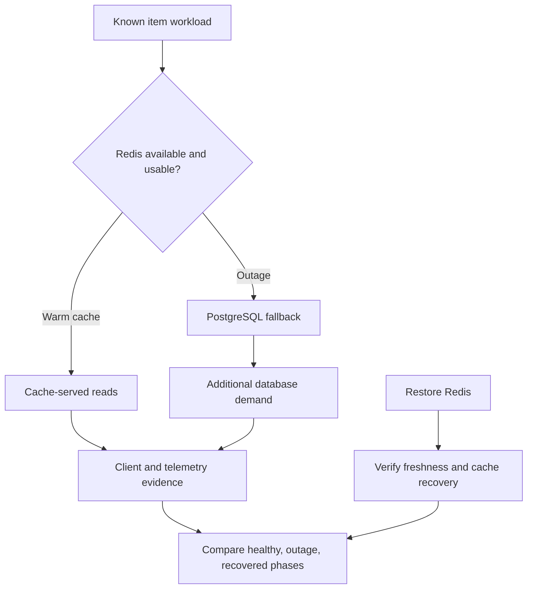

# Lab 45: Redis Failure Incident

## 1. Purpose and Learning Outcomes

You will test a Redis failure with all four observability signals available. Compare controlled warm-cache, outage, and recovery phases while checking CRUD and data freshness. Show both continued PostgreSQL-backed availability and the extra database work caused by losing the cache. A short successful fallback test does not prove the database can handle a prolonged full workload.

> **Primary Objective:** Prove that a Redis-only outage preserves PostgreSQL-backed CRUD, reports degraded readiness, changes cache and database demand, produces useful evidence, and recovers without stale responses.

This is the first dependency incident in the final phase. Stop only Redis, use uniquely named lab-owned items, and compare healthy, outage, and recovery requests. Build the incident timeline from saved observations.

Redis improves efficiency, while PostgreSQL remains the source of truth. HTTP success is only part of the result. Also verify degraded readiness, increased database reads, handling of failed cache invalidation, and the return of fresh cache hits. Later labs test PostgreSQL and observability-backend failures.

## 2. Starting Point and Lab Map

Open the complete application repository before using this guide. Unless a step says otherwise, run commands in Bash from the repository's top-level folder. Follow the starting checks in order because later commands depend on the helper functions and running services they prepare.

Read each explanation before running its commands. Run one complete code block, check the result, and then continue. In your notebook, save the commands, what happened, why you think it happened, and anything that differed from the expected result.

### Key Terms

| **Term**               | **Explanation**                                                                                             |
| ---------------------- | ----------------------------------------------------------------------------------------------------------- |
| Graceful degradation   | Continuing required business work with reduced capability or efficiency after an optional dependency fails. |
| Database amplification | Extra database work caused by reads that would normally be answered from cache.                             |
| Recovery proof         | Fresh evidence that the intended business behavior and relevant telemetry work again.                       |

### Lab Map

The arrows show how the parts connect and where a request can take different paths. Use this map to understand the design. It is not a recording of a request that actually ran.



## 3. Guided Walkthrough

### Step 01. Inherited State and Starting Checks

**What You Are Doing:** Check the expected TTL, one-worker setup, and recovered signal paths before injecting the fault. Keep those settings stable across the comparison.

**Practical Walkthrough:** Verify the thirty-second cache TTL, one application worker, and fresh evidence from every signal. A different TTL or process count changes cache lifetime and counter ownership, so do not change them during the incident.

Record the effective settings before taking a baseline. Keep cache lifetime and worker count constant through all phases. Otherwise, differences could come from configuration changes rather than the Redis failure.

```bash
source lab-notes/session.sh
source lab-notes/evidence.sh
source lab-notes/metrics-session.sh
source lab-notes/platform-session.sh
source lab-notes/traces-session.sh
source lab-notes/profiling/session.sh
load_app_settings
start_lab 45
dp config --quiet
dp ps -a
wait_ready
wait_backend loki:3100 /ready
wait_backend tempo:3200 /ready
wait_backend pyroscope:4040 /ready
test "$LAB_CACHE_TTL" -ge 10
test "$LAB_CACHE_TTL" -le 60
rcli PING
cp lab-notes/tracing/collector.yml "$LAB_DIR/collector.before.yml"
```

Complete [Lab 44](Lab-44.md). Keep one Uvicorn worker, the default 30-second TTL, fourteen services, and nine scrape jobs. If a changed TTL is outside 10–60 seconds, restore it through the app environment and recreate the app **before** the incident. Do not shorten TTL during the outage to make a failed correctness check pass.

Stop other generators while preserving checkpoints, users, credentials, database data, and volumes. Do not use `FLUSHALL`, delete Redis storage, stop PostgreSQL, or run `docker compose down -v`. Cleanup is limited to items this experiment creates.

Docker checks app liveness. Redis failure should not restart an otherwise responding application. Record the container ID and compare it after recovery.

**Understanding the Result:** Verify running settings, not just defaults in source. The comparison requires the intended baseline to be active.

### Step 02. Learning Objectives and Failure Predictions

**What You Are Doing:** Predict responses, cache behavior, dependency observations, and alert timing before the fault. These predictions give you specific claims to test.

**Practical Walkthrough:** Write expected outcomes for each phase: status codes, cache hits or misses, database reads, dependency gauges, and alerts. Separate immediate business behavior from delayed monitoring updates caused by checks, scrapes, and alert hold times.

Save predictions before injection. Monitoring may react later than requests because of observation and evaluation intervals. Use that distinction to explain expected delays and identify genuinely unexpected behavior afterward.

| **Observation**              | **Healthy Warm Cache**                | **Redis Unavailable**               | **Recovered**                          |
| ---------------------------- | ------------------------------------- | ----------------------------------- | -------------------------------------- |
| `/health/live`               | HTTP 200                              | HTTP 200                            | HTTP 200                               |
| `/health/ready`              | HTTP 200, `ready`                     | HTTP 200, `degraded`                | HTTP 200, `ready`                      |
| PostgreSQL dependency        | Available                             | Available                           | Available                              |
| Redis dependency             | Available                             | Unavailable                         | Available                              |
| Item reads                   | Usually answered from cache           | Fall back to PostgreSQL             | Return to hits after safe repopulation |
| Cache errors                 | Remain stable                         | Increase when cache operations fail | Stop increasing once healthy           |
| App DB `get` operation count | Near zero in the isolated warm burst  | About one operation per read        | Near zero again in the warm burst      |

**Prediction Checkpoint:** Predict latency direction, added database work, emitted records, and recovery conditions. A local connection refusal can be much faster than a network timeout. Neither a fixed latency penalty nor higher CPU use is guaranteed.

If cache deletion fails after a committed write, this implementation bypasses cache in that process for one TTL. Reads use PostgreSQL until a surviving stale value should have expired. Redis PING can recover before that interval ends, so readiness may recover before hits return. This protects the single-worker exercise; it is not distributed cache consistency across multiple replicas.

**Understanding the Result:** A short outage may affect requests yet end before an alert fires. Include monitoring timing in the prediction.

### Step 03. Install Incident Evidence Helpers

**What You Are Doing:** Add helpers that retain request and trace IDs and compare counters within the same application lifetime. Known synthetic context supplies reproducible trace lookup keys.

**Practical Walkthrough:** Review how helpers label phases and save identities. Keep raw counter subtraction inside one process lifetime. Synthetic parent context gives a known trace ID, while separate checks must still verify retention and complete delivery.

Read phase names, expected IDs, and snapshot scope first. The ledger is an independent reference. A known lookup key does not itself prove that all expected spans reached Tempo.

```bash
cat > lab-notes/profiling/item_load.py <<'PYTHON'
"""Read one lab-owned item at a bounded rate; preserve request/trace context evidence."""
import argparse,json,secrets,time,uuid
from urllib.request import ProxyHandler,Request,build_opener

parser=argparse.ArgumentParser()
parser.add_argument('base_url');parser.add_argument('item_id');parser.add_argument('output')
parser.add_argument('--count',type=int,default=20)
args=parser.parse_args();uuid.UUID(args.item_id)
assert 1<=args.count<=60
opener=build_opener(ProxyHandler({}))
with open(args.output,'x') as output:
    for number in range(args.count):
        request_id='redis-incident-'+str(uuid.uuid4());trace_id=secrets.token_hex(16)
        parent_id=secrets.token_hex(8)
        request=Request(args.base_url.rstrip('/')+'/api/v1/items/'+args.item_id,headers={
            'X-Request-ID':request_id,'traceparent':f'00-{trace_id}-{parent_id}-01'})
        start=time.time_ns()
        with opener.open(request,timeout=8) as response:
            item=json.load(response);status=response.status;returned=response.headers.get('X-Request-ID')
        assert status==200 and returned==request_id and item['id']==args.item_id
        output.write(json.dumps({'start_ns':start,'end_ns':time.time_ns(),'request_id':request_id,
            'trace_id':trace_id,'status':status,'item_id':item['id'],'name':item['name']})+'\n')
        output.flush();time.sleep(0.2)
print(json.dumps({'completed':args.count,'output':args.output}))
PYTHON
```

**Command Note:** `<<'PYTHON'` writes the block exactly as shown until the closing `PYTHON`. Quoting it prevents Bash from expanding `$variables` in the file. Creating and running the file are separate steps.

```bash
cat > lab-notes/profiling/metric_delta.py <<'PYTHON'
"""Compare process-local counter snapshots. Run inside app using its installed parser."""
import json,sys
from prometheus_client.parser import text_string_to_metric_families

def select(text):
    names={'application_cache_hits_total','application_cache_misses_total','application_redis_errors_total',
           'application_postgres_operation_duration_seconds_count','application_http_requests_total'}
    result={}
    for family in text_string_to_metric_families(text):
        for sample in family.samples:
            if sample.name not in names: continue
            if sample.name=='application_http_requests_total' and sample.labels.get('route')!='/api/v1/items/{item_id}': continue
            key=(sample.name,tuple(sorted(sample.labels.items())))
            result[key]=sample.value
    return result
before,after=select(sys.argv[1]),select(sys.argv[2])
rows=[]
for key,value in sorted(after.items()):
    delta=value-before.get(key,0)
    assert delta>=0,'Process restart/reset: compare a fresh stable interval'
    if delta:rows.append({'metric':key[0],'labels':dict(key[1]),'delta':delta})
print(json.dumps(rows,indent=2))
PYTHON
```

The loader saves the item, request ID, and trace ID for each read. It supplies a synthetic sampled W3C parent so the application uses a known trace identity. The caller's parent span is intentionally not exported, so its absence is expected as in Lab 38.

The metric helper calculates cumulative-counter differences within one running process and rejects resets. The database histogram's `_count{operation="get"}` counts app-observed database reads. It is not a count of every PostgreSQL statement and does not alone demonstrate saturation.

Temporarily bypass tail sampling so cache-hit and fallback traces can both be inspected. The script preserves redaction, batching, persistent export, and logging. Its exit trap restores the exact Lab 44 configuration. Native request metrics remain the complete independent population throughout.

**Understanding the Result:** Keep process boundaries and IDs attached to every comparison. They let you relate observations to the right run and detect invalid counter subtraction.

### Step 04. Run the Bounded Incident and Recover Redis

**What You Are Doing:** Run the full finite controller with its recovery trap. It creates known fixtures, performs the planned reads and writes, and keeps evidence if an assertion stops execution.

**Practical Walkthrough:** Install recovery by running the complete controller before Redis is changed. Preserve partial results after failure and verify restoration before another attempt. Do not mix fixture identities or overwrite the first run.

Keep phase timestamps, fixture IDs, and ledgers together. The controller's full sequence defines the experiment. If it stops, save the failure and confirm recovery before starting another run.

Read the script first. It creates a main item and a spare CRUD item, sends three twenty-read bursts, verifies outage persistence, and restores Redis even after assertion failure. On failure, the main item remains for investigation, with its ID saved for later scoped deletion.

Run the whole block in the same sourced Bash session. `set -euo pipefail` applies inside the subshell, so failed assertions trigger recovery without changing the parent shell's settings.

```bash
(
  set -euo pipefail
  recover_infrastructure() {
    dp start redis
    cp "$LAB_DIR/collector.before.yml" lab-notes/tracing/collector.yml
    dp up -d --no-deps --force-recreate otel-collector
  }
  trap recover_infrastructure EXIT
  trap 'exit 130' INT
  trap 'exit 143' TERM
  dp ps -q app > "$LAB_DIR/app-container.before.txt"
  lab-notes/.tools/bin/python - <<'PYTHON'
from pathlib import Path
import yaml
p=Path('lab-notes/tracing/collector.yml'); c=yaml.safe_load(p.read_text())
steps=c['service']['pipelines']['traces']['processors']
assert 'tail_sampling' in steps
c['service']['pipelines']['traces']['processors']=[s for s in steps if s!='tail_sampling']
p.write_text(yaml.safe_dump(c,sort_keys=False))
PYTHON
  dp run --rm -T --no-deps otel-collector validate --config=/etc/otelcol-contrib/config.yaml
  dp up -d --no-deps --force-recreate otel-collector
  wait_backend otel-collector:13133 /
  INCIDENT_TOKEN=$(new_uuid)
  CREATE=$(jq -n --arg name "lab45-$INCIDENT_TOKEN-before" \
    '{name:$name,description:"Redis incident fixture",price:"12.50",is_active:true}')
  STATUS=$(api -sS -o "$LAB_DIR/created.json" -w '%{http_code}' \
    -H 'Content-Type: application/json' -d "$CREATE" "$APP_URL/api/v1/items")
  test "$STATUS" = 201
  INCIDENT_ITEM=$(jq -er '.id' "$LAB_DIR/created.json")
  printf '%s\n' "$INCIDENT_ITEM" > "$LAB_DIR/item-id.txt"
  ITEM_KEY=$(cache_key "$INCIDENT_ITEM")
  api -fsS "$APP_URL/api/v1/items/$INCIDENT_ITEM" > "$LAB_DIR/warm.json"
  test "$(rcli EXISTS "$ITEM_KEY")" = 1
  test "$(rcli TTL "$ITEM_KEY")" -gt 0
  api -fsS "$APP_URL/metrics" > "$LAB_DIR/healthy.before.prom"
  python3 lab-notes/profiling/item_load.py "$APP_URL" "$INCIDENT_ITEM" \
    "$LAB_DIR/healthy.jsonl" --count 20
  api -fsS "$APP_URL/metrics" > "$LAB_DIR/healthy.after.prom"
  date -u +%FT%TZ > "$LAB_DIR/fault-start.txt"
  dp stop redis
  STATUS=$(api -sS -o "$LAB_DIR/outage-live.json" -w '%{http_code}' "$APP_URL/health/live")
  test "$STATUS" = 200
  STATUS=$(api -sS -o "$LAB_DIR/outage-ready.json" -w '%{http_code}' "$APP_URL/health/ready")
  test "$STATUS" = 200
  jq -e '.status=="degraded" and .dependencies.postgres=="up" and .dependencies.redis=="down"' \
    "$LAB_DIR/outage-ready.json"
  api -fsS "$APP_URL/metrics" > "$LAB_DIR/outage.before.prom"
  python3 lab-notes/profiling/item_load.py "$APP_URL" "$INCIDENT_ITEM" \
    "$LAB_DIR/outage.jsonl" --count 20
  api -fsS "$APP_URL/metrics" > "$LAB_DIR/outage.after.prom"
  UPDATE=$(jq -n --arg name "lab45-$INCIDENT_TOKEN-after" \
    '{name:$name,description:"Updated while Redis is down",price:"13.75",is_active:true}')
  api -fsS -X PUT -H 'Content-Type: application/json' -d "$UPDATE" \
    "$APP_URL/api/v1/items/$INCIDENT_ITEM" > "$LAB_DIR/updated.json"
  api -fsS "$APP_URL/api/v1/items/$INCIDENT_ITEM" > "$LAB_DIR/read-after-update.json"
  jq -e --slurpfile updated "$LAB_DIR/updated.json" \
    '.name==$updated[0].name and .price==$updated[0].price' "$LAB_DIR/read-after-update.json"
  dbsql -v incident_id="$INCIDENT_ITEM" > "$LAB_DIR/persisted-row.txt" <<'SQL'
SELECT id, name, price FROM items WHERE id = :'incident_id';
SQL
  SPARE=$(jq -n --arg name "lab45-$INCIDENT_TOKEN-temporary" '{name:$name,price:"1.00"}')
  STATUS=$(api -sS -o "$LAB_DIR/spare-created.json" -w '%{http_code}' \
    -H 'Content-Type: application/json' -d "$SPARE" "$APP_URL/api/v1/items")
  test "$STATUS" = 201
  SPARE_ID=$(jq -er '.id' "$LAB_DIR/spare-created.json")
  STATUS=$(api -sS -X DELETE -o "$LAB_DIR/spare-delete-body.txt" -w '%{http_code}' \
    "$APP_URL/api/v1/items/$SPARE_ID")
  test "$STATUS" = 204
  STATUS=$(api -sS -o "$LAB_DIR/spare-not-found.json" -w '%{http_code}' \
    "$APP_URL/api/v1/items/$SPARE_ID")
  test "$STATUS" = 404
  # Give the ordinary dependency monitor time to emit its state transition.
  sleep 18
  pq 'application_dependency_up{dependency="redis"}' > "$LAB_DIR/redis-dependency-down.json"
  pq 'redis_up' > "$LAB_DIR/redis-exporter-observation.json"
  pq 'up{job="redis"}' > "$LAB_DIR/redis-scrape-health.json"
  api -fsS "$PROM_URL/api/v1/alerts" > "$LAB_DIR/outage-alerts.json"
  dp logs --since 2m --tail 250 app > "$LAB_DIR/outage-app.log"
  date -u +%FT%TZ > "$LAB_DIR/recovery-start.txt"
  dp start redis
  wait_ready
  rcli PING > "$LAB_DIR/recovered-ping.txt"
  api -fsS "$APP_URL/health/ready" > "$LAB_DIR/recovered-ready.json"
  # PING may recover before the failed-invalidation bypass has expired.
  for ((attempt=0; attempt<=LAB_CACHE_TTL+5; attempt++)); do
    api -fsS "$APP_URL/api/v1/items/$INCIDENT_ITEM" > "$LAB_DIR/recovered-read.json"
    jq -e --slurpfile updated "$LAB_DIR/updated.json" \
      '.name==$updated[0].name and .price==$updated[0].price' "$LAB_DIR/recovered-read.json" >/dev/null
    if [[ "$(rcli EXISTS "$ITEM_KEY")" = 1 ]]; then break; fi
    sleep 1
  done
  test "$(rcli EXISTS "$ITEM_KEY")" = 1
  test "$(rcli TTL "$ITEM_KEY")" -gt 0
  rcli GET "$ITEM_KEY" > "$LAB_DIR/recovered-cache-value.json"
  jq -e --slurpfile updated "$LAB_DIR/updated.json" \
    '.name==$updated[0].name and .price==$updated[0].price' "$LAB_DIR/recovered-cache-value.json"
  api -fsS "$APP_URL/metrics" > "$LAB_DIR/recovered.before.prom"
  python3 lab-notes/profiling/item_load.py "$APP_URL" "$INCIDENT_ITEM" \
    "$LAB_DIR/recovered.jsonl" --count 20
  api -fsS "$APP_URL/metrics" > "$LAB_DIR/recovered.after.prom"
  dp ps -q app > "$LAB_DIR/app-container.after.txt"
  cmp "$LAB_DIR/app-container.before.txt" "$LAB_DIR/app-container.after.txt"
  date -u +%FT%TZ > "$LAB_DIR/recovery-complete.txt"
)
wait_ready
wait_backend otel-collector:13133 /
```

**Command Note:** `trap ... EXIT` schedules cleanup when that shell exits. Keep it with the fault and follow it with explicit recovery checks.

At completion, verify the original app container, successful readiness, and the updated value in PostgreSQL and cache. Also inspect uptime and restart count if Docker reports a restart: unchanged container identity does not exclude a process restart inside it.

An old cache entry may survive depending on TTL, outage duration, and persistence. Do not claim it definitely did. Verify failed invalidation, authoritative outage reads, the safety bypass, and the value repopulated after recovery. Keep the app running rather than restarting it to clear its local bypass.

**Understanding the Result:** Run fault actions only inside their recovery wrapper. Isolated lines would remove the controller's intended safeguards and phase boundaries.

### Step 05. Quantify Cache Fallback and Database Amplification

**What You Are Doing:** Compare cache and database changes across equivalent bursts. Investigate extra traffic, expiry, and resets before calling a difference an exact measure of amplification.

**Practical Walkthrough:** Use matching labels and one application lifetime for the twenty-read comparisons. Check TTL, probes, and other callers. Application counters and database-server metrics may count different work over the same interval.

Inspect real cache outcomes before calculating extra database demand. Keep app-observed reads separate from server-wide activity, which also includes probes and other clients. Explain deviations from the planned warm, outage, and recovered paths.

```bash
for phase in healthy outage recovered; do
  BEFORE=$(cat "$LAB_DIR/$phase.before.prom")
  AFTER=$(cat "$LAB_DIR/$phase.after.prom")
  dp exec -T app python - "$BEFORE" "$AFTER" \
    < lab-notes/profiling/metric_delta.py > "$LAB_DIR/$phase-deltas.json"
  jq . "$LAB_DIR/$phase-deltas.json"
done
python3 - "$LAB_DIR" <<'PYTHON'
import json,math,statistics,sys
from pathlib import Path
root=Path(sys.argv[1]);result=[]
for phase in ['healthy','outage','recovered']:
    requests=[json.loads(s) for s in (root/(phase+'.jsonl')).read_text().splitlines()]
    deltas=json.loads((root/(phase+'-deltas.json')).read_text())
    n=len(requests);assert n==20 and all(r['status']==200 for r in requests)
    db=sum(r['delta'] for r in deltas if r['metric']=='application_postgres_operation_duration_seconds_count'
           and r['labels'].get('operation')=='get')
    elapsed=sorted((r['end_ns']-r['start_ns'])/1e6 for r in requests)
    result.append({'phase':phase,'requests':n,'db_get_operations':db,'db_gets_per_read':db/n,
                   'client_median_ms':statistics.median(elapsed),'client_p95_ms':elapsed[math.ceil(.95*n)-1]})
(root/'incident-comparison.json').write_text(json.dumps(result,indent=2))
print(json.dumps(result,indent=2))
PYTHON
```

In isolation, each warm burst should produce about twenty hits and zero DB gets; the outage burst should produce twenty misses and twenty DB gets. Update and recovery checks occur outside the burst snapshots. Extra callers, expired TTL, or resets invalidate an exact comparison and must be accounted for.

Report extra database operations or DB gets per completed read. Dividing by a warm baseline of zero cannot produce a meaningful finite amplification multiple. For a fully warm baseline, report the rise from roughly zero to one database operation per read.

Redis errors can arise from GET, SET, DELETE, or PING, so their increments do not count failed HTTP requests. During bypass, a read counts as a miss without trying Redis, reducing Redis errors while fallback continues. Readiness PING checks can also add errors.

Latency may rise from failed cache work plus database access, but local refusal can be quick. Twenty requests provide only a coarse empirical p95, not a reliable production tail-SLO estimate. Report the measured direction and uncertainty.

**Understanding the Result:** Define the measured work before calculating amplification. A higher server total cannot automatically be attributed only to the twenty application reads.

### Step 06. Correlate Metrics, Logs, Traces and Profiles

**What You Are Doing:** Align metrics, records, traces, and available profiles with the same incident phases. Use them to test a specific explanation while preserving each observer's scope.

**Practical Walkthrough:** Use controller times and known IDs to compare signals. Test database fallback after cache loss against multiple observations. Keep identified requests separate from host or server measurements covering broader activity.

Combine cache failures, app database operations, and retained traces to evaluate fallback. Use exact IDs where available and phase times for aggregate views. Do not assign every resource change to one request merely because it happened nearby.

```promql
application_dependency_up{dependency="redis"}
```

```promql
sum by (operation) (rate(application_redis_errors_total[5m]))
```

```promql
sum(rate(application_postgres_operation_duration_seconds_count{operation="get"}[5m]))
```

Use earlier RED, cache, dependency, and database panels. `up{job="redis"}` shows whether Prometheus scraped the exporter; `redis_up` shows what the exporter observed about Redis. They can be 1 and 0 together. The app's `application_dependency_up` is another observer with different timing and credentials. None alone measures full database-infrastructure saturation.

Search Loki over the incident interval using the actual service and environment. The query keeps established resource labels and matches message text after JSON parsing:

```logql
{service_name="items-info",deployment_environment_name="local"}
  | json
  | message=~"cache_operation_failed|dependencies_degraded|dependencies_ready|item_updated"
```

```bash
TRACE_ID=$(jq -rs '.[0].trace_id' "$LAB_DIR/outage.jsonl")
REQUEST_ID=$(jq -rs '.[0].request_id' "$LAB_DIR/outage.jsonl")
fetch_trace "$TRACE_ID" "$LAB_DIR/fallback-trace.json"
python3 lab-notes/tracing/inspect_trace.py "$LAB_DIR/fallback-trace.json" > "$LAB_DIR/fallback-spans.json"
jq '.[] | {name,kind,duration_ms,status,attributes}' "$LAB_DIR/fallback-spans.json"
HEALTHY_TRACE=$(jq -rs '.[0].trace_id' "$LAB_DIR/healthy.jsonl")
fetch_trace "$HEALTHY_TRACE" "$LAB_DIR/cache-hit-trace.json"
python3 lab-notes/tracing/inspect_trace.py "$LAB_DIR/cache-hit-trace.json" > "$LAB_DIR/cache-hit-spans.json"
```

Compare a successful cache hit with a fallback trace. Fallback should show attempted Redis work and a database read while HTTP still succeeds. The failed Redis child can be marked as an error even when the app recovers. Inspect real spans and statuses rather than inventing a `cache.fallback` event the code does not emit.

Find logs using `REQUEST_ID` and follow the existing Tempo link. Background dependency transitions may have neither a request ID nor an active span; place them by timestamp and observer. Preserve their order instead of counting each warning as another customer failure.

In Pyroscope, use the same service/environment, incident interval, and Lab 42 profile type. Compare CPU stacks with the healthy phase. CRUD is not Lab 44's specially tagged worker, so this is a service-window comparison, not an exact-span profile. Dependency waiting can increase elapsed time with little CPU weight. Sparse samples do not prove zero overhead.

**Understanding the Result:** Multiple agreeing signals strengthen a specific explanation. Shared timing alone does not establish that all resource changes came from this incident.

### Step 07. Inspect Alerts and Prove Clean Recovery

**What You Are Doing:** Compare the outage duration with loaded alert settings and verify fresh recovery. A short incident can correctly end before the rule reaches firing state.

**Practical Walkthrough:** Read the actual hold time and evaluation cadence, then compare them with the recorded fault interval. Verify current dependencies and business requests regardless of alert firing. Do not weaken thresholds just to obtain a screenshot.

Save pending or inactive alert results if their timing is correct. The incident may recover before the policy's hold duration is met. Fresh recovery evidence matters independently of whether a warning fired.

```bash
jq '.data.alerts[] | {labels,state,activeAt}' "$LAB_DIR/outage-alerts.json"
api -fsS "$PROM_URL/api/v1/alerts" > "$LAB_DIR/recovered-alerts.json"
curl -fsS --connect-timeout 2 --max-time 15 \
  "${ALERTMANAGER_URL:-http://127.0.0.1:9093}/api/v2/alerts" > "$LAB_DIR/alertmanager-alerts.json"
wait_metric 'application_dependency_up{dependency="redis"}' 1
wait_metric 'redis_up' 1
wait_ready
dp logs --since 3m --tail 150 app redis > "$LAB_DIR/recovery.log"
lab-notes/.tools/bin/python - <<'CHECK'
import yaml
c=yaml.safe_load(open('lab-notes/tracing/collector.yml'))
assert 'tail_sampling' in c['service']['pipelines']['traces']['processors']
assert any(p['name']=='keep-profile-work' for p in c['processors']['tail_sampling']['policies'])
CHECK
dp ps -a
```

The outage may be shorter than `for`, so pending or not-yet-observed alert state can be valid. Only firing alerts go to Alertmanager; absence there does not prove broken routing. Inspect the loaded rule, evaluations, and outage timeline. Keep the production-style threshold instead of shortening it to manufacture firing.

Prove recovery with both dependencies observed up, preserved updated data, a fresh cache entry with positive TTL, restored warm hits, no sustained Redis error growth, and no unintended app restart. Dependency-ready state and cache-hit behavior require separate evidence.

**Understanding the Result:** Pending or inactive can be the correct alert outcome. Save the actual transitions and explain their timing.

### Step 08. Clean Up Only the Incident Fixtures

**What You Are Doing:** Delete only this incident's recorded fixtures after recovery. Preserve the course checkpoint and evidence.

**Practical Walkthrough:** Use saved IDs for cleanup and restore any temporary bypass setting. Keep unrelated data intact. Verify readiness and fresh signals so the next lab starts with the recovered cache policy.

Read each fixture ID before deletion. Keep the protected checkpoint separate, restore temporary bypass configuration at runtime, and check new business and telemetry evidence. Cleanup should remove test state without erasing the incident record.

```bash
INCIDENT_ITEM=$(cat "$LAB_DIR/item-id.txt")
STATUS=$(api -sS -X DELETE -o "$LAB_DIR/final-delete-body.txt" -w '%{http_code}' \
  "$APP_URL/api/v1/items/$INCIDENT_ITEM")
test "$STATUS" = 204
STATUS=$(api -sS -o "$LAB_DIR/final-not-found.json" -w '%{http_code}' \
  "$APP_URL/api/v1/items/$INCIDENT_ITEM")
test "$STATUS" = 404
test "$(rcli EXISTS "$(cache_key "$INCIDENT_ITEM")")" = 0
wait_ready
```

If failure left the spare item, read its UUID from `spare-created.json` and delete only that item through the recovered API. A 404 means it is already absent. Retain the curriculum checkpoint and all evidence; never expand cleanup to all items or cache keys.

**Understanding the Result:** Scoped deletion preserves unrelated data. Both current recovery and the saved incident must remain verifiable.

## 4. Troubleshooting and Diagnosis

Begin with the first result that differed from your prediction. Save the exact error or symptom and identify which service or command produced it. Use the checks below, make the needed fix, and repeat the original check to confirm the problem is resolved.

### Troubleshooting and Incident Reasoning

| **Unexpected Result**                     | **Next Useful Check**                                                                                                               |
| ----------------------------------------- | ----------------------------------------------------------------------------------------------------------------------------------- |
| Readiness is 503 with only Redis stopped  | Check PostgreSQL and error handling. Redis alone should produce HTTP 200 with degraded details.                                     |
| Liveness fails                            | Investigate process failure, resource contention, or code. Dependency readiness is a different check.                               |
| Warm burst still reaches DB               | Check the bypass deadline, TTL, exact key and value, and concurrent callers.                                                        |
| Redis recovered but hits are delayed      | Failed invalidation can keep the worker bypassing cache until the TTL safety period ends.                                           |
| Updated data reverts after recovery       | Stop and retain evidence. Inspect invalidation and bypass rather than hiding the problem with a full flush.                         |
| Exporter scrape is up while Redis is down | This is a valid observer distinction. Inspect `redis_up` and exporter logs.                                                         |
| No dependency transition record           | Check monitor cadence, query interval, and ingestion. Operation warnings do not prove the transition logger ran.                    |
| Trace absent                              | Check the temporary tail bypass, sampled parent, SDK export, and backend delivery before drawing cache conclusions.                 |

See [Redis cache-aside guidance](https://redis.io/learn/howtos/solutions/caching-architecture/cache-aside), [OpenTelemetry Python Redis instrumentation](https://opentelemetry-python-contrib.readthedocs.io/en/latest/instrumentation/redis/redis.html), and [Prometheus alerting rules](https://prometheus.io/docs/prometheus/latest/configuration/alerting_rules/). The exact tested behavior is defined in `app/app/cache.py`, `api.py`, and `main.py`.

## 5. Review and Practice

Answer the questions in your own words before reading the answers. For the scenario, say what you would inspect and exactly what each result would tell you.

### Knowledge Check

1. Why can Redis warnings coexist with HTTP 200?
2. Why can exporter up equal 1 while Redis up equals 0?
3. Why can PING recovery precede cache hits?
4. What is wrong with dividing outage DB reads by a zero warm-baseline count?

#### Answer Guide

1. Redis is optional, so a failed cache operation can be followed by a successful PostgreSQL-backed response.
2. Prometheus reached the exporter successfully, while the exporter could not reach Redis.
3. The failed-invalidation bypass intentionally continues for a TTL safety interval even after Redis responds to PING.
4. Division by zero is undefined. Report added operations and database gets per completed read instead.

### Professional Scenario Exercise

Write a short report about a cache outage that kept the service available while increasing database work. Include customer impact, detection, an alternative hypothesis, causal evidence, mitigation, recovery proof, and a concrete follow-up. Explain why HTTP 200 responses alone do not establish that the incident had no operational cost.

## 6. Completion Checklist

Tick an item only when you can show its result or saved evidence. Finish the cleanup instructions before starting the next lab.

### Observable Completion Criteria

- [ ] Only Redis was stopped and restored in the limited experiment with its recovery trap.
- [ ] Liveness remained successful, while readiness returned HTTP 200 with degraded cache details.
- [ ] Reads, creates, updates, and deletes were verified through the authoritative database path.
- [ ] Healthy, outage, and recovery bursts quantify cache behavior and DB gets per read.
- [ ] Logs and traces distinguish recovered dependency errors from successful HTTP outcomes.
- [ ] Profiles are interpreted separately from elapsed dependency waiting.
- [ ] Updated data is safely cached again, hits return, tail policies are restored, and only lab-owned fixtures are deleted.

## 7. Production Context and Next Lab

### Production Implications

Cache loss can send the full read workload to PostgreSQL. Production systems may need request limits, combining identical concurrent requests, circuit breakers, varied TTLs, and capacity planning. This worker-local bypass is not sufficient distributed invalidation for several workers. Test consistency and bounded fallback under representative load before using the pattern across a fleet.

### End State and Transition

Finish with healthy Redis, PostgreSQL, and readiness. Keep profiling and correlation enabled and restore the original tail policies, including the limited profile-work exception. Leave no intended fault or fixture active. [Lab 46](Lab-46.md) fails PostgreSQL, the required source of truth, so readiness and CRUD expectations change.
