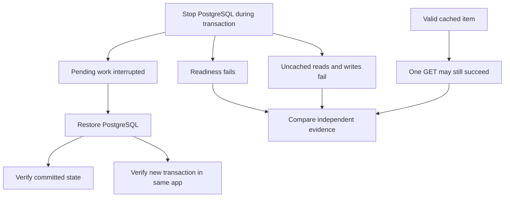

# Lab 46: PostgreSQL Failure Incident

## 1. Purpose and Learning Outcomes

**In Plain Language:** You will interrupt the required database and distinguish a live app from a working persistence path. A committed fixture, an uncommitted change, a cached read, and a failed create give you different outcomes to verify. After recovery, prove that durable state is correct and the existing application process can use its connection pool for new committed work.

> **Primary Objective:** Distinguish a live process from a broken data path, observe transaction and pool behavior during a PostgreSQL outage, and prove durable recovery.

Lab 45 showed graceful degradation when the optional cache failed. PostgreSQL is the required source of truth, so its failure changes readiness and the operations the application can safely complete. A cached GET may still succeed while writes and uncached reads fail.

This lab stops only the local PostgreSQL container, interrupts a transaction on a lab-owned row, records failed API operations, and recovers without restarting the app or deleting storage. It also closes a database error-classification edge case before the experiment. This is a controlled shutdown/restart exercise, not a simulation of disk corruption, failover or catastrophic power loss.

## 2. Starting Point and Lab Map

Use this guide inside the complete application repository. Run commands from the repository root in Bash unless a step says otherwise. Work through the starting checks in order; they load the helpers and state this lab needs.

Read the explanation before each step, run one complete code block at a time, and compare the actual result with the stated expectation. Save commands, observations, explanations, and unexpected results in your notebook.

### Key Terms

| **Term**           | **Plain-Language Meaning**                                                        |
| ------------------ | --------------------------------------------------------------------------------- |
| Uncommitted change | A transaction's pending work that has not become durable committed state.         |
| Pool recovery      | The application obtaining usable connections after old database connections fail. |
| Cache masking      | A cached response succeeding without exercising an unavailable database.          |

### Lab Map

The arrows show the flow or dependency being studied. Branches identify paths to compare; this is a conceptual map, not a captured runtime trace.



## 3. Guided Walkthrough

### Step 01. Inherited State and Starting Checks

**What You Are Doing:** Verify the recovered Redis incident and retain the specified timeout, TTL, and worker settings. These controls keep the database experiment comparable and bounded.

**Practical Walkthrough:** Verify Redis recovery and the specified timeout, TTL, and worker configuration before the database fault. Keep the same process unless the guide explicitly changes it. These controls bound waiting and let the experiment demonstrate connection-pool recovery without confusing it with application recreation.

Verify timeout, TTL, worker count, and recovered Redis before the database interruption. Save app lifecycle evidence after any prescribed deployment change. The later recovery claim depends on showing useful work resumed in that same process rather than being repaired by an unnoticed application replacement.

```bash
source lab-notes/session.sh
source lab-notes/evidence.sh
source lab-notes/metrics-session.sh
source lab-notes/platform-session.sh
source lab-notes/traces-session.sh
source lab-notes/profiling/session.sh
load_app_settings
start_lab 46
dp config --quiet
wait_ready
wait_backend loki:3100 /ready
wait_backend tempo:3200 /ready
wait_backend pyroscope:4040 /ready
mkdir -p lab-notes/operations
cp app/app/database.py "$LAB_DIR/database.before.py"
dp exec -T app python - <<'CHECK'
from app.config import Settings
s=Settings()
assert s.db_timeout_seconds<=5
assert s.trace_sample_ratio==1.0
print({'pool_size':s.db_pool_size,'max_overflow':s.db_max_overflow,
       'timeout_seconds':s.db_timeout_seconds,'cache_ttl_seconds':s.cache_ttl_seconds})
CHECK
```

Complete [Lab 45](Lab-45.md), including cleanup and recovery. Use the same Bash session and the stage-aware `dp` helper. The platform has fourteen services, nine scrape jobs, full SDK head recording, Collector tail policies, and the scoped profiling path from Lab 44.

Keep the default three-second database timeout and thirty-second cache TTL. Stop other load generators. All fixture names and UUIDs below belong to this run; earlier checkpoint data must remain. Host tools remain Bash, Python 3, curl, jq and the existing PyYAML environment.

**Understanding the Result:** Record current app identity before the fault. Later successful requests must be tied to that same running application.

### Step 02. Learning Objectives and Failure Boundaries

**What You Are Doing:** Predict outcomes by the dependency each path needs. Liveness, a warm read, an uncached list, and a write are intentionally different checks.

**Practical Walkthrough:** Predict liveness, warm cached reads, uncached reads or lists, and writes separately. They require different dependencies, so PostgreSQL loss need not make every endpoint fail identically. Establish cache state before testing the warm path so a miss is not mistaken for contradictory behavior.

Prepare the warm-key state explicitly and predict each route according to its required dependency. Liveness, a cached item, an uncached list, and a new write test different capabilities. A warm success during PostgreSQL failure does not contradict unavailable required persistence or not-ready status.

| **Boundary**              | **Expected Observation**                          | **What It Does Not Prove**                         |
| ------------------------- | ------------------------------------------------- | -------------------------------------------------- |
| App process               | Liveness remains HTTP 200                         | Required business functionality works              |
| Readiness                 | HTTP 503, PostgreSQL down, Redis up               | Every individual request must fail                 |
| Cached item GET           | Can remain HTTP 200 while the entry is valid      | PostgreSQL is healthy or fresh writes are possible |
| List, write, uncached GET | Sanitized HTTP 503 on database connection failure | Automatic replay is safe                           |
| Interrupted transaction   | Uncommitted changes are absent after restart      | Every ambiguous client timeout means rollback      |
| Connection pool           | Stale connections are replaced on later checkout  | An in-flight transaction can be rescued            |

**Prediction Checkpoint:** explain why a successful cached GET and unsuccessful readiness can both be correct. Readiness reports the required service capability. This app does not block every endpoint whenever readiness is false; an external router would use readiness to decide whether to send new traffic.

The SQLAlchemy engine is created once. Pool pre-ping checks connections on checkout, while recycle, acquisition timeout, connect timeout and statement timeout address different boundaries. A `docker exec` process creating a new engine cannot report the running worker's pool occupancy. Inspect configured limits, server-side sessions and request behavior instead.

**Understanding the Result:** One successful cached read does not prove database readiness. Use a path that actually requires PostgreSQL for that claim.

### Step 03. Normalize Database Connection Refusal Safely

**What You Are Doing:** Verify the narrow database connection-error translation established earlier and apply the guarded correction if needed. It must classify only failures inside the database operation boundary.

**Practical Walkthrough:** Inspect the earlier database connection-error translation and apply the guarded correction only if the expected source requires it. Keep exception handling scoped around database operations. A broad catch outside that boundary could misclassify unrelated programming or network errors as expected dependency failures.

Inspect the guarded patch and its exception boundary before application, then run the regression check. Normalize connection failures raised by database work without catching unrelated application errors broadly. Preserve expected error bodies through the request helper so classification can be verified during the real outage.

Some connection failures reach SQLAlchemy callers as an `OSError` subclass such as `ConnectionRefusedError`. The existing API already maps `SQLAlchemyError` and timeout failures to a sanitized database 503, but a raw OS exception can otherwise become a generic 500.

The small change below normalizes only exceptions raised inside `Database.operation`. It does not globally classify every filesystem or socket failure as a database outage. Session cleanup and rollback remain owned by the existing request dependency.

```bash
cat > lab-notes/operations/normalize_database_failure.py <<'PYTHON'
"""Normalize only network failures raised inside a database operation."""
from pathlib import Path
p=Path('app/app/database.py');source=p.read_text()
old='''        except (SQLAlchemyError, TimeoutError):
            self.metrics.dependency_up.labels("postgres").set(0)
            raise
        finally:'''
new='''        except (SQLAlchemyError, TimeoutError):
            self.metrics.dependency_up.labels("postgres").set(0)
            raise
        except OSError as error:
            self.metrics.dependency_up.labels("postgres").set(0)
            raise SQLAlchemyError("Database connection unavailable") from error
        finally:'''
if new not in source:
    assert source.count(old)==1, 'Review the current Database.operation implementation'
    p.write_text(source.replace(old,new))
print('Database-scoped OS failures use the existing sanitized database error handler')
PYTHON
```

**Command Note:** `<<'PYTHON'` writes the following block literally until `PYTHON`. Quoting the delimiter prevents Bash from expanding `$variables` inside the generated file; creation and execution are separate steps.

```bash
python3 lab-notes/operations/normalize_database_failure.py
cat > app/tests/test_database_connection_failure.py <<'PYTHON'
from sqlalchemy.ext.asyncio import AsyncSession


async def test_connection_refusal_is_sanitized_database_503(client, monkeypatch):
    async def unavailable(self, statement, *args, **kwargs):
        raise ConnectionRefusedError('private-connection-detail')
    monkeypatch.setattr(AsyncSession, 'scalar', unavailable)
    response = await client.get('/api/v1/items', headers={'X-Request-ID': 'db-refusal-contract'})
    assert response.status_code == 503
    assert response.json()['error']['code'] == 'database_unavailable'
    assert response.headers['X-Request-ID'] == 'db-refusal-contract'
    assert 'private-connection-detail' not in response.text
PYTHON
make test
dp up -d --no-deps --build app
wait_ready
```

This rebuild happens before the failure measurement. The same app process must then survive the actual database incident. Retain this correction and regression test in later labs.

```bash
cat > lab-notes/operations/request_probe.py <<'PYTHON'
"""One bounded request; preserve known IDs and expected error responses."""
import argparse,json,secrets,time,uuid
from urllib.error import HTTPError,URLError
from urllib.request import ProxyHandler,Request,build_opener
p=argparse.ArgumentParser()
p.add_argument('base_url');p.add_argument('path');p.add_argument('output')
p.add_argument('--method',choices=['GET','POST','PUT','DELETE'],default='GET')
p.add_argument('--body');p.add_argument('--expect',type=int)
a=p.parse_args();assert a.path.startswith('/') and not a.path.startswith('//')
rid='incident-'+str(uuid.uuid4());tid=secrets.token_hex(16);parent=secrets.token_hex(8)
headers={'X-Request-ID':rid,'traceparent':f'00-{tid}-{parent}-01'}
body=None if a.body is None else json.dumps(json.loads(a.body)).encode()
if body is not None:headers['Content-Type']='application/json'
request=Request(a.base_url.rstrip('/')+a.path,data=body,headers=headers,method=a.method)
started=time.time_ns();status=0;returned=None;document=None;transport_error=None
try:
    try:response=build_opener(ProxyHandler({})).open(request,timeout=12)
    except HTTPError as error:response=error
    with response:
        status=response.status;returned=response.headers.get('X-Request-ID')
        raw=response.read();document=json.loads(raw) if raw else None
except (URLError,TimeoutError,OSError) as error:
    transport_error=type(error).__name__
result={'start_ns':started,'end_ns':time.time_ns(),'method':a.method,'path':a.path,
        'status':status,'request_id':rid,'returned_request_id':returned,'trace_id':tid,
        'response':document,'transport_error':transport_error}
with open(a.output,'x') as f:json.dump(result,f,indent=2)
print(json.dumps({'status':status,'request_id':rid,'trace_id':tid,'output':a.output}))
if a.expect is not None:assert status==a.expect, f'Expected {a.expect}, observed {status}'
if status:assert returned==rid,'Response did not preserve request correlation'
PYTHON
```

```bash
cat > lab-notes/operations/change_event.py <<'PYTHON'
"""Append local operator change evidence; never accept secret values as fields."""
import argparse,datetime,json,os,uuid
p=argparse.ArgumentParser();p.add_argument('output')
p.add_argument('action');p.add_argument('target');p.add_argument('outcome')
p.add_argument('--reason',required=True);a=p.parse_args()
record={'timestamp':datetime.datetime.now(datetime.timezone.utc).isoformat(),
        'event_id':str(uuid.uuid4()),'actor':os.getenv('LAB_OPERATOR',os.getenv('USER','local-operator')),
        'action':a.action,'target':a.target,'outcome':a.outcome,'reason':a.reason}
with open(a.output,'a') as f:f.write(json.dumps(record)+'\n')
print(json.dumps(record))
PYTHON
```

The request helper preserves expected HTTP error bodies, IDs and timestamps without treating every 503 as a shell transport failure. Its synthetic sampled parent is deliberately not exported. Health routes are excluded from tracing, so a generated health-request trace ID is not evidence that a health span exists.

The change journal records the operator's actions outside the telemetry backends. It is local, editable evidence, not an authenticated or tamper-proof audit trail. Never put credentials in its reason field.

**Understanding the Result:** The intended 503 classification should be narrow and testable. Preserve regression checks for errors outside the database boundary.

### Step 04. Create a Durable Fixture and Inspect Connections

**What You Are Doing:** Create committed data to preserve and inspect normal connection state before the outage. Idle pooled connections are expected and should not automatically be labeled leaks.

**Practical Walkthrough:** Create and verify committed fixture data, then inspect normal connection state before interrupting the server. Pooled idle connections are retained for reuse and are not automatically leaks. Save the baseline so connection behavior after recovery can be interpreted against an actual normal state.

Verify the fixture through an independent committed read and record normal connection activity before stopping PostgreSQL. Distinguish idle pooled connections from idle transactions. Save the original field values and app lifecycle identity so post-recovery comparisons can establish retained data and continued use of the existing process.

```bash
TOKEN=$(new_uuid)
ORIGINAL_NAME="lab46-$TOKEN-committed"
PAYLOAD=$(jq -n --arg name "$ORIGINAL_NAME" '{name:$name,price:"21.00"}')
python3 lab-notes/operations/request_probe.py "$APP_URL" /api/v1/items "$LAB_DIR/created.json" \
  --method POST --body "$PAYLOAD" --expect 201
ITEM_ID=$(jq -er '.response.id' "$LAB_DIR/created.json")
printf '%s\n' "$ITEM_ID" > "$LAB_DIR/item-id.txt"
api -fsS "$APP_URL/api/v1/items/$ITEM_ID" > "$LAB_DIR/warm.json"
dbsql -v item_id="$ITEM_ID" -v service_name="$LAB_SERVICE" > "$LAB_DIR/database-before.txt" <<'SQL'
SELECT id, name, price FROM items WHERE id = :'item_id';
SELECT application_name, state, wait_event_type, count(*)
FROM pg_stat_activity WHERE application_name = :'service_name'
GROUP BY application_name, state, wait_event_type ORDER BY state;
SQL
docker inspect --format '{{.Id}} {{.State.StartedAt}} {{.RestartCount}}' "$(dp ps -q app)" \
  > "$LAB_DIR/app-before.txt"
api -fsS "$APP_URL/metrics" > "$LAB_DIR/metrics-before.prom"
```

**Command Note:** `jq --arg` passes a shell value as a JSON-query string variable without inserting it into the query text. Where used, `-e` turns a false or null final result into a failing exit status.

Idle connections are normal pooled connections, not automatically leaks. A pool maximum is a bound, not a target number that should always be allocated. The background dependency monitor can also use a connection; one observed session is not necessarily one customer request.

**Understanding the Result:** Committed state is the durability control. Connection count needs lifecycle context before it supports a leak diagnosis.

### Step 05. Interrupt a Transaction and Exercise the Broken Data Path

**What You Are Doing:** Observe the intended open transaction, interrupt PostgreSQL, and exercise the affected routes. Preserve the distinction between committed data, pending work, and requests that could not start a successful write.

**Practical Walkthrough:** Confirm the intended transaction is open, interrupt PostgreSQL inside the recovery controller, and run the documented request paths. Keep committed data, uncommitted changes, and rejected new writes distinct in the ledger. Each has a different expected result after the database returns.

Confirm the transaction reached its intended open state before interrupting the server. Keep the complete recovery controller and ledger. Separate already committed data, pending uncommitted changes, and new failed requests because those categories have different expected persistence outcomes after restoration.

```bash
(
  set -euo pipefail
  trap 'dp start postgres' EXIT
  trap 'exit 130' INT
  trap 'exit 143' TERM
  dbsql -v item_id="$ITEM_ID" > "$LAB_DIR/interrupted-transaction.txt" 2>&1 <<'SQL' &
SET application_name = 'lab46-uncommitted';
BEGIN;
UPDATE items SET name = 'lab46-uncommitted-change' WHERE id = :'item_id';
SELECT pg_sleep(45);
ROLLBACK;
SQL
  TX_CLIENT=$!
  SEEN=0
  for ((attempt=1; attempt<=10; attempt++)); do
    if [[ "$(dbsql -Atc "SELECT EXISTS (SELECT 1 FROM pg_stat_activity WHERE application_name='lab46-uncommitted' AND state='active' AND wait_event='PgSleep')")" = t ]]; then
      SEEN=1; break
    fi
    sleep 0.5
  done
  test "$SEEN" = 1
  # Only this fixture key is refreshed; the uncommitted SQL update is invisible.
  rcli DEL "$(cache_key "$ITEM_ID")" >/dev/null
  api -fsS "$APP_URL/api/v1/items/$ITEM_ID" > "$LAB_DIR/rewarmed.json"
  python3 lab-notes/operations/change_event.py "$LAB_DIR/changes.jsonl" stop postgres started \
    --reason 'Bounded PostgreSQL failure experiment'
  dp stop postgres
  wait "$TX_CLIENT" && TX_STATUS=0 || TX_STATUS=$?
  printf '%s\n' "$TX_STATUS" > "$LAB_DIR/transaction-client-exit.txt"
  test "$TX_STATUS" -ne 0
  python3 lab-notes/operations/request_probe.py "$APP_URL" /health/live "$LAB_DIR/live-down.json" --expect 200
  python3 lab-notes/operations/request_probe.py "$APP_URL" /health/ready "$LAB_DIR/ready-down.json" --expect 503
  jq -e '.response.status=="not_ready" and .response.dependencies.postgres=="down" and .response.dependencies.redis=="up"' \
    "$LAB_DIR/ready-down.json"
  python3 lab-notes/operations/request_probe.py "$APP_URL" "/api/v1/items/$ITEM_ID" "$LAB_DIR/warm-during-outage.json"
  # Its status can be 200 or 503 depending on whether the short-lived entry remains.
  jq -e '.status==200 or .status==503' "$LAB_DIR/warm-during-outage.json"
  rcli DEL "$(cache_key "$ITEM_ID")" >/dev/null
  python3 lab-notes/operations/request_probe.py "$APP_URL" "/api/v1/items/$ITEM_ID" "$LAB_DIR/cold-down.json" --expect 503
  python3 lab-notes/operations/request_probe.py "$APP_URL" /api/v1/items "$LAB_DIR/list-down.json" --expect 503
  FAILED_NAME="lab46-$TOKEN-not-committed"
  FAILED_BODY=$(jq -n --arg name "$FAILED_NAME" '{name:$name,price:"99.00"}')
  python3 lab-notes/operations/request_probe.py "$APP_URL" /api/v1/items "$LAB_DIR/create-down.json" \
    --method POST --body "$FAILED_BODY" --expect 503
  python3 lab-notes/operations/request_probe.py "$APP_URL" "/api/v1/items/$ITEM_ID" "$LAB_DIR/update-down.json" \
    --method PUT --body "$FAILED_BODY" --expect 503
  python3 lab-notes/operations/request_probe.py "$APP_URL" "/api/v1/items/$ITEM_ID" "$LAB_DIR/delete-down.json" \
    --method DELETE --expect 503
  sleep 18
  api -fsS "$APP_URL/metrics" > "$LAB_DIR/metrics-down.prom"
  pq 'application_dependency_up{dependency="postgres"}' > "$LAB_DIR/dependency-down.json"
  pq 'pg_up' > "$LAB_DIR/exporter-down.json"
  api -fsS "$PROM_URL/api/v1/alerts" > "$LAB_DIR/alerts-down.json"
  dp logs --since 3m --tail 200 app postgres > "$LAB_DIR/outage.log"
  python3 lab-notes/operations/change_event.py "$LAB_DIR/changes.jsonl" start postgres started \
    --reason 'Restore required persistence after bounded observations'
  dp start postgres
  wait_ready
)
wait_ready
```

**Command Note:** `trap ... EXIT` schedules cleanup when that shell exits. Keep it in the same block as the fault; the explicit recovery checks afterward confirm that restoration actually succeeded.

The deliberate transaction ends with `ROLLBACK` even if the fault is delayed. Stopping PostgreSQL during `pg_sleep` should terminate its session before that point; no uncommitted update becomes durable. If the ten polling attempts never observe the intended session, investigate that prerequisite instead of assuming the transaction was interrupted.

A warm-cache success is an observation, not a guaranteed outage feature. The explicit key deletion forces the subsequent GET through PostgreSQL, preventing cache state from hiding the data-path failure. The app's dependency metrics can briefly reflect whichever observer last updated them; compare the health response, scrape timestamp and background monitor record.

The failed-create experiment is deliberately a connection-unavailable case. A timeout after a server committed is different: the client can have an ambiguous outcome. Do not generalize these observations into blindly retrying non-idempotent production writes.

**Understanding the Result:** An attempted write is not proof of commit. Preserve transaction and response evidence before checking final state.

### Step 06. Prove Durable State and Pool Recovery

**What You Are Doing:** Check that the committed row survived and uncommitted or failed writes did not appear. Then complete a new transaction without restarting the application to demonstrate pool recovery.

**Practical Walkthrough:** After PostgreSQL recovers, verify the committed row, absence of rolled-back changes, and absence of the failed create. Then complete a fresh transaction and compare app identity, start time, and restart count with the baseline. This proves recovery through the existing application pool rather than a replacement process.

Clear only the fixture's cache key before the durable read, then check committed values and absence of the failed changes independently. Complete a new transaction and compare app ID, start time, and restart count. This demonstrates usable pool recovery rather than merely a listening database or cached response.

```bash
rcli DEL "$(cache_key "$ITEM_ID")" >/dev/null
python3 lab-notes/operations/request_probe.py "$APP_URL" "/api/v1/items/$ITEM_ID" "$LAB_DIR/durable-read.json" --expect 200
jq -e --arg name "$ORIGINAL_NAME" '.response.name==$name and .response.price=="21.00"' "$LAB_DIR/durable-read.json"
dbsql -v item_id="$ITEM_ID" -v failed_name="lab46-$TOKEN-not-committed" \
  -v service_name="$LAB_SERVICE" > "$LAB_DIR/database-after.txt" <<'SQL'
SELECT id, name, price FROM items WHERE id = :'item_id';
SELECT count(*) AS failed_create_rows FROM items WHERE name = :'failed_name';
SELECT application_name, state, wait_event_type, count(*)
FROM pg_stat_activity WHERE application_name = :'service_name'
GROUP BY application_name, state, wait_event_type ORDER BY state;
SQL
docker inspect --format '{{.Id}} {{.State.StartedAt}} {{.RestartCount}}' "$(dp ps -q app)" \
  > "$LAB_DIR/app-after.txt"
cmp "$LAB_DIR/app-before.txt" "$LAB_DIR/app-after.txt"
RECOVERED_BODY=$(jq -n --arg name "lab46-$TOKEN-recovered" '{name:$name,price:"22.00"}')
python3 lab-notes/operations/request_probe.py "$APP_URL" "/api/v1/items/$ITEM_ID" "$LAB_DIR/update-recovered.json" \
  --method PUT --body "$RECOVERED_BODY" --expect 200
rcli DEL "$(cache_key "$ITEM_ID")" >/dev/null
python3 lab-notes/operations/request_probe.py "$APP_URL" "/api/v1/items/$ITEM_ID" "$LAB_DIR/read-recovered.json" --expect 200
jq -e '.response.price=="22.00"' "$LAB_DIR/read-recovered.json"
wait_metric 'application_dependency_up{dependency="postgres"}' 1
wait_metric 'pg_up' 1
```

The committed fixture must survive, the uncommitted name must be absent, and the failed-create name must have zero rows. The successful post-recovery update shows a new transaction can commit using the existing application process. The app identity, start time and restart count must match; container ID alone would miss a process restart inside the container.

Pre-ping helps reject stale connections and establish new ones. It cannot recover the interrupted transaction or know whether an ambiguous operation committed. Do not restart the app as the first recovery action; that would hide whether its normal pool/session lifecycle recovered.

**Understanding the Result:** Successful new work plus unchanged app identity supports pool recovery. Durable data alone cannot prove the app reconnected correctly.

### Step 07. Correlate Errors, Events, Traces and Waiting

**What You Are Doing:** Connect the known failed request to sanitized logs and available spans. Connection failure can occur before any SQL statement span exists, and elapsed waiting is not automatically CPU work.

**Practical Walkthrough:** Correlate known failed requests with sanitized logs and whatever spans were actually emitted. A connection can fail before any SQL statement executes, so absence of a SQL span may fit the failure boundary. Compare elapsed waiting with profiles without assuming all delay consumed CPU.

Match known failure IDs to sanitized records and available spans, then locate where connection acquisition failed. A failure before SQL execution may correctly have no statement span. Compare elapsed waiting with CPU evidence carefully; a long failed request does not imply that the server spent the whole interval computing.

```promql
sum(rate(application_exceptions_total{kind="database"}[5m]))
```

```promql
sum by (route,status_code) (increase(application_http_requests_total{status_code="503"}[5m]))
```

```promql
histogram_quantile(0.95, sum by (le,operation) (rate(application_postgres_operation_duration_seconds_bucket[5m])))
```

```logql
{service_name="items-info",deployment_environment_name="local"}
  | json | message=~"database_request_failed|dependencies_degraded|dependencies_ready"
```

```bash
TRACE_ID=$(jq -r '.trace_id' "$LAB_DIR/cold-down.json")
fetch_trace "$TRACE_ID" "$LAB_DIR/failed-read-trace.json"
python3 lab-notes/tracing/inspect_trace.py "$LAB_DIR/failed-read-trace.json" > "$LAB_DIR/failed-read-spans.json"
jq '.[] | {name,duration_ms,status,attributes,events}' "$LAB_DIR/failed-read-spans.json"
```

Use actual service/environment label values if you changed the defaults. Match the error response's request ID to Loki, then inspect the failed trace. A failed connection can prevent a SQL statement span from existing at all; the enclosing operation/server span and sanitized exception record can still establish the failure boundary. Do not invent a successfully executed query from the intended route.

`up{job="postgres"}` describes scraping the exporter, while `pg_up` describes its database observation. Exporter HTTP success can coexist with PostgreSQL failure. CPU profiles may remain quiet during connection or pool waiting; elapsed span duration and process CPU are different measurements.

Inspect alert `for` durations before expecting Alertmanager notifications. A short exercise may produce pending alerts that resolve before firing. This is correct lifecycle behavior, not a reason to disable or weaken existing rules.

**Understanding the Result:** Trace and profile evidence have different limits. Do not invent a missing statement or CPU hotspot to explain dependency waiting.

### Step 08. Recovery, Cleanup and Troubleshooting

**What You Are Doing:** Restore all required paths and remove only this incident's fixtures. Confirm the database-scoped behavior and current application identity before moving to backend-only failures.

**Practical Walkthrough:** Verify fresh required-dependency paths and normal pool behavior, then delete only the incident fixtures. Confirm the application still has the intended identity and configuration. Preserve committed-state, rollback, failure, and recovery evidence for comparison with later observability-only outages.

Verify fresh database-required reads and writes before deleting only the saved incident fixtures. Confirm the expected app lifecycle and configuration remain in place. Preserve the distinct committed-state, rollback, failed-request, and recovery artifacts so later backend-only incidents can be compared against a real business-dependency failure.

```bash
python3 lab-notes/operations/request_probe.py "$APP_URL" "/api/v1/items/$ITEM_ID" "$LAB_DIR/cleanup-delete.json" \
  --method DELETE --expect 204
python3 lab-notes/operations/request_probe.py "$APP_URL" "/api/v1/items/$ITEM_ID" "$LAB_DIR/cleanup-missing.json" --expect 404
wait_ready
python3 lab-notes/operations/change_event.py "$LAB_DIR/changes.jsonl" incident postgres recovered \
  --reason 'Durable row, new commit, unchanged app process and scoped cleanup verified'
```

| **Observation**                               | **Next Check**                                                                                                 |
| --------------------------------------------- | -------------------------------------------------------------------------------------------------------------- |
| Generic 500 on cold connection failure        | Verify the database-scoped normalization was built into the current image; inspect sanitized exception type.   |
| Cached GET returns 200 while not ready        | Check cache TTL/key; this is compatible with required-store failure.                                           |
| Readiness stays false after PostgreSQL starts | Verify app credentials, migrated table access and pool/connectivity, not only `pg_isready`.                    |
| Interrupted row changed permanently           | Preserve evidence; confirm the exact transaction and target UUID rather than applying a broad rollback script. |
| Errors continue only on reused connections    | Inspect stale-connection detection, retry boundaries and connection invalidation.                              |
| No query span                                 | Connection or checkout can fail before SQL execution; use parent span and logs.                                |

If interrupted, run `dp start postgres`, `wait_ready`, inspect the saved fixture UUID, and repeat durable recovery checks before scoped deletion. Never delete the database volume to make readiness green.

References: [SQLAlchemy connection recovery](https://docs.sqlalchemy.org/en/20/faq/connections.html), [pooling](https://docs.sqlalchemy.org/en/20/core/pooling.html), and [PostgreSQL transactions](https://www.postgresql.org/docs/17/tutorial-transactions.html).

**Understanding the Result:** Recovery includes useful new transactions, not just an open database port. Keep the scoped behavior checks in the final notebook.

## 4. Troubleshooting and Diagnosis

Start with the first unexpected result. Record the exact symptom, identify which component produced it, and use the checks below before repeating the experiment. After a fix, repeat the original check and confirm recovery.

Use the recovery and troubleshooting checks in Step 06, Step 08.

## 5. Review and Practice

Answer the knowledge questions in your own words before reading the answer guide. For the scenario, name the evidence you would collect and the conclusion each observation would support.

### Knowledge Check

1. Can a cached 200 disprove a PostgreSQL outage?
2. Can pre-ping save an in-flight transaction?
3. Why scope OS-error conversion to database operations?
4. Does a timed-out write always mean nothing committed?

#### Answer Guide

1. No; it may avoid the database entirely.
2. No; it validates checkout, while an interrupted transaction is lost and must be handled as a whole.
3. Other network/filesystem failures need their own classification; broad conversion hides unrelated defects.
4. No; server commit and client acknowledgement can be separated, requiring reconciliation or idempotency design.

### Professional Scenario Exercise

Write an incident explanation for a live API that serves some cached reads but rejects writes. Identify required functionality, the evidence distinguishing pool checkout from statement execution, and why restarting the app would weaken your recovery proof.

## 6. Completion Checklist

Mark each item only after you can point to its result or evidence file. Complete any cleanup shown here before moving on.

### Observable Completion Criteria

- [ ] Database connection refusal returns a sanitized 503 and has a regression test.
- [ ] Liveness remains successful while readiness reports PostgreSQL unavailable.
- [ ] Cached and forced-uncached reads are distinguished.
- [ ] Failed writes and the interrupted transaction leave no unintended durable change.
- [ ] The existing app process recovers connections and commits a new update.
- [ ] Metrics, error/event records, a representative trace and change evidence support the timeline.
- [ ] Only the run-owned fixture is deleted and required dependencies are healthy.

## 7. Production Context and Next Lab

### Production Implications

Plan database timeout budgets, bounded retries, idempotency and connection capacity together. Readiness is an availability contract, not a transaction-replay mechanism. This single-node exercise provides no automatic failover, quorum protection or cross-host durability guarantee.

### End State and Transition

PostgreSQL and Redis are healthy; the app process survived the incident; the database-scoped error correction and evidence helpers remain. All telemetry paths and existing sampling policies are intact. Continue to [Lab 47](Lab-47.md) to separate business availability from failures in the observability system itself.
