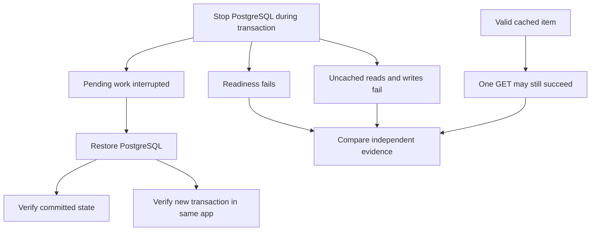

# Lab 46: PostgreSQL Failure Incident

## 1. Purpose and Learning Outcomes

You will interrupt the required database and distinguish a live application from a working persistence path. Check several separate cases: committed data, an uncommitted change, a cached read, and a failed create. After recovery, verify durable state and prove that the same application process can use its connection pool to commit new work.

> **Primary Objective:** Distinguish process liveness from database functionality, observe transactions and connection-pool behavior during an outage, and prove recovery of durable data and new work.

Redis failure allowed graceful degradation in Lab 45. PostgreSQL is the required source of truth, so its failure changes readiness and which operations can finish safely. A valid cached GET may still succeed while writes and uncached reads fail.

Stop only local PostgreSQL, interrupt a transaction on a lab-owned row, record API failures, and recover without restarting the app or deleting storage. First, address a narrow database-error classification case. This controlled shutdown/restart does not simulate disk corruption, failover, or sudden power loss.

## 2. Starting Point and Lab Map

Open the complete application repository before using this guide. Unless a step says otherwise, run commands in Bash from the repository's top-level folder. Follow the starting checks in order because later commands depend on the helper functions and running services they prepare.

Read each explanation before running its commands. Run one complete code block, check the result, and then continue. In your notebook, save the commands, what happened, why you think it happened, and anything that differed from the expected result.

### Key Terms

| **Term**           | **Explanation**                                                                       |
| ------------------ | ------------------------------------------------------------------------------------- |
| Uncommitted change | Pending transaction work that has not become committed, durable state.                |
| Pool recovery      | The application obtaining usable database connections after earlier connections fail. |
| Cache masking      | A cache answering a request successfully without testing the unavailable database.    |

### Lab Map

The arrows show how the parts connect and where a request can take different paths. Use this map to understand the design. It is not a recording of a request that actually ran.



## 3. Guided Walkthrough

### Step 01. Inherited State and Starting Checks

**What You Are Doing:** Verify Redis recovery and the intended timeout, TTL, and worker settings. Keep the database test limited and comparable.

**Practical Walkthrough:** Check the recovered cache and runtime settings before the database fault. Keep the same process after the guide's prescribed setup change. This lets you test normal connection-pool recovery rather than accidentally repairing the issue through application replacement.

Record lifecycle evidence after any required pre-test deployment. The recovery claim needs proof that useful work resumed in that same process. Verify timeout, TTL, one-worker settings, and Redis first.

```bash
source lab-notes/session.sh
source lab-notes/evidence.sh
source lab-notes/metrics-session.sh
source lab-notes/platform-session.sh
source lab-notes/traces-session.sh
source lab-notes/profiling/session.sh
load_app_settings
start_lab 46
dp config --quiet
wait_ready
wait_backend loki:3100 /ready
wait_backend tempo:3200 /ready
wait_backend pyroscope:4040 /ready
mkdir -p lab-notes/operations
cp app/app/database.py "$LAB_DIR/database.before.py"
dp exec -T app python - <<'CHECK'
from app.config import Settings
s=Settings()
assert s.db_timeout_seconds<=5
assert s.trace_sample_ratio==1.0
print({'pool_size':s.db_pool_size,'max_overflow':s.db_max_overflow,
       'timeout_seconds':s.db_timeout_seconds,'cache_ttl_seconds':s.cache_ttl_seconds})
CHECK
```

Complete [Lab 45](Lab-45.md), including cleanup. Continue in the same Bash session using `dp`. Keep fourteen services, nine scrape jobs, full SDK head recording, the Collector tail policies, and Lab 44's scoped profiling.

Keep the default three-second database timeout and thirty-second cache TTL. Stop unrelated load. Use only this run's fixture names and UUIDs, preserving earlier checkpoints. Required tools remain Bash, Python 3, curl, jq, and the existing PyYAML environment.

**Understanding the Result:** Save the app's current identity before injection. Later successful work must be linked to that same running application.

### Step 02. Learning Objectives and Failure Boundaries

**What You Are Doing:** Predict each path according to its dependencies. Liveness, a warm read, a list, and a write deliberately test different capabilities.

**Practical Walkthrough:** Establish the cache state, then predict cached reads, uncached reads or lists, writes, and health results separately. PostgreSQL failure need not produce the same response from every endpoint.

Prepare a known warm key so a later cache miss is not misread as contradictory behavior. A cached success can coexist with failed readiness because it does not exercise required persistence.

| **Boundary**              | **Expected Observation**                          | **What It Does Not Prove**                                            |
| ------------------------- | ------------------------------------------------- | --------------------------------------------------------------------- |
| App process               | Liveness remains HTTP 200                         | Does not prove required business operations work                      |
| Readiness                 | HTTP 503 with PostgreSQL down and Redis up        | Does not mean every individual endpoint must fail                     |
| Cached item GET           | May return HTTP 200 while its entry remains valid | Does not prove database health or the ability to commit writes        |
| List, write, uncached GET | Sanitized HTTP 503 on database connection failure | Does not establish that automatically replaying the operation is safe |
| Interrupted transaction   | Uncommitted changes are absent after restart      | Does not prove every ambiguous client timeout means rollback          |
| Connection Pool           | Replaces stale connections on later checkout      | Cannot rescue an already interrupted transaction                      |

**Prediction Checkpoint:** Explain how a cached 200 and failed readiness can both be correct. Readiness describes required capability. This application does not block every endpoint when unready; an external router would use readiness to decide whether to send new traffic.

The SQLAlchemy engine is created once. Pre-ping checks a connection when it is checked out. Recycling, pool-acquisition timeout, connect timeout, and statement timeout address different stages. A separate `docker exec` process with a new engine cannot report the running worker's pool occupancy. Inspect settings, server sessions, and actual request behavior instead.

**Understanding the Result:** Use an operation that genuinely needs PostgreSQL to assess database readiness. One cached response cannot establish it.

### Step 03. Normalize Database Connection Refusal Safely

**What You Are Doing:** Inspect the earlier database-error translation and apply the guarded correction only if needed. Keep classification limited to failures inside database operations.

**Practical Walkthrough:** Review the expected source before applying the patch. A broad exception handler could mislabel unrelated code or network errors as database outages. Preserve the narrow boundary around database work.

Read the guarded patch and run its regression check. Confirm that connection errors from database operations are normalized while unrelated errors retain their own meaning. Keep response bodies through the helper so the actual outage classification can be checked later.

Some connection failures reach callers as `OSError` subclasses, including `ConnectionRefusedError`. The API already converts `SQLAlchemyError` and timeout failures into sanitized database 503 responses. Without the narrow correction, a raw OS exception could become a generic 500.

The change handles only exceptions raised inside `Database.operation`. It does not label every socket or filesystem failure as a database outage. Existing request dependencies continue to own session cleanup and rollback.

```bash
cat > lab-notes/operations/normalize_database_failure.py <<'PYTHON'
"""Normalize only network failures raised inside a database operation."""
from pathlib import Path
p=Path('app/app/database.py');source=p.read_text()
old='''        except (SQLAlchemyError, TimeoutError):
            self.metrics.dependency_up.labels("postgres").set(0)
            raise
        finally:'''
new='''        except (SQLAlchemyError, TimeoutError):
            self.metrics.dependency_up.labels("postgres").set(0)
            raise
        except OSError as error:
            self.metrics.dependency_up.labels("postgres").set(0)
            raise SQLAlchemyError("Database connection unavailable") from error
        finally:'''
if new not in source:
    assert source.count(old)==1, 'Review the current Database.operation implementation'
    p.write_text(source.replace(old,new))
print('Database-scoped OS failures use the existing sanitized database error handler')
PYTHON
```

**Command Note:** `<<'PYTHON'` writes the block exactly as shown until the closing `PYTHON`. Quoting it prevents Bash from expanding `$variables` in the file. Creating the file does not execute it.

```bash
python3 lab-notes/operations/normalize_database_failure.py
cat > app/tests/test_database_connection_failure.py <<'PYTHON'
from sqlalchemy.ext.asyncio import AsyncSession


async def test_connection_refusal_is_sanitized_database_503(client, monkeypatch):
    async def unavailable(self, statement, *args, **kwargs):
        raise ConnectionRefusedError('private-connection-detail')
    monkeypatch.setattr(AsyncSession, 'scalar', unavailable)
    response = await client.get('/api/v1/items', headers={'X-Request-ID': 'db-refusal-contract'})
    assert response.status_code == 503
    assert response.json()['error']['code'] == 'database_unavailable'
    assert response.headers['X-Request-ID'] == 'db-refusal-contract'
    assert 'private-connection-detail' not in response.text
PYTHON
make test
dp up -d --no-deps --build app
wait_ready
```

Rebuild before taking failure measurements. After that, the same application process must survive the incident. Keep this correction and its regression test for later labs.

```bash
cat > lab-notes/operations/request_probe.py <<'PYTHON'
"""One bounded request; preserve known IDs and expected error responses."""
import argparse,json,secrets,time,uuid
from urllib.error import HTTPError,URLError
from urllib.request import ProxyHandler,Request,build_opener
p=argparse.ArgumentParser()
p.add_argument('base_url');p.add_argument('path');p.add_argument('output')
p.add_argument('--method',choices=['GET','POST','PUT','DELETE'],default='GET')
p.add_argument('--body');p.add_argument('--expect',type=int)
a=p.parse_args();assert a.path.startswith('/') and not a.path.startswith('//')
rid='incident-'+str(uuid.uuid4());tid=secrets.token_hex(16);parent=secrets.token_hex(8)
headers={'X-Request-ID':rid,'traceparent':f'00-{tid}-{parent}-01'}
body=None if a.body is None else json.dumps(json.loads(a.body)).encode()
if body is not None:headers['Content-Type']='application/json'
request=Request(a.base_url.rstrip('/')+a.path,data=body,headers=headers,method=a.method)
started=time.time_ns();status=0;returned=None;document=None;transport_error=None
try:
    try:response=build_opener(ProxyHandler({})).open(request,timeout=12)
    except HTTPError as error:response=error
    with response:
        status=response.status;returned=response.headers.get('X-Request-ID')
        raw=response.read();document=json.loads(raw) if raw else None
except (URLError,TimeoutError,OSError) as error:
    transport_error=type(error).__name__
result={'start_ns':started,'end_ns':time.time_ns(),'method':a.method,'path':a.path,
        'status':status,'request_id':rid,'returned_request_id':returned,'trace_id':tid,
        'response':document,'transport_error':transport_error}
with open(a.output,'x') as f:json.dump(result,f,indent=2)
print(json.dumps({'status':status,'request_id':rid,'trace_id':tid,'output':a.output}))
if a.expect is not None:assert status==a.expect, f'Expected {a.expect}, observed {status}'
if status:assert returned==rid,'Response did not preserve request correlation'
PYTHON
```

```bash
cat > lab-notes/operations/change_event.py <<'PYTHON'
"""Append local operator change evidence; never accept secret values as fields."""
import argparse,datetime,json,os,uuid
p=argparse.ArgumentParser();p.add_argument('output')
p.add_argument('action');p.add_argument('target');p.add_argument('outcome')
p.add_argument('--reason',required=True);a=p.parse_args()
record={'timestamp':datetime.datetime.now(datetime.timezone.utc).isoformat(),
        'event_id':str(uuid.uuid4()),'actor':os.getenv('LAB_OPERATOR',os.getenv('USER','local-operator')),
        'action':a.action,'target':a.target,'outcome':a.outcome,'reason':a.reason}
with open(a.output,'a') as f:f.write(json.dumps(record)+'\n')
print(json.dumps(record))
PYTHON
```

The helper saves expected error bodies, IDs, and timestamps rather than treating every 503 as a shell transport failure. Its synthetic parent span is intentionally not exported. Health routes are excluded from tracing, so a generated health-request ID does not prove that a matching health span exists.

The change journal records operator actions outside telemetry backends. It is editable local evidence, not an authenticated or tamper-proof audit log. Keep credentials out of the reason field.

**Understanding the Result:** The 503 translation should be narrowly scoped and testable. Retain checks showing that unrelated errors are not hidden by it.

### Step 04. Create a Durable Fixture and Inspect Connections

**What You Are Doing:** Create committed data as a recovery reference and inspect normal connections. Idle pooled connections are expected and are not automatically leaks.

**Practical Walkthrough:** Verify the committed fixture and save connection state before stopping PostgreSQL. Pools retain idle connections for reuse. Compare later behavior with this measured baseline rather than assuming any idle session is faulty.

Use an independent committed read to confirm original values. Distinguish idle connections from idle transactions. Save values and application lifecycle data so recovery can prove both retained state and continued use of the same process.

```bash
TOKEN=$(new_uuid)
ORIGINAL_NAME="lab46-$TOKEN-committed"
PAYLOAD=$(jq -n --arg name "$ORIGINAL_NAME" '{name:$name,price:"21.00"}')
python3 lab-notes/operations/request_probe.py "$APP_URL" /api/v1/items "$LAB_DIR/created.json" \
  --method POST --body "$PAYLOAD" --expect 201
ITEM_ID=$(jq -er '.response.id' "$LAB_DIR/created.json")
printf '%s\n' "$ITEM_ID" > "$LAB_DIR/item-id.txt"
api -fsS "$APP_URL/api/v1/items/$ITEM_ID" > "$LAB_DIR/warm.json"
dbsql -v item_id="$ITEM_ID" -v service_name="$LAB_SERVICE" > "$LAB_DIR/database-before.txt" <<'SQL'
SELECT id, name, price FROM items WHERE id = :'item_id';
SELECT application_name, state, wait_event_type, count(*)
FROM pg_stat_activity WHERE application_name = :'service_name'
GROUP BY application_name, state, wait_event_type ORDER BY state;
SQL
docker inspect --format '{{.Id}} {{.State.StartedAt}} {{.RestartCount}}' "$(dp ps -q app)" \
  > "$LAB_DIR/app-before.txt"
api -fsS "$APP_URL/metrics" > "$LAB_DIR/metrics-before.prom"
```

**Command Note:** `jq --arg` passes a shell value as a JSON-query string variable instead of inserting it directly into the query text. With `-e`, a final false or null result fails the command.

An idle pooled connection is not inherently a leak. The pool maximum is a limit, not a number that must always be allocated. Background dependency checks also use connections, so one observed session does not necessarily correspond to one customer request.

**Understanding the Result:** Committed data provides the durability control. Interpret connection counts using lifecycle and activity context before diagnosing leaks.

### Step 05. Interrupt a Transaction and Exercise the Broken Data Path

**What You Are Doing:** Confirm the open transaction, interrupt PostgreSQL, and test affected routes. Keep committed data, pending changes, and failed new writes as separate cases.

**Practical Walkthrough:** Verify the intended transaction is active before stopping the database within the recovery controller. Record each request path and its result. Each category of work has a different expected persistence result after restart.

Preserve the full recovery controller and ledger. Confirm the transaction reached its target state rather than assuming the command started in time. Separate prior commits, uncommitted work, and newly rejected requests when checking recovery.

```bash
(
  set -euo pipefail
  trap 'dp start postgres' EXIT
  trap 'exit 130' INT
  trap 'exit 143' TERM
  dbsql -v item_id="$ITEM_ID" > "$LAB_DIR/interrupted-transaction.txt" 2>&1 <<'SQL' &
SET application_name = 'lab46-uncommitted';
BEGIN;
UPDATE items SET name = 'lab46-uncommitted-change' WHERE id = :'item_id';
SELECT pg_sleep(45);
ROLLBACK;
SQL
  TX_CLIENT=$!
  SEEN=0
  for ((attempt=1; attempt<=10; attempt++)); do
    if [[ "$(dbsql -Atc "SELECT EXISTS (SELECT 1 FROM pg_stat_activity WHERE application_name='lab46-uncommitted' AND state='active' AND wait_event='PgSleep')")" = t ]]; then
      SEEN=1; break
    fi
    sleep 0.5
  done
  test "$SEEN" = 1
  # Only this fixture key is refreshed; the uncommitted SQL update is invisible.
  rcli DEL "$(cache_key "$ITEM_ID")" >/dev/null
  api -fsS "$APP_URL/api/v1/items/$ITEM_ID" > "$LAB_DIR/rewarmed.json"
  python3 lab-notes/operations/change_event.py "$LAB_DIR/changes.jsonl" stop postgres started \
    --reason 'Bounded PostgreSQL failure experiment'
  dp stop postgres
  wait "$TX_CLIENT" && TX_STATUS=0 || TX_STATUS=$?
  printf '%s\n' "$TX_STATUS" > "$LAB_DIR/transaction-client-exit.txt"
  test "$TX_STATUS" -ne 0
  python3 lab-notes/operations/request_probe.py "$APP_URL" /health/live "$LAB_DIR/live-down.json" --expect 200
  python3 lab-notes/operations/request_probe.py "$APP_URL" /health/ready "$LAB_DIR/ready-down.json" --expect 503
  jq -e '.response.status=="not_ready" and .response.dependencies.postgres=="down" and .response.dependencies.redis=="up"' \
    "$LAB_DIR/ready-down.json"
  python3 lab-notes/operations/request_probe.py "$APP_URL" "/api/v1/items/$ITEM_ID" "$LAB_DIR/warm-during-outage.json"
  # Its status can be 200 or 503 depending on whether the short-lived entry remains.
  jq -e '.status==200 or .status==503' "$LAB_DIR/warm-during-outage.json"
  rcli DEL "$(cache_key "$ITEM_ID")" >/dev/null
  python3 lab-notes/operations/request_probe.py "$APP_URL" "/api/v1/items/$ITEM_ID" "$LAB_DIR/cold-down.json" --expect 503
  python3 lab-notes/operations/request_probe.py "$APP_URL" /api/v1/items "$LAB_DIR/list-down.json" --expect 503
  FAILED_NAME="lab46-$TOKEN-not-committed"
  FAILED_BODY=$(jq -n --arg name "$FAILED_NAME" '{name:$name,price:"99.00"}')
  python3 lab-notes/operations/request_probe.py "$APP_URL" /api/v1/items "$LAB_DIR/create-down.json" \
    --method POST --body "$FAILED_BODY" --expect 503
  python3 lab-notes/operations/request_probe.py "$APP_URL" "/api/v1/items/$ITEM_ID" "$LAB_DIR/update-down.json" \
    --method PUT --body "$FAILED_BODY" --expect 503
  python3 lab-notes/operations/request_probe.py "$APP_URL" "/api/v1/items/$ITEM_ID" "$LAB_DIR/delete-down.json" \
    --method DELETE --expect 503
  sleep 18
  api -fsS "$APP_URL/metrics" > "$LAB_DIR/metrics-down.prom"
  pq 'application_dependency_up{dependency="postgres"}' > "$LAB_DIR/dependency-down.json"
  pq 'pg_up' > "$LAB_DIR/exporter-down.json"
  api -fsS "$PROM_URL/api/v1/alerts" > "$LAB_DIR/alerts-down.json"
  dp logs --since 3m --tail 200 app postgres > "$LAB_DIR/outage.log"
  python3 lab-notes/operations/change_event.py "$LAB_DIR/changes.jsonl" start postgres started \
    --reason 'Restore required persistence after bounded observations'
  dp start postgres
  wait_ready
)
wait_ready
```

**Command Note:** `trap ... EXIT` schedules restoration when that shell exits. Keep it in the fault block and confirm the result with explicit recovery checks afterward.

The deliberate transaction ends in `ROLLBACK` even if the fault is delayed. Stopping PostgreSQL during `pg_sleep` should terminate the session earlier, leaving no durable uncommitted update. If ten polling attempts never find the session, investigate that prerequisite instead of claiming it was interrupted.

A warm-cache success is an observation, not guaranteed outage support. Deleting the exact key forces the next GET to test PostgreSQL directly. Dependency metrics may temporarily reflect the last observer to update them, so compare readiness responses, scrape timestamps, and background-monitor records.

The failed create is deliberately tested while no database connection is available. A timeout after a server commit is different and may leave an ambiguous client outcome. Do not use this exercise to justify blindly retrying non-idempotent production writes.

**Understanding the Result:** A write attempt is not proof of a commit. Preserve transaction and response evidence before inspecting final state.

### Step 06. Prove Durable State and Pool Recovery

**What You Are Doing:** Confirm committed data survived while uncommitted and failed writes did not appear. Then commit new work without restarting the app to demonstrate connection-pool recovery.

**Practical Walkthrough:** Verify the original row, absence of the pending change, and absence of the failed create. Complete a fresh transaction and compare app identity, start time, and restart count with the baseline. This tests recovery in the existing process.

Clear only the fixture's cache key so the durability read reaches PostgreSQL. Check values independently, then commit a new update. A listening port or cached response alone cannot prove a usable recovered pool.

```bash
rcli DEL "$(cache_key "$ITEM_ID")" >/dev/null
python3 lab-notes/operations/request_probe.py "$APP_URL" "/api/v1/items/$ITEM_ID" "$LAB_DIR/durable-read.json" --expect 200
jq -e --arg name "$ORIGINAL_NAME" '.response.name==$name and .response.price=="21.00"' "$LAB_DIR/durable-read.json"
dbsql -v item_id="$ITEM_ID" -v failed_name="lab46-$TOKEN-not-committed" \
  -v service_name="$LAB_SERVICE" > "$LAB_DIR/database-after.txt" <<'SQL'
SELECT id, name, price FROM items WHERE id = :'item_id';
SELECT count(*) AS failed_create_rows FROM items WHERE name = :'failed_name';
SELECT application_name, state, wait_event_type, count(*)
FROM pg_stat_activity WHERE application_name = :'service_name'
GROUP BY application_name, state, wait_event_type ORDER BY state;
SQL
docker inspect --format '{{.Id}} {{.State.StartedAt}} {{.RestartCount}}' "$(dp ps -q app)" \
  > "$LAB_DIR/app-after.txt"
cmp "$LAB_DIR/app-before.txt" "$LAB_DIR/app-after.txt"
RECOVERED_BODY=$(jq -n --arg name "lab46-$TOKEN-recovered" '{name:$name,price:"22.00"}')
python3 lab-notes/operations/request_probe.py "$APP_URL" "/api/v1/items/$ITEM_ID" "$LAB_DIR/update-recovered.json" \
  --method PUT --body "$RECOVERED_BODY" --expect 200
rcli DEL "$(cache_key "$ITEM_ID")" >/dev/null
python3 lab-notes/operations/request_probe.py "$APP_URL" "/api/v1/items/$ITEM_ID" "$LAB_DIR/read-recovered.json" --expect 200
jq -e '.response.price=="22.00"' "$LAB_DIR/read-recovered.json"
wait_metric 'application_dependency_up{dependency="postgres"}' 1
wait_metric 'pg_up' 1
```

The committed fixture must remain, the uncommitted name must be absent, and the failed-create name must match zero rows. A successful new update proves a fresh transaction committed through the existing app. Verify identity, start time, and restart count; container ID alone can miss a process restart within the container.

Pre-ping helps reject stale connections and obtain usable ones. It cannot restore the interrupted transaction or resolve an ambiguous commit outcome. Avoid restarting the app first, because that would hide whether its normal pool/session lifecycle recovered.

**Understanding the Result:** New committed work plus unchanged lifecycle evidence supports pool recovery. Durable data by itself does not prove the app reconnected.

### Step 07. Correlate Errors, Events, Traces and Waiting

**What You Are Doing:** Match failed requests with sanitized logs and available spans. A connection can fail before SQL execution, and elapsed waiting need not mean CPU work.

**Practical Walkthrough:** Use known IDs to locate real emitted evidence. A missing statement span can be expected when acquisition fails before any statement runs. Compare elapsed duration with CPU profiles without assuming the whole delay was computation.

Locate the failed acquisition stage using IDs, records, and parent spans. Do not invent SQL work that never executed. Interpret quiet CPU evidence alongside waiting rather than treating every long failed request as heavy computation.

```promql
sum(rate(application_exceptions_total{kind="database"}[5m]))
```

```promql
sum by (route,status_code) (increase(application_http_requests_total{status_code="503"}[5m]))
```

```promql
histogram_quantile(0.95, sum by (le,operation) (rate(application_postgres_operation_duration_seconds_bucket[5m])))
```

```logql
{service_name="items-info",deployment_environment_name="local"}
  | json | message=~"database_request_failed|dependencies_degraded|dependencies_ready"
```

```bash
TRACE_ID=$(jq -r '.trace_id' "$LAB_DIR/cold-down.json")
fetch_trace "$TRACE_ID" "$LAB_DIR/failed-read-trace.json"
python3 lab-notes/tracing/inspect_trace.py "$LAB_DIR/failed-read-trace.json" > "$LAB_DIR/failed-read-spans.json"
jq '.[] | {name,duration_ms,status,attributes,events}' "$LAB_DIR/failed-read-spans.json"
```

Use actual service/environment labels. Match the response's request ID to Loki and inspect its trace. Connection failure may prevent any SQL statement span, while an enclosing operation/server span and sanitized exception still locate the failure. The intended route is not evidence of an executed query.

`up{job="postgres"}` reports exporter scraping; `pg_up` reports the exporter's database check. Successful exporter HTTP access can coexist with PostgreSQL failure. Profiles may show little CPU during connection or pool waiting because elapsed duration and CPU consumption are different measures.

Read loaded alert `for` durations before expecting Alertmanager delivery. A short incident may recover while alerts are pending. Preserve that correct lifecycle result rather than weakening or disabling rules.

**Understanding the Result:** Traces and profiles have different coverage limits. Do not invent a statement span or CPU hotspot to fill a gap caused by dependency waiting.

### Step 08. Recovery, Cleanup and Troubleshooting

**What You Are Doing:** Verify required operations and remove only this run's fixtures. Keep the database-scoped correction and confirm app identity before moving to telemetry-backend failures.

**Practical Walkthrough:** Check fresh database-dependent reads and writes and normal pool behavior. Then delete only recorded fixtures. Preserve separate evidence for committed state, rollback, failed requests, and recovery.

Verify the expected process and configuration as well as new transactions. Keep the incident artifacts so later backend-only outages can be compared with this genuine required-dependency failure.

```bash
python3 lab-notes/operations/request_probe.py "$APP_URL" "/api/v1/items/$ITEM_ID" "$LAB_DIR/cleanup-delete.json" \
  --method DELETE --expect 204
python3 lab-notes/operations/request_probe.py "$APP_URL" "/api/v1/items/$ITEM_ID" "$LAB_DIR/cleanup-missing.json" --expect 404
wait_ready
python3 lab-notes/operations/change_event.py "$LAB_DIR/changes.jsonl" incident postgres recovered \
  --reason 'Durable row, new commit, unchanged app process and scoped cleanup verified'
```

| **Observation**                               | **Next Check**                                                                                                 |
| --------------------------------------------- | -------------------------------------------------------------------------------------------------------------- |
| Generic 500 on cold connection failure        | Check that the current image contains the database-scoped correction and inspect the sanitized exception type. |
| Cached GET returns 200 while not ready        | Check the key and TTL. Cached success is compatible with failure of the required store.                        |
| Readiness stays false after PostgreSQL starts | Check credentials, migrated-table access, and pool connectivity, not only `pg_isready`.                        |
| Interrupted row changed permanently           | Preserve evidence and verify the exact transaction and UUID. Avoid a broad rollback script.                    |
| Errors continue only on reused connections    | Inspect stale detection, invalidation, and the boundaries at which retries occur.                              |
| No query span                                 | Checkout or connection may have failed before SQL execution. Use the enclosing span and logs.                  |

If interrupted, run `dp start postgres`, then `wait_ready`. Inspect the saved UUID and repeat durable-state checks before deleting that fixture. Never delete the database volume simply to make readiness pass.

See [SQLAlchemy connection recovery](https://docs.sqlalchemy.org/en/20/faq/connections.html), [pooling](https://docs.sqlalchemy.org/en/20/core/pooling.html), and [PostgreSQL transactions](https://www.postgresql.org/docs/17/tutorial-transactions.html) for further explanation.

**Understanding the Result:** Recovery requires useful new transactions, not just an open database port. Retain the scoped behavior checks in the notebook.

## 4. Troubleshooting and Diagnosis

Begin with the first result that differed from your prediction. Save the exact error or symptom and identify which service or command produced it. Use the checks below, make the needed fix, and repeat the original check to confirm the problem is resolved.

Use the durability and pool checks in Step 06 together with Step 08's recovery and troubleshooting procedure.

## 5. Review and Practice

Answer the questions in your own words before reading the answers. For the scenario, say what you would inspect and exactly what each result would tell you.

### Knowledge Check

1. Can a cached 200 disprove a PostgreSQL outage?
2. Can pre-ping save an in-flight transaction?
3. Why scope OS-error conversion to database operations?
4. Does a timed-out write always mean nothing committed?

#### Answer Guide

1. No. A cache hit may answer without contacting PostgreSQL at all.
2. No. Pre-ping validates connections at checkout. An interrupted transaction must be handled as a whole; pre-ping cannot rescue it.
3. Filesystem and other network failures need their own classification. A global conversion would hide unrelated defects.
4. No. The server can commit before the client receives acknowledgment. Reconciliation or an idempotency design is needed for ambiguous outcomes.

### Professional Scenario Exercise

Explain an incident where the API process stays live and serves some cached reads but rejects writes. Identify the required capability that is unavailable, distinguish pool acquisition from statement execution using evidence, and explain why restarting the app would weaken the recovery proof.

## 6. Completion Checklist

Tick an item only when you can show its result or saved evidence. Finish the cleanup instructions before starting the next lab.

### Observable Completion Criteria

- [ ] Connection refusal produces a sanitized database 503 and is covered by a regression check.
- [ ] Liveness succeeds while readiness reports PostgreSQL unavailable.
- [ ] Cached reads and forced uncached reads are evaluated separately.
- [ ] Failed writes and the interrupted transaction leave no unintended committed change.
- [ ] The same app process regains usable connections and commits a new update.
- [ ] Metrics, records, a representative trace, and operator-change evidence support the timeline.
- [ ] Only the run-owned fixture is removed, and required dependencies are healthy.

## 7. Production Context and Next Lab

### Production Implications

Plan database timeouts, limited retries, idempotency, and connection capacity together. Readiness communicates availability; it does not replay transactions. This single-node test provides no automatic failover, quorum protection, or cross-host durability guarantee.

### End State and Transition

Finish with healthy PostgreSQL and Redis and the original application process still running. Keep the narrow error correction and evidence helpers, along with all telemetry paths and sampling policies. [Lab 47](Lab-47.md) distinguishes business availability from failures inside observability itself.
