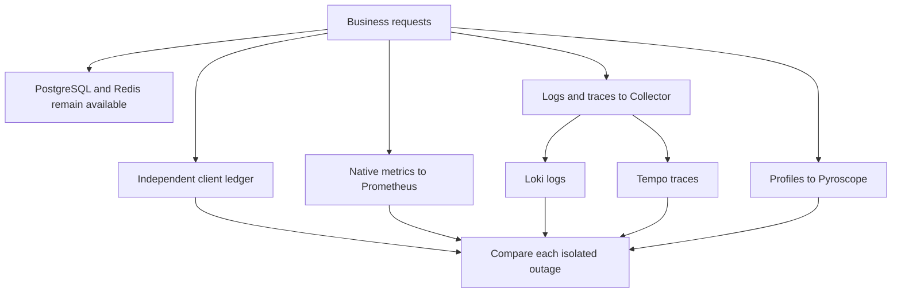

# Lab 47: Observability Backend Failure

## 1. Purpose and Learning Outcomes

**In Plain Language:** You will stop one observability component at a time while keeping PostgreSQL and Redis available. An independent request ledger checks whether business work continues, and known identities measure what telemetry is delayed or missing. Each backend has a different storage and buffering boundary, so recovery must include both fresh delivery and a separate assessment of the outage interval.

> **Primary Objective:** Measure application availability, telemetry gaps, queue behavior and recovery while stopping each observability backend separately.

The application can be healthy while the evidence used to diagnose it is incomplete. In this lab you stop Prometheus, Loki, Tempo, Pyroscope and the Collector, one at a time. You preserve an independent request ledger, compare surviving signals, and distinguish delayed delivery from permanent loss and deliberate sampling.

This is a bounded local transport experiment. It does not simulate an entire host failure, prove exactly-once delivery, or add a second collector. Keep the architecture and sampling policies inherited from Labs 40–46.

## 2. Starting Point and Lab Map

Use this guide inside the complete application repository. Run commands from the repository root in Bash unless a step says otherwise. Work through the starting checks in order; they load the helpers and state this lab needs.

Read the explanation before each step, run one complete code block at a time, and compare the actual result with the stated expectation. Save commands, observations, explanations, and unexpected results in your notebook.

### Key Terms

| **Term**       | **Plain-Language Meaning**                                                                    |
| -------------- | --------------------------------------------------------------------------------------------- |
| Failure domain | The component and signal paths directly affected by a selected fault.                         |
| Scrape gap     | An interval with no collected samples even though application counters may continue changing. |
| Backfill       | Later delivery of earlier evidence; it must be demonstrated rather than assumed.              |

### Lab Map

The arrows show the flow or dependency being studied. Branches identify paths to compare; this is a conceptual map, not a captured runtime trace.



## 3. Guided Walkthrough

### Step 01. Inherited State and Clean Start

**What You Are Doing:** Verify database recovery and stop competing generators. Keep the business dependencies running so the experiment isolates observability failures.

**Practical Walkthrough:** Check full recovery from the PostgreSQL incident and stop unrelated workload generators. Keep PostgreSQL and Redis running during these experiments so the intended failures affect observation infrastructure. A separate business ledger will show whether useful requests continue when a telemetry component is unavailable.

Keep PostgreSQL and Redis healthy and stop unrelated generators before telemetry faults. The independent business ledger is the control for useful work. If a database fault remains active, it would invalidate the intended comparison between failed observation infrastructure and continuing application behavior.

```bash
source lab-notes/session.sh
source lab-notes/evidence.sh
source lab-notes/metrics-session.sh
source lab-notes/platform-session.sh
source lab-notes/traces-session.sh
source lab-notes/profiling/session.sh
load_app_settings
start_lab 47
dp config --quiet
wait_ready
wait_backend loki:3100 /ready
wait_backend tempo:3200 /ready
wait_backend pyroscope:4040 /ready
api -fsS "$PROM_URL/-/ready"
test -f lab-notes/operations/request_probe.py
test -f lab-notes/operations/change_event.py
test -f lab-notes/profiling/profile_load.py
dp ps
```

Finish [Lab 46](Lab-46.md), including its database error normalization and fixture cleanup. Use Bash and the inherited `dp` composition; plain `docker compose up` would omit later lab overlays. Stop unrelated generators. Leave PostgreSQL and Redis running throughout this lab.

The CPU workload is deliberately retained by Lab 44's `keep-profile-work` tail policy. Ordinary successful item traces still have a probabilistic policy. An absent ordinary trace therefore cannot independently prove exporter loss. Health requests are excluded from tracing altogether.

**Understanding the Result:** Business and observability failure domains are the comparison. Do not introduce a dependency outage that would blur them.

### Step 02. Map the Failure Domains Before Changing Anything

**What You Are Doing:** Map the affected and surviving paths for each selected component. Those predictions tell you where independent evidence should remain available.

**Practical Walkthrough:** For each selected backend or Collector fault, mark affected and surviving paths in the provided map. Predict which independent evidence should remain available before stopping anything. Different signals use different transports, so one backend outage should not be assumed to remove every observation.

Trace each signal's actual path and mark which components the planned stop affects. Predict surviving evidence before injection. Logs and traces may share Collector while native metrics and direct profiles follow other paths, so a missing signal should not automatically imply that all observation has stopped.

| **Stopped Component** | **Directly Affected Path**                             | **Evidence That Should Remain**                                       |
| --------------------- | ------------------------------------------------------ | --------------------------------------------------------------------- |
| Prometheus            | Scraping, rule evaluation, queries, Tempo remote write | App `/metrics`, Loki, Tempo ingestion, profiles, local request ledger |
| Loki                  | Durable log ingestion and log queries                  | App responses, Docker log cache, metrics, traces, profiles            |
| Tempo                 | Trace ingestion/query and its generated metrics        | Native app metrics, logs, profiles                                    |
| Pyroscope             | Profile uploads and queries                            | Business API, native metrics, logs, traces                            |
| Collector             | App trace and log transport                            | Business API, direct Prometheus scraping, direct Pyroscope uploads    |

**Prediction Checkpoint:** which failures change `/health/ready`? None should, because PostgreSQL and Redis remain healthy. Which failure removes the platform's ability to evaluate its own alert rules? Prometheus does. An Alertmanager page remaining visible is not evidence of new evaluation during that outage.

Events continue to occur when their records are missing. The host ledger and operator journal are separate evidence channels; neither is an authenticated audit service. Record UTC times, action, target and result without credentials.

**Understanding the Result:** Surviving signals are controls, not automatic proof of completeness in the failed path. Record each boundary separately.

### Step 03. Understand Where Buffering Actually Exists

**What You Are Doing:** Locate each actual buffer and its persistence boundary. A disk-backed exporter queue does not preserve every in-memory span or sampling decision upstream.

**Practical Walkthrough:** Locate real SDK buffers, in-memory sampling state, batches, and persistent export queues in the active configuration. Note where data first becomes durable and how retries expire. A disk-backed queue cannot protect spans that had not reached it before a Collector restart.

Inspect active buffer, sampling, batching, queue, and retry settings with their units and durability scope. Identify the point at which export work becomes persisted. State explicitly that data still in earlier memory stages is outside that queue's restart protection, even when the queue itself survives.

```bash
rg -n 'sending_queue|queue_size|storage:|retry_on_failure|max_elapsed_time|decision_wait|num_traces|memory_limiter' \
  lab-notes/tracing/collector.yml
backend otel-collector:8888 /metrics > "$LAB_DIR/collector-before.prom"
rg '^otelcol_(exporter|receiver|processor)_' "$LAB_DIR/collector-before.prom" | head -40
```

The application SDK queue, Collector receiver/processor memory, tail-sampling state, exporter queue and downstream storage are different boundaries. The configured `file_storage` protects the exporter queue that references it. It does not persist every in-flight span or tail-sampling decision.

Docker's asynchronous, non-blocking Fluentd logging driver has finite buffering. Its local dual logging cache makes `docker logs` useful, but is not a replay source for the Collector. A JSON line visible locally may never reach Loki. No separate Fluentd process is part of this deployment.

Inspect the actual Collector exposition rather than assuming a `_total` suffix or a unit conversion from another release. Compare the same exporter and signal labels before/during/after. A retry/send-failure counter is not necessarily a count of unique permanently lost records. A queue size of zero can mean delivery, rejection, loss, or no input; use the ledger to discriminate.

**Understanding the Result:** Durability is stage-specific. Avoid describing the whole pipeline as persistent based on one exporter setting.

### Step 04. Install a Reusable, Reversible Fault Function

**What You Are Doing:** Install one finite fault function with per-run evidence and restoration. Its subshell scopes the recovery trap to the experiment rather than replacing interactive-shell behavior.

**Practical Walkthrough:** Install the finite fault function and inspect its per-run directory and restoration trap. The subshell confines trap changes to that experiment while retaining evidence if a command fails. Run complete invocations rather than extracting the stop command without its bounded recovery sequence.

Read the function's per-run directory, bounded workload, and restoration trap before invoking it. Run the full function for each target. Preserve partial output when a command fails so a later retry cannot erase the evidence needed to explain which fault or recovery boundary failed.

Each call creates a separate evidence directory, stops one target, performs real CRUD and fixed CPU work, captures the surviving boundaries, then restores that target. The function runs in a subshell so its exit trap does not replace your interactive shell's traps. A failed assertion triggers recovery rather than continuing to the next fault.

The requests are sequential and bounded by their existing timeouts. Do not increase counts to fill a queue on a small VM. This exercise measures ordinary short-outage behavior; saturation and queue pressure were studied in Lab 40.

```bash
cat > lab-notes/operations/backend-fault.sh <<'BASH'
backend_fault() (
  set -euo pipefail
  local service=${1:?service required}
  case "$service" in prometheus|loki|tempo|pyroscope|otel-collector) ;; *) return 2;; esac
  local run="$LAB_DIR/$service"
  mkdir "$run"
  local stopped=0
  recover() {
    if ((stopped)); then dp start "$service" >/dev/null; fi
  }
  trap recover EXIT
  trap 'exit 130' INT
  trap 'exit 143' TERM
  api -fsS "$APP_URL/metrics" > "$run/app-before.prom"
  docker inspect --format '{{.Id}} {{.State.StartedAt}} {{.RestartCount}}' "$(dp ps -q app)" > "$run/app-before.txt"
  date -u +%Y-%m-%dT%H:%M:%SZ > "$run/start.txt"
  python3 lab-notes/operations/change_event.py "$LAB_DIR/changes.jsonl" stop "$service" intended --reason 'isolated backend experiment'
  stopped=1
  dp stop -t 10 "$service"
  python3 lab-notes/operations/request_probe.py "$APP_URL" /health/ready "$run/ready.json" --expect 200
  python3 lab-notes/operations/request_probe.py "$APP_URL" /health/live "$run/live.json" --expect 200
  local payload item_id
  payload=$(jq -n --arg name "lab47-$service-$(new_uuid)" '{name:$name,price:"7.00"}')
  python3 lab-notes/operations/request_probe.py "$APP_URL" /api/v1/items "$run/create.json" --method POST --body "$payload" --expect 201
  item_id=$(jq -er '.response.id' "$run/create.json")
  python3 lab-notes/operations/request_probe.py "$APP_URL" "/api/v1/items/$item_id" "$run/get.json" --expect 200
  python3 lab-notes/operations/request_probe.py "$APP_URL" "/api/v1/items/$item_id" "$run/update.json" --method PUT --body "$payload" --expect 200
  python3 lab-notes/operations/request_probe.py "$APP_URL" "/api/v1/items/$item_id" "$run/delete.json" --method DELETE --expect 204
  python3 lab-notes/profiling/profile_load.py "$APP_URL" "$run/profile-work.jsonl" --variant cpu --count 12 --iterations 3000000
  sleep 15
  api -fsS "$APP_URL/metrics" > "$run/app-during.prom"
  if [[ $service != otel-collector ]]; then
    backend otel-collector:8888 /metrics > "$run/collector-during.prom"
  fi
  dp logs --since "$(cat "$run/start.txt")" --no-color app > "$run/docker-app.log"
  dp start "$service"
  stopped=0
  case "$service" in
    prometheus)
      local ok=0
      for attempt in {1..45}; do
        if api -fsS "$PROM_URL/-/ready" > /dev/null; then ok=1; break; fi
        sleep 1
      done
      test "$ok" -eq 1;;
    loki) wait_backend loki:3100 /ready;;
    tempo) wait_backend tempo:3200 /ready;;
    pyroscope) wait_backend pyroscope:4040 /ready;;
    otel-collector) wait_backend otel-collector:13133 /;;
  esac
  wait_ready
  python3 lab-notes/operations/change_event.py "$LAB_DIR/changes.jsonl" start "$service" recovered --reason 'readiness checked; delivery still needs evidence'
  sleep 20
  backend otel-collector:8888 /metrics > "$run/collector-after.prom"
  docker inspect --format '{{.Id}} {{.State.StartedAt}} {{.RestartCount}}' "$(dp ps -q app)" > "$run/app-after.txt"
  diff -u "$run/app-before.txt" "$run/app-after.txt"
  date -u +%Y-%m-%dT%H:%M:%SZ > "$run/end.txt"
)
BASH
source lab-notes/operations/backend-fault.sh
backend_fault prometheus
```

**Command Note:** `<<'BASH'` writes the following block literally until `BASH`. Quoting the delimiter prevents Bash from expanding `$variables` inside the generated file; creation and execution are separate steps.

**Understanding the Result:** Each run should have its own identities and timestamps. This keeps faults attributable and prevents evidence from separate attempts being mixed.

### Step 05. Prometheus: Scrape Gaps Are Different from Counter Resets

**What You Are Doing:** Stop Prometheus and compare later samples with the independent request ledger. Accumulated counters may preserve a total increase while losing the precise timing inside the gap.

**Practical Walkthrough:** Stop Prometheus for the prescribed interval while requests continue into the independent ledger. After restart, compare stored samples and cumulative native counters. A later counter may reflect work accumulated during the gap, but cannot reconstruct exactly when each event occurred inside it.

Compare app counters before, during, and after the Prometheus gap without restarting the app. The counter can accumulate events while collection is stopped, but later samples cannot recover their exact within-gap timing. Keep this collection gap distinct from a producer reset that changes cumulative state.

```bash
rg '^application_http_requests_total' "$LAB_DIR/prometheus/app-before.prom" > "$LAB_DIR/prometheus/counts-before.txt"
rg '^application_http_requests_total' "$LAB_DIR/prometheus/app-during.prom" > "$LAB_DIR/prometheus/counts-during.txt"
pq 'up{job="fastapi"}' > "$LAB_DIR/prometheus/target-after.json"
pq 'sum(rate(application_http_requests_total[5m]))' > "$LAB_DIR/prometheus/rate-after.json"
api -fsS "$PROM_URL/api/v1/alerts" > "$LAB_DIR/prometheus/alerts-after.json"
```

Inspect the outage window in Grafana. Native cumulative counters continued inside the unchanged app process. A later scrape can include their accumulated increase, but it cannot reconstruct precisely when requests happened in the missing interval. Histograms retain cumulative bucket counts, not individual request timestamps. `rate` across a gap requires enough usable samples and is not proof of uniform traffic.

Prometheus's own `up` series also has no new samples while Prometheus is stopped. An external monitor is needed to detect the monitor's disappearance reliably. Tempo's metrics-generator remote-write queue is another path with its own retry behavior; do not substitute generated, sampled trace metrics for the native application SLI.

**Understanding the Result:** A recovered total and missing time resolution can coexist. Do not claim exact historical backfill from the next cumulative sample.

### Step 06. Loki and Tempo: Measure Delayed Delivery Separately

**What You Are Doing:** Test Loki and Tempo separately and reconcile known IDs after each restoration. A brief queue snapshot can miss a backlog that formed and drained between observations.

**Practical Walkthrough:** Test Loki and Tempo separately, restoring and auditing one before starting the other. Reconcile expected record or trace IDs after delivery has had time to settle. A brief queue observation can miss a backlog that formed and drained between checks, so use identities as the end-to-end evidence.

Finish restoration and identity reconciliation for Loki before starting the Tempo experiment. Use known event or trace IDs after delivery settles. A queue snapshot can miss a transient backlog, while end-to-end identity evidence shows which expected records or spans became queryable.

```bash
backend_fault loki
backend_fault tempo
for target in loki tempo; do
  rg '^otelcol_exporter_.*(queue|failed|sent)' "$LAB_DIR/$target/collector-during.prom" \
    > "$LAB_DIR/$target/queue-during.txt" || true
  rg '^otelcol_exporter_.*(queue|failed|sent)' "$LAB_DIR/$target/collector-after.prom" \
    > "$LAB_DIR/$target/queue-after.txt" || true
done
```

A short Loki outage should allow traces and profiles to continue. A short Tempo outage should allow Loki logs and profiles to continue. Exporter failures and queue occupancy may appear only briefly; a snapshot can miss a transient backlog. Compare counters and downstream arrivals before concluding that nothing happened.

Collect known request IDs from successful CRUD and CPU operations. Query their recorded log events after recovery:

```bash
TARGET=loki
RUN="$LAB_DIR/$TARGET"
RID=$(jq -er '.request_id' "$RUN/create.json")
START_NS=$(jq -er '.start_ns' "$RUN/create.json")
END_NS=$(python3 -c 'import time; print(time.time_ns())')
QUERY="{service_name=\"$LAB_SERVICE\",deployment_environment_name=\"$LAB_ENVIRONMENT\"} | json | request_id=\"$RID\""
backend loki:3100 /loki/api/v1/query_range query "$QUERY" start "$START_NS" end "$END_NS" limit 100 \
  > "$RUN/create-logs.json"
jq '[.data.result[].values[]] | length' "$RUN/create-logs.json"
TRACE_ID=$(jq -rs '.[0].response.trace_id' "$LAB_DIR/tempo/profile-work.jsonl")
fetch_trace "$TRACE_ID" "$LAB_DIR/tempo/known-trace.json"
python3 lab-notes/tracing/inspect_trace.py "$LAB_DIR/tempo/known-trace.json" > "$LAB_DIR/tempo/known-spans.json"
jq '[.[] | select(.attributes["app.operation"]=="sum_squares") | {trace_id,span_id,name,events}]' \
  "$LAB_DIR/tempo/known-spans.json"
```

**Expected Result:** at least one matching create/request log and a CPU-work span for the known trace after a short recoverable outage. Repeat the same query after another twenty seconds if delivery is still pending; keep both observations. If absent after your bounded investigation, record “not observed by deadline,” then use queue/rejection counters and app logs to localize the failure. Do not replace a missing trace ID with an unrelated trace that happens to look healthy.

The profiling endpoint does not have the downstream service's five-span topology. Do not run the five-span retention audit from Lab 40 against these traces.

**Understanding the Result:** Queue snapshots explain transport state at an instant. They do not replace the full retained-population comparison.

### Step 07. Pyroscope: Prove Fresh Collection without Promising Backfill

**What You Are Doing:** Prove fresh profiling after Pyroscope recovery using new worker identities. An old profile or a startup flag cannot establish successful current delivery or historical backfill.

**Practical Walkthrough:** Restore Pyroscope and generate a fresh bounded worker operation with new identity and time bounds. Query its actual profile samples instead of relying on an old profile or enabled startup flag. Report current recovery separately from any evidence about profiles generated during the outage.

After Pyroscope recovery, generate new bounded CPU work and query its exact service, profile type, and time interval. Distinguish fresh collection from outage-history recovery. A visible older profile or enabled SDK flag cannot prove that the newly restored upload path works.

```bash
backend_fault pyroscope
python3 lab-notes/profiling/profile_load.py "$APP_URL" "$LAB_DIR/pyroscope/fresh.jsonl" \
  --variant cpu --count 20 --iterations 3000000
sleep 15
PROFILE_TYPE=$(cat lab-notes/profiling/profile-type.txt)
START_MS=$(jq -rs '(.[0].start_ns / 1000000 | floor)-10000' "$LAB_DIR/pyroscope/fresh.jsonl")
END_MS=$(python3 -c 'import time; print(time.time_ns()//1000000)')
SPAN_IDS=$(jq -s '[.[].response.span_id]' "$LAB_DIR/pyroscope/fresh.jsonl")
SELECTOR="{service_name=\"$LAB_SERVICE\",environment=\"$LAB_ENVIRONMENT\",workload=\"cpu\"}"
BODY=$(jq -n --arg selector "$SELECTOR" --arg type "$PROFILE_TYPE" \
  --argjson start "$START_MS" --argjson end "$END_MS" --argjson spans "$SPAN_IDS" \
  '{profileTypeID:$type,labelSelector:$selector,start:$start,end:$end,spanSelector:$spans}')
pquery SelectMergeStacktraces "$BODY" > "$LAB_DIR/pyroscope/fresh-profile.json"
jq -e '(.flamegraph.total // 0 | tonumber) > 0' "$LAB_DIR/pyroscope/fresh-profile.json"
```

**Command Note:** In `jq`, `--arg` supplies a string and `--argjson` supplies a JSON value. `-e` also makes a false or null final result fail the command, so assertions can stop the block.

The query includes a ten-second upload-bucket margin and selects only worker span IDs from the fresh batch. Older samples cannot make this fresh-delivery check pass. If upload is still pending, repeat the same query within sixty seconds.

The SDK initializes successfully before this incident. `profiler_started=true` describes startup state, not continuous successful delivery. Pyroscope availability is not an application readiness dependency.

Query the older outage interval as a separate window using its JSONL timestamps. An upload batch may straddle the outage; some samples may survive while others do not. The Python client is not a documented durable write-ahead log. A fresh nonzero profile proves collection resumed; it does not prove every failed upload was replayed. Sampling weight is resource evidence, not an exact request count.

**Understanding the Result:** Fresh samples prove the current path works. They do not prove historical profiling data was backfilled.

### Step 08. Collector: Break Both Shared Transport Paths

**What You Are Doing:** Stop the shared Collector and compare both affected paths with surviving metrics and profiling. Separate lost in-memory state from queued work that the persistent exporter can recover.

**Practical Walkthrough:** Stop the shared Collector and inspect both affected logs and traces alongside surviving native metrics and direct profiling. After restoration, distinguish recoverable persisted export work from lost earlier memory-only state. Audit known identities before deciding which records or spans survived.

Use the independent client ledger as the expected population, then mark each ID found locally, in Loki, and in Tempo after restoration. For retrieved traces, check the required span set as well as existence. This separates a missing whole record, a partial distributed trace, and a fully delivered operation, none of which can be inferred from one empty queue reading.

```bash
backend_fault otel-collector
pq 'up{job="fastapi"}' > "$LAB_DIR/otel-collector/app-target.json"
pq 'application_dependency_up' > "$LAB_DIR/otel-collector/dependencies.json"
python3 lab-notes/profiling/profile_load.py "$APP_URL" "$LAB_DIR/otel-collector/fresh.jsonl" \
  --variant cpu --count 12 --iterations 3000000
sleep 20
TRACE_ID=$(jq -rs '.[0].response.trace_id' "$LAB_DIR/otel-collector/fresh.jsonl")
fetch_trace "$TRACE_ID" "$LAB_DIR/otel-collector/fresh-trace.json"
```

Compare one outage-period request ID and trace ID with a fresh post-recovery pair using Step 6. The shared Collector outage affects both app logging and tracing. Native metrics and direct SDK profiling should continue. App containers need not restart just because the asynchronous Docker logging destination vanished.

Collector restarts discard unpersisted tail decisions and processor memory. Upstream buffers may retain some later records, and exporter persistence may recover already queued data. All are bounded. Do not interpret a recovered persistent exporter queue as durable protection for the entire path, and do not turn on a second logging agent to conceal missing records.

**Understanding the Result:** A shared component can affect several signals differently. Their buffering boundaries determine actual recovery behavior.

### Step 09. Evidence Table, Troubleshooting and Recovery Proof

**What You Are Doing:** Fill the evidence matrix with measured outcomes for every fault. Record current recovery and historical completeness as separate conclusions, including any unresolved gaps.

**Practical Walkthrough:** Complete the matrix with actual business outcomes, surviving observations, recovered delivery, and missing historical evidence for each fault. Keep unresolved gaps explicit. Verify every service and fresh canary before finishing, while preserving the earlier loss findings.

Fill the matrix from actual ledgers and queries, separating business impact, current recovery, and unrecovered historical gaps. Verify every expected service and new canary before finishing. A healthy final state should not erase or reclassify losses demonstrated during the earlier faults.

Fill this table with measured results, not the predictions from Step 2:

| **Target** | **CRUD/Ready** | **Local Event Record** | **Loki Known ID** | **Tempo Known ID** | **Profile Window** | **Queue/Drop Evidence** |
| ---------- | -------------- | ---------------------- | ----------------- | ------------------ | ------------------ | ----------------------- |
| Prometheus | Record codes   | Record presence        | Record presence   | Record presence    | Record weight      | Record metric labels    |
| Loki       | Record codes   | Record presence        | Arrival/deadline  | Record presence    | Record weight      | Record metric labels    |
| Tempo      | Record codes   | Record presence        | Record presence   | Arrival/deadline   | Record weight      | Record metric labels    |
| Pyroscope  | Record codes   | Record presence        | Record presence   | Record presence    | Fresh vs outage    | SDK/server evidence     |
| Collector  | Record codes   | Record presence        | Arrival/deadline  | Arrival/deadline   | Record weight      | Upstream vs exporter    |

| **Symptom**                        | **Check**                                              | **Next Action**                                                           |
| ---------------------------------- | ------------------------------------------------------ | ------------------------------------------------------------------------- |
| CRUD fails during telemetry outage | PostgreSQL/Redis readiness, app resource pressure      | Restore target, investigate the unexpected dependency before proceeding   |
| Trace absent but logs present      | Head ratio, tail policy, known ID, queue/drop counters | Use retained CPU workload and wait a bounded interval                     |
| No local app logs                  | Docker logging configuration and local cache limits    | Inspect effective logging metadata; do not assume the Loki query is wrong |
| Empty profile                      | Correct type, millisecond window, CPU sample weight    | Generate fresh bounded CPU work and wait for upload                       |
| Exporter queue remains nonzero     | Receiver address, backend readiness, disk/retry errors | Repair the transport, then prove known-ID arrival                         |
| Fault function exits early         | Exit trap and `dp ps`; fixture ID in its create JSON   | Restore that one backend; remove only that fixture after investigation    |

```bash
wait_ready
wait_backend loki:3100 /ready
wait_backend tempo:3200 /ready
wait_backend pyroscope:4040 /ready
wait_backend otel-collector:13133 /
api -fsS "$PROM_URL/-/ready"
pq 'up' > "$LAB_DIR/final-targets.json"
dp ps > "$LAB_DIR/final-containers.txt"
backend otel-collector:8888 /metrics > "$LAB_DIR/collector-final.prom"
```

All five targets must be restored, fixtures deleted and application process identity unchanged. Inspect the final `up` results for the nine configured jobs; do not merely count JSON objects if jobs have multiple targets. Queues should drain under the small final load, with no continuing refusal growth. Preserve failed measurements rather than silently rerunning them into the same files.

Technical references: [Collector resilience](https://opentelemetry.io/docs/collector/resiliency/), [Docker Fluentd logging](https://docs.docker.com/engine/logging/drivers/fluentd/), [Docker delivery modes](https://docs.docker.com/engine/logging/configure/), and [Prometheus storage](https://prometheus.io/docs/prometheus/latest/storage/).

**Understanding the Result:** Current health and historical completeness are separate conclusions. A green end state should not erase measured evidence gaps.

## 4. Troubleshooting and Diagnosis

Start with the first unexpected result. Record the exact symptom, identify which component produced it, and use the checks below before repeating the experiment. After a fix, repeat the original check and confirm recovery.

Use the recovery and troubleshooting checks in Step 09.

## 5. Review and Practice

Answer the knowledge questions in your own words before reading the answer guide. For the scenario, name the evidence you would collect and the conclusion each observation would support.

### Knowledge Check

1. Why does file storage not protect every span?
2. Can a later scrape reconstruct the timing of requests missed during a Prometheus outage?
3. Does a local Docker log line prove Loki ingestion?
4. Why use the CPU workload for a trace delivery canary?

#### Answer Guide

1. Only configured exporter queues use that persistence; SDK, processor and tail-sampling memory have separate lifecycles.
2. It can observe cumulative deltas, but not recover individual request timestamps or missing evaluation history.
3. No. The local diagnostic cache and forwarding path have different retention and delivery behavior.
4. The inherited tail policy deliberately retains that workload, removing ordinary probabilistic sampling as the main ambiguity.

### Professional Scenario Exercise

A release succeeds but the incident dashboard goes blank. Write a response that separates user impact from loss of visibility. Cite one surviving signal, one independently recorded change, one missing known record and one fresh recovery canary. Specify which conclusions remain uncertain.

## 6. Completion Checklist

Mark each item only after you can point to its result or evidence file. Complete any cleanup shown here before moving on.

### Observable Completion Criteria

- [ ] Each of the five backends was stopped separately and restored before the next fault.
- [ ] CRUD, readiness and app process identity were measured during every outage.
- [ ] Known request/trace IDs distinguish event-record gaps from sampling.
- [ ] Outage and fresh profile windows were compared without claiming guaranteed backfill.
- [ ] All targets recovered and exporter queues were inspected after recovery.

## 7. Production Context and Next Lab

### Production Implications

Production systems need independent monitoring of the monitoring plane, capacity budgets for each buffer, bounded retry policies, reliable storage and explicit loss objectives. Separate failure domains and redundant collectors may be appropriate there. This single-node experiment demonstrates their absence; it does not claim high availability.

### End State and Transition

The complete platform is healthy again with the same signal paths and sampling configuration. Lab 48 reviews whether those powerful diagnostics expose unnecessary access, secrets or sensitive records.
