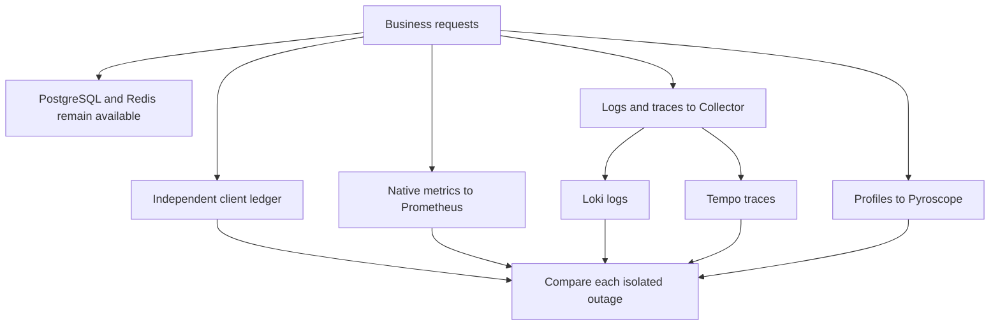

# Lab 47: Observability Backend Failure

## 1. Purpose and Learning Outcomes

You will stop one observability component at a time while keeping PostgreSQL and Redis healthy. An independent request ledger checks whether business work continues. Known IDs then show which telemetry arrived late or remained missing. Because each backend has different buffers and storage, verify fresh delivery separately from recovery of outage-period evidence.

> **Primary Objective:** Measure business availability, telemetry gaps, queue behavior, and recovery while stopping each observability backend separately.

An application can be healthy while its diagnostic evidence is incomplete. Stop Prometheus, Loki, Tempo, Pyroscope, and the Collector one at a time. Keep a separate request ledger, compare surviving signals, and distinguish delayed delivery, continued absence, and deliberate sampling.

This is a short, controlled local transport test. It does not simulate host failure, guarantee exactly-once delivery, or introduce another Collector. Preserve the architecture and sampling policies from Labs 40–46.

## 2. Starting Point and Lab Map

Open the complete application repository before using this guide. Unless a step says otherwise, run commands in Bash from the repository's top-level folder. Follow the starting checks in order because later commands depend on the helper functions and running services they prepare.

Read each explanation before running its commands. Run one complete code block, check the result, and then continue. In your notebook, save the commands, what happened, why you think it happened, and anything that differed from the expected result.

### Key Terms

| **Term**       | **Explanation**                                                                               |
| -------------- | --------------------------------------------------------------------------------------------- |
| Failure domain | The component and signal paths directly affected by a particular fault.                       |
| Scrape gap     | A period with no collected samples, even though application counters may keep increasing.     |
| Backfill       | Delivery of earlier evidence after the outage. It must be observed rather than assumed.       |

### Lab Map

The arrows show how the parts connect and where a request can take different paths. Use this map to understand the design. It is not a recording of a request that actually ran.



## 3. Guided Walkthrough

### Step 01. Inherited State and Clean Start

**What You Are Doing:** Confirm recovery from the database incident and stop competing generators. Keep business dependencies available so only observability failures are being tested.

**Practical Walkthrough:** Verify PostgreSQL recovery and leave both PostgreSQL and Redis running. The independent ledger records useful work when a telemetry component is unavailable. An unresolved database fault would change the purpose of this comparison.

Start with healthy business dependencies and no unrelated load. Use the client ledger as the control for continued operations. This separates a failure to observe the application from a failure of the application's required data path.

```bash
source lab-notes/session.sh
source lab-notes/evidence.sh
source lab-notes/metrics-session.sh
source lab-notes/platform-session.sh
source lab-notes/traces-session.sh
source lab-notes/profiling/session.sh
load_app_settings
start_lab 47
dp config --quiet
wait_ready
wait_backend loki:3100 /ready
wait_backend tempo:3200 /ready
wait_backend pyroscope:4040 /ready
api -fsS "$PROM_URL/-/ready"
test -f lab-notes/operations/request_probe.py
test -f lab-notes/operations/change_event.py
test -f lab-notes/profiling/profile_load.py
dp ps
```

Finish [Lab 46](Lab-46.md), including normalization and fixture cleanup. Use Bash and `dp`; plain `docker compose up` would omit later overlays. Stop unrelated generators and leave PostgreSQL and Redis running for the entire exercise.

Lab 44's `keep-profile-work` policy retains the CPU diagnostic workload. Ordinary successful item traces can still be sampled out, so their absence alone cannot prove export loss. Health requests are excluded from tracing entirely.

**Understanding the Result:** Keep business and telemetry failure domains separate. Introducing a database or cache outage would obscure the intended comparison.

### Step 02. Map the Failure Domains Before Changing Anything

**What You Are Doing:** Map which paths fail and which remain available for each target. These predictions identify where independent evidence should survive.

**Practical Walkthrough:** Follow the actual transport paths before stopping anything. Mark affected and surviving components for each fault. A single backend outage does not necessarily remove all signals.

Logs and traces share the Collector, while native metrics and direct profiles use other paths. Predict survivors from that architecture rather than treating every missing signal as a complete observation outage.

| **Stopped Component** | **Directly Affected Path**                                 | **Evidence That Should Remain**                                       |
| --------------------- | ---------------------------------------------------------- | --------------------------------------------------------------------- |
| Prometheus            | Scraping, rule evaluation, queries, and Tempo remote write | App `/metrics`, Loki, Tempo ingestion, profiles, and the local ledger |
| Loki                  | Durable log ingestion and log queries                      | Responses, Docker's local cache, metrics, traces, and profiles        |
| Tempo                 | Trace ingestion and queries, plus its generated metrics    | Native app metrics, logs, and profiles                                |
| Pyroscope             | Profile uploads and queries                                | Business API, native metrics, logs, and traces                        |
| Collector             | Application log and trace transport                        | Business API, direct Prometheus scrapes, and direct Pyroscope uploads |

**Prediction Checkpoint:** None of these faults should change `/health/ready` while PostgreSQL and Redis remain healthy. Stopping Prometheus also stops its alert-rule evaluation. An old alert still visible in Alertmanager does not prove new evaluations occurred during that outage.

Events can occur even when their records are missing. The host ledger and operator journal provide separate evidence, but neither is an authenticated audit service. Save UTC time, action, target, and result without credentials.

**Understanding the Result:** Surviving signals provide controls. They do not automatically prove completeness of the failed path, which needs its own identity checks.

### Step 03. Understand Where Buffering Actually Exists

**What You Are Doing:** Find the actual buffers and where persistence begins. A disk-backed exporter queue does not protect all upstream in-memory data.

**Practical Walkthrough:** Inspect SDK buffering, sampling state, batching, and persistent queues in the active setup. Record retry limits and where work becomes durable. Spans not yet admitted to a persistent queue have different restart risks.

Record capacities with their units and persistence scope. State which stages remain in memory before queued export. A queue surviving restart does not prove that those earlier stages survived too.

```bash
rg -n 'sending_queue|queue_size|storage:|retry_on_failure|max_elapsed_time|decision_wait|num_traces|memory_limiter' \
  lab-notes/tracing/collector.yml
backend otel-collector:8888 /metrics > "$LAB_DIR/collector-before.prom"
rg '^otelcol_(exporter|receiver|processor)_' "$LAB_DIR/collector-before.prom" | head -40
```

SDK queues, receiver/processor memory, tail state, exporter queues, and backend storage are separate stages. `file_storage` protects the exporter queue configured to use it. It does not persist every in-flight span or pending sampling decision.

Docker's asynchronous nonblocking Fluentd driver has finite buffers. Its dual logging cache makes `docker logs` useful, but does not replay those cached records into the Collector. A locally visible JSON line may never reach Loki. This deployment has no separate Fluentd process.

Inspect actual metric names instead of assuming a `_total` suffix or another version's units. Match exporter and signal labels across phases. Retry or send-failure counts need not count unique lost records. A zero queue can mean delivery, rejection, loss, or no input; compare known IDs to determine what happened.

**Understanding the Result:** Attach persistence claims to a specific stage. One exporter setting does not make the whole pipeline durable.

### Step 04. Install a Reusable, Reversible Fault Function

**What You Are Doing:** Install a limited fault function with separate evidence and automatic restoration for each run. Its subshell keeps the recovery trap local to that experiment.

**Practical Walkthrough:** Review the run directory, finite workload, and trap before invocation. Execute the whole function rather than copying only its stop command. Failed commands should preserve evidence and restore the target before further investigation.

Use a fresh run directory for each target and retain partial output after failure. A later retry must not overwrite the identities and timestamps needed to locate the failed step.

Each call stops one target, performs actual CRUD and fixed CPU work, captures surviving evidence, and restores the target. The subshell avoids replacing interactive-shell traps. Assertion failure triggers recovery instead of continuing into the next fault.

Requests remain sequential and bounded by their existing timeouts. Keep counts small rather than trying to fill queues. Lab 40 already tested saturation; this exercise examines ordinary short outages.

```bash
cat > lab-notes/operations/backend-fault.sh <<'BASH'
backend_fault() (
  set -euo pipefail
  local service=${1:?service required}
  case "$service" in prometheus|loki|tempo|pyroscope|otel-collector) ;; *) return 2;; esac
  local run="$LAB_DIR/$service"
  mkdir "$run"
  local stopped=0
  recover() {
    if ((stopped)); then dp start "$service" >/dev/null; fi
  }
  trap recover EXIT
  trap 'exit 130' INT
  trap 'exit 143' TERM
  api -fsS "$APP_URL/metrics" > "$run/app-before.prom"
  docker inspect --format '{{.Id}} {{.State.StartedAt}} {{.RestartCount}}' "$(dp ps -q app)" > "$run/app-before.txt"
  date -u +%Y-%m-%dT%H:%M:%SZ > "$run/start.txt"
  python3 lab-notes/operations/change_event.py "$LAB_DIR/changes.jsonl" stop "$service" intended --reason 'isolated backend experiment'
  stopped=1
  dp stop -t 10 "$service"
  python3 lab-notes/operations/request_probe.py "$APP_URL" /health/ready "$run/ready.json" --expect 200
  python3 lab-notes/operations/request_probe.py "$APP_URL" /health/live "$run/live.json" --expect 200
  local payload item_id
  payload=$(jq -n --arg name "lab47-$service-$(new_uuid)" '{name:$name,price:"7.00"}')
  python3 lab-notes/operations/request_probe.py "$APP_URL" /api/v1/items "$run/create.json" --method POST --body "$payload" --expect 201
  item_id=$(jq -er '.response.id' "$run/create.json")
  python3 lab-notes/operations/request_probe.py "$APP_URL" "/api/v1/items/$item_id" "$run/get.json" --expect 200
  python3 lab-notes/operations/request_probe.py "$APP_URL" "/api/v1/items/$item_id" "$run/update.json" --method PUT --body "$payload" --expect 200
  python3 lab-notes/operations/request_probe.py "$APP_URL" "/api/v1/items/$item_id" "$run/delete.json" --method DELETE --expect 204
  python3 lab-notes/profiling/profile_load.py "$APP_URL" "$run/profile-work.jsonl" --variant cpu --count 12 --iterations 3000000
  sleep 15
  api -fsS "$APP_URL/metrics" > "$run/app-during.prom"
  if [[ $service != otel-collector ]]; then
    backend otel-collector:8888 /metrics > "$run/collector-during.prom"
  fi
  dp logs --since "$(cat "$run/start.txt")" --no-color app > "$run/docker-app.log"
  dp start "$service"
  stopped=0
  case "$service" in
    prometheus)
      local ok=0
      for attempt in {1..45}; do
        if api -fsS "$PROM_URL/-/ready" > /dev/null; then ok=1; break; fi
        sleep 1
      done
      test "$ok" -eq 1;;
    loki) wait_backend loki:3100 /ready;;
    tempo) wait_backend tempo:3200 /ready;;
    pyroscope) wait_backend pyroscope:4040 /ready;;
    otel-collector) wait_backend otel-collector:13133 /;;
  esac
  wait_ready
  python3 lab-notes/operations/change_event.py "$LAB_DIR/changes.jsonl" start "$service" recovered --reason 'readiness checked; delivery still needs evidence'
  sleep 20
  backend otel-collector:8888 /metrics > "$run/collector-after.prom"
  docker inspect --format '{{.Id}} {{.State.StartedAt}} {{.RestartCount}}' "$(dp ps -q app)" > "$run/app-after.txt"
  diff -u "$run/app-before.txt" "$run/app-after.txt"
  date -u +%Y-%m-%dT%H:%M:%SZ > "$run/end.txt"
)
BASH
source lab-notes/operations/backend-fault.sh
backend_fault prometheus
```

**Command Note:** `<<'BASH'` writes the block exactly as shown until the closing `BASH`. Its quotes stop Bash from expanding `$variables` inside the file. Writing and executing it are separate steps.

**Understanding the Result:** Separate identities and timestamps make each fault attributable. Do not mix evidence from different attempts.

### Step 05. Prometheus: Scrape Gaps Are Different from Counter Resets

**What You Are Doing:** Stop Prometheus and compare later samples with the client ledger. Cumulative values may preserve total changes without preserving their timing inside the scrape gap.

**Practical Walkthrough:** Let requests continue while Prometheus is stopped. After recovery, inspect stored samples and native cumulative counters. A later scrape may observe accumulated activity, but it cannot recover each request's exact time.

Keep the app process running while comparing counters across the collection gap. Distinguish missing collection from a producer reset, which would also change cumulative state.

```bash
rg '^application_http_requests_total' "$LAB_DIR/prometheus/app-before.prom" > "$LAB_DIR/prometheus/counts-before.txt"
rg '^application_http_requests_total' "$LAB_DIR/prometheus/app-during.prom" > "$LAB_DIR/prometheus/counts-during.txt"
pq 'up{job="fastapi"}' > "$LAB_DIR/prometheus/target-after.json"
pq 'sum(rate(application_http_requests_total[5m]))' > "$LAB_DIR/prometheus/rate-after.json"
api -fsS "$PROM_URL/api/v1/alerts" > "$LAB_DIR/prometheus/alerts-after.json"
```

Inspect the gap in Grafana. App counters continued in the unchanged process, so a later sample can include accumulated increases. Histograms also retain cumulative buckets, not individual timestamps. `rate` needs enough usable samples and does not prove traffic was evenly distributed during the missing interval.

Prometheus produces no new samples of its own `up` while stopped. Reliable detection of the monitor's absence needs an external observer. Tempo's remote-write queue has its own retries, but its sampled generated metrics cannot replace the native application SLI.

**Understanding the Result:** Recovered totals and lost time detail can coexist. The next cumulative scrape does not provide exact historical backfill.

### Step 06. Loki and Tempo: Measure Delayed Delivery Separately

**What You Are Doing:** Test Loki and Tempo individually and reconcile IDs after each recovery. One queue snapshot may miss a backlog that formed and drained quickly.

**Practical Walkthrough:** Restore and audit one target before stopping the other. Allow delivery to settle, then compare expected records or traces. Use known identities as end-to-end evidence, with queue observations as supporting snapshots.

Complete Loki restoration and reconciliation before beginning Tempo. A brief backlog can escape observation, while saved IDs show which expected data eventually became queryable.

```bash
backend_fault loki
backend_fault tempo
for target in loki tempo; do
  rg '^otelcol_exporter_.*(queue|failed|sent)' "$LAB_DIR/$target/collector-during.prom" \
    > "$LAB_DIR/$target/queue-during.txt" || true
  rg '^otelcol_exporter_.*(queue|failed|sent)' "$LAB_DIR/$target/collector-after.prom" \
    > "$LAB_DIR/$target/queue-after.txt" || true
done
```

During a short Loki outage, traces and profiles should continue. During a Tempo outage, logs and profiles should continue. Queue and failure signals may be brief, so compare counters and actual arrivals before deciding that no disruption occurred.

Collect the known request IDs from successful CRUD and CPU operations, then query their log records after recovery:

```bash
TARGET=loki
RUN="$LAB_DIR/$TARGET"
RID=$(jq -er '.request_id' "$RUN/create.json")
START_NS=$(jq -er '.start_ns' "$RUN/create.json")
END_NS=$(python3 -c 'import time; print(time.time_ns())')
QUERY="{service_name=\"$LAB_SERVICE\",deployment_environment_name=\"$LAB_ENVIRONMENT\"} | json | request_id=\"$RID\""
backend loki:3100 /loki/api/v1/query_range query "$QUERY" start "$START_NS" end "$END_NS" limit 100 \
  > "$RUN/create-logs.json"
jq '[.data.result[].values[]] | length' "$RUN/create-logs.json"
TRACE_ID=$(jq -rs '.[0].response.trace_id' "$LAB_DIR/tempo/profile-work.jsonl")
fetch_trace "$TRACE_ID" "$LAB_DIR/tempo/known-trace.json"
python3 lab-notes/tracing/inspect_trace.py "$LAB_DIR/tempo/known-trace.json" > "$LAB_DIR/tempo/known-spans.json"
jq '[.[] | select(.attributes["app.operation"]=="sum_squares") | {trace_id,span_id,name,events}]' \
  "$LAB_DIR/tempo/known-spans.json"
```

**Expected Result:** After a recoverable short outage, find at least one matching create/request log and the known CPU-work span. If pending, repeat the same query after twenty seconds and keep both results. If still absent by the investigation deadline, record “not observed by deadline” and inspect queue/refusal evidence and app logs. Do not substitute an unrelated healthy trace.

The profile-work route does not use the downstream route's five-span structure. Do not apply Lab 40's five-span retention audit to these traces.

**Understanding the Result:** Queue snapshots describe one moment of transport state. They do not replace comparison of the expected retained identities.

### Step 07. Pyroscope: Prove Fresh Collection without Promising Backfill

**What You Are Doing:** Verify fresh profile delivery after Pyroscope returns. Old stored data or a startup flag cannot prove current uploads or historical backfill.

**Practical Walkthrough:** Generate new bounded worker operations after restoration, saving new IDs and intervals. Query their actual samples. Report fresh recovery separately from what survived during the outage.

Use the correct service, type, and interval for new CPU work. An older visible profile proves past storage only. Check the restored path using data that could not have arrived before recovery.

```bash
backend_fault pyroscope
python3 lab-notes/profiling/profile_load.py "$APP_URL" "$LAB_DIR/pyroscope/fresh.jsonl" \
  --variant cpu --count 20 --iterations 3000000
sleep 15
PROFILE_TYPE=$(cat lab-notes/profiling/profile-type.txt)
START_MS=$(jq -rs '(.[0].start_ns / 1000000 | floor)-10000' "$LAB_DIR/pyroscope/fresh.jsonl")
END_MS=$(python3 -c 'import time; print(time.time_ns()//1000000)')
SPAN_IDS=$(jq -s '[.[].response.span_id]' "$LAB_DIR/pyroscope/fresh.jsonl")
SELECTOR="{service_name=\"$LAB_SERVICE\",environment=\"$LAB_ENVIRONMENT\",workload=\"cpu\"}"
BODY=$(jq -n --arg selector "$SELECTOR" --arg type "$PROFILE_TYPE" \
  --argjson start "$START_MS" --argjson end "$END_MS" --argjson spans "$SPAN_IDS" \
  '{profileTypeID:$type,labelSelector:$selector,start:$start,end:$end,spanSelector:$spans}')
pquery SelectMergeStacktraces "$BODY" > "$LAB_DIR/pyroscope/fresh-profile.json"
jq -e '(.flamegraph.total // 0 | tonumber) > 0' "$LAB_DIR/pyroscope/fresh-profile.json"
```

**Command Note:** In `jq`, `--arg` supplies strings and `--argjson` supplies JSON values. `-e` fails the command for a final false or null result, so assertions can stop the block.

The query adds ten-second upload margins but selects only the new batch's worker span IDs. Older samples cannot satisfy it. If upload is pending, repeat the same query within sixty seconds.

`profiler_started=true` records successful initialization before the incident. It does not guarantee continuous delivery. Pyroscope is still not a required application-readiness dependency.

Query the earlier outage window separately using its JSONL times. An upload batch can cross the outage boundary, and only some samples may survive. The Python client is not a documented durable WAL. Fresh nonzero samples prove resumed collection, not replay of every failed upload. Sample weight is resource evidence rather than an exact request count.

**Understanding the Result:** Fresh samples demonstrate present recovery. Historical backfill needs separate evidence.

### Step 08. Collector: Break Both Shared Transport Paths

**What You Are Doing:** Stop the shared Collector and inspect affected logs and traces alongside surviving metrics and profiles. Distinguish persisted queue recovery from lost memory-only state.

**Practical Walkthrough:** Use native metrics and direct profiling as controls while Collector transport is unavailable. After restoration, audit known identities. Only work already stored in the persistent exporter queue has that queue's restart protection.

Use the client ledger as the expected population. Mark IDs found locally, in Loki, and in Tempo, and inspect each trace's required spans. Separate absent records, partial traces, and complete operations; an empty queue alone cannot distinguish them.

```bash
backend_fault otel-collector
pq 'up{job="fastapi"}' > "$LAB_DIR/otel-collector/app-target.json"
pq 'application_dependency_up' > "$LAB_DIR/otel-collector/dependencies.json"
python3 lab-notes/profiling/profile_load.py "$APP_URL" "$LAB_DIR/otel-collector/fresh.jsonl" \
  --variant cpu --count 12 --iterations 3000000
sleep 20
TRACE_ID=$(jq -rs '.[0].response.trace_id' "$LAB_DIR/otel-collector/fresh.jsonl")
fetch_trace "$TRACE_ID" "$LAB_DIR/otel-collector/fresh-trace.json"
```

Compare an outage-period request/trace pair with a new pair using Step 6. Collector loss affects both log and trace transport, while native metrics and direct profiling should continue. App containers need not restart just because their asynchronous Docker logging destination disappears.

A Collector restart loses unpersisted sampling and processor state. Upstream buffers may preserve some later work, and export storage may recover already queued data, but each has limits. Do not describe that as durability for the entire path or add a second logging agent to hide missing records.

**Understanding the Result:** A shared component can disrupt signals in different ways. Their individual buffering stages determine what can recover.

### Step 09. Evidence Table, Troubleshooting and Recovery Proof

**What You Are Doing:** Complete the matrix with measured outcomes. Keep business impact, current recovery, and historical gaps as separate conclusions.

**Practical Walkthrough:** Record actual requests, surviving evidence, fresh delivery, and unrecovered data for each fault. Keep unresolved gaps visible. Verify every service and new canary before finishing without rewriting earlier losses as success.

Fill the matrix from ledgers and queries, not assumptions. A healthy final state proves current recovery but does not erase missing evidence from the outage.

Enter observed results in this table rather than copying Step 2's predictions:

| **Target** | **CRUD/Ready**      | **Local Event Record** | **Loki Known ID**          | **Tempo Known ID**         | **Profile Window**               | **Queue/Drop Evidence**                    |
| ---------- | ------------------- | ---------------------- | -------------------------- | -------------------------- | -------------------------------- | ------------------------------------------ |
| Prometheus | Save response codes | Check record presence  | Check known ID             | Check known ID             | Record sample weight             | Save observed metric labels                |
| Loki       | Save response codes | Check record presence  | Record arrival or deadline | Check known ID             | Record sample weight             | Save observed metric labels                |
| Tempo      | Save response codes | Check record presence  | Check known ID             | Record arrival or deadline | Record sample weight             | Save observed metric labels                |
| Pyroscope  | Save response codes | Check record presence  | Check known ID             | Check known ID             | Compare fresh and outage windows | Save SDK/backend evidence                  |
| Collector  | Save response codes | Check record presence  | Record arrival or deadline | Record arrival or deadline | Record sample weight             | Distinguish upstream and exporter evidence |

| **Symptom**                        | **Check**                                                  | **Next Action**                                                                |
| ---------------------------------- | ---------------------------------------------------------- | ------------------------------------------------------------------------------ |
| CRUD fails during telemetry outage | Check business dependencies and app resource pressure      | Restore the target and investigate the unexpected dependency before continuing |
| Trace absent but logs present      | Check head ratio, tail policy, known ID, and loss counters | Use the retained CPU workload and wait within a defined deadline               |
| No local app logs                  | Inspect Docker logging settings and cache limits           | Check effective logging metadata before blaming a Loki query                   |
| Empty profile                      | Check type, millisecond bounds, and CPU work               | Generate fresh bounded work and allow upload time                              |
| Exporter queue remains nonzero     | Inspect destination, backend readiness, disk, and retries  | Repair delivery and prove arrival of the known ID                              |
| Fault function exits early         | Check the exit trap, `dp ps`, and saved fixture JSON       | Restore that target, investigate, then remove only its fixture                 |

```bash
wait_ready
wait_backend loki:3100 /ready
wait_backend tempo:3200 /ready
wait_backend pyroscope:4040 /ready
wait_backend otel-collector:13133 /
api -fsS "$PROM_URL/-/ready"
pq 'up' > "$LAB_DIR/final-targets.json"
dp ps > "$LAB_DIR/final-containers.txt"
backend otel-collector:8888 /metrics > "$LAB_DIR/collector-final.prom"
```

Restore all five targets, delete run-owned fixtures, and verify unchanged app process identity. Inspect `up` for all nine jobs rather than counting JSON objects, since a job can have multiple targets. Queues should drain under the small final workload without continuing refusal growth. Keep failed measurements and use new files for retries.

See [Collector resilience](https://opentelemetry.io/docs/collector/resiliency/), [Docker Fluentd logging](https://docs.docker.com/engine/logging/drivers/fluentd/), [Docker delivery modes](https://docs.docker.com/engine/logging/configure/), and [Prometheus storage](https://prometheus.io/docs/prometheus/latest/storage/).

**Understanding the Result:** Current health and historical completeness are different findings. Preserve measured gaps even after every service is green.

## 4. Troubleshooting and Diagnosis

Begin with the first result that differed from your prediction. Save the exact error or symptom and identify which service or command produced it. Use the checks below, make the needed fix, and repeat the original check to confirm the problem is resolved.

Use Step 09's troubleshooting and recovery checks to verify the final state.

## 5. Review and Practice

Answer the questions in your own words before reading the answers. For the scenario, say what you would inspect and exactly what each result would tell you.

### Knowledge Check

1. Why does file storage not protect every span?
2. Can a later scrape reconstruct the timing of requests missed during a Prometheus outage?
3. Does a local Docker log line prove Loki ingestion?
4. Why use the CPU workload for a trace delivery canary?

#### Answer Guide

1. Only exporter queues configured for file storage receive that protection. SDK, processor, and tail-sampling memory have separate lifecycles.
2. A later scrape may observe cumulative increases, but it cannot reconstruct individual timestamps or missed rule evaluations.
3. No. Docker's local cache and the forwarding path have different retention and delivery behavior.
4. Its explicit retention policy removes ordinary probabilistic selection as the main reason for a missing trace, making delivery easier to test.

### Professional Scenario Exercise

A release succeeds, but its incident dashboard becomes blank. Explain how to distinguish customer impact from lost visibility. Use one surviving signal, an independently recorded change, a missing known record, and a fresh recovery canary. State which conclusions remain uncertain.

## 6. Completion Checklist

Tick an item only when you can show its result or saved evidence. Finish the cleanup instructions before starting the next lab.

### Observable Completion Criteria

- [ ] Each of the five targets was stopped separately and restored before the next fault.
- [ ] CRUD, readiness, and app process identity were measured for every outage.
- [ ] Known request and trace IDs distinguish missing records from intentional sampling.
- [ ] Fresh and outage profile windows were compared without assuming guaranteed backfill.
- [ ] All targets recovered, and exporter queues were inspected afterward.

## 7. Production Context and Next Lab

### Production Implications

Production monitoring needs an independent observer for its own failures, capacity planning for each buffer, limited retries, reliable storage, and explicit acceptable-loss targets. Separate failure domains and redundant Collectors may be appropriate. This one-node test illustrates the limits of the local design rather than proving high availability.

### End State and Transition

Finish with the complete platform healthy and the same collection paths and sampling settings. Lab 48 reviews whether these diagnostic capabilities expose unnecessary access, secrets, or sensitive records.
