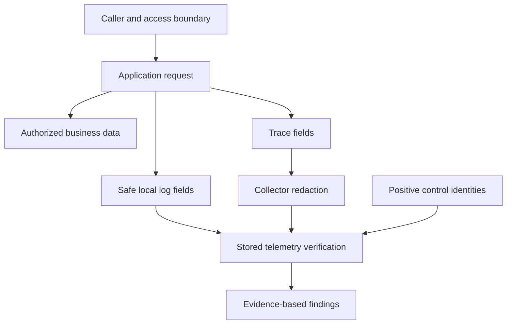

# Lab 48: Security and Telemetry Hardening Review

## 1. Purpose and Learning Outcomes

**In Plain Language:** You will review the access and data exposure of the system you actually built. Inventory only safe configuration fields, inspect runtime privileges, protect local credential files, and test synthetic sensitive markers through the telemetry paths. Positive controls are essential: absence of a marker is useful redaction evidence only when the expected non-sensitive records were successfully collected.

> **Primary Objective:** Review exposure, credentials, privileges and sensitive telemetry, apply a concrete local hardening change, and verify redaction without hiding useful evidence.

The platform now makes failures observable. Those same endpoints, log fields, query APIs and diagnostic workloads can expose operational data or consume resources. This lab reviews the actual running composition, tests synthetic secret handling and records decisions about administrative access.

The review is confined to your local repository and its containers. It is not penetration testing, a vulnerability-free certification, an internet deployment, or an implementation of authentication for the learning API. No real credentials are placed into probes, screenshots or telemetry.

## 2. Starting Point and Lab Map

Use this guide inside the complete application repository. Run commands from the repository root in Bash unless a step says otherwise. Work through the starting checks in order; they load the helpers and state this lab needs.

Read the explanation before each step, run one complete code block at a time, and compare the actual result with the stated expectation. Save commands, observations, explanations, and unexpected results in your notebook.

### Key Terms

| **Term**         | **Plain-Language Meaning**                                                           |
| ---------------- | ------------------------------------------------------------------------------------ |
| Trust boundary   | A point where access, identity, or privileges change between callers and components. |
| Least privilege  | Granting only the access needed for a component's intended work.                     |
| Positive control | Expected harmless evidence that confirms the collection or test path worked.         |

### Lab Map

The arrows show the flow or dependency being studied. Branches identify paths to compare; this is a conceptual map, not a captured runtime trace.



## 3. Guided Walkthrough

### Step 01. Prerequisites and Starting State

**What You Are Doing:** Restore every backend before reviewing exposure and redaction. Keep the bounded diagnostic routes available for these checks while documenting their separate production decision.

**Practical Walkthrough:** Restore every backend and verify fresh four-signal evidence before reviewing exposure and redaction. Keep the bounded diagnostic routes available for this lab's checks, while recording their separate production-use decision. A broken collection path would make later absence searches inconclusive.

Verify fresh records, traces, metrics, and profiles before testing absence of sensitive markers. An unavailable collection path would make an empty search inconclusive. Keep the diagnostic routes within this lab's scope and document their separate production decision rather than silently assuming they belong in every deployment.

```bash
source lab-notes/session.sh
source lab-notes/evidence.sh
source lab-notes/metrics-session.sh
source lab-notes/platform-session.sh
source lab-notes/traces-session.sh
source lab-notes/profiling/session.sh
load_app_settings
start_lab 48
dp config --quiet
wait_ready
wait_backend loki:3100 /ready
wait_backend tempo:3200 /ready
wait_backend pyroscope:4040 /ready
mkdir -p lab-notes/operations
umask 077
chmod 700 "$LAB_DIR"
```

Complete [Lab 47](Lab-47.md), with all stopped services restored. Work from the repository root in the existing Bash session. The Collector and SDK settings remain unchanged. Keep the bounded demo endpoint enabled for this review and the final game day; production exposure of that endpoint needs a separate decision.

**Measurable Outcomes:** inventory every published listener; distinguish runtime privileges from initialization exceptions; verify administrative API flags; protect local credential files; demonstrate positive log/trace controls with synthetic secrets absent; and write an actionable findings register.

**Understanding the Result:** Redaction checks require known data arrival. Begin with positive evidence that the intended telemetry paths work.

### Step 02. Draw the Trust Boundaries

**What You Are Doing:** Identify who can reach each interface and under which identity. Loopback bindings, shared container networks, and authentication answer different access questions.

**Practical Walkthrough:** Identify the caller, reachable network, and authentication boundary for each interface. Host loopback limits one access path, while shared Docker networks can provide another. Authentication and binding address answer different questions and should be recorded separately in the inventory.

For each endpoint, record caller location, binding address, reachable network, and authentication separately. Loopback publication constrains one route of access but does not describe internal Docker reachability. Use this inventory to state the actual trust boundary instead of a broad claim that a private-looking address is secure.

| **Boundary**                   | **Actual Access in This Repository**                                | **Review Question**                                                   |
| ------------------------------ | ------------------------------------------------------------------- | --------------------------------------------------------------------- |
| Host → app                     | Loopback HTTP; business and demo routes have no user authentication | Who else can access this host or tunnel the port?                     |
| Host → Grafana                 | Loopback HTTP; login required for private datasources               | Are credentials unique, and are anonymous access and signup disabled? |
| Host → Prometheus/Alertmanager | Local query and control surfaces                                    | Could an untrusted process query data, silence alerts or send writes? |
| Docker daemon → Collector      | Loopback-published Fluent Forward input                             | Is this kept local and limited to the intended logging path?          |
| App → PostgreSQL/Redis         | Docker DNS and credentials                                          | Are application and bootstrap roles separated?                        |
| App/Collector → backends       | Internal unauthenticated learning network                           | Can unrelated containers join that trust domain?                      |
| Operator → evidence files      | Local filesystem                                                    | Could evidence or expanded configuration reveal credentials?          |

Loopback limits network reachability, not access by other local users, browser behavior, host malware or Docker administrators. An internal Docker network is not application-level authorization. The node exporter introduced earlier may intentionally bind the Docker bridge address for host metrics; review that exception rather than declaring every listener loopback-only.

**Prediction Checkpoint:** should hiding a dashboard prevent users from querying its datasource? No. Dashboard navigation and datasource authorization are different controls. Should request IDs identify authenticated actors? No; clients can choose valid request IDs.

**Understanding the Result:** A loopback-published service is not automatically isolated from peer containers. State the actual trust boundary being checked.

### Step 03. Inventory Configuration without Printing Secrets

**What You Are Doing:** Produce an allowlisted inventory from the active model without retaining its secret values. Review actual published listeners and settings rather than exposing a full configuration dump.

**Practical Walkthrough:** Generate the allowlisted inventory from the effective Compose model, retaining only the fields required for review. The complete model can contain resolved secrets, so use the supplied filtered extraction instead of saving a full dump. Inspect actual published listeners and active settings.

Pipe expanded Compose JSON directly through the allowlisted inventory tool and save only its filtered result. Check the actual published bindings and selected settings. The full resolved model can contain credentials, so it is an input for controlled extraction rather than an artifact to dump into shareable evidence.

```bash
cat > lab-notes/operations/security_inventory.py <<'PYTHON'
"""Read expanded Compose JSON from stdin; emit an allowlisted, secret-free inventory."""
import json,sys
config=json.load(sys.stdin)
result=[]
for name,service in sorted(config['services'].items()):
    command=service.get('command') or []
    if isinstance(command,str):command=command.split()
    flags={key:any(arg==key or arg.startswith(key+'=true') for arg in command)
           for key in ('--web.enable-admin-api','--web.enable-lifecycle','--web.enable-remote-write-receiver')}
    ports=[{key:port.get(key) for key in ('host_ip','published','target','protocol')}
           for port in service.get('ports',[])]
    mounts=[{'type':mount.get('type'),'target':mount.get('target'),'read_only':mount.get('read_only',False)}
            for mount in service.get('volumes',[])]
    result.append({'service':name,'image':service.get('image'),'user':service.get('user','image default'),
                   'privileged':service.get('privileged',False),'read_only':service.get('read_only',False),
                   'cap_add':service.get('cap_add',[]),'cap_drop':service.get('cap_drop',[]),
                   'security_opt':service.get('security_opt',[]),'pid':service.get('pid'),
                   'network_mode':service.get('network_mode'),'ports':ports,'mounts':mounts,
                   'environment_keys':sorted((service.get('environment') or {}).keys()),
                   'logging_driver':service.get('logging',{}).get('driver'), 'prometheus_flags':flags})
json.dump(result,sys.stdout,indent=2);print()
PYTHON
```

**Command Note:** `<<'PYTHON'` writes the following block literally until `PYTHON`. Quoting the delimiter prevents Bash from expanding `$variables` inside the generated file; creation and execution are separate steps.

```bash
set -o pipefail
dp config --format json | python3 lab-notes/operations/security_inventory.py > "$LAB_DIR/compose-inventory.json"
jq '.[] | {service,user,ports,privileged,cap_add,read_only}' "$LAB_DIR/compose-inventory.json"
python3 - "$LAB_DIR/compose-inventory.json" <<'PYTHON'
import json,sys
rows=json.load(open(sys.argv[1]))
assert not any(row['privileged'] for row in rows),'Unexpected privileged service'
assert not any(m['target']=='/var/run/docker.sock' for row in rows for m in row['mounts']),'Docker socket exposed'
for row in rows:
    for port in row['ports']:
        address=port.get('host_ip') or '0.0.0.0'
        print(row['service'],address,port['published'],'->',port['target'])
        assert address not in ('0.0.0.0','::'),'Investigate wildcard publishing before continuing'
PYTHON
```

The expanded Compose document passes through memory to an allowlisted report. Do not save `dp config` output directly, enable shell tracing, or attach a full `docker inspect` document: environment values can contain passwords. The report intentionally records environment **names**, not values, and never prints arbitrary command arguments.

Check for unnecessary host ports on PostgreSQL, Redis, Loki, Tempo, Pyroscope and OTLP. Lab 42 removed the Pyroscope host listener because Grafana can query it internally. Collector port 8006 serves Docker's host-side logging driver; binding the container receiver to `0.0.0.0` is still necessary for forwarding through Docker.

If a required local-only UI was changed to a wildcard binding, correct its active Compose overlay to `127.0.0.1:HOST_PORT:CONTAINER_PORT`, validate and recreate only that service. Do not remove the bridge listener used by the node exporter without also revisiting its scrape path.

**Understanding the Result:** The inventory should prove exposure without becoming a new credential artifact. Review its contents before attaching it as evidence.

### Step 04. Verify Runtime Privileges and Document Exceptions

**What You Are Doing:** Inspect effective users, capabilities, and writable paths, including image defaults. Record intentional exceptions, such as volume initialization and host observation, with their specific purpose.

**Practical Walkthrough:** Inspect effective runtime users, capabilities, and writable locations, including defaults inherited from images. Compare each privilege with its stated purpose, such as host observation or volume initialization. Record specific justified exceptions rather than assuming every service should share one runtime profile.

Compare each runtime user, capability, and writable mount with its documented purpose. Include image defaults, since absent Compose fields do not necessarily mean absent privileges. Record specific host-observation or initialization exceptions with evidence rather than forcing unrelated services into an identical runtime model.

```bash
while IFS= read -r cid; do
  docker inspect --format '{{json .}}' "$cid" | python3 -c '
import json,sys
c=json.load(sys.stdin);h=c["HostConfig"]
print(json.dumps({"service":c["Config"]["Labels"].get("com.docker.compose.service"),
"user":c["Config"]["User"],"privileged":h["Privileged"],"read_only":h["ReadonlyRootfs"],
"cap_add":h["CapAdd"],"cap_drop":h["CapDrop"],"security_opt":h["SecurityOpt"],
"pid_mode":h["PidMode"],"image_id":c["Image"]}))'
done < <(dp ps -q) > "$LAB_DIR/runtime-inventory.jsonl"
cat "$LAB_DIR/runtime-inventory.jsonl"
```

Check effective image users as well as Compose's `user` field. The application and backend wrappers run as non-root users with dropped capabilities; writable named volumes are intentional state, not a reason to make the entire container privileged.

The one-shot `init-volumes` service runs with narrowly scoped ownership capabilities and no network to prepare volume ownership. It is not a permanently running root application. Node exporter host filesystem/process mounts are another deliberate exception: inspect their read-only flags and necessity. A read-only host mount still exposes data to the process that can read it.

Do not apply `read_only: true` to every service mechanically. SQLite, WALs, compaction, queues and temporary files require deliberate writable paths. Review capabilities, mounts, host namespace use, user identity and socket access together.

**Understanding the Result:** Declared YAML is only part of the effective state. Image defaults and active container settings complete the privilege picture.

### Step 05. Protect Credentials and Understand Rotation

**What You Are Doing:** Restrict credential-file permissions and distinguish that change from password rotation. A copied or previously committed secret remains compromised until its credential is replaced appropriately.

**Practical Walkthrough:** Apply the documented restrictive permissions to credential files and verify the resulting modes. This limits local file access but does not change the underlying password or invalidate previously copied values. Treat actual credential replacement and dependent-service updates as a separate rotation procedure.

Apply the stated permissions and inspect the resulting modes without printing credential contents. Explain the boundary of this change: it restricts local file access but does not rotate the underlying secret. Actual rotation requires updating the credential and every dependent consumer through a separate coordinated procedure.

```bash
chmod 600 .env
python3 - <<'PYTHON'
from pathlib import Path
import stat
mode=stat.S_IMODE(Path('.env').stat().st_mode)
assert mode==0o600,oct(mode)
print('Local environment permissions:',oct(mode))
PYTHON
if git rev-parse --is-inside-work-tree >/dev/null 2>&1; then
  if git ls-files --error-unmatch .env >/dev/null 2>&1; then
    printf '%s\n' 'STOP: .env is tracked; remove it from tracking and rotate exposed credentials.'
  else
    git check-ignore .env
  fi
fi
python3 lab-notes/operations/change_event.py "$LAB_DIR/changes.jsonl" chmod .env completed --reason 'owner-only local credential file'
```

This changes file permissions, not passwords. Review secret quality privately. Never print passwords to prove that they are strong. `.env.example` contains setup guidance, not reusable production credentials. If a secret entered Git history, removing the current file does not revoke copies: rotate the affected credential and coordinate history cleanup according to repository policy.

Changing `POSTGRES_PASSWORD` in `.env` does not change the password of an existing PostgreSQL role. Likewise Grafana's initial admin environment variables do not reliably reset an existing database account. Rotation requires changing the actual server-side credential, updating consumers, verifying access, and revoking the previous value. Record who performed that governed change without storing either password.

Compose secrets can mount files under `/run/secrets`, but this application's typed settings do not automatically read a `_FILE` variable. Adopting file-based secrets requires an explicit settings implementation and tests. A local Compose secret file is not an encrypted organizational secret manager. Production secret distribution, backup encryption and access auditing remain separate work.

**Understanding the Result:** Permission tightening is not secret rotation. State precisely which protection this step establishes.

### Step 06. Review Administrative APIs without Invoking Destructive Actions

**What You Are Doing:** Inspect administrative and write-capable interfaces without exercising destructive operations. Include the deliberately enabled remote-write receiver in the access review.

**Practical Walkthrough:** Inspect administrative and write-capable endpoints through the provided read-only checks. Include the enabled remote-write receiver because it accepts data even though it belongs to monitoring infrastructure. Record reachability and authentication without invoking destructive administrative actions merely to demonstrate their existence.

Inspect enabled administrative and ingestion capabilities using read-only endpoints. Include remote write because accepting monitoring data is still a write capability. Record reachability and authentication separately, and keep the review observational rather than invoking destructive operations merely to prove an endpoint exists.

```bash
api -fsS "$PROM_URL/api/v1/status/flags" > "$LAB_DIR/prometheus-flags.json"
jq '.data | with_entries(select(.key | test("web.enable-(admin-api|lifecycle|remote-write-receiver)")))' \
  "$LAB_DIR/prometheus-flags.json"
jq -e '.data["web.enable-admin-api"]=="false" and .data["web.enable-lifecycle"]=="false"' \
  "$LAB_DIR/prometheus-flags.json"
GRAFANA_HTTP=${GRAFANA_URL:-http://127.0.0.1:3000}
STATUS=$(curl --noproxy '*' -sS --connect-timeout 2 --max-time 10 -o "$LAB_DIR/grafana-anonymous.json" \
  -w '%{http_code}' "$GRAFANA_HTTP/api/datasources")
printf '%s\n' "$STATUS" > "$LAB_DIR/grafana-anonymous-status.txt"
test "$STATUS" = 401
```

Lab 41 intentionally enabled the Prometheus remote-write receiver for Tempo-generated metrics. It is a write surface, even though destructive admin APIs and HTTP lifecycle endpoints remain disabled. Keep it behind the learning network/loopback boundary. Use container restart for a validated configuration change rather than enabling reload solely for convenience.

Alertmanager permits operations such as silencing and alert submission within its trusted access model. Loki, Tempo, Pyroscope and Collector ingest/query endpoints also require a controlled network boundary. Do not send fake production alerts or destructive API calls as a “security check.” Review flags, access paths and documented capabilities instead.

For internet deployment, add authenticated authorization-aware ingress, TLS, rate limits and an explicit allowlist of paths. HTTPS transport and login solve different problems. The API also needs domain authorization before real multi-user data is served. No proxy or access-control deployment is added during this local review.

**Understanding the Result:** An observability endpoint can be a write boundary. Its operational purpose does not remove the need to understand access.

### Step 07. Inject Synthetic Secrets with Positive Controls

**What You Are Doing:** Send unique fake sensitive markers alongside known safe request identities. The marker's intended business-data presence and forbidden telemetry presence are different expectations.

**Practical Walkthrough:** Send unique synthetic sensitive markers with known safe correlation identities. The item body may legitimately store and return the test value, while telemetry should obey its narrower field policy. Preserve this distinction so intended business-data presence is not confused with a logging leak.

Use only the unique synthetic markers and preserve safe correlation IDs as positive controls. Business storage can legitimately contain the submitted test value while telemetry must follow its narrower policy. Keep those destinations distinct when interpreting presence of a marker in an item response versus a log or span.

```bash
cat > lab-notes/operations/redaction_probe.py <<'PYTHON'
"""Use only synthetic secrets. Save IDs for positive-control telemetry checks."""
import argparse,json,time,uuid
from urllib.parse import urlencode
from urllib.request import ProxyHandler,Request,build_opener
p=argparse.ArgumentParser();p.add_argument('base_url');p.add_argument('output');a=p.parse_args()
marker='FAKE-LAB48-'+uuid.uuid4().hex
opener=build_opener(ProxyHandler({}));started=time.time_ns()
def call(path,method='GET',body=None):
    rid='redaction-'+str(uuid.uuid4())
    headers={'X-Request-ID':rid,'Authorization':'Bearer '+marker,'Cookie':'lab_secret='+marker}
    data=None if body is None else json.dumps(body).encode()
    if data is not None:headers['Content-Type']='application/json'
    with opener.open(Request(a.base_url.rstrip('/')+path,data=data,headers=headers,method=method),timeout=12) as response:
        raw=response.read();document=json.loads(raw) if raw else None
        assert response.headers['X-Request-ID']==rid
        return {'request_id':rid,'status':response.status,'response':document}
records={}
records['profile']=call('/api/v1/demo/profile-work?'+urlencode({'variant':'cpu','iterations':3000000,'secret':marker}))
records['create']=call('/api/v1/items','POST',{'name':'lab48-'+uuid.uuid4().hex,'description':marker,'price':'4.80'})
item_id=records['create']['response']['id']
try:
    assert records['profile']['status']==200 and records['create']['status']==201
    assert records['create']['response']['description']==marker
finally:
    records['delete']=call('/api/v1/items/'+item_id,'DELETE')
with open(a.output,'x') as f:
    json.dump({'synthetic_marker':marker,'start_ns':started,'end_ns':time.time_ns(),'records':records},f,indent=2)
print(json.dumps({'output':a.output,'profile_trace_id':records['profile']['response']['trace_id']}))
PYTHON
```

```bash
START_UTC=$(date -u +%Y-%m-%dT%H:%M:%SZ)
python3 lab-notes/operations/redaction_probe.py "$APP_URL" "$LAB_DIR/redaction-probe.json"
sleep 20
dp logs --since "$START_UTC" --no-color app > "$LAB_DIR/app-probe.log"
TRACE_ID=$(jq -er '.records.profile.response.trace_id' "$LAB_DIR/redaction-probe.json")
fetch_trace "$TRACE_ID" "$LAB_DIR/profile-trace.json"
python3 lab-notes/tracing/inspect_trace.py "$LAB_DIR/profile-trace.json" > "$LAB_DIR/profile-spans.json"
START_NS=$(jq -er '.start_ns' "$LAB_DIR/redaction-probe.json")
END_NS=$(python3 -c 'import time; print(time.time_ns())')
for operation in profile create delete; do
  RID=$(jq -er --arg op "$operation" '.records[$op].request_id' "$LAB_DIR/redaction-probe.json")
  QUERY="{service_name=\"$LAB_SERVICE\",deployment_environment_name=\"$LAB_ENVIRONMENT\"} | json | request_id=\"$RID\""
  backend loki:3100 /loki/api/v1/query_range query "$QUERY" start "$START_NS" end "$END_NS" limit 100 \
    > "$LAB_DIR/$operation-logs.json"
done
api -fsS "$APP_URL/metrics" > "$LAB_DIR/probe-metrics.prom"
```

**Command Note:** `jq --arg` passes a shell value as a JSON-query string variable without inserting it into the query text. Where used, `-e` turns a false or null final result into a failing exit status.

The marker is fake and unique. It appears in an Authorization header, a cookie, an extra query parameter and one item description. The body is expected to contain it in the create response and persistence, because it is user data; the helper deletes its own item afterward. It should not appear in emitted logs, metric labels or retained trace attributes.

The endpoint accepting the fake Authorization header demonstrates that the learning API has no authentication enforcement. It does not demonstrate that the token was valid or checked. Do not use real secrets in query strings even when this controlled redaction test passes.

**Understanding the Result:** Use fake markers only. The test checks field handling without introducing real credentials or personal secrets into evidence.

### Step 08. Assert Absence Only After Proving Collection Worked

**What You Are Doing:** First prove that the request's expected records and trace arrived, then check for forbidden fields. Inspect both local emission and backend storage because downstream redaction cannot undo an earlier local leak.

**Practical Walkthrough:** First prove the expected request records and trace arrived, then search for forbidden markers and fields. Inspect local emission as well as backend storage: Collector redaction cannot undo a value already written locally. Keep query windows and identities tied to the known test request.

Treat the verification as two assertions: expected safe correlation evidence is present, and forbidden markers are absent from that evidence. If the first assertion fails, report an inconclusive redaction test and investigate delivery. If the second fails, record whether the value appeared in local output, resource attributes, span attributes, or event attributes to locate the policy boundary needing correction.

```bash
python3 - "$LAB_DIR" <<'PYTHON'
import json,sys
from pathlib import Path
root=Path(sys.argv[1]);probe=json.loads((root/'redaction-probe.json').read_text())
marker=probe['synthetic_marker']
spans=json.loads((root/'profile-spans.json').read_text())
assert any(s['attributes'].get('app.operation')=='sum_squares' for s in spans),'No retained positive-control worker span'
local=(root/'app-probe.log').read_text()
for op,record in probe['records'].items():
    assert record['request_id'] in local,('Missing local positive control',op)
    document=json.loads((root/(op+'-logs.json')).read_text())
    records=[line for stream in document['data']['result'] for _,line in stream['values']]
    assert records and any(record['request_id'] in line for line in records),('Missing Loki positive control',op)
for filename in ('app-probe.log','profile-trace.json','profile-spans.json',
                 'profile-logs.json','create-logs.json','delete-logs.json','probe-metrics.prom'):
    assert marker not in (root/filename).read_text(),('Synthetic secret leaked',filename)
print('Positive controls present; marker absent from tested telemetry artifacts.')
PYTHON
```

Inspect normalized trace attributes and span events. The inherited Collector transform removes SQL statement text, complete URLs/query strings and verbose exception fields before storage. Application logging avoids sensitive fields before they enter stdout. Downstream redaction does not undo a leak already written into Docker's local cache, which is why both boundaries are tested.

An empty query cannot pass a confidentiality test. A failed positive control means the test is inconclusive until the transport or query is fixed. A passing marker test covers these inputs and this configuration; it is not a proof that every code path is free of sensitive information.

**Understanding the Result:** Absence is meaningful only with a positive collection control. A broken pipeline can otherwise look falsely successful at hiding sensitive data.

### Step 09. Audit-Relevant Records and Findings Register

**What You Are Doing:** Record concrete findings with evidence, scope, and follow-up actions. Distinguish operational correlation records from an authenticated and protected security audit trail.

**Practical Walkthrough:** Write each finding with the observed boundary, evidence reference, consequence, and concrete follow-up. Distinguish facts established by this lab from assumptions needing another check. Ordinary correlation logs remain editable operational evidence unless separate authenticated, protected audit guarantees are implemented.

For each finding, record the observed boundary, artifact, consequence, and concrete next action. Separate verified facts from assumptions and retain unresolved questions. Ordinary operational logs support correlation, but their presence alone does not establish the protected authorship or immutability expected of a dedicated audit system.

A `created_item` or request log provides operational evidence. Without authenticated actor identity, governed action semantics, reliable delivery and protected retention it is not a trustworthy security audit trail. Keep these categories distinct:

| **Record**                    | **What It Establishes**                        | **Missing Guarantee**                                   |
| ----------------------------- | ---------------------------------------------- | ------------------------------------------------------- |
| App log with request/trace ID | Correlated execution observation               | Authenticated actor and durable audit delivery          |
| Operator change journal       | Stated action, time and target                 | Independent identity verification and tamper protection |
| Deployment image ID           | Exact local artifact selected                  | Approval, supply-chain provenance and signing           |
| Synthetic marker test         | Tested fields stayed out of observed telemetry | Universal absence of confidential data                  |

Create `findings.md` in this run's evidence directory. For each actual finding record: evidence file/line, affected boundary, realistic impact, remediation owner, priority, target date, verification command, and accepted residual risk. Do not populate it with invented vulnerabilities just to fill a table. At minimum record the deliberate unauthenticated local API/demo exposure, the retained Prometheus remote-write surface, and host-level trust assumptions as explicit deployment constraints.

**Exercise:** propose an audit event schema with authenticated actor, action, target, outcome, timestamp and correlation ID. Explain where authentication would come from and how delivery/retention would differ from the current best-effort diagnostic logging path. Do not claim that adding `actor="admin"` makes a record trustworthy.

**Understanding the Result:** The report should make each conclusion reviewable. Avoid labeling routine telemetry an audit trail stronger than its actual controls.

## 4. Troubleshooting and Diagnosis

Start with the first unexpected result. Record the exact symptom, identify which component produced it, and use the checks below before repeating the experiment. After a fix, repeat the original check and confirm recovery.

### Troubleshooting and Final Checks

| **Observation**                     | **Interpretation**                               | **Follow-Up**                                                              |
| ----------------------------------- | ------------------------------------------------ | -------------------------------------------------------------------------- |
| Inventory reports wildcard port     | Effective overlay changed the binding            | Correct the responsible file, recreate that service, re-inventory          |
| Runtime user is blank               | Image default may be root                        | Inspect image `Config.User`; fix the image/service deliberately            |
| Grafana anonymous query returns 200 | Anonymous/auth configuration changed             | Review Grafana settings and access policy before continuing                |
| Marker appears only in local log    | App logging leaked before Collector sanitization | Fix the emitting logger, then rerun with a new marker                      |
| Marker appears in trace             | Unexpected attribute survives transformation     | Inspect exact key, add a targeted transform, validate Collector and repeat |
| No marker and no request record     | Broken observation path                          | Restore positive controls before claiming redaction                        |

If remediation changes application logging or Collector transforms, preserve request/trace IDs and low-cardinality operational fields. Re-run tests, native configuration validation and the fresh marker experiment. Avoid indiscriminate field deletion that makes incidents impossible to diagnose.

```bash
dp config --quiet
wait_ready
wait_backend loki:3100 /ready
wait_backend tempo:3200 /ready
wait_backend pyroscope:4040 /ready
python3 lab-notes/operations/change_event.py "$LAB_DIR/changes.jsonl" review telemetry completed --reason 'exposure inventory and synthetic-marker checks recorded'
```

Technical references: [Prometheus security model](https://prometheus.io/docs/operating/security/), [Compose secrets](https://docs.docker.com/compose/how-tos/use-secrets/), and [Grafana security configuration](https://grafana.com/docs/grafana/latest/setup-grafana/configure-security/).

## 5. Review and Practice

Answer the knowledge questions in your own words before reading the answer guide. For the scenario, name the evidence you would collect and the conclusion each observation would support.

### Knowledge Check

1. Why is downstream log redaction insufficient by itself?
2. Does a request ID prove who acted?
3. Why does changing a database password variable not necessarily rotate a role?
4. Why keep remote write enabled while documenting its risk?

#### Answer Guide

1. The sensitive value may already exist in stdout, Docker caches or other upstream records.
2. No. It is a correlation value, and valid client-supplied IDs are accepted.
3. Initialization environment variables do not rewrite existing role credentials; server and consumers need coordinated changes.
4. Tempo uses the inherited internal metrics path. Restrict its access boundary rather than silently breaking a required integration.

### Professional Scenario Exercise

A team proposes exposing every observability port to simplify remote troubleshooting. Produce a reviewed access plan: identify the necessary human entry point, internal-only receivers, authentication and TLS needs, allowed administrative operations, and temporary-access expiry. Use the actual inventory rather than a generic checklist.

## 6. Completion Checklist

Mark each item only after you can point to its result or evidence file. Complete any cleanup shown here before moving on.

### Observable Completion Criteria

- [ ] Effective host listeners and runtime privileges are recorded without secret values.
- [ ] .env has owner-only permissions and its tracking status is checked.
- [ ] Administrative API flags and Grafana anonymous datasource access are checked.
- [ ] Synthetic secret probes have positive local-log, Loki and retained-trace controls.
- [ ] Findings distinguish diagnostic records from authenticated audit events.
- [ ] No extra public ports, collectors or permanent components were introduced.

## 7. Production Context and Next Lab

### Production Implications

Production hardening requires authenticated business access, centralized secret distribution, encrypted transport, controlled administrative access, tested updates and protected audit retention. Observability data deserves an explicit sensitivity policy. This lab improves and reviews a local learning stack; it does not certify it for public deployment.

### End State and Transition

All services remain healthy, fixtures are removed, and local evidence is protected. Lab 49 turns configuration checks and state protection into repeatable validation, backup, restore and release checkpoints.
