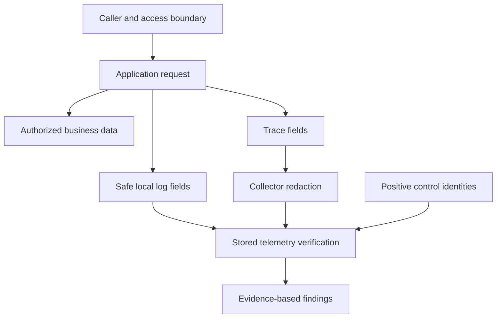

# Lab 48: Security and Telemetry Hardening Review

## 1. Purpose and Learning Outcomes

You will review who can reach the system you built and what data it may expose. Record only safe configuration fields, check container permissions, protect files that hold credentials, and send fake sensitive values through the telemetry paths. First confirm that ordinary, harmless records arrive. Only then can a missing sensitive value provide useful evidence that the filtering worked.

> **Primary Objective:** Review network access, credentials, container permissions, and sensitive telemetry. Make a specific local security improvement, then check that sensitive values are removed while useful diagnostic evidence remains.

The platform now helps you see failures. However, its endpoints, log fields, query APIs, and diagnostic workloads can also reveal operational data or use system resources. In this lab, you will review the services that are actually running, test how they handle fake secrets, and record decisions about administrative access.

Keep this review within your local repository and its containers. It does not include penetration testing, public internet deployment, or adding authentication to the learning API. Completing it does not prove that the system has no vulnerabilities. Use fake values throughout; never put real credentials in test requests, screenshots, or telemetry.

## 2. Starting Point and Lab Map

Open the complete application repository before using this guide. Unless a step says otherwise, run commands in Bash from the repository's top-level folder. Follow the starting checks in order because later commands depend on the helper functions and running services they prepare.

Read each explanation before running its commands. Run one complete code block, check the result, and then continue. In your notebook, save the commands, what happened, why you think it happened, and anything that differed from the expected result.

### Key Terms

| **Term**         | **Explanation**                                                                                            |
| ---------------- | ---------------------------------------------------------------------------------------------------------- |
| Trust boundary   | A place where the rules for access, identity, or permissions change as a caller reaches another component. |
| Least privilege  | Giving a component only the access and permissions it needs to do its job.                                 |
| Positive control | Harmless evidence you expect to find, which confirms that the test or collection path worked.              |

### Lab Map

The arrows show how the parts connect and where a request can take different paths. Use this map to understand the design. It is not a recording of a request that actually ran.



## 3. Guided Walkthrough

### Step 01. Prerequisites and Starting State

**What You Are Doing:** Bring every backend back into service before checking access and sensitive-data filtering. Keep the limited diagnostic routes available for the lab, and separately record whether they should be available in production.

**Practical Walkthrough:** Restore the backends and confirm that fresh logs, traces, metrics, and profiles arrive. You need this working starting point because an empty search could otherwise mean that collection failed. Keep the limited diagnostic routes available for these checks and record their intended production use separately.

Before searching for sensitive markers, find fresh records in all four signals: logs, traces, metrics, and profiles. If one collection path is unavailable, a search that returns nothing cannot tell you whether filtering worked. Use the diagnostic routes for this lab, but do not assume that every deployment should expose them.

```bash
source lab-notes/session.sh
source lab-notes/evidence.sh
source lab-notes/metrics-session.sh
source lab-notes/platform-session.sh
source lab-notes/traces-session.sh
source lab-notes/profiling/session.sh
load_app_settings
start_lab 48
dp config --quiet
wait_ready
wait_backend loki:3100 /ready
wait_backend tempo:3200 /ready
wait_backend pyroscope:4040 /ready
mkdir -p lab-notes/operations
umask 077
chmod 700 "$LAB_DIR"
```

Complete [Lab 47](Lab-47.md) and restart every service that was stopped. Continue from the repository's top-level folder in the existing Bash session. Leave the Collector and SDK settings as they are. Keep the limited demo endpoint enabled for this review and the final game day; decide separately whether to expose it in production.

**Measurable Outcomes:** Record every published listener; separate normal runtime permissions from setup-only exceptions; check administrative API flags; restrict access to local credential files; prove that expected logs and traces arrive while fake secrets stay out; and write findings with clear follow-up actions.

**Understanding the Result:** You can assess filtering only after you know that data arrived. Start by finding the harmless evidence expected from each telemetry path.

### Step 02. Draw the Trust Boundaries

**What You Are Doing:** Identify who can reach each interface and what identity they use. A loopback address, a shared container network, and authentication each control a different part of access.

**Practical Walkthrough:** For each interface, record the caller, the network they can use, and whether authentication is required. A host loopback binding limits access through the host, but containers may still connect over a shared Docker network. Record the binding address and authentication separately.

For every endpoint, note where the caller runs, which address the service listens on, which networks can reach it, and how the caller is authenticated. Publishing a port on loopback limits one access path; it does not describe access between containers. Use these details to explain the actual access boundary instead of assuming that a private-looking address is secure.

| **Boundary**                   | **Actual Access in This Repository**                                 | **Review Question**                                                   |
| ------------------------------ | -------------------------------------------------------------------- | --------------------------------------------------------------------- |
| Host → app                     | HTTP on loopback; business and demo routes do not authenticate users | Who else can use this host or create a tunnel to the port?            |
| Host → Grafana                 | HTTP on loopback; private datasources require login                  | Are credentials unique, and are anonymous access and signup disabled? |
| Host → Prometheus/Alertmanager | Local interfaces for queries and control actions                     | Could an untrusted process read data, silence alerts, or send writes? |
| Docker daemon → Collector      | Fluent Forward input published on loopback                           | Is access kept local and used only for the intended logging path?     |
| App → PostgreSQL/Redis         | Connections use Docker DNS and credentials                           | Do application operations and initial setup use separate roles?       |
| App/Collector → backends       | Internal learning network without authentication                     | Could unrelated containers join this network and gain access?         |
| Operator → evidence files      | Files stored on the local filesystem                                 | Could saved evidence or expanded configuration expose credentials?    |

Loopback limits which network paths can reach a service. It does not protect against other local users, browser behavior, malware on the host, or Docker administrators. A shared Docker network also does not provide application-level authorization. The earlier node exporter may intentionally listen on the Docker bridge address so it can provide host metrics. Review that exception instead of claiming that every listener uses loopback.

**Prediction Checkpoint:** Should hiding a dashboard stop users from querying its datasource? No. Dashboard visibility and permission to query data are separate controls. Should a request ID identify an authenticated actor? No. Clients can supply valid request IDs, so the ID alone does not prove who made the request.

**Understanding the Result:** Publishing a service on loopback does not automatically block access from other containers. State exactly which callers and network paths your check covers.

### Step 03. Inventory Configuration without Printing Secrets

**What You Are Doing:** Create an inventory that includes only approved configuration fields and leaves out secret values. Check the active port bindings and settings without saving a complete configuration dump.

**Practical Walkthrough:** Use the supplied filter to extract only the fields needed from the effective Compose configuration. The complete configuration may include resolved secret values, so save the filtered inventory only. Review the ports and settings that are actually active.

Send the expanded Compose JSON directly into the inventory tool, which selects an allowed set of fields. Save only that filtered output, then check the published bindings and selected settings. Treat the full configuration as temporary input because it may contain credentials; do not include it in evidence you might share.

```bash
cat > lab-notes/operations/security_inventory.py <<'PYTHON'
"""Read expanded Compose JSON from stdin; emit an allowlisted, secret-free inventory."""
import json,sys
config=json.load(sys.stdin)
result=[]
for name,service in sorted(config['services'].items()):
    command=service.get('command') or []
    if isinstance(command,str):command=command.split()
    flags={key:any(arg==key or arg.startswith(key+'=true') for arg in command)
           for key in ('--web.enable-admin-api','--web.enable-lifecycle','--web.enable-remote-write-receiver')}
    ports=[{key:port.get(key) for key in ('host_ip','published','target','protocol')}
           for port in service.get('ports',[])]
    mounts=[{'type':mount.get('type'),'target':mount.get('target'),'read_only':mount.get('read_only',False)}
            for mount in service.get('volumes',[])]
    result.append({'service':name,'image':service.get('image'),'user':service.get('user','image default'),
                   'privileged':service.get('privileged',False),'read_only':service.get('read_only',False),
                   'cap_add':service.get('cap_add',[]),'cap_drop':service.get('cap_drop',[]),
                   'security_opt':service.get('security_opt',[]),'pid':service.get('pid'),
                   'network_mode':service.get('network_mode'),'ports':ports,'mounts':mounts,
                   'environment_keys':sorted((service.get('environment') or {}).keys()),
                   'logging_driver':service.get('logging',{}).get('driver'), 'prometheus_flags':flags})
json.dump(result,sys.stdout,indent=2);print()
PYTHON
```

**Command Note:** `<<'PYTHON'` writes the following text into a file until the closing `PYTHON` line. The quoted delimiter prevents Bash from replacing `$variables` in that text. Writing the file and running it are two separate actions.

```bash
set -o pipefail
dp config --format json | python3 lab-notes/operations/security_inventory.py > "$LAB_DIR/compose-inventory.json"
jq '.[] | {service,user,ports,privileged,cap_add,read_only}' "$LAB_DIR/compose-inventory.json"
python3 - "$LAB_DIR/compose-inventory.json" <<'PYTHON'
import json,sys
rows=json.load(open(sys.argv[1]))
assert not any(row['privileged'] for row in rows),'Unexpected privileged service'
assert not any(m['target']=='/var/run/docker.sock' for row in rows for m in row['mounts']),'Docker socket exposed'
for row in rows:
    for port in row['ports']:
        address=port.get('host_ip') or '0.0.0.0'
        print(row['service'],address,port['published'],'->',port['target'])
        assert address not in ('0.0.0.0','::'),'Investigate wildcard publishing before continuing'
PYTHON
```

The expanded Compose configuration passes through memory, and the report keeps only approved fields. Do not save the complete `dp config` output, turn on shell tracing, or attach a full `docker inspect` document, because these can expose passwords in environment values. The report records environment **names** only, and it does not print arbitrary command arguments.

Look for host ports that are not needed on PostgreSQL, Redis, Loki, Tempo, Pyroscope, and OTLP receivers. Lab 42 removed the Pyroscope host listener because Grafana can reach it through the internal network. Collector port 8006 receives logs from Docker's logging driver on the host. Its receiver inside the container still needs to listen on `0.0.0.0` so Docker can forward traffic to it.

If a UI intended only for local use now listens on all host addresses, change the responsible Compose overlay to `127.0.0.1:HOST_PORT:CONTAINER_PORT`. Validate the configuration and recreate only that service. If you change the node exporter's bridge listener, also review how Prometheus will reach it for scraping.

**Understanding the Result:** The inventory should show which services are exposed without becoming another file that contains credentials. Review the report before using it as evidence.

### Step 04. Verify Runtime Privileges and Document Exceptions

**What You Are Doing:** Check the users, Linux capabilities, and writable paths that containers actually use, including settings inherited from their images. Explain each intentional exception, such as setting up volume ownership or reading host metrics.

**Practical Walkthrough:** Inspect each container's effective user, capabilities, and writable locations. Include defaults from the image, even when Compose does not specify them. Match each permission to a clear need, such as preparing a volume or observing the host, and document justified exceptions for each service.

Compare every runtime user, capability, and writable mount with the work it supports. A missing field in Compose does not prove that the permission is absent; the image may supply a default. Use evidence to explain setup and host-monitoring exceptions rather than forcing every service to use the same permissions.

```bash
while IFS= read -r cid; do
  docker inspect --format '{{json .}}' "$cid" | python3 -c '
import json,sys
c=json.load(sys.stdin);h=c["HostConfig"]
print(json.dumps({"service":c["Config"]["Labels"].get("com.docker.compose.service"),
"user":c["Config"]["User"],"privileged":h["Privileged"],"read_only":h["ReadonlyRootfs"],
"cap_add":h["CapAdd"],"cap_drop":h["CapDrop"],"security_opt":h["SecurityOpt"],
"pid_mode":h["PidMode"],"image_id":c["Image"]}))'
done < <(dp ps -q) > "$LAB_DIR/runtime-inventory.jsonl"
cat "$LAB_DIR/runtime-inventory.jsonl"
```

Check both the image's default user and Compose's `user` field. The application and backend wrappers run as non-root users with capabilities removed. Their named volumes are intentionally writable because they store state. That need does not require giving the whole container privileged access.

The one-time `init-volumes` service has only the ownership-related capabilities it needs and has no network access. It prepares volume ownership, then exits; it is not a root application that stays running. Node exporter's host filesystem and process mounts are another deliberate exception. Check that their read-only settings and purpose are appropriate. Remember that read-only access still lets the process see the mounted data.

Do not add `read_only: true` to every service without checking its storage needs. SQLite, write-ahead logs, compaction, queues, and temporary files need specific writable locations. Review users, capabilities, mounts, host namespaces, and socket access together to understand the permissions a container actually has.

**Understanding the Result:** Compose YAML does not show the whole permission model. Image defaults and the settings of running containers are also part of the effective state.

### Step 05. Protect Credentials and Understand Rotation

**What You Are Doing:** Limit who can read credential files and explain how this differs from changing a password. Restricting a file does not invalidate a secret that someone already copied or that was committed to Git.

**Practical Walkthrough:** Apply the specified file permissions and verify the resulting modes. This reduces local access to the files, but the passwords remain the same and old copies still work. Replacing a credential and updating the services that use it requires a separate rotation procedure.

Apply the permissions and inspect the file modes without printing the contents. Explain exactly what changed: fewer local users can read the file, but the secret itself has not changed. To rotate a secret, you must update the actual credential and all of its consumers in a coordinated process.

```bash
chmod 600 .env
python3 - <<'PYTHON'
from pathlib import Path
import stat
mode=stat.S_IMODE(Path('.env').stat().st_mode)
assert mode==0o600,oct(mode)
print('Local environment permissions:',oct(mode))
PYTHON
if git rev-parse --is-inside-work-tree >/dev/null 2>&1; then
  if git ls-files --error-unmatch .env >/dev/null 2>&1; then
    printf '%s\n' 'STOP: .env is tracked; remove it from tracking and rotate exposed credentials.'
  else
    git check-ignore .env
  fi
fi
python3 lab-notes/operations/change_event.py "$LAB_DIR/changes.jsonl" chmod .env completed --reason 'owner-only local credential file'
```

These commands change file permissions, not passwords. Review password quality privately; never print a password as proof that it is strong. `.env.example` provides setup guidance and does not supply reusable production credentials. If a secret was committed to Git, deleting the current file does not invalidate existing copies. Rotate that credential and handle history cleanup according to repository policy.

Editing `POSTGRES_PASSWORD` in `.env` does not change the password of a PostgreSQL role that already exists. Grafana's initial admin environment variables also do not reliably reset an existing database account. Rotation requires changing the credential on the server, updating the services that use it, checking that access works, and invalidating the old value. Record who performed the controlled change without recording either password.

Compose secrets can provide files under `/run/secrets`, but this application's typed settings do not automatically load a `_FILE` variable. Supporting that pattern requires a deliberate settings change and tests. A local Compose secret file is not an encrypted organizational secret manager. Production secret delivery, encrypted backups, and records of secret access need separate work.

**Understanding the Result:** You have restricted access to credential files. Describe that protection accurately; the step does not rotate the credentials inside them.

### Step 06. Review Administrative APIs without Invoking Destructive Actions

**What You Are Doing:** Check which interfaces support administration or data writes without running destructive operations. Include the remote-write receiver that the earlier labs deliberately enabled.

**Practical Walkthrough:** Use the provided read-only checks to inspect administrative and write-capable endpoints. The remote-write receiver belongs to the monitoring system, but it still accepts data and needs an access review. Record who can reach each endpoint and whether authentication is required.

Inspect administrative and ingestion features through read-only endpoints. Include remote write because accepting monitoring data is a write operation. Record reachability and authentication as separate facts. You do not need to run a destructive action to show that an administrative capability exists.

```bash
api -fsS "$PROM_URL/api/v1/status/flags" > "$LAB_DIR/prometheus-flags.json"
jq '.data | with_entries(select(.key | test("web.enable-(admin-api|lifecycle|remote-write-receiver)")))' \
  "$LAB_DIR/prometheus-flags.json"
jq -e '.data["web.enable-admin-api"]=="false" and .data["web.enable-lifecycle"]=="false"' \
  "$LAB_DIR/prometheus-flags.json"
GRAFANA_HTTP=${GRAFANA_URL:-http://127.0.0.1:3000}
STATUS=$(curl --noproxy '*' -sS --connect-timeout 2 --max-time 10 -o "$LAB_DIR/grafana-anonymous.json" \
  -w '%{http_code}' "$GRAFANA_HTTP/api/datasources")
printf '%s\n' "$STATUS" > "$LAB_DIR/grafana-anonymous-status.txt"
test "$STATUS" = 401
```

Lab 41 enabled the Prometheus remote-write receiver so Tempo can send generated metrics. This endpoint accepts writes even though destructive admin APIs and HTTP lifecycle endpoints remain disabled. Keep it within the learning network and loopback access boundary. After a validated configuration change, restart the container instead of enabling HTTP reload merely for convenience.

Within its trusted access model, Alertmanager allows actions such as adding silences and submitting alerts. The ingestion and query endpoints for Loki, Tempo, Pyroscope, and the Collector also need controlled network access. Review their flags, access paths, and documented features. Do not submit fake production alerts or make destructive API calls to demonstrate a security concern.

A public deployment would need an ingress layer that checks identity and permissions, TLS, request rate limits, and an explicit list of allowed paths. HTTPS protects transport, while login checks identity; they serve different purposes. The API would also need rules about which business data each user may access. This local review does not deploy a proxy or add access controls.

**Understanding the Result:** A monitoring endpoint may accept writes as well as queries. Understand and control its access even when its purpose is operational monitoring.

### Step 07. Inject Synthetic Secrets with Positive Controls

**What You Are Doing:** Send unique fake sensitive values with known, safe request IDs. The fake value may belong in the submitted business data, while it must stay out of telemetry.

**Practical Walkthrough:** Send the synthetic markers together with safe IDs that let you find the requests. The item body may correctly store and return the test value. Logs and traces follow a more limited field policy, so finding the marker in an item response and finding it in telemetry have different meanings.

Use only the unique fake markers and keep safe correlation IDs as positive controls. The submitted business data can legitimately contain a marker, but telemetry must follow its own field restrictions. Check where a value appears before deciding whether it is an expected item response or a leak in a log or span.

```bash
cat > lab-notes/operations/redaction_probe.py <<'PYTHON'
"""Use only synthetic secrets. Save IDs for positive-control telemetry checks."""
import argparse,json,time,uuid
from urllib.parse import urlencode
from urllib.request import ProxyHandler,Request,build_opener
p=argparse.ArgumentParser();p.add_argument('base_url');p.add_argument('output');a=p.parse_args()
marker='FAKE-LAB48-'+uuid.uuid4().hex
opener=build_opener(ProxyHandler({}));started=time.time_ns()
def call(path,method='GET',body=None):
    rid='redaction-'+str(uuid.uuid4())
    headers={'X-Request-ID':rid,'Authorization':'Bearer '+marker,'Cookie':'lab_secret='+marker}
    data=None if body is None else json.dumps(body).encode()
    if data is not None:headers['Content-Type']='application/json'
    with opener.open(Request(a.base_url.rstrip('/')+path,data=data,headers=headers,method=method),timeout=12) as response:
        raw=response.read();document=json.loads(raw) if raw else None
        assert response.headers['X-Request-ID']==rid
        return {'request_id':rid,'status':response.status,'response':document}
records={}
records['profile']=call('/api/v1/demo/profile-work?'+urlencode({'variant':'cpu','iterations':3000000,'secret':marker}))
records['create']=call('/api/v1/items','POST',{'name':'lab48-'+uuid.uuid4().hex,'description':marker,'price':'4.80'})
item_id=records['create']['response']['id']
try:
    assert records['profile']['status']==200 and records['create']['status']==201
    assert records['create']['response']['description']==marker
finally:
    records['delete']=call('/api/v1/items/'+item_id,'DELETE')
with open(a.output,'x') as f:
    json.dump({'synthetic_marker':marker,'start_ns':started,'end_ns':time.time_ns(),'records':records},f,indent=2)
print(json.dumps({'output':a.output,'profile_trace_id':records['profile']['response']['trace_id']}))
PYTHON
```

```bash
START_UTC=$(date -u +%Y-%m-%dT%H:%M:%SZ)
python3 lab-notes/operations/redaction_probe.py "$APP_URL" "$LAB_DIR/redaction-probe.json"
sleep 20
dp logs --since "$START_UTC" --no-color app > "$LAB_DIR/app-probe.log"
TRACE_ID=$(jq -er '.records.profile.response.trace_id' "$LAB_DIR/redaction-probe.json")
fetch_trace "$TRACE_ID" "$LAB_DIR/profile-trace.json"
python3 lab-notes/tracing/inspect_trace.py "$LAB_DIR/profile-trace.json" > "$LAB_DIR/profile-spans.json"
START_NS=$(jq -er '.start_ns' "$LAB_DIR/redaction-probe.json")
END_NS=$(python3 -c 'import time; print(time.time_ns())')
for operation in profile create delete; do
  RID=$(jq -er --arg op "$operation" '.records[$op].request_id' "$LAB_DIR/redaction-probe.json")
  QUERY="{service_name=\"$LAB_SERVICE\",deployment_environment_name=\"$LAB_ENVIRONMENT\"} | json | request_id=\"$RID\""
  backend loki:3100 /loki/api/v1/query_range query "$QUERY" start "$START_NS" end "$END_NS" limit 100 \
    > "$LAB_DIR/$operation-logs.json"
done
api -fsS "$APP_URL/metrics" > "$LAB_DIR/probe-metrics.prom"
```

**Command Note:** `jq --arg` safely passes a shell value into a JSON query as a string variable. It does not insert the value into the query text. When `-e` is used, a false or null final result makes the command return a failing exit status.

The unique fake marker is sent in an Authorization header, a cookie, an extra query parameter, and one item description. The item response and stored business data are expected to contain it because it is part of the submitted body. The helper deletes the item it created afterward. The marker should stay out of emitted logs, metric labels, and retained trace attributes.

The API accepts the fake Authorization header because this learning API does not enforce authentication. Acceptance does not mean that it checked or approved the token. Even if this controlled filtering test passes, do not put real secrets in query strings.

**Understanding the Result:** Fake markers let you test field handling without putting real credentials or personal secrets into your evidence.

### Step 08. Assert Absence Only After Proving Collection Worked

**What You Are Doing:** Confirm that the expected request records and trace arrived before checking for forbidden values. Inspect both local output and backend storage, because filtering later in the pipeline cannot erase an earlier local leak.

**Practical Walkthrough:** Find the expected records and trace for the test request, then search for sensitive markers and forbidden fields. Check local emission as well as stored telemetry. Collector filtering cannot undo a value already written locally. Use the test's known IDs and time window for each query.

Check two things: the expected safe correlation evidence is present, and the forbidden markers are absent from that evidence. If the safe evidence is missing, the filtering test is inconclusive; investigate delivery first. If a marker appears, identify whether it is in local output, resource attributes, span attributes, or event attributes. That location helps you find the part of the policy that needs a correction.

```bash
python3 - "$LAB_DIR" <<'PYTHON'
import json,sys
from pathlib import Path
root=Path(sys.argv[1]);probe=json.loads((root/'redaction-probe.json').read_text())
marker=probe['synthetic_marker']
spans=json.loads((root/'profile-spans.json').read_text())
assert any(s['attributes'].get('app.operation')=='sum_squares' for s in spans),'No retained positive-control worker span'
local=(root/'app-probe.log').read_text()
for op,record in probe['records'].items():
    assert record['request_id'] in local,('Missing local positive control',op)
    document=json.loads((root/(op+'-logs.json')).read_text())
    records=[line for stream in document['data']['result'] for _,line in stream['values']]
    assert records and any(record['request_id'] in line for line in records),('Missing Loki positive control',op)
for filename in ('app-probe.log','profile-trace.json','profile-spans.json',
                 'profile-logs.json','create-logs.json','delete-logs.json','probe-metrics.prom'):
    assert marker not in (root/filename).read_text(),('Synthetic secret leaked',filename)
print('Positive controls present; marker absent from tested telemetry artifacts.')
PYTHON
```

Inspect the normalized trace attributes and span events. The existing Collector transform removes SQL statement text, full URLs and query strings, and detailed exception fields before storage. Application logging avoids sensitive fields before writing to stdout. Later filtering cannot remove a value already written to Docker's local cache, so test both the application output and the backend boundary.

A search that returns nothing cannot prove confidentiality on its own. If the positive control fails, fix the transport or query before interpreting the result. A passing test supports a claim about these inputs and this configuration only; it does not prove that every application path is free of sensitive data.

**Understanding the Result:** A missing marker is useful evidence only when the expected harmless records arrived. Otherwise, a broken pipeline could look like successful filtering.

### Step 09. Audit-Relevant Records and Findings Register

**What You Are Doing:** Write findings that include evidence, the scope of the observation, and a follow-up action. Explain the difference between ordinary operational logs and a protected security audit trail that identifies authenticated actors.

**Practical Walkthrough:** For each finding, record the access or data boundary you observed, the supporting evidence, its consequence, and the next action. Separate verified facts from assumptions that still need checking. Ordinary correlation logs can be edited and do not automatically have the identity and protection guarantees of an audit system.

Record the observed boundary, evidence artifact, possible consequence, and next action for every finding. Keep unresolved questions visible, and identify which statements you verified. Operational logs help connect events, but their existence alone does not prove who wrote them or that they cannot be changed.

A `created_item` event or request log helps explain what the application did. It becomes a trustworthy security audit trail only with authenticated actor identity, clearly defined actions, reliable delivery, and protected retention. Keep the following kinds of evidence separate:

| **Record**                    | **What It Establishes**                                    | **Missing Guarantee**                                      |
| ----------------------------- | ---------------------------------------------------------- | ---------------------------------------------------------- |
| App log with request/trace ID | An observed action linked to a request or trace            | Proof of the actor's identity and reliable audit delivery  |
| Operator change journal       | A record of the stated action, time, and target            | Independent identity checks and protection against changes |
| Deployment image ID           | The exact local image selected for deployment              | Approval, evidence of its source, and signing              |
| Synthetic marker test         | The tested fields were absent from the telemetry inspected | Proof that confidential data is absent from every path     |

Create `findings.md` in the evidence directory for this run. For each real finding, record the evidence file and line, affected boundary, realistic impact, person responsible for the fix, priority, target date, verification command, and any remaining risk that is accepted. Do not invent vulnerabilities to fill the report. At a minimum, document these deployment limits: the intentionally unauthenticated local API and demo routes, the enabled Prometheus remote-write endpoint, and the assumption that the host can be trusted.

**Exercise:** Propose an audit event format with an authenticated actor, action, target, outcome, timestamp, and correlation ID. Explain how the actor would be authenticated and how delivery and retention would differ from today's best-effort diagnostic logs. Adding `actor="admin"` by itself does not make a record trustworthy.

**Understanding the Result:** Each conclusion should have evidence that another person can review. Describe telemetry according to the controls it actually has, without claiming stronger audit guarantees.

## 4. Troubleshooting and Diagnosis

Begin with the first result that differed from your prediction. Save the exact error or symptom and identify which service or command produced it. Use the checks below, make the needed fix, and repeat the original check to confirm the problem is resolved.

### Troubleshooting and Final Checks

| **Observation**                     | **Interpretation**                                           | **Follow-Up**                                                                    |
| ----------------------------------- | ------------------------------------------------------------ | -------------------------------------------------------------------------------- |
| Inventory reports wildcard port     | An active overlay changed the address the service listens on | Fix the responsible file, recreate that service, and run the inventory again     |
| Runtime user is blank               | The image's default user may be root                         | Inspect image `Config.User`, then deliberately correct the image or service      |
| Grafana anonymous query returns 200 | Anonymous access or authentication settings changed          | Review Grafana's settings and access policy before continuing                    |
| Marker appears only in local log    | The application emitted it before Collector filtering        | Fix the logger that wrote it, then test with a new marker                        |
| Marker appears in trace             | A field remained after the expected transformation           | Find the exact key, add a targeted transform, validate the Collector, and repeat |
| No marker and no request record     | The observation path is not working                          | Restore the positive controls before judging whether filtering worked            |

If you change application logging or Collector transforms, keep request and trace IDs and useful operational fields with a limited range of values. Run the tests, native configuration checks, and marker experiment again with a fresh marker. Remove sensitive fields carefully so you keep the information needed to diagnose incidents.

```bash
dp config --quiet
wait_ready
wait_backend loki:3100 /ready
wait_backend tempo:3200 /ready
wait_backend pyroscope:4040 /ready
python3 lab-notes/operations/change_event.py "$LAB_DIR/changes.jsonl" review telemetry completed --reason 'exposure inventory and synthetic-marker checks recorded'
```

Technical references: Use the [Prometheus security model](https://prometheus.io/docs/operating/security/), [Compose secrets](https://docs.docker.com/compose/how-tos/use-secrets/), and [Grafana security configuration](https://grafana.com/docs/grafana/latest/setup-grafana/configure-security/) documentation to understand the access and configuration controls reviewed here.

## 5. Review and Practice

Answer the questions in your own words before reading the answers. For the scenario, say what you would inspect and exactly what each result would tell you.

### Knowledge Check

1. Why is downstream log redaction insufficient by itself?
2. Does a request ID prove who acted?
3. Why does changing a database password variable not necessarily rotate a role?
4. Why keep remote write enabled while documenting its risk?

#### Answer Guide

1. The value may already have been written to stdout, Docker's cache, or another earlier record before downstream filtering removes it.
2. No. A request ID connects related evidence. Since clients may supply valid IDs, it does not prove their identity.
3. Setup variables do not update passwords for roles that already exist. You must change the server-side credential and update the services that use it together.
4. Tempo depends on this existing internal path for generated metrics. Control who can reach it while keeping the required integration working.

### Professional Scenario Exercise

A team wants to expose every observability port to make remote troubleshooting easier. Write an access plan for review using the actual inventory. Identify the entry point people need, the receivers that should remain internal, authentication and TLS requirements, allowed administrative actions, and when temporary access must expire.

## 6. Completion Checklist

Tick an item only when you can show its result or saved evidence. Finish the cleanup instructions before starting the next lab.

### Observable Completion Criteria

- [ ] The active host listeners and runtime permissions are recorded without including secret values.
- [ ] .env can be read only by its owner, and you checked whether Git tracks it.
- [ ] Administrative API flags and anonymous access to Grafana datasources have been checked.
- [ ] The fake-secret tests include successful positive controls in local logs, Loki, and retained traces.
- [ ] The findings explain the difference between diagnostic records and authenticated audit events.
- [ ] The review added no public ports, extra collectors, or permanent components.

## 7. Production Context and Next Lab

### Production Implications

Production security also needs authenticated access to business data, central secret delivery, encrypted connections, controlled administrative access, tested updates, and protected audit retention. Define which observability data is sensitive and how it must be handled. This lab improves and reviews a local learning system; completing it does not approve the system for public deployment.

### End State and Transition

Leave all services healthy, remove the test data, and protect the local evidence files. In Lab 49, you will turn configuration checks and state protection into repeatable steps for validation, backup, restore, and releases.
