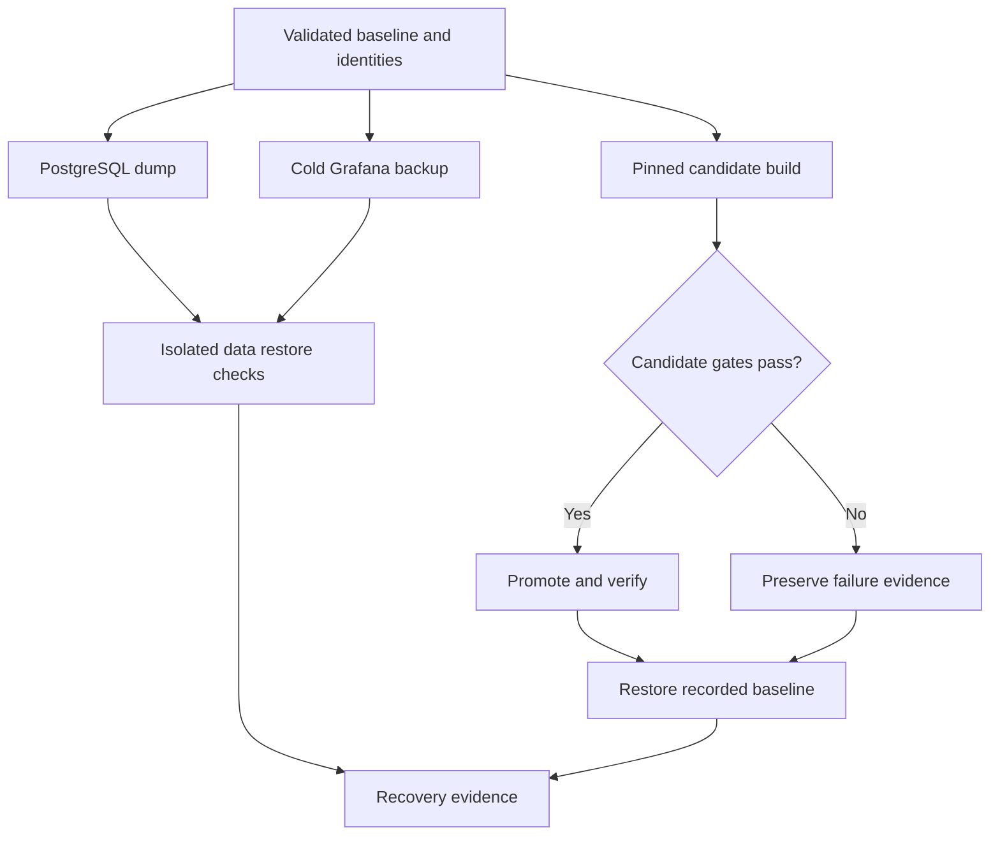

# Lab 49: Configuration Validation, Backup, Restore, Upgrade, and Rollback

## 1. Purpose and Learning Outcomes

**In Plain Language:** You will prove recovery rather than merely create backups. Validate the active configuration, capture identifiable source and data checkpoints, restore PostgreSQL and Grafana into isolated targets, and rehearse a small observable app release. Promotion and rollback use recorded image identities, with checks that business data and all telemetry paths still work afterward.

> **Primary Objective:** Automate configuration gates, restore protected state into isolated targets, rehearse a pinned application release and prove rollback with preserved change evidence.

A backup file and a successful container start are incomplete recovery evidence. This lab validates the active configuration, restores a PostgreSQL dump into a separate database, checks a cold Grafana backup, and promotes then rolls back a small application release.

All restore targets are new and lab-owned. The source database and live volumes are never overwritten. The upgrade changes application behavior and version metadata while keeping the database schema and dependency versions unchanged. Major database migrations, backend storage-format upgrades, unattended production deployment and a full disaster-recovery site are outside this exercise.

## 2. Starting Point and Lab Map

Use this guide inside the complete application repository. Run commands from the repository root in Bash unless a step says otherwise. Work through the starting checks in order; they load the helpers and state this lab needs.

Read the explanation before each step, run one complete code block at a time, and compare the actual result with the stated expectation. Save commands, observations, explanations, and unexpected results in your notebook.

### Key Terms

| **Term**             | **Plain-Language Meaning**                                                                            |
| -------------------- | ----------------------------------------------------------------------------------------------------- |
| Logical backup       | A database export that can reconstruct database objects and contents through supported restore tools. |
| Restore verification | Checking recovered content and application behavior in an isolated target.                            |
| Release identity     | The exact recorded image or version used for promotion and rollback.                                  |

### Lab Map

The arrows show the flow or dependency being studied. Branches identify paths to compare; this is a conceptual map, not a captured runtime trace.



## 3. Guided Walkthrough

### Step 01. Inherited State, Tools and Safety Boundaries

**What You Are Doing:** Verify the recovered platform and control other writers before checkpoint comparisons. The lab uses database tools inside the selected container and keeps protected backups separate from public evidence.

**Practical Walkthrough:** Verify the platform is recovered and control competing writers before comparing checkpoint fingerprints. Use the selected container's database tools as documented. Keep protected backup material separate from evidence intended for sharing, because a valid backup can contain application data and sensitive operational configuration.

Verify the recovered platform and control writers before fingerprint comparisons. Keep the protected backup location distinct from shareable evidence. Use the selected database tools as documented so the backup process matches the running server context without assuming a separately installed host client has compatible behavior.

```bash
source lab-notes/session.sh
source lab-notes/evidence.sh
source lab-notes/metrics-session.sh
source lab-notes/platform-session.sh
source lab-notes/traces-session.sh
source lab-notes/profiling/session.sh
load_app_settings
start_lab 49
umask 077
chmod 700 "$LAB_DIR"
wait_ready
wait_backend loki:3100 /ready
wait_backend tempo:3200 /ready
wait_backend pyroscope:4040 /ready
mkdir -p lab-notes/operations
TOKEN=$(python3 -c 'import uuid; print(uuid.uuid4().hex[:12])')
BACKUP_DIR="$LAB_ROOT/lab-notes/backups/lab49-backup-$TOKEN"
mkdir -p "$BACKUP_DIR"
chmod 700 "$BACKUP_DIR"
printf '%s\n' "$BACKUP_DIR" > "$LAB_DIR/backup-location.txt"
```

Complete [Lab 48](Lab-48.md). Stop unrelated load generators and external database writers. Use the current `dp` overlays, Python 3, jq, Docker and the existing PyYAML environment. `pg_dump`, `pg_restore`, `createdb` and `psql` run inside the pinned PostgreSQL 17 container; no host PostgreSQL installation is required.

Backups contain business data and potentially credentials in Grafana state. Owner-only permissions are a local safeguard, not encryption or off-host protection. Keep these artifacts outside Git, restrict access, and use approved encrypted storage for real recovery copies. Never attach a dump or `.env` to a public issue. Check `docker system df` and `df -h .` first: image archives, candidate images and database copies require additional free disk space.

**Understanding the Result:** A controlled checkpoint makes separate comparisons meaningful. It does not imply every backup method requires the app to be stopped.

### Step 02. Define Checkpoints Before Taking Action

**What You Are Doing:** Define success gates for configuration, backup, restore, promotion, and rollback before acting. Each gate needs an observable result rather than only a successful command exit.

**Practical Walkthrough:** Read the success gates before performing configuration, backup, restore, promotion, or rollback actions. Associate each gate with observable state, such as restored rows or a working API response. A command exiting successfully establishes only that command's result, not every later recovery requirement.

Read every success gate before taking its associated action. Match backup creation with restore proof, promotion with observed release behavior, and rollback with the recorded baseline identity. A successful command exit is one observation; the gate specifies the broader state that must be verified before proceeding.

| **Checkpoint**    | **Gate**                                           | **Evidence**                                  |
| ----------------- | -------------------------------------------------- | --------------------------------------------- |
| Configuration     | Active Compose and native validators pass          | Tool output and sanitized inventory           |
| Database backup   | Dump completes; quiesced fingerprints agree        | Dump, revision, row count and content hash    |
| Database restore  | Isolated restored state matches; API can read it   | Restore log and isolated readiness/CRUD read  |
| Grafana backup    | Service stopped before state copy                  | Cold archive and restored SQLite integrity    |
| Candidate release | Exact image ID, tests, readiness and behavior pass | Version/header, known row, change record      |
| Rollback          | Recorded baseline image and version restored       | Old behavior, same durable row, fresh signals |

**Prediction Checkpoint:** does `docker compose down -v` belong in a rollback? No: it destroys persistent state. Does rolling back an image undo a schema migration? No. Does a hash prove that a backup can be restored? No; both integrity checking and an actual restore are needed.

RPO describes acceptable data loss and RTO describes acceptable restoration time. Measure this rehearsal's elapsed times, but do not present them as production objectives without workload, size and failure-domain assumptions.

**Understanding the Result:** Define recovery evidence before creating the backup. This prevents archive existence from being mistaken for a tested restore.

### Step 03. Automate the Active Configuration Gates

**What You Are Doing:** Validate the configurations actually mounted into running services with their corresponding tools. Parsing YAML is a different assurance level from a service's own semantic validator.

**Practical Walkthrough:** Identify the files actually mounted into active services and validate them with the appropriate tools. YAML parsing checks document structure, while native validators understand service-specific fields and semantics. Keep validation scope explicit where a component lacks an equivalent full offline check.

Resolve mounted active configuration paths first, then run each appropriate native validator. Generic YAML parsing establishes structure but not every service-specific setting. Preserve validator output and scope so a passing parser is not presented as proof that an untested runtime or external dependency will work.

```bash
cat > lab-notes/operations/validate-platform.sh <<'BASH'
#!/usr/bin/env bash
set -euo pipefail
source lab-notes/session.sh
source lab-notes/evidence.sh
source lab-notes/metrics-session.sh
source lab-notes/platform-session.sh
source lab-notes/traces-session.sh
source lab-notes/profiling/session.sh
dp config --quiet
config_path() {
  local cid
  cid=$(dp ps -q "$1")
  test -n "$cid"
  docker inspect --format '{{json .Config.Cmd}}' "$cid" | python3 -c '
import json,sys
args=json.load(sys.stdin);flag=sys.argv[1];matches=[]
for n,arg in enumerate(args):
    if arg==flag:matches.append(args[n+1])
    elif arg.startswith(flag+"="):matches.append(arg.split("=",1)[1])
assert len(matches)==1 and matches[0].startswith("/"),(flag,"expected one absolute config path")
print(matches[0])' "$2"
}
prom_path=$(config_path prometheus --config.file)
am_path=$(config_path alertmanager --config.file)
otel_path=$(config_path otel-collector --config)
loki_path=$(config_path loki -config.file)
dp run --rm -T --no-deps --entrypoint promtool prometheus check config "$prom_path"
dp run --rm -T --no-deps --entrypoint amtool alertmanager check-config "$am_path"
dp run --rm -T --no-deps otel-collector validate "--config=$otel_path"
dp run --rm -T --no-deps loki "-config.file=$loki_path" -verify-config=true
lab-notes/.tools/bin/python - <<'PYTHON'
import json
from pathlib import Path
import yaml
count=0
for root in (Path('config'),Path('lab-notes/prometheus'),Path('lab-notes/tracing')):
    if not root.exists():continue
    for path in sorted(root.rglob('*')):
        if path.is_file() and path.suffix in ('.yaml','.yml','.json'):
            assert not path.is_symlink(),f'Review configuration symlink: {path}'
            if path.suffix=='.json':json.loads(path.read_text())
            else:list(yaml.safe_load_all(path.read_text()))
            count+=1
print(f'Parsed {count} YAML/JSON documents; runtime smoke tests remain required.')
PYTHON
BASH
```

**Command Note:** `<<'BASH'` writes the following block literally until `BASH`. Quoting the delimiter prevents Bash from expanding `$variables` inside the generated file; creation and execution are separate steps.

```bash
chmod +x lab-notes/operations/validate-platform.sh
set -o pipefail
bash lab-notes/operations/validate-platform.sh 2>&1 | tee "$LAB_DIR/config-validation.log"
make test 2>&1 | tee "$LAB_DIR/application-tests.log"
dp config --format json | python3 lab-notes/operations/security_inventory.py > "$LAB_DIR/config-inventory.json"
```

The validator discovers the running service's configuration path and uses the same service image and mounts. This avoids accidentally checking the original Prometheus file while the learning overlay uses another file. The command stops on the first failure.

The Collector, Prometheus, Alertmanager and Loki have the native checks shown. Generic YAML parsing for Tempo/Pyroscope and JSON parsing for Grafana check syntax only. Do not invent a universal `--validate` flag or claim that parsing proves every backend setting is supported. Exact-version startup checks, readiness and signal canaries complete those gates.

An expanded Compose file can contain secrets. The validation transcript uses quiet configuration checking and the allowlisted inventory from Lab 48, not a full environment dump.

**Understanding the Result:** Validate active inputs, not similarly named unused copies. Each tool provides a different level of assurance.

### Step 04. Archive Source, Configuration and Release Identity

**What You Are Doing:** Archive source and operational configuration with the exact release identity. Review the manifest and content classification so filenames alone do not decide whether a file is safe to share.

**Practical Walkthrough:** Archive source and operational configuration with the exact release identity and inspect the manifest. Classify contents by what they contain rather than by apparently harmless filenames. The archive must preserve enough identity to reproduce the baseline while keeping protected material out of public evidence.

Inspect the archive manifest and exact source/image identity before treating it as a reproducible checkpoint. Classify material by contents, not filename. Keep credentials and private run artifacts out of shareable configuration evidence while preserving the release information needed to select the correct baseline during rollback.

```bash
cat > lab-notes/operations/config_archive.py <<'PYTHON'
"""Archive reviewed source/configuration, excluding credentials and run artifacts."""
import argparse,hashlib,json,tarfile
from pathlib import Path
p=argparse.ArgumentParser();p.add_argument('output');a=p.parse_args()
root=Path.cwd();out=Path(a.output).resolve();assert not out.exists()
roots=['app','config','postgres','scripts','docs','Makefile','docker-compose.yml','.gitignore','.env.example','README.md','SECURITY.md']
files=set()
for name in roots:
    path=root/name
    if path.is_file():files.add(path)
    elif path.exists():files.update(p for p in path.rglob('*') if p.is_file())
notes=root/'lab-notes'
if notes.exists():
    files.update(p for p in notes.rglob('*') if p.is_file() and p.suffix in ('.py','.sh','.yaml','.yml','.json','.txt'))
exclude={'__pycache__','.pytest_cache','.ruff_cache','.venv','venv','.tools','evidence','backups','release','.git'}
selected=[]
for path in sorted(files):
    rel=path.relative_to(root)
    if any(part in exclude or part.startswith('lab49-backup-') for part in rel.parts):continue
    if path.name=='.env' or (path.name.startswith('.env.') and path.name!='.env.example'):continue
    # Only configuration/scripts in lab-notes, never dated evidence or notebooks.
    if rel.parts[0]=='lab-notes' and any(part.startswith('lab-') or part[:4].isdigit() for part in rel.parts[1:-1]):continue
    assert not path.is_symlink(),f'Review symlink before backup: {rel}'
    selected.append((path,rel))
with tarfile.open(out,'x:gz') as archive:
    for path,rel in selected:archive.add(path,arcname=str(rel),recursive=False)
manifest={str(rel):hashlib.sha256(path.read_bytes()).hexdigest() for path,rel in selected}
Path(str(out)+'.manifest.json').write_text(json.dumps(manifest,indent=2)+'\n')
print(json.dumps({'files':len(selected),'archive':str(out),'secrets_file_included':False}))
PYTHON
```

```bash
python3 lab-notes/operations/config_archive.py "$BACKUP_DIR/configuration.tar.gz"
BASE_IMAGE_ID=$(docker inspect --format '{{.Image}}' "$(dp ps -q app)")
BASE_VERSION=$(api -fsS "$APP_URL/openapi.json" | jq -er '.info.version')
BASE_TAG="lab49-app:baseline-$TOKEN"
docker image tag "$BASE_IMAGE_ID" "$BASE_TAG"
jq -n --arg image "$BASE_IMAGE_ID" --arg tag "$BASE_TAG" --arg version "$BASE_VERSION" \
  '{image_id:$image,local_tag:$tag,app_version:$version}' > "$BACKUP_DIR/baseline-release.json"
docker image save "$BASE_TAG" > "$BACKUP_DIR/baseline-image.tar"
python3 lab-notes/operations/change_event.py "$LAB_DIR/changes.jsonl" checkpoint app completed --reason "$BASE_IMAGE_ID"
```

**Command Note:** `jq --arg` passes a shell value as a JSON-query string variable without inserting it into the query text. Where used, `-e` turns a false or null final result into a failing exit status.

Review the archive manifest before copying it elsewhere. It excludes `.env`, tool environments, run evidence, backups and the candidate release workspace. It preserves source, migrations, provisioning, scripts and learning configuration. Custom files can still embed secrets despite an innocent filename; classification requires review.

Record secret-manager references and the recovery procedure separately. This archive intentionally cannot recreate credentials by itself. Preserve PostgreSQL role/owner bootstrap information and Grafana's configured encryption key through the secret-management process. Grafana datasource secrets encrypted with a custom `GF_SECURITY_SECRET_KEY` require that same key during restoration.

A local tag is a convenient name, not immutable identity. Record the content-addressed image ID and verify it before deployment. The image archive permits local recovery if its tag disappears; `docker image load -i` restores the saved artifact. Dependency lock files, base-image pins and release notes belong to the same checkpoint.

**Understanding the Result:** A filename or branch name is not an immutable release identifier. Retain the recorded image and source identities used by the procedure.

### Step 05. Make a Logical PostgreSQL Backup and Manifest

**What You Are Doing:** Create a consistent logical dump and compare fingerprints across the controlled checkpoint. The app pause aligns the separate comparisons; it is not a general requirement for `pg_dump` snapshots.

**Practical Walkthrough:** Create the logical dump and compare the controlled checkpoint fingerprints before and after as instructed. `pg_dump` supplies its own consistent snapshot; the temporary app pause aligns the separate state comparisons used by this exercise. Keep the dump and manifest together for the later restore test.

Check that the dump artifact and its manifest identify the same backup run, then retain the checkpoint fingerprint captured around that run. Keep command failure output separate from a successful backup claim: a filename existing on disk does not establish a complete dump. The next step must restore this exact artifact and compare the resulting data, rather than testing a different backup.

```bash
PAYLOAD=$(jq -n --arg name "lab49-checkpoint-$TOKEN" '{name:$name,price:"49.00"}')
python3 lab-notes/operations/request_probe.py "$APP_URL" /api/v1/items "$LAB_DIR/checkpoint-item.json" \
  --method POST --body "$PAYLOAD" --expect 201
ITEM_ID=$(jq -er '.response.id' "$LAB_DIR/checkpoint-item.json")
cat > lab-notes/operations/database-fingerprint.sql <<'SQL'
SELECT jsonb_build_object(
  'row_count', count(*),
  'rows_md5', md5(COALESCE(jsonb_agg(to_jsonb(i) ORDER BY id), '[]'::jsonb)::text),
  'alembic_revision', (SELECT version_num FROM alembic_version)
) FROM items AS i;
SQL
(
  set -euo pipefail
  trap 'dp start app >/dev/null' EXIT
  trap 'exit 130' INT
  trap 'exit 143' TERM
  dp stop -t 30 app
  dbsql -At < lab-notes/operations/database-fingerprint.sql > "$BACKUP_DIR/database-before.json"
  dp exec -T postgres sh -ec 'exec pg_dump -U postgres -d "$APP_DB_NAME" --format=custom --no-owner --no-acl' \
    > "$BACKUP_DIR/items.dump.partial"
  dbsql -At < lab-notes/operations/database-fingerprint.sql > "$BACKUP_DIR/database-after.json"
  diff -u "$BACKUP_DIR/database-before.json" "$BACKUP_DIR/database-after.json"
  mv "$BACKUP_DIR/items.dump.partial" "$BACKUP_DIR/items.dump"
)
wait_ready
python3 lab-notes/operations/change_event.py "$LAB_DIR/changes.jsonl" backup postgres completed --reason 'logical dump and quiesced state fingerprint'
```

**Command Note:** `trap ... EXIT` schedules cleanup when that shell exits. Keep it in the same block as the fault; the explicit recovery checks afterward confirm that restoration actually succeeded.

`pg_dump` takes a consistent logical snapshot even with concurrent writers. The brief app stop is used here so a separate before/after fingerprint describes the same state as the dump. It is not a requirement of `pg_dump`, and it does not stop other clients you may have introduced. Any fingerprint mismatch invalidates this checkpoint until writers are controlled and the backup is repeated in a new directory.

The dump contains database objects and data, not cluster-wide role credentials. `--no-owner --no-acl` supports restoration under the known application role. The fingerprint's MD5 is a compact equality check for this lab, not a cryptographic authenticity claim. The archive hashes generated later use SHA-256.

**Understanding the Result:** Do not generalize the pause into a requirement for every logical dump. Its role here is comparison consistency.

### Step 06. Restore to a New Database and Verify Content

**What You Are Doing:** Restore into a new database and verify revision, rows, content, and an actual API read. The isolated app namespace prevents an old cache entry from masquerading as restored database content.

**Practical Walkthrough:** Restore into the new isolated database and verify migration revision, row counts, content fingerprints, and an actual API read. Use the distinct app namespace so cached data from the original environment cannot satisfy the read accidentally. This tests restored data through the application's real access path.

Confirm the restore destination is the new database before executing restoration. Compare revision, counts, fingerprints, and an API read using the distinct namespace. That namespace prevents an old cached response from satisfying the test without accessing the restored database contents.

```bash
RESTORE_DB="lab49_restore_$TOKEN"
dp exec -T -e RESTORE_DB="$RESTORE_DB" postgres sh -ec \
  'exec createdb -U postgres -O "$APP_DB_USER" "$RESTORE_DB"'
dp exec -T -e RESTORE_DB="$RESTORE_DB" postgres sh -ec \
  'exec pg_restore -U postgres -d "$RESTORE_DB" --role="$APP_DB_USER" --no-owner --no-acl --exit-on-error --single-transaction' \
  < "$BACKUP_DIR/items.dump" > "$LAB_DIR/restore.log" 2>&1
dp exec -T -e RESTORE_DB="$RESTORE_DB" postgres sh -ec \
  'exec psql -X -v ON_ERROR_STOP=1 -At -U postgres -d "$RESTORE_DB"' \
  < lab-notes/operations/database-fingerprint.sql > "$LAB_DIR/restored-database.json"
diff -u "$BACKUP_DIR/database-before.json" "$LAB_DIR/restored-database.json"
CLONE_NAME="lab49-restore-app-$TOKEN"
dp run -d --no-deps --name "$CLONE_NAME" \
  -e POSTGRES_DB="$RESTORE_DB" -e SERVICE_NAME=lab49-restore \
  -e OTEL_ENABLED=false -e PYROSCOPE_ENABLED=false app > "$LAB_DIR/restore-app-id.txt"
RESTORE_OK=0
for attempt in {1..45}; do
  if docker exec "$CLONE_NAME" python -c \
    'import json,urllib.request; r=json.load(urllib.request.urlopen("http://127.0.0.1:8000/health/ready",timeout=3)); assert r["status"]=="ready"' \
    > /dev/null 2>&1; then RESTORE_OK=1; break; fi
  sleep 1
done
test "$RESTORE_OK" -eq 1
docker exec -e ITEM_ID="$ITEM_ID" "$CLONE_NAME" python -c \
  'import json,os,urllib.request; r=json.load(urllib.request.urlopen("http://127.0.0.1:8000/api/v1/items/"+os.environ["ITEM_ID"],timeout=5)); assert r["price"]=="49.00"; print(json.dumps(r))' \
  > "$LAB_DIR/restored-api-item.json"
docker rm -f "$CLONE_NAME"
case "$RESTORE_DB" in lab49_restore_*) ;; *) printf '%s\n' 'Unexpected restore target'; false;; esac
dp exec -T -e RESTORE_DB="$RESTORE_DB" postgres sh -ec 'exec dropdb -U postgres "$RESTORE_DB"'
```

The restored application's unique service name gives it a separate Redis key namespace, so a cache hit from the original app cannot fake database recovery. It publishes no host ports. Readiness, migration revision, every row's content hash and an actual API read provide different checks.

If a step fails, preserve its transcript, remove only the uniquely named temporary app, and investigate the isolated database. Do not drop the source database to “start fresh.” `--single-transaction` makes a restore failure atomic within the target, but it cannot repair an incompatible schema or missing required extension.

**Understanding the Result:** A successful restore command is only one gate. Content and uncached application access establish useful recovery.

### Step 07. Back Up Grafana State Cold and Test the Archive

**What You Are Doing:** Stop Grafana for its state copy and test the archive using a separate restore volume. Inspect the restored database and application state rather than treating archive creation as recovery proof.

**Practical Walkthrough:** Stop Grafana for the cold state copy, then test that archive in a separate restore volume. Inspect restored database and application state before declaring success. Keep the original volume intact so the verification cannot overwrite the working instance it is meant to protect.

Identify the original Grafana volume and stop its owner before the cold copy. Test the archive in the separate restore volume, preserving the original. Inspect restored application state as well as archive readability; a file that opens successfully does not by itself prove usable Grafana recovery.

```bash
GRAFANA_VOLUME=$(docker inspect --format '{{range .Mounts}}{{if eq .Destination "/var/lib/grafana"}}{{.Name}}{{end}}{{end}}' "$(dp ps -q grafana)")
test -n "$GRAFANA_VOLUME"
HELPER_IMAGE=busybox:1.37.0-musl
docker image inspect "$HELPER_IMAGE" >/dev/null 2>&1 || docker pull "$HELPER_IMAGE"
(
  set -euo pipefail
  trap 'dp start grafana >/dev/null' EXIT
  trap 'exit 130' INT
  trap 'exit 143' TERM
  dp stop -t 30 grafana
  docker run --rm --network none --read-only --user 10001:10001 --cap-drop ALL \
    --security-opt no-new-privileges:true -v "$GRAFANA_VOLUME:/source:ro" "$HELPER_IMAGE" \
    tar -C /source -czf - . > "$BACKUP_DIR/grafana-data.tar.gz.partial"
  mv "$BACKUP_DIR/grafana-data.tar.gz.partial" "$BACKUP_DIR/grafana-data.tar.gz"
)
wait_grafana
RESTORE_VOLUME="lab49-grafana-restore-$TOKEN"
docker volume create --label learning.lab=49 --label "learning.run=$TOKEN" "$RESTORE_VOLUME" > /dev/null
docker run --rm --network none --read-only --user 0:0 --cap-drop ALL --cap-add CHOWN \
  --security-opt no-new-privileges:true -v "$RESTORE_VOLUME:/restore" "$HELPER_IMAGE" chown 10001:10001 /restore
docker run --rm -i --network none --read-only --user 10001:10001 --cap-drop ALL \
  --security-opt no-new-privileges:true -v "$RESTORE_VOLUME:/restore" "$HELPER_IMAGE" \
  tar -C /restore -xzf - < "$BACKUP_DIR/grafana-data.tar.gz"
docker run --rm --network none --read-only --user 10001:10001 --cap-drop ALL \
  --security-opt no-new-privileges:true -v "$RESTORE_VOLUME:/restore" --entrypoint python "$BASE_IMAGE_ID" -c \
  'import sqlite3; c=sqlite3.connect("/restore/grafana.db"); assert c.execute("PRAGMA integrity_check").fetchone()[0]=="ok"; print({"dashboards":c.execute("SELECT count(*) FROM dashboard").fetchone()[0]})' \
  > "$LAB_DIR/grafana-restore-check.txt"
docker volume rm "$RESTORE_VOLUME"
```

Grafana is stopped before copying its SQLite database and related state. The helper is a short-lived, pinned utility container, not another platform service. It runs without a network or host directory mounts; the brief root operation only prepares the new restore volume's ownership.

The SQLite check opens only the writable restore copy, allowing SQLite to process any copied WAL safely. It verifies structural integrity and the dashboard table. It does not validate every encrypted datasource credential or Grafana migration. A full Grafana upgrade drill also starts the target version against a separate restored copy with the correct encryption key. Never run two Grafana versions simultaneously against the same SQLite volume.

| **State**              | **Recovery Approach for This Stack**                                                         |
| ---------------------- | -------------------------------------------------------------------------------------------- |
| PostgreSQL             | Tested logical dump plus role/secret bootstrap; larger systems may need physical backup/PITR |
| Grafana                | Provisioning plus stopped-service state backup and encryption-key custody                    |
| Redis                  | Rebuild cache from PostgreSQL; avoid restoring stale cached rows as authoritative data       |
| Prometheus             | Supported snapshot or clean shutdown copy with exact-version compatibility checks            |
| Loki, Tempo, Pyroscope | Coordinated clean shutdown/cold volume copy or documented backend backup procedure           |
| Alertmanager           | Configuration plus silences/notification state according to operational needs                |
| Collector              | Config and deliberate queue recovery policy; queue copy is not complete telemetry history    |

Do not copy live database directories with a generic tar command and call them consistent backups. Recovery of several backends at a single global instant is a different coordination problem.

**Understanding the Result:** Archive creation and restore usability are separate claims. Isolation preserves the original while proving the copy.

### Step 08. Build a Small Pinned Application Upgrade

**What You Are Doing:** Build a pinned candidate that adds a visible version header while preserving the baseline. The isolated candidate allows review and testing without overwriting the rollback source.

**Practical Walkthrough:** Build the pinned candidate in its isolated source context and verify the visible version header. Preserve the baseline source and image identity for rollback. The candidate changes observable release behavior, allowing later gates to prove which version actually serves requests.

Build the candidate from its isolated source context and retain exact baseline and candidate identities. Verify the new visible header after deployment rather than assuming a successful build proves the running version. Keeping the baseline unchanged makes the subsequent rollback comparison concrete and reproducible.

```bash
RELEASE_ROOT="$LAB_ROOT/lab-notes/operations/release/$TOKEN"
mkdir -p "$RELEASE_ROOT"
python3 - "$RELEASE_ROOT" <<'PYTHON'
import shutil,sys
from pathlib import Path
out=Path(sys.argv[1])/'app'
shutil.copytree('app',out,ignore=shutil.ignore_patterns('__pycache__','.pytest_cache','.ruff_cache','.venv','venv','.env'))
PYTHON
```

```bash
cat > "$RELEASE_ROOT/app/app/release_header.py" <<'PYTHON'
"""Small, observable application release change; no database schema change."""
from starlette.types import ASGIApp, Message, Receive, Scope, Send


class ReleaseHeaderMiddleware:
    def __init__(self, app: ASGIApp, version: str) -> None:
        self.app = app
        self.version = version.encode('ascii')

    async def __call__(self, scope: Scope, receive: Receive, send: Send) -> None:
        if scope['type'] != 'http':
            await self.app(scope, receive, send)
            return

        async def send_with_version(message: Message) -> None:
            if message['type'] == 'http.response.start':
                message = dict(message)
                headers = [(key, value) for key, value in message.get('headers', [])
                           if key.lower() != b'x-app-version']
                message['headers'] = [*headers, (b'x-app-version', self.version)]
            await send(message)

        await self.app(scope, receive, send_with_version)
PYTHON
```

```bash
python3 - "$RELEASE_ROOT/app/app/main.py" <<'PYTHON'
from pathlib import Path
import sys
p=Path(sys.argv[1]);text=p.read_text()
needle='    telemetry.instrument(app, database, cache)'
assert text.count(needle)==1,'Expected the inherited app instrumentation point'
text=text.replace(needle,'    from app.release_header import ReleaseHeaderMiddleware\n    app.add_middleware(ReleaseHeaderMiddleware, version=settings.app_version)\n'+needle)
p.write_text(text)
PYTHON
CANDIDATE_TAG="lab49-app:candidate-$TOKEN"
CANDIDATE_VERSION=1.0.1
test "$BASE_VERSION" != "$CANDIDATE_VERSION"
docker build --target test -t "lab49-tests:$TOKEN" "$RELEASE_ROOT/app"
docker run --rm --network none "lab49-tests:$TOKEN" > "$LAB_DIR/candidate-tests.log" 2>&1
docker build --target runtime -t "$CANDIDATE_TAG" "$RELEASE_ROOT/app"
CANDIDATE_ID=$(docker image inspect --format '{{.Id}}' "$CANDIDATE_TAG")
jq -n --arg image "$CANDIDATE_ID" --arg tag "$CANDIDATE_TAG" --arg version "$CANDIDATE_VERSION" \
  '{image_id:$image,local_tag:$tag,app_version:$version}' > "$BACKUP_DIR/candidate-release.json"
```

The candidate adds `X-App-Version` through a small ASGI middleware and sets the release version through typed configuration. The original application source and baseline image stay intact. The new header is observable behavior; this is more than relabeling the same image. The runtime packages, Python base and schema remain pinned to the inherited versions.

The candidate test image exercises the copied source. Review its test transcript before promotion. If your inherited baseline already uses version 1.0.1, choose a different explicit local patch version and record that decision; do not silently reuse the baseline version.

**Understanding the Result:** A successful build does not prove deployment. The response header and recorded image identity provide runtime release evidence.

### Step 09. Promote, Verify and Roll Back by Recorded Identity

**What You Are Doing:** Promote the recorded candidate, run its gates, and roll back by the recorded baseline identity. If a gate fails, restore immediately and preserve the failure evidence.

**Practical Walkthrough:** Promote the recorded candidate, execute its gates, then roll back using the recorded baseline identity. If a gate fails, restore immediately through the prepared path and retain the failure evidence. Do not substitute a moving tag for the exact baseline when proving rollback.

At each gate, compare three concrete observations: the container's image identity, the application's visible release behavior, and a useful request result. After rollback, all three must agree with the recorded baseline, while the durable checkpoint remains readable. If only the tag or configuration file changed, inspect the running container before recording a successful return to the earlier release.

```bash
cat > lab-notes/operations/compose.release.yaml <<'YAML'
services:
  app:
    image: ${LAB_RELEASE_IMAGE:?Select the recorded release image}
    build: !reset null
    environment:
      APP_VERSION: ${LAB_RELEASE_VERSION:?Select the release version}
YAML
drelease() { dp -f "$LAB_ROOT/lab-notes/operations/compose.release.yaml" "$@"; }
export LAB_RELEASE_IMAGE="$CANDIDATE_TAG" LAB_RELEASE_VERSION="$CANDIDATE_VERSION"
test "$(docker image inspect --format '{{.Id}}' "$LAB_RELEASE_IMAGE")" = "$CANDIDATE_ID"
drelease config --quiet
python3 lab-notes/operations/change_event.py "$LAB_DIR/changes.jsonl" promote app intended --reason "$CANDIDATE_ID"
drelease up -d --no-deps --no-build --pull never app
wait_ready
test "$(docker inspect --format '{{.Image}}' "$(dp ps -q app)")" = "$CANDIDATE_ID"
api -fsS -D "$LAB_DIR/candidate-headers.txt" "$APP_URL/health/live" > "$LAB_DIR/candidate-live.json"
python3 - "$LAB_DIR/candidate-headers.txt" "$CANDIDATE_VERSION" <<'PYTHON'
from pathlib import Path
import sys
headers=Path(sys.argv[1]).read_text().lower()
assert ('x-app-version: '+sys.argv[2]) in headers
PYTHON
api -fsS "$APP_URL/openapi.json" | jq -e --arg version "$CANDIDATE_VERSION" '.info.version==$version'
rcli DEL "$(cache_key "$ITEM_ID")" > /dev/null
api -fsS "$APP_URL/api/v1/items/$ITEM_ID" > "$LAB_DIR/candidate-item.json"
jq -e '.price=="49.00"' "$LAB_DIR/candidate-item.json"
python3 lab-notes/operations/change_event.py "$LAB_DIR/changes.jsonl" promote app verified --reason 'version header, readiness and durable item checked'
export LAB_RELEASE_IMAGE="$BASE_TAG" LAB_RELEASE_VERSION="$BASE_VERSION"
test "$(docker image inspect --format '{{.Id}}' "$LAB_RELEASE_IMAGE")" = "$BASE_IMAGE_ID"
drelease config --quiet
drelease up -d --no-deps --no-build --pull never app
wait_ready
test "$(docker inspect --format '{{.Image}}' "$(dp ps -q app)")" = "$BASE_IMAGE_ID"
api -fsS -D "$LAB_DIR/rollback-headers.txt" "$APP_URL/health/live" > "$LAB_DIR/rollback-live.json"
python3 - "$LAB_DIR/rollback-headers.txt" <<'PYTHON'
from pathlib import Path
import sys
assert 'x-app-version:' not in Path(sys.argv[1]).read_text().lower()
PYTHON
api -fsS "$APP_URL/openapi.json" | jq -e --arg version "$BASE_VERSION" '.info.version==$version'
rcli DEL "$(cache_key "$ITEM_ID")" > /dev/null
api -fsS "$APP_URL/api/v1/items/$ITEM_ID" > "$LAB_DIR/rollback-item.json"
jq -e '.price=="49.00"' "$LAB_DIR/rollback-item.json"
python3 lab-notes/operations/change_event.py "$LAB_DIR/changes.jsonl" rollback app verified --reason "$BASE_IMAGE_ID"
unset LAB_RELEASE_IMAGE LAB_RELEASE_VERSION
unset -f drelease
```

If a candidate gate fails, run the baseline export, identity check and `drelease up` block immediately, then capture the failure evidence. Do not proceed as if promotion succeeded. The override is deliberately not added to the persistent `dp` overlay list. After rollback the standard composition and original source remain the default for later labs.

Process counters reset when the app is replaced; rate functions handle resets, but record the deployment window. `service.version` distinguishes releases in traces, while business IDs persist in PostgreSQL. No Alembic downgrade is involved because this release did not migrate the schema.

For a future backend or database upgrade, first read exact-version release notes, verify storage and migration compatibility, restore a backup into an isolated target, and test forward and backward behavior. An old image may be unable to read storage rewritten by a new version. In that case rollback requires a compatible restore and an explicit data-loss decision; an image switch alone is unsafe.

**Understanding the Result:** Rollback is verified by active behavior and identity, not only by a deployment command completing. Keep promotion and restoration evidence together.

### Step 10. Complete the Recovery Proof and Protect the Checkpoint

**What You Are Doing:** Verify business, storage, and all four signals after rollback. Keep the proven checkpoint protected and remove only the temporary restore targets whose checks are complete.

**Practical Walkthrough:** After rollback, verify business reads and writes, persistent state, targets, and fresh logs, traces, metrics, and profiles. Retain the proven protected checkpoint and remove only temporary restore resources whose tests are complete. Confirm the original release is active before the capstone begins.

Verify the original release is active and perform fresh business, storage, target, and telemetry checks. Retain the proven protected backup and remove only completed temporary restore resources. Current rollback success and successful backup restoration are distinct achievements, so preserve evidence for both before the capstone.

```bash
python3 lab-notes/profiling/profile_load.py "$APP_URL" "$LAB_DIR/rollback-canary.jsonl" \
  --variant cpu --count 12 --iterations 3000000
sleep 20
TRACE_ID=$(jq -rs '.[0].response.trace_id' "$LAB_DIR/rollback-canary.jsonl")
fetch_trace "$TRACE_ID" "$LAB_DIR/rollback-trace.json"
python3 lab-notes/operations/request_probe.py "$APP_URL" "/api/v1/items/$ITEM_ID" "$LAB_DIR/checkpoint-delete.json" \
  --method DELETE --expect 204
bash lab-notes/operations/validate-platform.sh > "$LAB_DIR/final-validation.log" 2>&1
wait_ready
wait_grafana
pq 'up' > "$LAB_DIR/final-targets.json"
python3 - "$BACKUP_DIR" <<'PYTHON'
import hashlib,json,sys
from pathlib import Path
root=Path(sys.argv[1]);hashes={}
for path in sorted(root.iterdir()):
    if path.is_file() and path.name!='sha256.json':
        h=hashlib.sha256()
        with path.open('rb') as f:
            for chunk in iter(lambda:f.read(1048576),b''):h.update(chunk)
        hashes[path.name]=h.hexdigest()
(root/'sha256.json').write_text(json.dumps(hashes,indent=2)+'\n')
print('Checkpoint hashes written; keep the trusted manifest separately for tamper detection.')
PYTHON
```

Use Lab 47's known-ID Loki query and fresh profile query on the rollback canary. Confirm that all four signals resumed, not just that Tempo returned a trace. Keep the backup and evidence; delete temporary restore containers/databases/volumes only after their checks. Do not prune images or volumes as an automatic final step.

| **Failure**                     | **Investigation**                                                                            |
| ------------------------------- | -------------------------------------------------------------------------------------------- |
| Validator checks a missing file | Compare running command, overlay mount and native binary version                             |
| Dump is empty or partial        | Check exit status and disk space; never rename an unsuccessful partial dump                  |
| Restore permission error        | Verify database owner and existing application role; preserve original ACL policy separately |
| Fingerprints differ             | Look for concurrent writers, timezone differences or a different source database             |
| Grafana SQLite check fails      | Verify clean shutdown and a complete archive; do not repair the live database blindly        |
| Candidate fails readiness       | Roll back recorded image/version, inspect safe errors, then diagnose offline                 |
| Rollback cannot read data       | Stop; reassess schema/storage compatibility and restore strategy                             |

References: [PostgreSQL logical backups](https://www.postgresql.org/docs/17/backup-dump.html), [pg_restore](https://www.postgresql.org/docs/17/app-pgrestore.html), [Grafana backup](https://grafana.com/docs/grafana/latest/administration/back-up-grafana/), and [Compose merge/reset rules](https://docs.docker.com/reference/compose-file/merge/).

**Understanding the Result:** Recovery includes both data and useful service behavior. A restored version label alone cannot prove all signal paths and storage checks passed.

## 4. Troubleshooting and Diagnosis

Start with the first unexpected result. Record the exact symptom, identify which component produced it, and use the checks below before repeating the experiment. After a fix, repeat the original check and confirm recovery.

Use the recovery and troubleshooting checks in Step 10.

## 5. Review and Practice

Answer the knowledge questions in your own words before reading the answer guide. For the scenario, name the evidence you would collect and the conclusion each observation would support.

### Knowledge Check

1. Why stop writers if pg_dump already takes a consistent snapshot?
2. Why is the clone service name different?
3. Why preserve a Grafana encryption key separately?
4. When is image rollback insufficient?

#### Answer Guide

1. This drill compares separately collected fingerprints with the dump; quiescence makes those measurements comparable.
2. It prevents original-service cache entries from falsely proving the restored database works.
3. Encrypted datasource secrets may be unreadable without the key used to encrypt them.
4. When a schema/storage change is incompatible, data was transformed, or the old version cannot safely read the new state.

### Professional Scenario Exercise

A patch deploys successfully but breaks an important read path. Write a five-step decision record that names the baseline image, the schema compatibility gate, the restoration checkpoint, the user-impact window and the recovery evidence. Explain what would change if the release had performed an irreversible migration.

## 6. Completion Checklist

Mark each item only after you can point to its result or evidence file. Complete any cleanup shown here before moving on.

### Observable Completion Criteria

- [ ] Active native configuration checks and application tests pass.
- [ ] Configuration/image identity and protected backups are preserved.
- [ ] A separate PostgreSQL restore matches the full fingerprint and serves an API read.
- [ ] A cold Grafana copy restores into a new volume with SQLite integrity checked.
- [ ] A real candidate image changes version/header behavior and passes gates.
- [ ] Rollback restores the recorded baseline image and preserves durable data.
- [ ] Temporary restore targets are removed and fresh telemetry is verified.

## 7. Production Context and Next Lab

### Production Implications

Production backup programs need scheduled tested restores, retention, encryption, off-host copies, access control and measured recovery objectives. Release safety also needs provenance, approvals and schema compatibility strategy. This single-node rehearsal establishes repeatable evidence; it does not provide redundant storage or automatic failover.

### End State and Transition

The original application image/version is running, schema and data remain intact, restore targets are removed and protected checkpoints are retained. Lab 50 uses these operating habits in a multi-fault game day and evidence-based postmortem.
