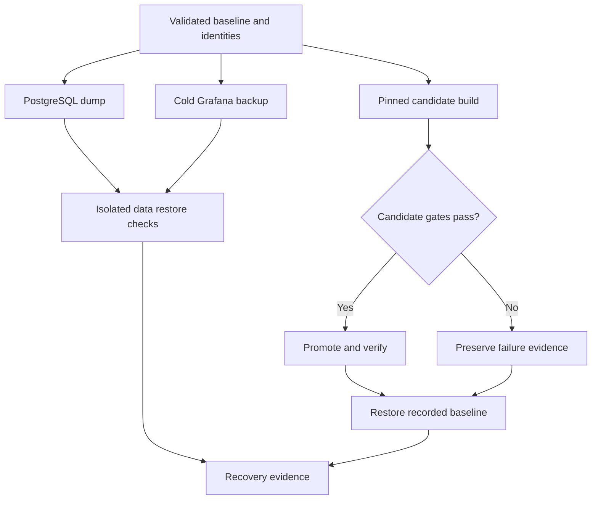

# Lab 49: Configuration Validation, Backup, Restore, Upgrade, and Rollback

## 1. Purpose and Learning Outcomes

You will show that recovery works, rather than only creating backup files. First validate the active configuration and save identifiable copies of the source and data. Then restore PostgreSQL and Grafana into separate targets and rehearse a small application release with a visible behavior change. Use recorded image identities for deployment and rollback, and check afterward that business data and every telemetry path still work.

> **Primary Objective:** Automate configuration checks, restore protected data into separate test targets, deploy a candidate application image with a fixed identity, and prove that rollback works while keeping evidence of each change.

A backup file alone does not prove that you can recover, and a container starting does not prove that the application works. In this lab, you will validate the active configuration, restore a PostgreSQL dump into a separate database, check a Grafana backup made while Grafana was stopped, and deploy then roll back a small application release.

Create new restore targets that belong only to this lab. Never overwrite the source database or live volumes. The application release changes behavior and version information while leaving the database schema and dependency versions unchanged. This exercise does not cover major database migrations, backend storage-format upgrades, unattended production deployment, or building a complete disaster-recovery site.

## 2. Starting Point and Lab Map

Open the complete application repository before using this guide. Unless a step says otherwise, run commands in Bash from the repository's top-level folder. Follow the starting checks in order because later commands depend on the helper functions and running services they prepare.

Read each explanation before running its commands. Run one complete code block, check the result, and then continue. In your notebook, save the commands, what happened, why you think it happened, and anything that differed from the expected result.

### Key Terms

| **Term**             | **Explanation**                                                                                       |
| -------------------- | ----------------------------------------------------------------------------------------------------- |
| Logical backup       | An export of database objects and data that supported restore tools can use to rebuild them.          |
| Restore verification | Checking that recovered data is correct and the application can use it in a separate test target.     |
| Release identity     | The exact recorded image or version selected for deployment and rollback.                             |

### Lab Map

The arrows show how the parts connect and where a request can take different paths. Use this map to understand the design. It is not a recording of a request that actually ran.



## 3. Guided Walkthrough

### Step 01. Inherited State, Tools and Safety Boundaries

**What You Are Doing:** Confirm that the platform has recovered and stop unrelated writes before comparing saved data checks. Use the tools in the selected database container, and keep protected backups separate from evidence you may share.

**Practical Walkthrough:** Check that the platform is healthy and control other processes that could change the data during checkpoint comparisons. Use the database tools in the specified container. Store backups separately from shareable evidence because they may contain business data and sensitive operational settings.

Verify the recovered platform, then control other writers before comparing data fingerprints. These fingerprints summarize the state you want to recover. Keep backups in a protected location separate from shareable evidence. Use the documented tools inside the database container so you do not depend on a host-installed client with different behavior or compatibility.

```bash
source lab-notes/session.sh
source lab-notes/evidence.sh
source lab-notes/metrics-session.sh
source lab-notes/platform-session.sh
source lab-notes/traces-session.sh
source lab-notes/profiling/session.sh
load_app_settings
start_lab 49
umask 077
chmod 700 "$LAB_DIR"
wait_ready
wait_backend loki:3100 /ready
wait_backend tempo:3200 /ready
wait_backend pyroscope:4040 /ready
mkdir -p lab-notes/operations
TOKEN=$(python3 -c 'import uuid; print(uuid.uuid4().hex[:12])')
BACKUP_DIR="$LAB_ROOT/lab-notes/backups/lab49-backup-$TOKEN"
mkdir -p "$BACKUP_DIR"
chmod 700 "$BACKUP_DIR"
printf '%s\n' "$BACKUP_DIR" > "$LAB_DIR/backup-location.txt"
```

Complete [Lab 48](Lab-48.md). Stop unrelated load generators and external clients that write to the database. Use the current `dp` overlays, Python 3, jq, Docker, and the existing PyYAML environment. The tools `pg_dump`, `pg_restore`, `createdb`, and `psql` run inside the pinned PostgreSQL 17 container, so you do not need to install PostgreSQL on the host.

Backups contain business data, and Grafana state may also contain credentials. Owner-only file permissions limit local access, but they do not encrypt the backup or protect against losing the host. Keep these files out of Git, restrict access, and use approved encrypted storage for real recovery copies. Never attach a dump or `.env` to a public issue. First check `docker system df` and `df -h .`, because image archives, candidate images, and database copies need extra disk space.

**Understanding the Result:** Controlling changes to the data lets you compare separately collected checkpoints fairly. This does not mean that every backup method requires stopping the application.

### Step 02. Define Checkpoints Before Taking Action

**What You Are Doing:** Decide what must pass before configuration validation, backup, restore, deployment, or rollback is considered successful. Each checkpoint needs an observable result beyond a command returning success.

**Practical Walkthrough:** Read the success checks before starting each action. Link each check to a result you can inspect, such as restored rows or a successful API response. A command's successful exit confirms that command completed; it does not prove that all recovery requirements have been met.

For each action, read its success criteria first. A backup needs an actual restore test, a deployment needs evidence of the new behavior, and rollback needs the recorded baseline identity. Use command exit status as one piece of evidence, then verify the wider state listed in the checkpoint before continuing.

| **Checkpoint**    | **Gate**                                                                        | **Evidence**                                                     |
| ----------------- | ------------------------------------------------------------------------------- | ---------------------------------------------------------------- |
| Configuration     | The active Compose configuration and service-specific checks pass               | Validation output and an inventory with sensitive values removed |
| Database backup   | The dump finishes and fingerprints match while writes are paused                | Dump, migration revision, row count, and content hash            |
| Database restore  | The separate restore matches the source checkpoint and supports an API read     | Restore log, isolated readiness result, and CRUD read            |
| Grafana backup    | Grafana is stopped before its state is copied                                   | Cold backup archive and restored SQLite integrity result         |
| Candidate release | The exact image is recorded, tests pass, and readiness and behavior are correct | Version/header result, known row, and change record              |
| Rollback          | The recorded baseline image and version are active again                        | Original behavior, the same durable row, and fresh telemetry     |

**Prediction Checkpoint:** Should rollback include `docker compose down -v`? No. It deletes persistent state. Does returning to an old image undo a database schema migration? No. Does a matching hash prove that a backup can be restored? No. Check file integrity and perform an actual restore.

RPO is the amount of data loss you can accept, and RTO is the time you can accept for restoration. Measure how long this rehearsal takes. Do not treat those measurements as production targets without stating the workload, data size, and kinds of failures they assume.

**Understanding the Result:** Define the recovery evidence before taking a backup. This keeps a backup file's existence from being confused with proof that its contents can be restored and used.

### Step 03. Automate the Active Configuration Gates

**What You Are Doing:** Validate the configuration files that running services actually use, with the right tools for each service. A YAML parser checks document structure; a service's own validator can also check settings and their meaning.

**Practical Walkthrough:** Find the configuration files mounted into the active services, then run the appropriate checks. YAML parsing checks syntax and structure. Native validators can check service-specific options as well. Where a service has no equivalent complete offline check, state exactly what your validation covers.

First find the active mounted configuration paths, then run the relevant service-specific validators. A general YAML parser does not know whether every setting is supported by the service. Save the validator output and record the limits of each check. Passing a parser does not prove that runtime behavior or external dependencies will work.

```bash
cat > lab-notes/operations/validate-platform.sh <<'BASH'
#!/usr/bin/env bash
set -euo pipefail
source lab-notes/session.sh
source lab-notes/evidence.sh
source lab-notes/metrics-session.sh
source lab-notes/platform-session.sh
source lab-notes/traces-session.sh
source lab-notes/profiling/session.sh
dp config --quiet
config_path() {
  local cid
  cid=$(dp ps -q "$1")
  test -n "$cid"
  docker inspect --format '{{json .Config.Cmd}}' "$cid" | python3 -c '
import json,sys
args=json.load(sys.stdin);flag=sys.argv[1];matches=[]
for n,arg in enumerate(args):
    if arg==flag:matches.append(args[n+1])
    elif arg.startswith(flag+"="):matches.append(arg.split("=",1)[1])
assert len(matches)==1 and matches[0].startswith("/"),(flag,"expected one absolute config path")
print(matches[0])' "$2"
}
prom_path=$(config_path prometheus --config.file)
am_path=$(config_path alertmanager --config.file)
otel_path=$(config_path otel-collector --config)
loki_path=$(config_path loki -config.file)
dp run --rm -T --no-deps --entrypoint promtool prometheus check config "$prom_path"
dp run --rm -T --no-deps --entrypoint amtool alertmanager check-config "$am_path"
dp run --rm -T --no-deps otel-collector validate "--config=$otel_path"
dp run --rm -T --no-deps loki "-config.file=$loki_path" -verify-config=true
lab-notes/.tools/bin/python - <<'PYTHON'
import json
from pathlib import Path
import yaml
count=0
for root in (Path('config'),Path('lab-notes/prometheus'),Path('lab-notes/tracing')):
    if not root.exists():continue
    for path in sorted(root.rglob('*')):
        if path.is_file() and path.suffix in ('.yaml','.yml','.json'):
            assert not path.is_symlink(),f'Review configuration symlink: {path}'
            if path.suffix=='.json':json.loads(path.read_text())
            else:list(yaml.safe_load_all(path.read_text()))
            count+=1
print(f'Parsed {count} YAML/JSON documents; runtime smoke tests remain required.')
PYTHON
BASH
```

**Command Note:** `<<'BASH'` writes the following text into a file until the closing `BASH` line. The quoted delimiter prevents Bash from replacing `$variables` inside that text. Creating the file and executing it are separate actions.

```bash
chmod +x lab-notes/operations/validate-platform.sh
set -o pipefail
bash lab-notes/operations/validate-platform.sh 2>&1 | tee "$LAB_DIR/config-validation.log"
make test 2>&1 | tee "$LAB_DIR/application-tests.log"
dp config --format json | python3 lab-notes/operations/security_inventory.py > "$LAB_DIR/config-inventory.json"
```

The validator finds the configuration path used by the running service and checks it with the same image and mounts. This avoids checking an old Prometheus file when the learning overlay uses a different one. The command stops as soon as a check fails.

The supplied native checks apply to the Collector, Prometheus, Alertmanager, and Loki. General YAML parsing for Tempo and Pyroscope, and JSON parsing for Grafana, check syntax only. Do not assume that every service has a `--validate` flag or that parsing confirms support for every option. Complete those checks by starting the exact version, verifying readiness, and sending small test workloads that produce fresh signals.

Expanded Compose output may contain secrets. The validation record therefore uses a quiet configuration check and Lab 48's inventory of approved fields. It does not save a full environment dump.

**Understanding the Result:** Check the files that services actually use, rather than unused files with similar names. Record what each validation tool can and cannot prove.

### Step 04. Archive Source, Configuration and Release Identity

**What You Are Doing:** Save the source and operational configuration together with the exact release identity. Review the archive's file list and contents, because an ordinary-looking filename can still contain sensitive information.

**Practical Walkthrough:** Create an archive of source and operational configuration, record the exact release identity, and inspect its manifest. Decide how to protect files based on their contents. Preserve enough information to reproduce the baseline while keeping protected material out of evidence intended for sharing.

Before calling the archive a reproducible checkpoint, inspect its manifest and confirm the source and image identities. Review what files contain rather than judging them by name. Keep credentials and private run artifacts out of shareable configuration evidence, while retaining the release information needed to select the right baseline for rollback.

```bash
cat > lab-notes/operations/config_archive.py <<'PYTHON'
"""Archive reviewed source/configuration, excluding credentials and run artifacts."""
import argparse,hashlib,json,tarfile
from pathlib import Path
p=argparse.ArgumentParser();p.add_argument('output');a=p.parse_args()
root=Path.cwd();out=Path(a.output).resolve();assert not out.exists()
roots=['app','config','postgres','scripts','docs','Makefile','docker-compose.yml','.gitignore','.env.example','README.md','SECURITY.md']
files=set()
for name in roots:
    path=root/name
    if path.is_file():files.add(path)
    elif path.exists():files.update(p for p in path.rglob('*') if p.is_file())
notes=root/'lab-notes'
if notes.exists():
    files.update(p for p in notes.rglob('*') if p.is_file() and p.suffix in ('.py','.sh','.yaml','.yml','.json','.txt'))
exclude={'__pycache__','.pytest_cache','.ruff_cache','.venv','venv','.tools','evidence','backups','release','.git'}
selected=[]
for path in sorted(files):
    rel=path.relative_to(root)
    if any(part in exclude or part.startswith('lab49-backup-') for part in rel.parts):continue
    if path.name=='.env' or (path.name.startswith('.env.') and path.name!='.env.example'):continue
    # Only configuration/scripts in lab-notes, never dated evidence or notebooks.
    if rel.parts[0]=='lab-notes' and any(part.startswith('lab-') or part[:4].isdigit() for part in rel.parts[1:-1]):continue
    assert not path.is_symlink(),f'Review symlink before backup: {rel}'
    selected.append((path,rel))
with tarfile.open(out,'x:gz') as archive:
    for path,rel in selected:archive.add(path,arcname=str(rel),recursive=False)
manifest={str(rel):hashlib.sha256(path.read_bytes()).hexdigest() for path,rel in selected}
Path(str(out)+'.manifest.json').write_text(json.dumps(manifest,indent=2)+'\n')
print(json.dumps({'files':len(selected),'archive':str(out),'secrets_file_included':False}))
PYTHON
```

```bash
python3 lab-notes/operations/config_archive.py "$BACKUP_DIR/configuration.tar.gz"
BASE_IMAGE_ID=$(docker inspect --format '{{.Image}}' "$(dp ps -q app)")
BASE_VERSION=$(api -fsS "$APP_URL/openapi.json" | jq -er '.info.version')
BASE_TAG="lab49-app:baseline-$TOKEN"
docker image tag "$BASE_IMAGE_ID" "$BASE_TAG"
jq -n --arg image "$BASE_IMAGE_ID" --arg tag "$BASE_TAG" --arg version "$BASE_VERSION" \
  '{image_id:$image,local_tag:$tag,app_version:$version}' > "$BACKUP_DIR/baseline-release.json"
docker image save "$BASE_TAG" > "$BACKUP_DIR/baseline-image.tar"
python3 lab-notes/operations/change_event.py "$LAB_DIR/changes.jsonl" checkpoint app completed --reason "$BASE_IMAGE_ID"
```

**Command Note:** `jq --arg` passes a shell value into a JSON query as a string variable without inserting it into the query text. When used, `-e` makes a false or null final result return a failing exit status.

Review the archive's file list before copying it elsewhere. It excludes `.env`, tool environments, run evidence, backups, and the candidate release workspace. It keeps source code, migrations, provisioning, scripts, and learning configuration. Custom files may still contain secrets even when their names look harmless, so inspect their contents before deciding where the archive can be shared.

Record secret-manager references and the credential recovery procedure separately. This archive deliberately does not contain everything needed to recreate credentials. Use the secret-management process to preserve the information needed to recreate PostgreSQL roles and ownership, along with Grafana's configured encryption key. Datasource secrets encrypted using a custom `GF_SECURITY_SECRET_KEY` need that same key during restoration.

A local tag is a convenient label and can change which image it points to. Record the image ID derived from its contents and verify it before deployment. If the tag is lost, the image archive lets you recover the saved image locally with `docker image load -i`. Keep dependency lock files, pinned base-image references, and release notes with the same checkpoint.

**Understanding the Result:** A filename or branch name can change and does not uniquely identify an unchanged release. Keep the exact source and image identities that this procedure uses.

### Step 05. Make a Logical PostgreSQL Backup and Manifest

**What You Are Doing:** Create a consistent logical database dump and compare fingerprints from the controlled checkpoint. The app is paused to keep those separate comparisons aligned; `pg_dump` does not generally require that pause to take a consistent snapshot.

**Practical Walkthrough:** Create the logical dump, then compare the before-and-after checkpoint fingerprints as instructed. `pg_dump` creates its own consistent snapshot. This exercise briefly pauses the app so the separately collected fingerprints describe the same data. Keep the dump and its manifest together for the restore test.

Check that the dump and manifest refer to the same backup run, and keep the fingerprint collected for that checkpoint. Save errors when a command fails; a file appearing on disk does not prove that the dump finished. In the next step, restore this exact backup and compare its data, rather than testing a different artifact.

```bash
PAYLOAD=$(jq -n --arg name "lab49-checkpoint-$TOKEN" '{name:$name,price:"49.00"}')
python3 lab-notes/operations/request_probe.py "$APP_URL" /api/v1/items "$LAB_DIR/checkpoint-item.json" \
  --method POST --body "$PAYLOAD" --expect 201
ITEM_ID=$(jq -er '.response.id' "$LAB_DIR/checkpoint-item.json")
cat > lab-notes/operations/database-fingerprint.sql <<'SQL'
SELECT jsonb_build_object(
  'row_count', count(*),
  'rows_md5', md5(COALESCE(jsonb_agg(to_jsonb(i) ORDER BY id), '[]'::jsonb)::text),
  'alembic_revision', (SELECT version_num FROM alembic_version)
) FROM items AS i;
SQL
(
  set -euo pipefail
  trap 'dp start app >/dev/null' EXIT
  trap 'exit 130' INT
  trap 'exit 143' TERM
  dp stop -t 30 app
  dbsql -At < lab-notes/operations/database-fingerprint.sql > "$BACKUP_DIR/database-before.json"
  dp exec -T postgres sh -ec 'exec pg_dump -U postgres -d "$APP_DB_NAME" --format=custom --no-owner --no-acl' \
    > "$BACKUP_DIR/items.dump.partial"
  dbsql -At < lab-notes/operations/database-fingerprint.sql > "$BACKUP_DIR/database-after.json"
  diff -u "$BACKUP_DIR/database-before.json" "$BACKUP_DIR/database-after.json"
  mv "$BACKUP_DIR/items.dump.partial" "$BACKUP_DIR/items.dump"
)
wait_ready
python3 lab-notes/operations/change_event.py "$LAB_DIR/changes.jsonl" backup postgres completed --reason 'logical dump and quiesced state fingerprint'
```

**Command Note:** `trap ... EXIT` schedules cleanup when the current shell exits. Keep it in the same block as the fault. The explicit recovery checks afterward are still needed to confirm that restoration worked.

`pg_dump` can take a consistent logical snapshot while other clients are writing. Here, the app stops briefly so the separate before-and-after fingerprints match the state captured by the dump. This pause is not required by `pg_dump`, and it does not stop any other clients you added. If fingerprints differ, the checkpoint is invalid. Control the remaining writers and repeat the backup in a new directory.

The dump includes database objects and data, but it does not include cluster-wide role credentials. The flags `--no-owner --no-acl` let the restore use the known application role. The fingerprint uses MD5 as a compact way to compare data in this lab; it does not prove that the data came from a trusted source. The archive hashes created later use SHA-256.

**Understanding the Result:** The pause keeps this lab's separate data comparisons consistent. It is not a rule that every logical database dump requires application downtime.

### Step 06. Restore to a New Database and Verify Content

**What You Are Doing:** Restore into a new database and check the migration revision, rows, contents, and a real API read. Give the test app its own namespace so an old cache entry cannot make the database restore appear successful.

**Practical Walkthrough:** Restore the dump into the separate database. Compare its migration revision, row counts, and content fingerprints, then read data through the API. The separate app namespace prevents the original environment's cached data from answering the request. This checks the restored data through the application's normal access path.

Confirm that the destination is the new database before starting the restore. Check its revision, counts, fingerprints, and an API read with the distinct app namespace. This prevents an old cached response from passing the test without reading the restored database.

```bash
RESTORE_DB="lab49_restore_$TOKEN"
dp exec -T -e RESTORE_DB="$RESTORE_DB" postgres sh -ec \
  'exec createdb -U postgres -O "$APP_DB_USER" "$RESTORE_DB"'
dp exec -T -e RESTORE_DB="$RESTORE_DB" postgres sh -ec \
  'exec pg_restore -U postgres -d "$RESTORE_DB" --role="$APP_DB_USER" --no-owner --no-acl --exit-on-error --single-transaction' \
  < "$BACKUP_DIR/items.dump" > "$LAB_DIR/restore.log" 2>&1
dp exec -T -e RESTORE_DB="$RESTORE_DB" postgres sh -ec \
  'exec psql -X -v ON_ERROR_STOP=1 -At -U postgres -d "$RESTORE_DB"' \
  < lab-notes/operations/database-fingerprint.sql > "$LAB_DIR/restored-database.json"
diff -u "$BACKUP_DIR/database-before.json" "$LAB_DIR/restored-database.json"
CLONE_NAME="lab49-restore-app-$TOKEN"
dp run -d --no-deps --name "$CLONE_NAME" \
  -e POSTGRES_DB="$RESTORE_DB" -e SERVICE_NAME=lab49-restore \
  -e OTEL_ENABLED=false -e PYROSCOPE_ENABLED=false app > "$LAB_DIR/restore-app-id.txt"
RESTORE_OK=0
for attempt in {1..45}; do
  if docker exec "$CLONE_NAME" python -c \
    'import json,urllib.request; r=json.load(urllib.request.urlopen("http://127.0.0.1:8000/health/ready",timeout=3)); assert r["status"]=="ready"' \
    > /dev/null 2>&1; then RESTORE_OK=1; break; fi
  sleep 1
done
test "$RESTORE_OK" -eq 1
docker exec -e ITEM_ID="$ITEM_ID" "$CLONE_NAME" python -c \
  'import json,os,urllib.request; r=json.load(urllib.request.urlopen("http://127.0.0.1:8000/api/v1/items/"+os.environ["ITEM_ID"],timeout=5)); assert r["price"]=="49.00"; print(json.dumps(r))' \
  > "$LAB_DIR/restored-api-item.json"
docker rm -f "$CLONE_NAME"
case "$RESTORE_DB" in lab49_restore_*) ;; *) printf '%s\n' 'Unexpected restore target'; false;; esac
dp exec -T -e RESTORE_DB="$RESTORE_DB" postgres sh -ec 'exec dropdb -U postgres "$RESTORE_DB"'
```

The restored app has a unique service name, which gives it a separate Redis key namespace. It therefore cannot reuse the original app's cached data to make recovery appear successful. It exposes no host ports. Check readiness, migration revision, hashes of every row's contents, and a real API read; each checks a different part of recovery.

If a step fails, save its output, remove only the temporary app with the unique name, and investigate the separate restore database. Never delete the source database to start again. `--single-transaction` keeps a failed restore from leaving partial changes in its target, but it cannot fix an incompatible schema or supply a missing extension.

**Understanding the Result:** A successful restore command is one checkpoint. Matching content and an application read that cannot use the original cache show that the restored data is useful.

### Step 07. Back Up Grafana State Cold and Test the Archive

**What You Are Doing:** Stop Grafana before copying its state, then test the backup in a separate restore volume. Check the restored database and application state instead of treating archive creation alone as proof of recovery.

**Practical Walkthrough:** Stop Grafana, copy its state, and restore the archive into a new volume. Check the restored database and application state before declaring success. Leave the original volume intact so the test cannot overwrite the working instance it is meant to protect.

Identify Grafana's original volume and stop the service that owns it before making the cold copy. Restore the archive into the separate test volume, leaving the original untouched. Check the recovered application state as well as whether the archive opens. A readable archive alone does not prove usable recovery.

```bash
GRAFANA_VOLUME=$(docker inspect --format '{{range .Mounts}}{{if eq .Destination "/var/lib/grafana"}}{{.Name}}{{end}}{{end}}' "$(dp ps -q grafana)")
test -n "$GRAFANA_VOLUME"
HELPER_IMAGE=busybox:1.37.0-musl
docker image inspect "$HELPER_IMAGE" >/dev/null 2>&1 || docker pull "$HELPER_IMAGE"
(
  set -euo pipefail
  trap 'dp start grafana >/dev/null' EXIT
  trap 'exit 130' INT
  trap 'exit 143' TERM
  dp stop -t 30 grafana
  docker run --rm --network none --read-only --user 10001:10001 --cap-drop ALL \
    --security-opt no-new-privileges:true -v "$GRAFANA_VOLUME:/source:ro" "$HELPER_IMAGE" \
    tar -C /source -czf - . > "$BACKUP_DIR/grafana-data.tar.gz.partial"
  mv "$BACKUP_DIR/grafana-data.tar.gz.partial" "$BACKUP_DIR/grafana-data.tar.gz"
)
wait_grafana
RESTORE_VOLUME="lab49-grafana-restore-$TOKEN"
docker volume create --label learning.lab=49 --label "learning.run=$TOKEN" "$RESTORE_VOLUME" > /dev/null
docker run --rm --network none --read-only --user 0:0 --cap-drop ALL --cap-add CHOWN \
  --security-opt no-new-privileges:true -v "$RESTORE_VOLUME:/restore" "$HELPER_IMAGE" chown 10001:10001 /restore
docker run --rm -i --network none --read-only --user 10001:10001 --cap-drop ALL \
  --security-opt no-new-privileges:true -v "$RESTORE_VOLUME:/restore" "$HELPER_IMAGE" \
  tar -C /restore -xzf - < "$BACKUP_DIR/grafana-data.tar.gz"
docker run --rm --network none --read-only --user 10001:10001 --cap-drop ALL \
  --security-opt no-new-privileges:true -v "$RESTORE_VOLUME:/restore" --entrypoint python "$BASE_IMAGE_ID" -c \
  'import sqlite3; c=sqlite3.connect("/restore/grafana.db"); assert c.execute("PRAGMA integrity_check").fetchone()[0]=="ok"; print({"dashboards":c.execute("SELECT count(*) FROM dashboard").fetchone()[0]})' \
  > "$LAB_DIR/grafana-restore-check.txt"
docker volume rm "$RESTORE_VOLUME"
```

Stop Grafana before copying its SQLite database and related state. The helper is a temporary utility container with a pinned version, rather than another permanent platform service. It has no network access or host directory mounts. Its brief root operation only sets ownership on the new restore volume.

The SQLite check opens the writable restored copy only, so SQLite can safely process any copied write-ahead log. The check verifies database structure and the dashboard table. It does not test every encrypted datasource credential or Grafana migration. A complete Grafana upgrade rehearsal must also start the target version against a separate restored copy using the correct encryption key. Never run two Grafana versions at the same time against the same SQLite volume.

| **State**              | **Recovery Approach for This Stack**                                                                                        |
| ---------------------- | --------------------------------------------------------------------------------------------------------------------------- |
| PostgreSQL             | Verify a logical restore and preserve role/secret setup; larger systems may need physical backups or point-in-time recovery |
| Grafana                | Preserve provisioning, copy state while Grafana is stopped, and protect the required encryption key                         |
| Redis                  | Rebuild the cache from PostgreSQL; do not treat old cached rows as the authoritative data                                   |
| Prometheus             | Use a supported snapshot or copy after a clean shutdown, then check compatibility with the exact version                    |
| Loki, Tempo, Pyroscope | Coordinate a clean shutdown and cold volume copy, or follow the backend's documented backup procedure                       |
| Alertmanager           | Preserve configuration and any silence or notification state required for operations                                        |
| Collector              | Preserve configuration and decide how to recover queues; a queue copy is not a complete telemetry history                   |

Copying a live database directory with a general tar command does not establish that the backup is consistent. Recovering several backends to the same instant is a separate problem that requires coordination across them.

**Understanding the Result:** Creating an archive and proving that its restore is usable are different checks. A separate target lets you test the copy while preserving the original.

### Step 08. Build a Small Pinned Application Upgrade

**What You Are Doing:** Build a candidate image with a fixed identity that adds a visible version header. Keep its source separate so you can review and test it while preserving the baseline needed for rollback.

**Practical Walkthrough:** Build the candidate from its separate source directory and check the new version header. Retain the original source and baseline image identity. The header gives you a visible behavior change that later checks can use to identify which release is serving requests.

Build from the isolated candidate source and record the exact identities of both images. After deployment, verify the new header in an actual response; a completed build does not show which version is running. Keeping the baseline intact makes rollback testable and repeatable.

```bash
RELEASE_ROOT="$LAB_ROOT/lab-notes/operations/release/$TOKEN"
mkdir -p "$RELEASE_ROOT"
python3 - "$RELEASE_ROOT" <<'PYTHON'
import shutil,sys
from pathlib import Path
out=Path(sys.argv[1])/'app'
shutil.copytree('app',out,ignore=shutil.ignore_patterns('__pycache__','.pytest_cache','.ruff_cache','.venv','venv','.env'))
PYTHON
```

```bash
cat > "$RELEASE_ROOT/app/app/release_header.py" <<'PYTHON'
"""Small, observable application release change; no database schema change."""
from starlette.types import ASGIApp, Message, Receive, Scope, Send


class ReleaseHeaderMiddleware:
    def __init__(self, app: ASGIApp, version: str) -> None:
        self.app = app
        self.version = version.encode('ascii')

    async def __call__(self, scope: Scope, receive: Receive, send: Send) -> None:
        if scope['type'] != 'http':
            await self.app(scope, receive, send)
            return

        async def send_with_version(message: Message) -> None:
            if message['type'] == 'http.response.start':
                message = dict(message)
                headers = [(key, value) for key, value in message.get('headers', [])
                           if key.lower() != b'x-app-version']
                message['headers'] = [*headers, (b'x-app-version', self.version)]
            await send(message)

        await self.app(scope, receive, send_with_version)
PYTHON
```

```bash
python3 - "$RELEASE_ROOT/app/app/main.py" <<'PYTHON'
from pathlib import Path
import sys
p=Path(sys.argv[1]);text=p.read_text()
needle='    telemetry.instrument(app, database, cache)'
assert text.count(needle)==1,'Expected the inherited app instrumentation point'
text=text.replace(needle,'    from app.release_header import ReleaseHeaderMiddleware\n    app.add_middleware(ReleaseHeaderMiddleware, version=settings.app_version)\n'+needle)
p.write_text(text)
PYTHON
CANDIDATE_TAG="lab49-app:candidate-$TOKEN"
CANDIDATE_VERSION=1.0.1
test "$BASE_VERSION" != "$CANDIDATE_VERSION"
docker build --target test -t "lab49-tests:$TOKEN" "$RELEASE_ROOT/app"
docker run --rm --network none "lab49-tests:$TOKEN" > "$LAB_DIR/candidate-tests.log" 2>&1
docker build --target runtime -t "$CANDIDATE_TAG" "$RELEASE_ROOT/app"
CANDIDATE_ID=$(docker image inspect --format '{{.Id}}' "$CANDIDATE_TAG")
jq -n --arg image "$CANDIDATE_ID" --arg tag "$CANDIDATE_TAG" --arg version "$CANDIDATE_VERSION" \
  '{image_id:$image,local_tag:$tag,app_version:$version}' > "$BACKUP_DIR/candidate-release.json"
```

The candidate adds `X-App-Version` using a small ASGI middleware and sets the release version through typed configuration. The original application source and baseline image remain intact. The new response header changes visible behavior, so the candidate does more than rename the same image. Runtime packages, the Python base image, and the schema keep their existing pinned versions.

The candidate test image runs checks against the copied source. Review the test output before deployment. If the existing baseline already uses version 1.0.1, choose and record a different explicit local patch version. Do not give the candidate the same version as the baseline without saying so.

**Understanding the Result:** Building an image does not prove that it was deployed. Check the response header and the running container's recorded image identity to confirm the release.

### Step 09. Promote, Verify and Roll Back by Recorded Identity

**What You Are Doing:** Deploy the recorded candidate, run its success checks, and return to the recorded baseline image. If any check fails, restore the baseline immediately and keep the failure evidence.

**Practical Walkthrough:** Deploy the candidate whose identity you recorded, run the required checks, then roll back to the exact baseline. If a check fails, use the prepared recovery path immediately and save the evidence. Use the recorded baseline identity rather than a tag that could point to a different image.

At every checkpoint, compare the container's image identity, the application's visible release behavior, and a useful request result. After rollback, all three should agree with the baseline, and the saved durable row should still be readable. If you changed only a tag or configuration file, inspect the running container before claiming that the old release is active again.

```bash
cat > lab-notes/operations/compose.release.yaml <<'YAML'
services:
  app:
    image: ${LAB_RELEASE_IMAGE:?Select the recorded release image}
    build: !reset null
    environment:
      APP_VERSION: ${LAB_RELEASE_VERSION:?Select the release version}
YAML
drelease() { dp -f "$LAB_ROOT/lab-notes/operations/compose.release.yaml" "$@"; }
export LAB_RELEASE_IMAGE="$CANDIDATE_TAG" LAB_RELEASE_VERSION="$CANDIDATE_VERSION"
test "$(docker image inspect --format '{{.Id}}' "$LAB_RELEASE_IMAGE")" = "$CANDIDATE_ID"
drelease config --quiet
python3 lab-notes/operations/change_event.py "$LAB_DIR/changes.jsonl" promote app intended --reason "$CANDIDATE_ID"
drelease up -d --no-deps --no-build --pull never app
wait_ready
test "$(docker inspect --format '{{.Image}}' "$(dp ps -q app)")" = "$CANDIDATE_ID"
api -fsS -D "$LAB_DIR/candidate-headers.txt" "$APP_URL/health/live" > "$LAB_DIR/candidate-live.json"
python3 - "$LAB_DIR/candidate-headers.txt" "$CANDIDATE_VERSION" <<'PYTHON'
from pathlib import Path
import sys
headers=Path(sys.argv[1]).read_text().lower()
assert ('x-app-version: '+sys.argv[2]) in headers
PYTHON
api -fsS "$APP_URL/openapi.json" | jq -e --arg version "$CANDIDATE_VERSION" '.info.version==$version'
rcli DEL "$(cache_key "$ITEM_ID")" > /dev/null
api -fsS "$APP_URL/api/v1/items/$ITEM_ID" > "$LAB_DIR/candidate-item.json"
jq -e '.price=="49.00"' "$LAB_DIR/candidate-item.json"
python3 lab-notes/operations/change_event.py "$LAB_DIR/changes.jsonl" promote app verified --reason 'version header, readiness and durable item checked'
export LAB_RELEASE_IMAGE="$BASE_TAG" LAB_RELEASE_VERSION="$BASE_VERSION"
test "$(docker image inspect --format '{{.Id}}' "$LAB_RELEASE_IMAGE")" = "$BASE_IMAGE_ID"
drelease config --quiet
drelease up -d --no-deps --no-build --pull never app
wait_ready
test "$(docker inspect --format '{{.Image}}' "$(dp ps -q app)")" = "$BASE_IMAGE_ID"
api -fsS -D "$LAB_DIR/rollback-headers.txt" "$APP_URL/health/live" > "$LAB_DIR/rollback-live.json"
python3 - "$LAB_DIR/rollback-headers.txt" <<'PYTHON'
from pathlib import Path
import sys
assert 'x-app-version:' not in Path(sys.argv[1]).read_text().lower()
PYTHON
api -fsS "$APP_URL/openapi.json" | jq -e --arg version "$BASE_VERSION" '.info.version==$version'
rcli DEL "$(cache_key "$ITEM_ID")" > /dev/null
api -fsS "$APP_URL/api/v1/items/$ITEM_ID" > "$LAB_DIR/rollback-item.json"
jq -e '.price=="49.00"' "$LAB_DIR/rollback-item.json"
python3 lab-notes/operations/change_event.py "$LAB_DIR/changes.jsonl" rollback app verified --reason "$BASE_IMAGE_ID"
unset LAB_RELEASE_IMAGE LAB_RELEASE_VERSION
unset -f drelease
```

If a candidate check fails, immediately run the baseline export, identity check, and `drelease up` block, then save the failure evidence. Record the promotion as failed. This release override is intentionally left out of the persistent `dp` overlay list. After rollback, later labs continue with the standard composition and original source by default.

Replacing the app resets its process counters. Rate functions account for resets, but you should still record the deployment time window. Traces use `service.version` to distinguish releases, while business IDs remain stored in PostgreSQL. No Alembic downgrade is needed because this release did not change the schema.

Before a future backend or database upgrade, read the release notes for the exact versions and check storage and migration compatibility. Restore a backup into a separate target and test both the new version and the return path. An old image may not understand storage rewritten by the new version. If that happens, rollback needs a compatible restore and an explicit decision about possible data loss; changing the image alone is unsafe.

**Understanding the Result:** Confirm rollback through the running image and observed behavior, rather than only a completed deployment command. Keep the evidence for deployment and restoration together.

### Step 10. Complete the Recovery Proof and Protect the Checkpoint

**What You Are Doing:** After rollback, check business operations, stored data, and all four telemetry signals. Protect the verified backup and remove only the temporary restore targets whose checks are finished.

**Practical Walkthrough:** Verify business reads and writes, persistent data, scrape targets, and fresh logs, traces, metrics, and profiles after rollback. Keep the protected backup that passed its restore test. Remove only temporary resources whose checks are complete, and confirm that the original release is running before the capstone.

Confirm that the original release is active, then perform fresh business, storage, target, and telemetry checks. Keep the tested backup protected and remove only finished temporary restore resources. Proving rollback works and proving a backup can be restored are separate achievements. Save evidence of both for the capstone.

```bash
python3 lab-notes/profiling/profile_load.py "$APP_URL" "$LAB_DIR/rollback-canary.jsonl" \
  --variant cpu --count 12 --iterations 3000000
sleep 20
TRACE_ID=$(jq -rs '.[0].response.trace_id' "$LAB_DIR/rollback-canary.jsonl")
fetch_trace "$TRACE_ID" "$LAB_DIR/rollback-trace.json"
python3 lab-notes/operations/request_probe.py "$APP_URL" "/api/v1/items/$ITEM_ID" "$LAB_DIR/checkpoint-delete.json" \
  --method DELETE --expect 204
bash lab-notes/operations/validate-platform.sh > "$LAB_DIR/final-validation.log" 2>&1
wait_ready
wait_grafana
pq 'up' > "$LAB_DIR/final-targets.json"
python3 - "$BACKUP_DIR" <<'PYTHON'
import hashlib,json,sys
from pathlib import Path
root=Path(sys.argv[1]);hashes={}
for path in sorted(root.iterdir()):
    if path.is_file() and path.name!='sha256.json':
        h=hashlib.sha256()
        with path.open('rb') as f:
            for chunk in iter(lambda:f.read(1048576),b''):h.update(chunk)
        hashes[path.name]=h.hexdigest()
(root/'sha256.json').write_text(json.dumps(hashes,indent=2)+'\n')
print('Checkpoint hashes written; keep the trusted manifest separately for tamper detection.')
PYTHON
```

Run Lab 47's Loki query with a known ID and its fresh profile query for the rollback test request. Confirm that logs, traces, metrics, and profiles all work again; finding a trace in Tempo is only one check. Keep the backup and evidence. Remove temporary restore containers, databases, and volumes only after their checks are complete. Do not automatically prune images or volumes at the end.

| **Failure**                     | **Investigation**                                                                                              |
| ------------------------------- | -------------------------------------------------------------------------------------------------------------- |
| Validator checks a missing file | Compare the running command, the overlay's mount, and the version of the service's validation tool             |
| Dump is empty or partial        | Check the exit status and free disk space; do not rename a failed partial dump as a completed backup           |
| Restore permission error        | Check the database owner and existing application role; preserve the original access-control policy separately |
| Fingerprints differ             | Check for other writers, different timezone settings, or selection of the wrong source database                |
| Grafana SQLite check fails      | Confirm a clean shutdown and complete archive; investigate before attempting any repair of the live database   |
| Candidate fails readiness       | Restore the recorded image and version, inspect errors without exposing secrets, then diagnose offline         |
| Rollback cannot read data       | Stop and review schema/storage compatibility and the restore plan                                              |

References: Consult [PostgreSQL logical backups](https://www.postgresql.org/docs/17/backup-dump.html), [pg_restore](https://www.postgresql.org/docs/17/app-pgrestore.html), [Grafana backup](https://grafana.com/docs/grafana/latest/administration/back-up-grafana/), and [Compose merge/reset rules](https://docs.docker.com/reference/compose-file/merge/) for the backup, restore, and configuration behavior used in this lab.

**Understanding the Result:** Recovery must restore usable data and service behavior. Seeing the old version label again does not prove that storage and every telemetry path have passed their checks.

## 4. Troubleshooting and Diagnosis

Begin with the first result that differed from your prediction. Save the exact error or symptom and identify which service or command produced it. Use the checks below, make the needed fix, and repeat the original check to confirm the problem is resolved.

Use the recovery and troubleshooting checks listed in Step 10 to investigate any remaining problems.

## 5. Review and Practice

Answer the questions in your own words before reading the answers. For the scenario, say what you would inspect and exactly what each result would tell you.

### Knowledge Check

1. Why stop writers if pg_dump already takes a consistent snapshot?
2. Why is the clone service name different?
3. Why preserve a Grafana encryption key separately?
4. When is image rollback insufficient?

#### Answer Guide

1. The drill compares fingerprints collected at different moments with the dump. Pausing writers keeps the data unchanged so those comparisons are meaningful.
2. A different service name gives the clone its own cache namespace. This prevents the original app's cached data from falsely proving that the restored database works.
3. Grafana may be unable to read encrypted datasource credentials without the key originally used to encrypt them.
4. An image rollback is not enough if schema or storage changes are incompatible, data was transformed, or the old version cannot safely read the new state.

### Professional Scenario Exercise

A patch deploys but breaks an important read operation. Write a five-step decision record covering the baseline image, the schema compatibility check, the restore checkpoint, the period when users were affected, and the evidence of recovery. Explain how your decision would change if the release had made an irreversible database migration.

## 6. Completion Checklist

Tick an item only when you can show its result or saved evidence. Finish the cleanup instructions before starting the next lab.

### Observable Completion Criteria

- [ ] The service-specific checks for active configuration and the application tests pass.
- [ ] The configuration, exact image identity, and protected backups are preserved.
- [ ] A separate PostgreSQL restore matches the complete fingerprint and supports an API read.
- [ ] A Grafana backup made while the service was stopped has been restored into a new volume, and its SQLite integrity was checked.
- [ ] The candidate image changes the version/header behavior and passes every required check.
- [ ] Rollback returns to the recorded baseline image while keeping durable data intact.
- [ ] Temporary restore targets are removed, and fresh telemetry has been verified.

## 7. Production Context and Next Lab

### Production Implications

A production backup program needs regularly tested restores, retention rules, encryption, copies stored away from the host, access controls, and measured recovery targets. Safe releases also need evidence of where artifacts came from, approvals, and a plan for schema compatibility. This single-node rehearsal gives you repeatable recovery evidence. It does not add redundant storage or automatic failover.

### End State and Transition

Leave the original application image and version running, with schema and data intact. Remove the temporary restore targets and retain the protected checkpoints. In Lab 50, you will use these operating practices during a game day with several faults and write a postmortem based on the evidence.
