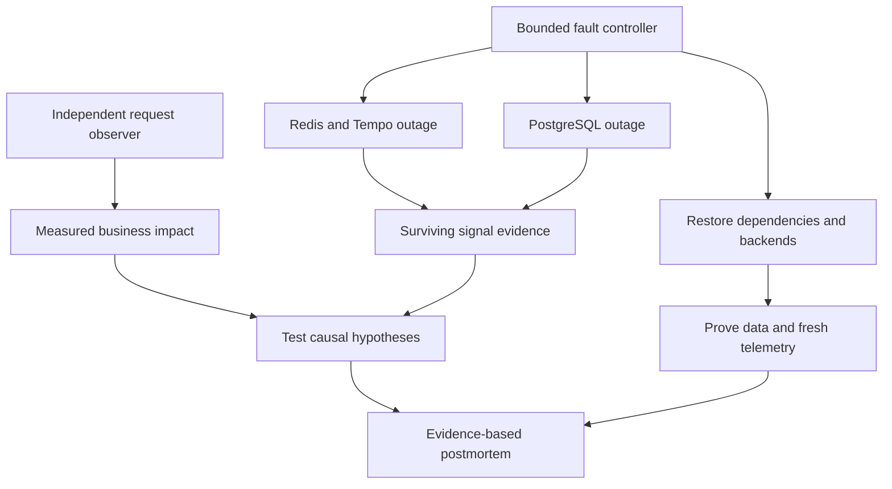

# Lab 50: Capstone Reliability Game Day and Evidence-Based Postmortem

## 1. Purpose and Learning Outcomes

**In Plain Language:** You will run a bounded game day that combines cache degradation, loss of trace visibility, and a required-database outage. One role controls faults while the other investigates from surviving evidence and an independent request ledger. Finish by proving business and telemetry recovery, then write a postmortem that clearly separates measured impact, supported causes, and remaining uncertainty.

> **Primary Objective:** Diagnose overlapping failures using all four signals, event and change evidence; restore safely, prove durable recovery, and write a defensible incident postmortem.

This final lab combines optional-cache degradation, loss of trace visibility and a required-database outage. You will keep a separate external request ledger, investigate symptoms through surviving signals, recover the platform, and reconstruct the incident from timestamps and known identifiers.

The game day is local and bounded. It does not delete volumes, corrupt data, add Kubernetes, or claim high availability. The expected fault plan is visible for reproducibility; for a two-person exercise one operator may run the controller while another investigates without watching its terminal. Solo execution is equally valid.

## 2. Starting Point and Lab Map

Use this guide inside the complete application repository. Run commands from the repository root in Bash unless a step says otherwise. Work through the starting checks in order; they load the helpers and state this lab needs.

Read the explanation before each step, run one complete code block at a time, and compare the actual result with the stated expectation. Save commands, observations, explanations, and unexpected results in your notebook.

### Key Terms

| **Term**      | **Plain-Language Meaning**                                                         |
| ------------- | ---------------------------------------------------------------------------------- |
| Game day      | A planned, bounded incident exercise with defined roles and recovery actions.      |
| Impact window | The measured interval and population affected by the incident.                     |
| Postmortem    | An evidence-based account of impact, causes, recovery, and justified improvements. |

### Lab Map

The arrows show the flow or dependency being studied. Branches identify paths to compare; this is a conceptual map, not a captured runtime trace.



## 3. Guided Walkthrough

### Step 01. Prerequisites, Roles and Clean Start

**What You Are Doing:** Verify the original post-rollback release, protected checkpoint, and recovered services. Assign controller and investigator roles before starting so fault changes and diagnostic actions remain attributable.

**Practical Walkthrough:** Verify the recorded post-rollback baseline, protected checkpoint, and fully recovered services. Assign controller and investigator roles before running the scenario, even if one learner performs them sequentially. Keep change actions attributable so later diagnosis can be compared with an accurate incident timeline.

Verify the original post-rollback release and protected checkpoint, then assign who controls faults and who records hypotheses. Preserve UTC change times and independent observations. If one person holds multiple roles, keep their records separate so later reasoning can still be compared with the actual controller actions.

```bash
source lab-notes/session.sh
source lab-notes/evidence.sh
source lab-notes/metrics-session.sh
source lab-notes/platform-session.sh
source lab-notes/traces-session.sh
source lab-notes/profiling/session.sh
load_app_settings
start_lab 50
umask 077
chmod 700 "$LAB_DIR"
bash lab-notes/operations/validate-platform.sh > "$LAB_DIR/config-validation.log" 2>&1
wait_ready
wait_grafana
wait_backend loki:3100 /ready
wait_backend tempo:3200 /ready
wait_backend pyroscope:4040 /ready
wait_backend otel-collector:13133 /
pq 'up' > "$LAB_DIR/targets-before.json"
dp ps > "$LAB_DIR/containers-before.txt"
```

Complete [Lab 49](Lab-49.md), including rollback to the original image/version, cleanup of restore targets and preservation of its protected backup. Keep Lab 46's safe database failure classification and Lab 44's scoped profiling correlation. Stop other load generators and leave all fourteen learning-stage services running.

The controller owns fault injection and recovery. The investigator owns hypotheses and evidence. The scribe records UTC changes, decisions and uncertainty; one person may perform all three roles. Success means explaining user impact and recovery from recorded evidence, not guessing the component names fastest.

**Abort Conditions:** unexpected app restarts, host memory/disk exhaustion, a damaged backup, failure to restore a stopped service, or errors outside the three intended fault targets. Restore Redis, PostgreSQL and Tempo using `dp start redis postgres tempo`, stop the observer, preserve evidence, and investigate before repeating.

**Understanding the Result:** The investigator's evidence and controller's actual changes serve different purposes. Preserve both without rewriting predictions after the event.

### Step 02. Objectives, Architecture and Predictions

**What You Are Doing:** Predict business and observability behavior for each phase independently. A trace-backend outage changes visibility without necessarily causing the business failure you later observe.

**Practical Walkthrough:** Predict business responses and available observations independently for each phase. Redis and Tempo interruption affects cache behavior and trace visibility; the later PostgreSQL phase changes required business access. Do not assume the first missing trace explains a business failure that occurs under a different dependency state.

Predict each phase using the dependencies actually changed in that phase. Separate cache degradation, missing trace visibility, and required database failure. This prevents the earliest visible telemetry gap from being accepted as the cause of a later business error without evidence linking the two boundaries.

| **Phase**              | **Intended Change**                                   | **Business Prediction**                                   | **Observability Prediction**                                                |
| ---------------------- | ----------------------------------------------------- | --------------------------------------------------------- | --------------------------------------------------------------------------- |
| Baseline               | No failure                                            | Reads and readiness succeed                               | All signals visible                                                         |
| Cache and trace outage | Stop Redis and Tempo                                  | Reads use PostgreSQL; readiness is degraded with HTTP 200 | Native metrics, Loki and profiles survive; trace export queues/retries      |
| Database outage        | Restore Redis, then stop PostgreSQL; Tempo still down | Liveness succeeds, readiness and uncached/list reads fail | Logs and native metrics describe impact while trace queries remain impaired |
| Recovery               | Restore PostgreSQL, then Tempo                        | Durable rows and writes work again                        | Fresh and buffered trace delivery must be checked separately                |

Metrics answer scope and timing. Logs record specific events, traces explain retained request paths, span events record milestones inside those paths, and profiles show sampled CPU work. A profile is not a request log. A failed trace query is not evidence that no request occurred. Operator changes supply context without becoming authenticated audit records.

**Prediction Checkpoint:** predict the first visible symptom, the most reliable independent signal during the Tempo outage, whether cached item GETs can succeed during database failure, and which alerts may remain pending because the fault is shorter than their `for` duration. Save the predictions before running the controller.

The existing signal paths remain unchanged: direct Prometheus scraping; JSON stdout through Docker/Collector to Loki; app OTLP through Collector to Tempo; and direct SDK uploads to Pyroscope. Do not introduce duplicate telemetry to compensate for an outage.

**Understanding the Result:** Multiple simultaneous faults need separate hypotheses. A visibility failure can hide evidence without causing the underlying request failure.

### Step 03. Create a Known Durable Row and External Observer

**What You Are Doing:** Create one known durable row and start an independent finite observer. It records expected failures as data rather than stopping when the application returns a deliberate 503.

**Practical Walkthrough:** Create and verify the known durable row, then start the finite independent observer. Its ledger must retain expected 503 responses instead of aborting on them. Keep transport failures distinct from HTTP statuses; a helper's zero transport result is not a response code sent by the application.

Verify the new fixture is committed before starting the observer and preserve its identity. Read how the finite observer records expected `503` responses and transport failures. A sentinel used for no HTTP response is not an application status code and must remain separate in the impact calculation.

```bash
PAYLOAD=$(jq -n --arg name "lab50-$(new_uuid)" '{name:$name,price:"50.00"}')
python3 lab-notes/operations/request_probe.py "$APP_URL" /api/v1/items "$LAB_DIR/created.json" \
  --method POST --body "$PAYLOAD" --expect 201
ITEM_ID=$(jq -er '.response.id' "$LAB_DIR/created.json")
printf '%s\n' "$ITEM_ID" > "$LAB_DIR/item-id.txt"
api -fsS "$APP_URL/api/v1/items/$ITEM_ID" > "$LAB_DIR/item-before.json"
docker inspect --format '{{.Id}} {{.State.StartedAt}} {{.RestartCount}}' "$(dp ps -q app)" > "$LAB_DIR/app-before.txt"
```

**Command Note:** `jq --arg` passes a shell value as a JSON-query string variable without inserting it into the query text. Where used, `-e` turns a false or null final result into a failing exit status.

```bash
cat > lab-notes/operations/game_monitor.py <<'PYTHON'
"""Bounded, sequential external observer; expected outages remain evidence."""
import argparse,json,secrets,time,uuid
from pathlib import Path
from urllib.error import HTTPError,URLError
from urllib.request import ProxyHandler,Request,build_opener
p=argparse.ArgumentParser();p.add_argument('base_url');p.add_argument('item_id');p.add_argument('output')
p.add_argument('phase_file');p.add_argument('stop_file');p.add_argument('--seconds',type=int,default=240)
a=p.parse_args();assert 30<=a.seconds<=300
uuid.UUID(a.item_id)
paths=['/health/live','/health/ready','/api/v1/items','/api/v1/items/'+a.item_id]
opener=build_opener(ProxyHandler({}));deadline=time.monotonic()+a.seconds
with open(a.output,'x') as output:
    while time.monotonic()<deadline and not Path(a.stop_file).exists():
        for path in paths:
            if Path(a.stop_file).exists() or time.monotonic()>=deadline:break
            rid='game-'+str(uuid.uuid4());trace_id=secrets.token_hex(16)
            phase=Path(a.phase_file).read_text().strip()
            request=Request(a.base_url.rstrip('/')+path,headers={'X-Request-ID':rid,
                'traceparent':f'00-{trace_id}-{secrets.token_hex(8)}-01'})
            start=time.time_ns();status=0;body=None;failure=None;returned_id=None
            try:
                try:response=opener.open(request,timeout=5)
                except HTTPError as error:response=error
                with response:
                    status=response.status;raw=response.read();body=json.loads(raw) if raw else None
                    returned_id=response.headers.get('X-Request-ID')
            except (URLError,TimeoutError,OSError,ValueError) as error:
                failure=type(error).__name__
            output.write(json.dumps({'start_ns':start,'end_ns':time.time_ns(),'phase':phase,
                'path':path,'status':status,'request_id':rid,'returned_request_id':returned_id,
                'trace_id':trace_id,'response':body,'transport_error':failure})+'\n')
            output.flush()
        time.sleep(1)
PYTHON
```

**Command Note:** `<<'PYTHON'` writes the following block literally until `PYTHON`. Quoting the delimiter prevents Bash from expanding `$variables` inside the generated file; creation and execution are separate steps.

The observer records every attempted liveness, readiness, list and fixture GET with timestamps, status, request ID, a synthetic sampled trace parent and response body. Expected HTTP 503 responses are evidence, not shell failures. Transport errors have status zero and a safe error type. Requests are sequential, pause between cycles and stop after a deadline or stop-file signal.

Health paths remain untraced. Ordinary successful business traces remain subject to tail sampling. CPU canaries use the deliberately retained diagnostic policy; their response IDs provide stronger delivery checks. The observer traffic is a small, controlled sample, not the whole service population.

**Understanding the Result:** The observer supplies the impact population. Preserve every attempt and its actual outcome, including expected failures.

### Step 04. Run the Bounded Multi-Fault Controller

**What You Are Doing:** Run the complete controller with restoration installed before the first fault. Keep its phase timing and the observer ledger so symptoms can later be compared with actual changes.

**Practical Walkthrough:** Run the complete bounded controller with restoration installed before the first service interruption. Preserve phase times, operator actions, and the observer ledger. If an assertion stops the scenario, let recovery finish and retain partial evidence before deciding how to continue.

Run the complete controller with recovery installed before the first stop. Keep phase timestamps, observer output, and operator actions together. If the scenario aborts, allow restoration to finish and retain the incomplete run; repeating without preserving it would remove evidence of the unexpected boundary that stopped progress.

```bash
cat > lab-notes/operations/game-day.sh <<'BASH'
game_day() (
  set -euo pipefail
  local phase_file="$LAB_DIR/phase.txt" stop_file="$LAB_DIR/observer.stop"
  local observer_pid=''
  phase() { printf '%s\n' "$1" > "$phase_file.next"; mv "$phase_file.next" "$phase_file"; }
  change() {
    python3 lab-notes/operations/change_event.py "$LAB_DIR/changes.jsonl" "$1" "$2" "$3" --reason "$4"
  }
  recover() {
    dp start redis postgres tempo >/dev/null || printf '%s\n' 'Recovery command failed; investigate immediately.' >&2
    touch "$stop_file"
    if [[ -n $observer_pid ]]; then wait "$observer_pid" || true; fi
  }
  trap recover EXIT
  trap 'exit 130' INT
  trap 'exit 143' TERM
  phase baseline
  python3 lab-notes/operations/game_monitor.py "$APP_URL" "$ITEM_ID" "$LAB_DIR/observer.jsonl" \
    "$phase_file" "$stop_file" --seconds 240 &
  observer_pid=$!
  change begin game-day started 'bounded local multi-fault exercise'
  python3 lab-notes/profiling/profile_load.py "$APP_URL" "$LAB_DIR/baseline-cpu.jsonl" \
    --variant cpu --count 8 --iterations 3000000
  sleep 15
  api -fsS "$APP_URL/metrics" > "$LAB_DIR/metrics-baseline.prom"
  change stop redis-and-tempo intended 'cache fallback and trace visibility loss'
  phase cache-and-traces
  dp stop -t 10 redis tempo
  python3 lab-notes/operations/request_probe.py "$APP_URL" /health/ready "$LAB_DIR/cache-ready.json" --expect 200
  jq -e '.response.status=="degraded" and .response.dependencies.redis=="down"' "$LAB_DIR/cache-ready.json"
  python3 lab-notes/profiling/profile_load.py "$APP_URL" "$LAB_DIR/cache-outage-cpu.jsonl" \
    --variant cpu --count 8 --iterations 3000000
  sleep 15
  api -fsS "$APP_URL/metrics" > "$LAB_DIR/metrics-cache-outage.prom"
  backend otel-collector:8888 /metrics > "$LAB_DIR/collector-cache-outage.prom"
  pq 'application_dependency_up' > "$LAB_DIR/dependencies-cache-outage.json"
  change start redis intended 'restore optional cache before database fault'
  dp start redis
  wait_ready
  change start redis verified 'readiness returned to ready'
  change stop postgres intended 'required persistence unavailable; Tempo remains stopped'
  phase database-and-traces
  dp stop -t 10 postgres
  python3 lab-notes/operations/request_probe.py "$APP_URL" /health/live "$LAB_DIR/db-live.json" --expect 200
  python3 lab-notes/operations/request_probe.py "$APP_URL" /health/ready "$LAB_DIR/db-ready.json" --expect 503
  python3 lab-notes/operations/request_probe.py "$APP_URL" /api/v1/items "$LAB_DIR/db-list.json" --expect 503
  python3 lab-notes/profiling/profile_load.py "$APP_URL" "$LAB_DIR/db-outage-cpu.jsonl" \
    --variant cpu --count 8 --iterations 3000000
  sleep 15
  api -fsS "$APP_URL/metrics" > "$LAB_DIR/metrics-db-outage.prom"
  backend otel-collector:8888 /metrics > "$LAB_DIR/collector-db-outage.prom"
  api -fsS "$PROM_URL/api/v1/alerts" > "$LAB_DIR/alerts-during.json"
  change start postgres intended 'restore required business dependency first'
  phase recovering
  dp start postgres
  wait_ready
  change start postgres verified 'business readiness restored'
  dp start tempo
  wait_backend tempo:3200 /ready
  change start tempo verified 'trace backend ready; delivery checks follow'
  phase recovered
  python3 lab-notes/profiling/profile_load.py "$APP_URL" "$LAB_DIR/recovered-cpu.jsonl" \
    --variant cpu --count 12 --iterations 3000000
  sleep 20
  api -fsS "$APP_URL/metrics" > "$LAB_DIR/metrics-recovered.prom"
  backend otel-collector:8888 /metrics > "$LAB_DIR/collector-recovered.prom"
  touch "$stop_file"
  wait "$observer_pid"
  observer_pid=''
  change end game-day recovered 'faults removed; independent recovery verification follows'
)
BASH
source lab-notes/operations/game-day.sh
game_day
```

**Command Note:** `trap ... EXIT` schedules cleanup when that shell exits. Keep it in the same block as the fault; the explicit recovery checks afterward confirm that restoration actually succeeded.

The controller performs a finite amount of work and installs restoration traps before stopping anything. Its normal outage is short enough to study the configured retry behavior without deliberately exhausting disk or queues. The observer has its own four-minute bound; a stuck external Docker daemon is still an operator incident, not something a shell trap can guarantee to repair.

From another terminal, source the same session helpers and use `dp ps`, `pq` and Grafana while the controller runs. Do not call `start_lab` there if you intend to write into this run's directory; explicitly use the printed `LAB_DIR`. Record what you inferred before consulting `changes.jsonl`.

**Understanding the Result:** The controller timeline establishes actual changes. The observer establishes impact; neither should be inferred solely from the other.

### Step 05. Establish Impact Before Investigating Causes

**What You Are Doing:** Calculate impact from the observed request population before selecting a cause. Compare liveness, readiness, and business outcomes without substituting exporter reachability for user-visible behavior.

**Practical Walkthrough:** Calculate impact from the ledger's actual attempted requests and responses before choosing a root cause. Compare liveness, readiness, and useful business behavior as separate outcomes. Exporter reachability is an observation-path result and cannot replace the user's request outcome in the impact calculation.

Calculate impact from actual attempts and outcomes before selecting a cause. Keep liveness, readiness, business success, and exporter reachability separate. The bounded observer population supports this incident's measured impact, not an inferred monthly SLO or a claim about unobserved users.

```bash
cat > lab-notes/operations/game_summary.py <<'PYTHON'
"""Summarize only the bounded observer population; never infer a monthly SLO."""
import collections,datetime,json,math,sys
from pathlib import Path
root=Path(sys.argv[1]);rows=[json.loads(line) for line in (root/'observer.jsonl').read_text().splitlines()]
assert rows,'No observer evidence'
assert {'baseline','cache-and-traces','database-and-traces','recovered'} <= {r['phase'] for r in rows},'Missing an intended observation phase'
def utc(ns):return datetime.datetime.fromtimestamp(ns/1e9,datetime.timezone.utc).isoformat()
phases={}
for phase in dict.fromkeys(row['phase'] for row in rows):
    selected=[r for r in rows if r['phase']==phase]
    eligible=[r for r in selected if r['path'].startswith('/api/v1/items')]
    failed=[r for r in eligible if r['status']==0 or r['status']>=500]
    durations=sorted((r['end_ns']-r['start_ns'])/1e6 for r in eligible)
    phases[phase]={'eligible_requests':len(eligible),'failed_requests':len(failed),
      'error_fraction':len(failed)/len(eligible) if eligible else None,
      'observed_p95_ms':durations[max(0,math.ceil(len(durations)*.95)-1)] if durations else None,
      'liveness_codes':dict(collections.Counter(str(r['status']) for r in selected if r['path']=='/health/live')),
      'readiness_states':dict(collections.Counter((r['response'] or {}).get('status','transport_error') for r in selected if r['path']=='/health/ready'))}
eligible=[r for r in rows if r['path'].startswith('/api/v1/items')]
failed=[r for r in eligible if r['status']==0 or r['status']>=500]
report={'observation_start':utc(rows[0]['start_ns']),'observation_end':utc(rows[-1]['end_ns']),
        'first_observed_business_failure':utc(failed[0]['start_ns']) if failed else None,
        'last_observed_business_failure':utc(failed[-1]['end_ns']) if failed else None,
        'eligible_requests':len(eligible),'failed_requests':len(failed),'phases':phases,
        'interpretation':'Controlled observer sample only; not production traffic or a monthly SLO.'}
(root/'impact-summary.json').write_text(json.dumps(report,indent=2)+'\n')
print(json.dumps(report,indent=2))
PYTHON
```

```bash
python3 lab-notes/operations/game_summary.py "$LAB_DIR" > "$LAB_DIR/impact-summary-display.json"
cat "$LAB_DIR/impact-summary-display.json"
pq 'sum(rate(application_http_requests_total{route=~"/api/v1/items.*",status_code=~"5.."}[5m]))' \
  > "$LAB_DIR/business-error-rate.json"
pq 'application_dependency_up' > "$LAB_DIR/dependencies-after.json"
pq 'pg_up{job="postgres"}' > "$LAB_DIR/postgres-exporter-after.json"
pq 'redis_up{job="redis"}' > "$LAB_DIR/redis-exporter-after.json"
```

Compare the observer's liveness codes, readiness states and business failures with the native metrics. A successful `up` scrape means Prometheus reached that target; an exporter can be reachable while `pg_up` or `redis_up` reports its dependency unavailable. The app's dependency gauge is another observer with its own probe cadence.

The summary denominator includes only this observer's list and item reads. Health probes, CPU exercises and setup/cleanup writes are excluded. Status zero counts as failure for this bounded availability measurement; 5xx is a server failure. Report actual counts and the observation window. Do not extrapolate the exercise into a monthly error budget or invent customer counts.

The first failed sample bounds detection in this observation stream; it is not necessarily the exact start of user impact. Requests can straddle phase transitions. Five-minute PromQL rates mix phases and include other eligible traffic, whereas the JSONL summary groups individual requests by the phase when they began.

**Understanding the Result:** Use the real denominator and state missing observations. Do not invent successful or failed requests to complete a cleaner percentage.

### Step 06. Use Logs, Span Events and Change Context to Test Hypotheses

**What You Are Doing:** Use known request identities, dependency transitions, span events, and change records to test hypotheses. Allow for each observer's cadence when events appear at different times.

**Practical Walkthrough:** Use known IDs, dependency transitions, span events, and recorded changes to test competing explanations. Align observations while allowing for scrape, evaluation, delivery, and sampling delays. A later timestamp in one signal does not automatically mean the underlying event happened later than another signal suggests.

Write competing hypotheses and test them against exact IDs, dependency transitions, span events, and change timestamps. Account for each signal's observation and delivery delay. A later visible sample can describe an earlier event, so displayed timestamp order alone should not determine causality.

```bash
RID=$(jq -er '.request_id' "$LAB_DIR/db-list.json")
START_NS=$(jq -er '.start_ns' "$LAB_DIR/created.json")
END_NS=$(python3 -c 'import time; print(time.time_ns())')
QUERY="{service_name=\"$LAB_SERVICE\",deployment_environment_name=\"$LAB_ENVIRONMENT\"} | json | request_id=\"$RID\""
backend loki:3100 /loki/api/v1/query_range query "$QUERY" start "$START_NS" end "$END_NS" limit 100 \
  > "$LAB_DIR/failed-request-logs.json"
jq -e '[.data.result[].values[]] | length>0' "$LAB_DIR/failed-request-logs.json"
dp logs --since "$(cat "$LAB_DIR/started-at.txt")" --no-color app > "$LAB_DIR/app-incident.log"
dp logs --since "$(cat "$LAB_DIR/started-at.txt")" --no-color otel-collector > "$LAB_DIR/collector-incident.log"
for phase in baseline cache-outage db-outage recovered; do
  TRACE_ID=$(jq -rs '.[0].response.trace_id' "$LAB_DIR/$phase-cpu.jsonl")
  if fetch_trace "$TRACE_ID" "$LAB_DIR/$phase-trace.json"; then
    python3 lab-notes/tracing/inspect_trace.py "$LAB_DIR/$phase-trace.json" > "$LAB_DIR/$phase-spans.json"
  else
    printf '%s\n' "$TRACE_ID not observed by query deadline" > "$LAB_DIR/$phase-trace-missing.txt"
  fi
done
```

Find the sanitized database failure log for the known request and the dependency transition records. The transition log may lag the first failed request because the background probe runs periodically. Repeated request failures are not the same event as one dependency state transition.

Inspect CPU-worker span events and their ordering in the normalized traces. Fetch the failed business request's `trace_id` from `db-list.json` separately: its error policy should retain it if transport delivery succeeds. A connection refusal may occur before a SQL query span exists; do not invent a query that was never executed.

Compare outage-period trace arrivals with fresh recovered arrivals. Delayed traces after Tempo returns support a buffering hypothesis; missing traces require checking rejected data, queue exhaustion, retry expiry or process loss. The known CPU policy reduces sampling ambiguity but does not eliminate transport uncertainty. Review the Collector snapshots from the outage as well as recovery; a drained final queue alone cannot prove zero loss.

Only after recording your evidence-supported hypothesis, align it with the operator journal. Distinguish an injected stop, the dependency becoming unavailable, the request failure, its log record, and the later alert-state change. These are related occurrences, not interchangeable timestamps.

**Understanding the Result:** Keep event time and observation time distinct. Exact identities support stronger joins than approximate visual alignment.

### Step 07. Use Profiles to Explain Work and Validate Correlation

**What You Are Doing:** Inspect the surviving CPU profiles and the exact-span recovery evidence separately. Profiles may explain computation while unavailable traces limit execution-path visibility.

**Practical Walkthrough:** Inspect surviving CPU profiles for computation evidence and exact-span recovery profiles for their narrower operation context. Missing traces during Tempo failure limit execution-path visibility even when profiles remain available. Avoid treating CPU samples as a reconstruction of every awaited dependency operation.

First identify which profile window overlaps the incident and which belongs to the new recovery operation. For the latter, check service identity, profile type, time bounds, and selected worker span against the saved ledger. Describe the visible computation and leave unobserved dependency waits unresolved; the profile supports a specific work explanation without supplying the missing trace's complete sequence.

```bash
PROFILE_TYPE=$(cat lab-notes/profiling/profile-type.txt)
START_MS=$(jq -rs '(.[0].start_ns / 1000000 | floor)-10000' "$LAB_DIR/recovered-cpu.jsonl")
END_MS=$(python3 -c 'import time; print(time.time_ns()//1000000)')
SPAN_ID=$(jq -rs '.[0].response.span_id' "$LAB_DIR/recovered-cpu.jsonl")
SELECTOR="{service_name=\"$LAB_SERVICE\",environment=\"$LAB_ENVIRONMENT\",workload=\"cpu\"}"
BODY=$(jq -n --arg selector "$SELECTOR" --arg type "$PROFILE_TYPE" \
  --argjson start "$START_MS" --argjson end "$END_MS" \
  '{profileTypeID:$type,labelSelector:$selector,start:$start,end:$end}')
pquery SelectMergeStacktraces "$BODY" > "$LAB_DIR/recovered-profile.json"
jq -e '(.flamegraph.total // 0 | tonumber)>0' "$LAB_DIR/recovered-profile.json"
SPAN_BODY=$(jq --arg span "$SPAN_ID" '. + {spanSelector:[$span]}' <<< "$BODY")
pquery SelectMergeStacktraces "$SPAN_BODY" > "$LAB_DIR/recovered-span-profile.json"
jq '(.flamegraph.total // 0 | tonumber)' "$LAB_DIR/recovered-span-profile.json"
```

Use a ten-second margin around each ledger window to include upload buckets. Repeat the aggregate query with each outage CPU ledger's timestamps, and keep those aggregate results separate from exact-span recovery evidence. Profiles travel directly to Pyroscope, so they can remain available while Tempo is down. Compare CPU loop frames and reported `thread_cpu_ms`/`wall_ms`; do not blame CPU saturation for a database connection failure merely because an unrelated diagnostic loop appears in a profile.

An individual span can receive zero statistical samples. If the first span profile is empty, select another recorded worker span from the same bounded batch and report that sampling limitation. An aggregate nonzero profile is required to prove collection; a nonzero exact-span result proves the stronger correlation introduced in Lab 44. Verify that `pyroscope.profile.id` in the retained worker span matches the selected span ID before using Grafana's trace-to-profile navigation.

**Understanding the Result:** Each surviving signal answers its own question. State the gaps left by unavailable or unretained trace evidence.

### Step 08. Prove Business, Storage and Telemetry Recovery

**What You Are Doing:** Verify durable data, new useful business work, every target, and fresh telemetry after restoration. Historical loss and alert-window decay remain separate questions from current health.

**Practical Walkthrough:** Verify the durable row, new useful writes and reads, all expected targets, and fresh telemetry after restoration. Keep current recovery separate from historical gaps and alert-window decay. A long-window alert may remain affected by earlier failures after the service is currently healthy.

Verify retained rows and fresh useful transactions, then inspect all expected targets and new telemetry canaries. Keep historical delivery gaps and slow-decaying alert windows separate from current health. Successful restoration does not retroactively fill every observation gap or immediately remove earlier failures from long-range calculations.

```bash
wait_ready
wait_grafana
wait_backend loki:3100 /ready
wait_backend tempo:3200 /ready
wait_backend pyroscope:4040 /ready
wait_backend otel-collector:13133 /
docker inspect --format '{{.Id}} {{.State.StartedAt}} {{.RestartCount}}' "$(dp ps -q app)" > "$LAB_DIR/app-after.txt"
diff -u "$LAB_DIR/app-before.txt" "$LAB_DIR/app-after.txt"
rcli DEL "$(cache_key "$ITEM_ID")" > /dev/null
api -fsS "$APP_URL/api/v1/items/$ITEM_ID" > "$LAB_DIR/item-recovered.json"
jq -e '.price=="50.00"' "$LAB_DIR/item-recovered.json"
UPDATE=$(jq '{name,description,price:"51.00"}' "$LAB_DIR/item-recovered.json")
python3 lab-notes/operations/request_probe.py "$APP_URL" "/api/v1/items/$ITEM_ID" "$LAB_DIR/update-recovered.json" \
  --method PUT --body "$UPDATE" --expect 200
rcli DEL "$(cache_key "$ITEM_ID")" > /dev/null
api -fsS "$APP_URL/api/v1/items/$ITEM_ID" > "$LAB_DIR/item-updated-from-db.json"
jq -e '.price=="51.00"' "$LAB_DIR/item-updated-from-db.json"
wait_metric 'pg_up{job="postgres"}' 1
wait_metric 'redis_up{job="redis"}' 1
wait_metric 'application_dependency_up{dependency="postgres"}' 1
wait_metric 'application_dependency_up{dependency="redis"}' 1
pq 'up' > "$LAB_DIR/targets-final.json"
api -fsS "$PROM_URL/api/v1/alerts" > "$LAB_DIR/alerts-final.json"
api -fsS "${ALERTMANAGER_URL:-http://127.0.0.1:9093}/api/v2/alerts" > "$LAB_DIR/alertmanager-final.json"
dp ps > "$LAB_DIR/containers-final.txt"
python3 lab-notes/operations/request_probe.py "$APP_URL" "/api/v1/items/$ITEM_ID" "$LAB_DIR/delete-fixture.json" \
  --method DELETE --expect 204
python3 lab-notes/operations/request_probe.py "$APP_URL" "/api/v1/items/$ITEM_ID" "$LAB_DIR/fixture-absent.json" --expect 404
python3 lab-notes/operations/change_event.py "$LAB_DIR/changes.jsonl" verify platform completed \
  --reason 'durable read/write, unchanged app process, dependency and telemetry checks recorded'
```

Check every configured scrape target, not merely the availability of the Prometheus HTTP endpoint. Compare pending/firing/resolved alert states with actual thresholds and evaluation intervals. A short fault may never satisfy `for`; this is not automatically an alerting defect. A recovered service can also leave a rate-based alert active until its window ages out.

Use the recovered CPU request ID to query a fresh Loki record and its returned trace ID to verify a fresh retained trace, alongside the fresh profile and native metrics. Separate those checks from the fate of older buffered data. Confirm the observer exited, all intended faults were removed, and no app restart was used to conceal a pool/recovery problem.

**Understanding the Result:** Fresh canaries prove present operation. They do not fill missing incident history or erase previously consumed error budget.

### Step 09. Write the Evidence-Based Postmortem

**What You Are Doing:** Write the postmortem using the saved timestamps and evidence references. State gaps honestly and connect each proposed improvement to a demonstrated failure mechanism or diagnostic limitation.

**Practical Walkthrough:** Complete the existing postmortem template using saved timestamps, measured impact, and evidence references. Separate established causes from unresolved hypotheses. Tie each improvement to a demonstrated failure mechanism or diagnostic limitation, and preserve the original structure so the report is easy to compare with other runs.

Fill Scope and Impact from the observer summary, and build the UTC timeline from both controller changes and measured symptoms. In Causal Analysis, connect each claimed mechanism to an artifact or exact request ID. For each corrective action, supply an owner, due date, and observable verification result. Use Telemetry Gaps to record unanswered questions instead of filling missing timings or loss counts with guesses.

Create `postmortem.md` inside this run's `LAB_DIR`. Use the structure below and replace each instruction with your measured finding and an evidence-file reference. Do not manufacture timings, lost-record counts or customer impact to make the report appear complete.

```markdown
# Reliability Game Day Postmortem

## Executive Summary
Describe the observed business impact, visibility impairment, restoration and current state.

## Scope and Impact
State the observer window, eligible request count, failures and denominator exclusions.
Separate cached-read availability from required database functionality.
Explain what real customer impact cannot be inferred from this controlled sample.

## Timeline in UTC
| **Time** | **Observation or Action** | **Evidence** | **Interpretation and Confidence** |
| -------- | ------------------------- | ------------ | --------------------------------- |

Include the last healthy observation, each change, first detected symptom,
mitigation decisions, business recovery and verified telemetry recovery.

## Detection and Investigation
Explain the first useful signal, misleading indicators and competing hypotheses.
Reference metrics, specific log records, trace/span events and profile evidence.

## Causal Analysis
Separate the injected triggering actions from application behavior and contributing conditions.
Explain cache fallback, required persistence, connection handling and trace buffering.
Distinguish the actual failure from delayed or missing records about that failure.

## Recovery and Data Integrity
Cite uncached reads, successful writes, exporter/dependency health and process identity.
State what the backup/restore checkpoint would protect if state recovery were necessary.

## Telemetry Gaps and Uncertainty
Identify unavailable queries, delayed delivery, unknown loss and sampling limitations.
Do not label all missing traces as lost or all recovered queues as lossless.

## What Helped and What Slowed Diagnosis
Tie each finding to an observed decision or evidence gap.

## Corrective Actions
| **Priority** | **Concrete Action** | **Owner** | **Due Date** | **Verification** | **Expected Benefit** |
| ------------ | ------------------- | --------- | ------------ | ---------------- | -------------------- |

Choose a small number of actions addressing demonstrated weaknesses.

## Evidence Index
Map each claim to an artifact, request ID, trace/span ID, query window or change event.

## Follow-Up Review
State who will verify completed actions and when the exercise will be repeated.
```

A strong causal statement connects mechanism and evidence: the required persistence dependency was stopped, uncached reads returned the safe database error, liveness stayed healthy, and uncached reads recovered after PostgreSQL returned. A weak statement says only “the database was down.”

For corrective actions, prefer measurable changes such as a tested external check for monitoring availability, a retry-budget alert validated against real queue metrics, or a documented restore rehearsal cadence. Assign a real owner and date yourself. “Improve monitoring” and “be more careful” are not verifiable actions.

Do not blame an operator for following the agreed fault plan. The exercise evaluates system behavior and response practices. Review whether the prewritten runbooks explained the observed cache-hit exception and the distinction between user recovery and telemetry recovery.

**Understanding the Result:** An honest gap is more useful than an invented explanation. The final account should be reproducible from the retained evidence.

## 4. Troubleshooting and Diagnosis

Start with the first unexpected result. Record the exact symptom, identify which component produced it, and use the checks below before repeating the experiment. After a fix, repeat the original check and confirm recovery.

### Troubleshooting and Optional Extensions

| **Unexpected Result**                           | **Check Before Changing the System**                                                               |
| ----------------------------------------------- | -------------------------------------------------------------------------------------------------- |
| Redis outage makes readiness HTTP 503           | PostgreSQL health, accidental extra fault, inherited readiness implementation                      |
| DB outage causes liveness failure               | App process identity, event-loop starvation, host pressure; abort if outside scope                 |
| Cached GET succeeds while readiness fails       | TTL and cache key; force an uncached read before concluding DB recovery                            |
| No trace for successful item GET                | Tail policy versus delivery; use the retained CPU canary                                           |
| No failure alert fired                          | Rule expression, actual evaluation timestamps and `for` duration                                   |
| Profile does not explain failed request latency | CPU sampling measures executing work, not all blocked wall time                                    |
| Restore commands do not recover a target        | Configuration, disk and service logs; preserve the failure and use Lab 49 checkpoints deliberately |
| Timeline appears inconsistent                   | UTC conversion, clock synchronization, request start/end and ingestion delay                       |

After completing the required run, repeat once with an investigator who has not seen the controller timing. Keep the same bounded fault set and compare diagnosis time and evidence quality. Do not escalate to disk deletion, arbitrary network disruption or unbounded CPU load as an “advanced” extension.

A second useful exercise is to review the postmortem against the evidence index. Ask another reader to challenge one causal claim, one impact calculation and one loss claim. Correct unsupported statements and record what extra measurement would settle the uncertainty.

## 5. Review and Practice

Answer the knowledge questions in your own words before reading the answer guide. For the scenario, name the evidence you would collect and the conclusion each observation would support.

### Knowledge Check

1. Why separate business recovery from telemetry recovery?
2. Why is an event not the same thing as its log record?
3. What can the observer error fraction legitimately describe?
4. What makes a corrective action testable?

#### Answer Guide

1. Requests may recover while queues drain, old records remain missing or a backend still cannot answer queries.
2. The occurrence can happen before its record is emitted, transported, ingested or lost; each has a different timestamp and guarantee.
3. Only the explicitly measured request population and interval, with its exclusions and sampling limitations.
4. A specific change, accountable owner, due date, observable verification and a stated expected benefit.

### Professional Scenario Exercise

Present a ten-minute incident review to an engineering team. Begin with measured user-facing behavior, then show the smallest set of evidence that explains the mechanism. State one conclusion you cannot support and the measurement required to support it. Finish by asking reviewers to assess the corrective actions against the observed failure modes.

## 6. Completion Checklist

Mark each item only after you can point to its result or evidence file. Complete any cleanup shown here before moving on.

### Observable Completion Criteria

- [ ] Predictions and clean-start gates were saved before injecting faults.
- [ ] Redis/Tempo overlap and the later PostgreSQL outage were measured with an independent observer.
- [ ] Business impact uses an explicit denominator and honest time bounds.
- [ ] Metrics, specific event records, traces/span events, profiles and change records support the investigation.
- [ ] Recovery includes unchanged app process identity, uncached durable reads and a successful write.
- [ ] All targets, known-ID telemetry and fixture cleanup are checked.
- [ ] A complete postmortem links claims to evidence and assigns verifiable corrective actions.

## 7. Production Context and Next Lab

### Production Implications

Professional reliability work combines technical instrumentation with controlled changes, safe recovery, explicit uncertainty and learning from incidents. A single-node game day cannot establish availability guarantees, but it can expose weak assumptions before a larger deployment. Protect the evidence, periodically rehearse recovery, and test corrective actions under realistic constraints.

### End State and Transition

This completes the fifty-lab curriculum. The platform is healthy, the baseline release is active, lab-owned fixtures and temporary restore targets are removed, and backup/evidence artifacts are retained securely. Your final deliverable is the completed postmortem and a verified action list, supported by a repository you can inspect, operate and extend.
