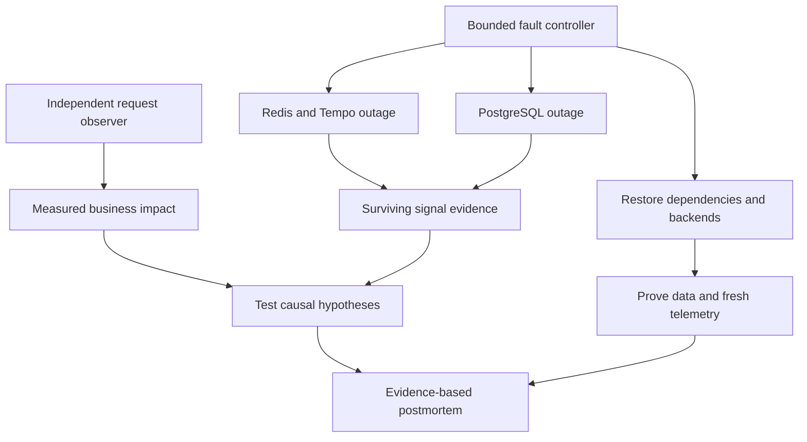

# Lab 50: Capstone Reliability Game Day and Evidence-Based Postmortem

## 1. Purpose and Learning Outcomes

You will run a short, controlled incident exercise with a cache failure, a loss of trace visibility, and an outage of the required database. One role introduces the faults, while another investigates using the signals that still work and a separate request log. Finish by proving that business operations and telemetry have recovered. Then write a postmortem that separates measured impact, causes supported by evidence, and questions that remain unanswered.

> **Primary Objective:** Diagnose overlapping failures using all four telemetry signals, event records, and change evidence. Restore the system safely, verify that durable data still works, and write an incident postmortem whose conclusions are supported by evidence.

This final lab combines failure of the optional cache, loss of trace visibility, and an outage of the required database. Keep an independent record of attempted requests, investigate with the signals still available, and restore the platform. Then use timestamps and known IDs to explain what happened.

Keep the game day local and limited in scope and duration. It does not delete volumes, corrupt data, add Kubernetes, or establish high availability. The fault plan is shown so the exercise can be repeated. With two people, one can run the controller while the other investigates without watching that terminal. You can also complete the exercise alone.

## 2. Starting Point and Lab Map

Open the complete application repository before using this guide. Unless a step says otherwise, run commands in Bash from the repository's top-level folder. Follow the starting checks in order because later commands depend on the helper functions and running services they prepare.

Read each explanation before running its commands. Run one complete code block, check the result, and then continue. In your notebook, save the commands, what happened, why you think it happened, and anything that differed from the expected result.

### Key Terms

| **Term**      | **Explanation**                                                                           |
| ------------- | ----------------------------------------------------------------------------------------- |
| Game day      | A planned incident exercise with clear limits, assigned roles, and recovery steps.        |
| Impact window | The measured period of disruption and the group of requests or users affected.            |
| Postmortem    | A report that uses evidence to explain impact, causes, recovery, and useful improvements. |

### Lab Map

The arrows show how the parts connect and where a request can take different paths. Use this map to understand the design. It is not a recording of a request that actually ran.



## 3. Guided Walkthrough

### Step 01. Prerequisites, Roles and Clean Start

**What You Are Doing:** Confirm that the original release is running after rollback, the protected checkpoint exists, and all services have recovered. Assign control and investigation roles so you can identify who made each change and who recorded each observation.

**Practical Walkthrough:** Check the recorded baseline release, protected backup checkpoint, and health of every service. Assign a controller and investigator before starting, even if you perform both roles yourself. Record who makes each change so you can compare the investigation with an accurate incident timeline later.

Verify the original release after rollback and check the protected checkpoint. Decide who will control faults and who will record explanations to test. Save change times in UTC and keep independent observations. If one person fills several roles, maintain separate records so the reasoning can still be compared with the controller's actual actions.

```bash
source lab-notes/session.sh
source lab-notes/evidence.sh
source lab-notes/metrics-session.sh
source lab-notes/platform-session.sh
source lab-notes/traces-session.sh
source lab-notes/profiling/session.sh
load_app_settings
start_lab 50
umask 077
chmod 700 "$LAB_DIR"
bash lab-notes/operations/validate-platform.sh > "$LAB_DIR/config-validation.log" 2>&1
wait_ready
wait_grafana
wait_backend loki:3100 /ready
wait_backend tempo:3200 /ready
wait_backend pyroscope:4040 /ready
wait_backend otel-collector:13133 /
pq 'up' > "$LAB_DIR/targets-before.json"
dp ps > "$LAB_DIR/containers-before.txt"
```

Complete [Lab 49](Lab-49.md), including rollback to the original image and version, removal of restore targets, and preservation of the protected backup. Keep Lab 46's safe database failure classification and Lab 44's profiling correlation for selected operations. Stop other load generators and leave all fourteen learning-stage services running.

The controller introduces faults and restores services. The investigator records possible explanations and collects evidence. The scribe records UTC change times, decisions, and uncertainty. One person can fill all three roles. Success means explaining the observed impact and recovery from evidence, rather than being the first to name a failed component.

**Abort Conditions:** Stop the exercise if the app restarts unexpectedly, host memory or disk space runs out, the backup is damaged, a stopped service cannot be restored, or errors occur outside the three planned fault targets. Run `dp start redis postgres tempo` to restore Redis, PostgreSQL, and Tempo. Stop the observer, preserve the evidence, and investigate before trying again.

**Understanding the Result:** Investigator observations explain the reasoning, while controller records show what was actually changed. Keep both, including predictions that turned out to be wrong.

### Step 02. Objectives, Architecture and Predictions

**What You Are Doing:** Predict the business response and available telemetry separately for each phase. Losing the trace backend changes what you can observe, but it does not necessarily cause a later business request to fail.

**Practical Walkthrough:** For each phase, predict request outcomes and which signals should remain available. Stopping Redis affects caching, and stopping Tempo affects trace visibility. The later PostgreSQL outage affects access to required business data. Do not assume that an earlier missing trace explains a failure under a different dependency state.

Base each prediction on the dependencies changed in that phase. Treat cache failure, missing trace visibility, and required database failure as separate conditions. Before linking an early telemetry gap to a later business error, find evidence that connects them.

| **Phase**              | **Intended Change**                                          | **Business Prediction**                                                    | **Observability Prediction**                                                             |
| ---------------------- | ------------------------------------------------------------ | -------------------------------------------------------------------------- | ---------------------------------------------------------------------------------------- |
| Baseline               | Leave all services running                                   | Reads and readiness succeed                                                | All signals are available                                                                |
| Cache and trace outage | Stop Redis and Tempo                                         | Reads fall back to PostgreSQL; readiness reports degradation with HTTP 200 | Native metrics, Loki, and profiles remain available; trace export queues data or retries |
| Database outage        | Restart Redis, then stop PostgreSQL while Tempo remains down | Liveness succeeds, but readiness, uncached reads, and list reads fail      | Logs and native metrics show the impact while trace queries remain impaired              |
| Recovery               | Restart PostgreSQL, then Tempo                               | Durable rows can be read and new writes succeed                            | Check fresh trace delivery separately from delivery of older buffered traces             |

Metrics help measure how widespread a problem is and when it occurred. Logs record particular events. Retained traces show request paths, and span events mark points within those paths. Profiles sample CPU work; they are not a log of every request. A failed trace query does not prove that no request occurred. Operator change records add useful context, but they do not automatically become authenticated audit records.

**Prediction Checkpoint:** Write down the first symptom you expect, the most reliable independent signal while Tempo is down, and whether cached item GETs can still succeed while PostgreSQL is down. Also identify alerts that may stay pending because the fault ends before their `for` duration passes. Save these predictions before starting the controller.

Keep the existing signal paths: Prometheus scrapes directly; JSON stdout travels through Docker and the Collector to Loki; app OTLP travels through the Collector to Tempo; and the SDK uploads profiles directly to Pyroscope. Do not add duplicate telemetry paths to compensate for the planned outage.

**Understanding the Result:** Investigate simultaneous faults with separate explanations to test. A failure in visibility can hide evidence without causing the request failure itself.

### Step 03. Create a Known Durable Row and External Observer

**What You Are Doing:** Create one known row in durable storage and start a separate observer that runs for a limited time. It records expected failures as results instead of stopping when the app returns a planned 503 response.

**Practical Walkthrough:** Create the known row, verify it was saved, and start the independent observer. Its request log must keep expected 503 responses. Record transport failures separately from HTTP responses: a zero used by the helper means no HTTP response was received, not that the application returned status code zero.

Confirm that the test row has been committed before starting the observer, and save its ID. Review how the observer records expected `503` responses and connection failures. A placeholder for no HTTP response is not an application status code, so keep the distinction when calculating impact.

```bash
PAYLOAD=$(jq -n --arg name "lab50-$(new_uuid)" '{name:$name,price:"50.00"}')
python3 lab-notes/operations/request_probe.py "$APP_URL" /api/v1/items "$LAB_DIR/created.json" \
  --method POST --body "$PAYLOAD" --expect 201
ITEM_ID=$(jq -er '.response.id' "$LAB_DIR/created.json")
printf '%s\n' "$ITEM_ID" > "$LAB_DIR/item-id.txt"
api -fsS "$APP_URL/api/v1/items/$ITEM_ID" > "$LAB_DIR/item-before.json"
docker inspect --format '{{.Id}} {{.State.StartedAt}} {{.RestartCount}}' "$(dp ps -q app)" > "$LAB_DIR/app-before.txt"
```

**Command Note:** `jq --arg` passes a shell value into a JSON query as a string variable without inserting it into the query text. When used, `-e` returns a failing exit status if the final result is false or null.

```bash
cat > lab-notes/operations/game_monitor.py <<'PYTHON'
"""Bounded, sequential external observer; expected outages remain evidence."""
import argparse,json,secrets,time,uuid
from pathlib import Path
from urllib.error import HTTPError,URLError
from urllib.request import ProxyHandler,Request,build_opener
p=argparse.ArgumentParser();p.add_argument('base_url');p.add_argument('item_id');p.add_argument('output')
p.add_argument('phase_file');p.add_argument('stop_file');p.add_argument('--seconds',type=int,default=240)
a=p.parse_args();assert 30<=a.seconds<=300
uuid.UUID(a.item_id)
paths=['/health/live','/health/ready','/api/v1/items','/api/v1/items/'+a.item_id]
opener=build_opener(ProxyHandler({}));deadline=time.monotonic()+a.seconds
with open(a.output,'x') as output:
    while time.monotonic()<deadline and not Path(a.stop_file).exists():
        for path in paths:
            if Path(a.stop_file).exists() or time.monotonic()>=deadline:break
            rid='game-'+str(uuid.uuid4());trace_id=secrets.token_hex(16)
            phase=Path(a.phase_file).read_text().strip()
            request=Request(a.base_url.rstrip('/')+path,headers={'X-Request-ID':rid,
                'traceparent':f'00-{trace_id}-{secrets.token_hex(8)}-01'})
            start=time.time_ns();status=0;body=None;failure=None;returned_id=None
            try:
                try:response=opener.open(request,timeout=5)
                except HTTPError as error:response=error
                with response:
                    status=response.status;raw=response.read();body=json.loads(raw) if raw else None
                    returned_id=response.headers.get('X-Request-ID')
            except (URLError,TimeoutError,OSError,ValueError) as error:
                failure=type(error).__name__
            output.write(json.dumps({'start_ns':start,'end_ns':time.time_ns(),'phase':phase,
                'path':path,'status':status,'request_id':rid,'returned_request_id':returned_id,
                'trace_id':trace_id,'response':body,'transport_error':failure})+'\n')
            output.flush()
        time.sleep(1)
PYTHON
```

**Command Note:** `<<'PYTHON'` writes the following text into a file until the closing `PYTHON` line. Quoting the delimiter stops Bash from replacing `$variables` in that text. Writing the file and running it are separate steps.

For each attempted liveness, readiness, list, and test-item GET, the observer records timestamps, status, request ID, a synthetic trace parent marked for sampling, and the response body. Expected HTTP 503 responses are useful evidence, so they do not abort the shell. Transport errors are recorded with status zero and a safe error type. Requests run one at a time, pause between cycles, and stop at the deadline or when the stop file appears.

Health endpoints remain untraced, and normal successful business traces still follow the tail-sampling policy. The CPU test requests use the diagnostic policy that deliberately retains their traces, so their returned IDs provide stronger delivery checks. The observer produces a small, controlled sample of traffic; it does not measure every request to the service.

**Understanding the Result:** The observer defines which requests your impact calculation covers. Keep every attempt and its actual result, including expected failures.

### Step 04. Run the Bounded Multi-Fault Controller

**What You Are Doing:** Run the complete controller, with automatic restoration set up before the first fault. Save phase times and the observer's request log so you can compare symptoms with the changes that actually occurred.

**Practical Walkthrough:** Run the entire controller block so recovery handling is installed before a service stops. Keep phase timestamps, operator actions, and the observer log. If a check aborts the scenario, allow recovery to finish and save the partial run before deciding what to do next.

Run the full controller with recovery already prepared before the first stop. Keep phase timestamps, observer output, and operator actions together. If it aborts, let restoration finish and retain the incomplete evidence. Repeating the exercise without saving that run would lose the unexpected result that stopped progress.

```bash
cat > lab-notes/operations/game-day.sh <<'BASH'
game_day() (
  set -euo pipefail
  local phase_file="$LAB_DIR/phase.txt" stop_file="$LAB_DIR/observer.stop"
  local observer_pid=''
  phase() { printf '%s\n' "$1" > "$phase_file.next"; mv "$phase_file.next" "$phase_file"; }
  change() {
    python3 lab-notes/operations/change_event.py "$LAB_DIR/changes.jsonl" "$1" "$2" "$3" --reason "$4"
  }
  recover() {
    dp start redis postgres tempo >/dev/null || printf '%s\n' 'Recovery command failed; investigate immediately.' >&2
    touch "$stop_file"
    if [[ -n $observer_pid ]]; then wait "$observer_pid" || true; fi
  }
  trap recover EXIT
  trap 'exit 130' INT
  trap 'exit 143' TERM
  phase baseline
  python3 lab-notes/operations/game_monitor.py "$APP_URL" "$ITEM_ID" "$LAB_DIR/observer.jsonl" \
    "$phase_file" "$stop_file" --seconds 240 &
  observer_pid=$!
  change begin game-day started 'bounded local multi-fault exercise'
  python3 lab-notes/profiling/profile_load.py "$APP_URL" "$LAB_DIR/baseline-cpu.jsonl" \
    --variant cpu --count 8 --iterations 3000000
  sleep 15
  api -fsS "$APP_URL/metrics" > "$LAB_DIR/metrics-baseline.prom"
  change stop redis-and-tempo intended 'cache fallback and trace visibility loss'
  phase cache-and-traces
  dp stop -t 10 redis tempo
  python3 lab-notes/operations/request_probe.py "$APP_URL" /health/ready "$LAB_DIR/cache-ready.json" --expect 200
  jq -e '.response.status=="degraded" and .response.dependencies.redis=="down"' "$LAB_DIR/cache-ready.json"
  python3 lab-notes/profiling/profile_load.py "$APP_URL" "$LAB_DIR/cache-outage-cpu.jsonl" \
    --variant cpu --count 8 --iterations 3000000
  sleep 15
  api -fsS "$APP_URL/metrics" > "$LAB_DIR/metrics-cache-outage.prom"
  backend otel-collector:8888 /metrics > "$LAB_DIR/collector-cache-outage.prom"
  pq 'application_dependency_up' > "$LAB_DIR/dependencies-cache-outage.json"
  change start redis intended 'restore optional cache before database fault'
  dp start redis
  wait_ready
  change start redis verified 'readiness returned to ready'
  change stop postgres intended 'required persistence unavailable; Tempo remains stopped'
  phase database-and-traces
  dp stop -t 10 postgres
  python3 lab-notes/operations/request_probe.py "$APP_URL" /health/live "$LAB_DIR/db-live.json" --expect 200
  python3 lab-notes/operations/request_probe.py "$APP_URL" /health/ready "$LAB_DIR/db-ready.json" --expect 503
  python3 lab-notes/operations/request_probe.py "$APP_URL" /api/v1/items "$LAB_DIR/db-list.json" --expect 503
  python3 lab-notes/profiling/profile_load.py "$APP_URL" "$LAB_DIR/db-outage-cpu.jsonl" \
    --variant cpu --count 8 --iterations 3000000
  sleep 15
  api -fsS "$APP_URL/metrics" > "$LAB_DIR/metrics-db-outage.prom"
  backend otel-collector:8888 /metrics > "$LAB_DIR/collector-db-outage.prom"
  api -fsS "$PROM_URL/api/v1/alerts" > "$LAB_DIR/alerts-during.json"
  change start postgres intended 'restore required business dependency first'
  phase recovering
  dp start postgres
  wait_ready
  change start postgres verified 'business readiness restored'
  dp start tempo
  wait_backend tempo:3200 /ready
  change start tempo verified 'trace backend ready; delivery checks follow'
  phase recovered
  python3 lab-notes/profiling/profile_load.py "$APP_URL" "$LAB_DIR/recovered-cpu.jsonl" \
    --variant cpu --count 12 --iterations 3000000
  sleep 20
  api -fsS "$APP_URL/metrics" > "$LAB_DIR/metrics-recovered.prom"
  backend otel-collector:8888 /metrics > "$LAB_DIR/collector-recovered.prom"
  touch "$stop_file"
  wait "$observer_pid"
  observer_pid=''
  change end game-day recovered 'faults removed; independent recovery verification follows'
)
BASH
source lab-notes/operations/game-day.sh
game_day
```

**Command Note:** `trap ... EXIT` schedules cleanup when the current shell exits. Keep it in the same block as the fault, and use the explicit checks afterward to confirm that restoration really worked.

The controller runs a limited amount of work and installs restoration traps before stopping services. The planned outage is short enough to examine retry behavior without deliberately filling queues or disks. The observer also has its own four-minute limit. If the external Docker daemon gets stuck, operator investigation is still required; a shell trap cannot guarantee recovery from that problem.

While the controller runs, open another terminal, load the same session helpers, and inspect `dp ps`, `pq`, and Grafana. If you want to save evidence in the current run's directory, do not call `start_lab` there. Set the printed `LAB_DIR` explicitly. Write down your interpretation before looking at `changes.jsonl`.

**Understanding the Result:** The controller timeline shows what changed, while the observer shows the effect on requests. Keep both records; neither can establish the other by itself.

### Step 05. Establish Impact Before Investigating Causes

**What You Are Doing:** Measure impact from the observed requests before deciding on a cause. Compare liveness, readiness, and business results separately. Reaching an exporter is not the same as a user request succeeding.

**Practical Walkthrough:** Use the request log's actual attempts and responses to calculate impact before selecting a root cause. Treat liveness, readiness, and useful business operations as separate outcomes. Exporter reachability describes a monitoring path and cannot replace the business request result in the calculation.

Start with actual attempts and outcomes. Keep liveness, readiness, business success, and exporter reachability separate when interpreting them. This limited observer sample supports a measurement of this exercise's impact. It does not establish a monthly service-level objective or tell you what unobserved users experienced.

```bash
cat > lab-notes/operations/game_summary.py <<'PYTHON'
"""Summarize only the bounded observer population; never infer a monthly SLO."""
import collections,datetime,json,math,sys
from pathlib import Path
root=Path(sys.argv[1]);rows=[json.loads(line) for line in (root/'observer.jsonl').read_text().splitlines()]
assert rows,'No observer evidence'
assert {'baseline','cache-and-traces','database-and-traces','recovered'} <= {r['phase'] for r in rows},'Missing an intended observation phase'
def utc(ns):return datetime.datetime.fromtimestamp(ns/1e9,datetime.timezone.utc).isoformat()
phases={}
for phase in dict.fromkeys(row['phase'] for row in rows):
    selected=[r for r in rows if r['phase']==phase]
    eligible=[r for r in selected if r['path'].startswith('/api/v1/items')]
    failed=[r for r in eligible if r['status']==0 or r['status']>=500]
    durations=sorted((r['end_ns']-r['start_ns'])/1e6 for r in eligible)
    phases[phase]={'eligible_requests':len(eligible),'failed_requests':len(failed),
      'error_fraction':len(failed)/len(eligible) if eligible else None,
      'observed_p95_ms':durations[max(0,math.ceil(len(durations)*.95)-1)] if durations else None,
      'liveness_codes':dict(collections.Counter(str(r['status']) for r in selected if r['path']=='/health/live')),
      'readiness_states':dict(collections.Counter((r['response'] or {}).get('status','transport_error') for r in selected if r['path']=='/health/ready'))}
eligible=[r for r in rows if r['path'].startswith('/api/v1/items')]
failed=[r for r in eligible if r['status']==0 or r['status']>=500]
report={'observation_start':utc(rows[0]['start_ns']),'observation_end':utc(rows[-1]['end_ns']),
        'first_observed_business_failure':utc(failed[0]['start_ns']) if failed else None,
        'last_observed_business_failure':utc(failed[-1]['end_ns']) if failed else None,
        'eligible_requests':len(eligible),'failed_requests':len(failed),'phases':phases,
        'interpretation':'Controlled observer sample only; not production traffic or a monthly SLO.'}
(root/'impact-summary.json').write_text(json.dumps(report,indent=2)+'\n')
print(json.dumps(report,indent=2))
PYTHON
```

```bash
python3 lab-notes/operations/game_summary.py "$LAB_DIR" > "$LAB_DIR/impact-summary-display.json"
cat "$LAB_DIR/impact-summary-display.json"
pq 'sum(rate(application_http_requests_total{route=~"/api/v1/items.*",status_code=~"5.."}[5m]))' \
  > "$LAB_DIR/business-error-rate.json"
pq 'application_dependency_up' > "$LAB_DIR/dependencies-after.json"
pq 'pg_up{job="postgres"}' > "$LAB_DIR/postgres-exporter-after.json"
pq 'redis_up{job="redis"}' > "$LAB_DIR/redis-exporter-after.json"
```

Compare the observer's liveness status codes, readiness states, and business failures with native metrics. A successful `up` scrape means Prometheus reached that target. An exporter may still be reachable while `pg_up` or `redis_up` says its dependency is unavailable. The app's dependency gauge is another observation source and updates on its own probe schedule.

The summary's denominator is the number of list and item reads attempted by this observer. It excludes health probes, CPU exercises, and setup or cleanup writes. Status zero counts as a failed attempt in this limited availability measurement, while 5xx means an HTTP server failure. Report the actual counts and observation period. Do not turn this exercise into a monthly error-budget estimate or invent a number of affected customers.

The first failed sample tells you when this observer first detected a failure; user impact may have started earlier. A request may also start in one phase and finish in another. Five-minute PromQL rates combine several phases and other eligible traffic. The JSONL summary instead assigns each request to the phase in which it started, so the two views may differ.

**Understanding the Result:** Use the actual number of measured requests and explain any missing observations. Do not add imagined successes or failures to produce a cleaner percentage.

### Step 06. Use Logs, Span Events and Change Context to Test Hypotheses

**What You Are Doing:** Test possible explanations using known request IDs, dependency state changes, span events, and change records. Allow for the different schedules on which each observer collects information.

**Practical Walkthrough:** Compare possible explanations against known IDs, dependency transitions, span events, and recorded changes. Align the evidence while accounting for scraping, rule evaluation, delivery, and sampling delays. A signal appearing later does not necessarily mean that the underlying event happened later.

Write down competing explanations, then check each against exact IDs, dependency transitions, span events, and change times. Consider how long each signal takes to observe and deliver an event. A later visible sample may describe an earlier event, so timestamp order on the screen is not enough to establish cause and effect.

```bash
RID=$(jq -er '.request_id' "$LAB_DIR/db-list.json")
START_NS=$(jq -er '.start_ns' "$LAB_DIR/created.json")
END_NS=$(python3 -c 'import time; print(time.time_ns())')
QUERY="{service_name=\"$LAB_SERVICE\",deployment_environment_name=\"$LAB_ENVIRONMENT\"} | json | request_id=\"$RID\""
backend loki:3100 /loki/api/v1/query_range query "$QUERY" start "$START_NS" end "$END_NS" limit 100 \
  > "$LAB_DIR/failed-request-logs.json"
jq -e '[.data.result[].values[]] | length>0' "$LAB_DIR/failed-request-logs.json"
dp logs --since "$(cat "$LAB_DIR/started-at.txt")" --no-color app > "$LAB_DIR/app-incident.log"
dp logs --since "$(cat "$LAB_DIR/started-at.txt")" --no-color otel-collector > "$LAB_DIR/collector-incident.log"
for phase in baseline cache-outage db-outage recovered; do
  TRACE_ID=$(jq -rs '.[0].response.trace_id' "$LAB_DIR/$phase-cpu.jsonl")
  if fetch_trace "$TRACE_ID" "$LAB_DIR/$phase-trace.json"; then
    python3 lab-notes/tracing/inspect_trace.py "$LAB_DIR/$phase-trace.json" > "$LAB_DIR/$phase-spans.json"
  else
    printf '%s\n' "$TRACE_ID not observed by query deadline" > "$LAB_DIR/$phase-trace-missing.txt"
  fi
done
```

Find the database failure log for the known request, with sensitive details removed, and the dependency state-change records. The state-change log may appear after the first failed request because the background probe runs periodically. Several request failures and one dependency transition are different events; do not count them as the same observation.

Check the CPU-worker span events and their order in the normalized traces. Separately get the failed business request's `trace_id` from `db-list.json`. The error policy should retain that trace if transport delivery succeeds. A refused connection may happen before any SQL query span is created, so do not claim that a query ran without evidence.

Compare traces sent during the outage with fresh traces sent after recovery. Older traces arriving after Tempo returns support the idea that data was buffered. If traces are missing, investigate rejected data, full queues, expired retries, or a lost process. The known CPU retention policy reduces uncertainty about sampling, but transport may still fail. Review Collector snapshots from both the outage and recovery; an empty queue at the end does not prove that no data was lost.

Record your evidence-supported explanation before comparing it with the operator journal. Separate the time a service was stopped, the time its dependency became unavailable, the failed request, the written log, and the later alert-state change. These events are connected, but their timestamps describe different things.

**Understanding the Result:** Separate when an event happened from when it was observed. Matching exact IDs connects evidence more reliably than aligning nearby points on a chart.

### Step 07. Use Profiles to Explain Work and Validate Correlation

**What You Are Doing:** Inspect CPU profiles that remained available during the outage, then examine the more specific profile evidence for recovery spans. Profiles show sampled computation even when missing traces limit your view of the request path.

**Practical Walkthrough:** Use surviving CPU profiles to understand computation, and profiles matched to exact recovery spans to inspect those particular operations. Profiles may remain available while Tempo is down, but they do not replace the missing request path. CPU samples cannot reconstruct every period spent waiting for a dependency.

Identify the profile window that overlaps the incident and the window for the new recovery operation. For the recovery profile, check the service identity, profile type, time range, and selected worker span against the saved request record. Explain the computation you can see. Leave dependency waits unresolved when they were not observed; a CPU profile does not supply the full sequence from a missing trace.

```bash
PROFILE_TYPE=$(cat lab-notes/profiling/profile-type.txt)
START_MS=$(jq -rs '(.[0].start_ns / 1000000 | floor)-10000' "$LAB_DIR/recovered-cpu.jsonl")
END_MS=$(python3 -c 'import time; print(time.time_ns()//1000000)')
SPAN_ID=$(jq -rs '.[0].response.span_id' "$LAB_DIR/recovered-cpu.jsonl")
SELECTOR="{service_name=\"$LAB_SERVICE\",environment=\"$LAB_ENVIRONMENT\",workload=\"cpu\"}"
BODY=$(jq -n --arg selector "$SELECTOR" --arg type "$PROFILE_TYPE" \
  --argjson start "$START_MS" --argjson end "$END_MS" \
  '{profileTypeID:$type,labelSelector:$selector,start:$start,end:$end}')
pquery SelectMergeStacktraces "$BODY" > "$LAB_DIR/recovered-profile.json"
jq -e '(.flamegraph.total // 0 | tonumber)>0' "$LAB_DIR/recovered-profile.json"
SPAN_BODY=$(jq --arg span "$SPAN_ID" '. + {spanSelector:[$span]}' <<< "$BODY")
pquery SelectMergeStacktraces "$SPAN_BODY" > "$LAB_DIR/recovered-span-profile.json"
jq '(.flamegraph.total // 0 | tonumber)' "$LAB_DIR/recovered-span-profile.json"
```

Allow ten seconds on either side of each recorded window so the query includes the relevant upload buckets. Repeat the aggregate query with the timestamps from each outage CPU ledger, and keep those results separate from recovery profiles matched to exact spans. Profiles upload directly to Pyroscope and can remain available while Tempo is down. Compare CPU loop frames with `thread_cpu_ms` and `wall_ms`. An unrelated diagnostic loop in a profile does not prove that CPU saturation caused a database connection failure.

Statistical sampling may capture no samples for an individual span. If the first span profile is empty, choose another recorded worker span from the same limited batch and state that sampling limitation. A nonzero aggregate profile is needed to prove collection worked. A nonzero result for an exact span proves the more specific correlation introduced in Lab 44. Before using Grafana's trace-to-profile link, verify that `pyroscope.profile.id` in the retained worker span matches the selected span ID.

**Understanding the Result:** Each available signal answers a particular question. Explain what remains unknown because trace evidence was unavailable or not retained.

### Step 08. Prove Business, Storage and Telemetry Recovery

**What You Are Doing:** After restoration, check durable data, new business operations, all expected targets, and fresh telemetry. Treat missing historical data and alerts that still include the outage window as separate questions from current health.

**Practical Walkthrough:** Verify the known durable row, new writes and reads, every expected target, and fresh telemetry. Separate present recovery from gaps in past evidence. Alerts based on longer time windows may still reflect earlier failures even after the service is healthy again.

Read the saved rows and perform fresh useful transactions, then check every expected target and send new telemetry test requests. Keep historical delivery gaps separate from present operation. Recovery does not automatically fill missing evidence or immediately remove old failures from calculations that cover a longer period.

```bash
wait_ready
wait_grafana
wait_backend loki:3100 /ready
wait_backend tempo:3200 /ready
wait_backend pyroscope:4040 /ready
wait_backend otel-collector:13133 /
docker inspect --format '{{.Id}} {{.State.StartedAt}} {{.RestartCount}}' "$(dp ps -q app)" > "$LAB_DIR/app-after.txt"
diff -u "$LAB_DIR/app-before.txt" "$LAB_DIR/app-after.txt"
rcli DEL "$(cache_key "$ITEM_ID")" > /dev/null
api -fsS "$APP_URL/api/v1/items/$ITEM_ID" > "$LAB_DIR/item-recovered.json"
jq -e '.price=="50.00"' "$LAB_DIR/item-recovered.json"
UPDATE=$(jq '{name,description,price:"51.00"}' "$LAB_DIR/item-recovered.json")
python3 lab-notes/operations/request_probe.py "$APP_URL" "/api/v1/items/$ITEM_ID" "$LAB_DIR/update-recovered.json" \
  --method PUT --body "$UPDATE" --expect 200
rcli DEL "$(cache_key "$ITEM_ID")" > /dev/null
api -fsS "$APP_URL/api/v1/items/$ITEM_ID" > "$LAB_DIR/item-updated-from-db.json"
jq -e '.price=="51.00"' "$LAB_DIR/item-updated-from-db.json"
wait_metric 'pg_up{job="postgres"}' 1
wait_metric 'redis_up{job="redis"}' 1
wait_metric 'application_dependency_up{dependency="postgres"}' 1
wait_metric 'application_dependency_up{dependency="redis"}' 1
pq 'up' > "$LAB_DIR/targets-final.json"
api -fsS "$PROM_URL/api/v1/alerts" > "$LAB_DIR/alerts-final.json"
api -fsS "${ALERTMANAGER_URL:-http://127.0.0.1:9093}/api/v2/alerts" > "$LAB_DIR/alertmanager-final.json"
dp ps > "$LAB_DIR/containers-final.txt"
python3 lab-notes/operations/request_probe.py "$APP_URL" "/api/v1/items/$ITEM_ID" "$LAB_DIR/delete-fixture.json" \
  --method DELETE --expect 204
python3 lab-notes/operations/request_probe.py "$APP_URL" "/api/v1/items/$ITEM_ID" "$LAB_DIR/fixture-absent.json" --expect 404
python3 lab-notes/operations/change_event.py "$LAB_DIR/changes.jsonl" verify platform completed \
  --reason 'durable read/write, unchanged app process, dependency and telemetry checks recorded'
```

Check every configured scrape target, not only whether the Prometheus HTTP endpoint responds. Compare pending, firing, and resolved alerts with their configured thresholds and evaluation intervals. A short fault may end before its `for` duration is satisfied, which is not automatically an alerting bug. A rate-based alert can also remain active after recovery until the earlier failures leave its calculation window.

Use the recovered CPU request ID to find a fresh Loki record, and its returned trace ID to find a fresh retained trace. Check the new profile and native metrics as well. Investigate older buffered data separately. Confirm that the observer has exited, all planned faults are removed, and the app was not restarted to hide a connection-pool or recovery problem.

**Understanding the Result:** Fresh test requests show that the system works now. They do not recreate missing incident records or undo the error budget already used by earlier failures.

### Step 09. Write the Evidence-Based Postmortem

**What You Are Doing:** Write the postmortem from saved timestamps and evidence references. State any gaps clearly, and connect proposed improvements to a failure mechanism or investigation limit that the exercise demonstrated.

**Practical Walkthrough:** Fill in the existing postmortem template using recorded times, measured impact, and references to evidence. Separate established causes from explanations that remain unverified. Link each improvement to a demonstrated problem, and keep the template's structure so reports from different runs are easy to compare.

Use the observer summary for Scope and Impact. Build the UTC timeline from controller changes and measured symptoms. In Causal Analysis, support each explanation with an artifact or exact request ID. Give every corrective action an owner, due date, and result that will show whether it worked. Put unanswered questions in Telemetry Gaps instead of guessing missing times or lost-record counts.

Create `postmortem.md` in this run's `LAB_DIR`. Follow the structure below, replacing each instruction with your measured finding and a reference to its evidence file. Leave uncertainty visible rather than inventing timing, data-loss counts, or customer impact to complete the report.

```markdown
# Reliability Game Day Postmortem

## Executive Summary
Describe the observed business impact, visibility impairment, restoration and current state.

## Scope and Impact
State the observer window, eligible request count, failures and denominator exclusions.
Separate cached-read availability from required database functionality.
Explain what real customer impact cannot be inferred from this controlled sample.

## Timeline in UTC
| **Time** | **Observation or Action** | **Evidence** | **Interpretation and Confidence** |
| -------- | ------------------------- | ------------ | --------------------------------- |

Include the last healthy observation, each change, first detected symptom,
mitigation decisions, business recovery and verified telemetry recovery.

## Detection and Investigation
Explain the first useful signal, misleading indicators and competing hypotheses.
Reference metrics, specific log records, trace/span events and profile evidence.

## Causal Analysis
Separate the injected triggering actions from application behavior and contributing conditions.
Explain cache fallback, required persistence, connection handling and trace buffering.
Distinguish the actual failure from delayed or missing records about that failure.

## Recovery and Data Integrity
Cite uncached reads, successful writes, exporter/dependency health and process identity.
State what the backup/restore checkpoint would protect if state recovery were necessary.

## Telemetry Gaps and Uncertainty
Identify unavailable queries, delayed delivery, unknown loss and sampling limitations.
Do not label all missing traces as lost or all recovered queues as lossless.

## What Helped and What Slowed Diagnosis
Tie each finding to an observed decision or evidence gap.

## Corrective Actions
| **Priority** | **Concrete Action** | **Owner** | **Due Date** | **Verification** | **Expected Benefit** |
| ------------ | ------------------- | --------- | ------------ | ---------------- | -------------------- |

Choose a small number of actions addressing demonstrated weaknesses.

## Evidence Index
Map each claim to an artifact, request ID, trace/span ID, query window or change event.

## Follow-Up Review
State who will verify completed actions and when the exercise will be repeated.
```

A useful causal statement explains the mechanism and its evidence: the required database was stopped, uncached reads returned the safe database error, liveness stayed healthy, and uncached reads worked again after PostgreSQL returned. Saying only that the database was down leaves out the link between the fault, request behavior, and recovery.

Choose corrective actions with results you can test. Examples include an external check that detects monitoring outages, a retry-budget alert tested against actual queue metrics, or a written schedule for restore rehearsals. Assign a real owner and date. Broad advice such as improving monitoring or being more careful does not provide a result you can verify.

Do not blame someone for carrying out the agreed fault plan. Use the exercise to assess system behavior and response procedures. Check whether the existing runbooks explained why a cached read might still succeed and why business recovery can happen before telemetry recovery is complete.

**Understanding the Result:** A clearly stated gap is more useful than a made-up explanation. Another reader should be able to follow the retained evidence and understand how you reached the final account.

## 4. Troubleshooting and Diagnosis

Begin with the first result that differed from your prediction. Save the exact error or symptom and identify which service or command produced it. Use the checks below, make the needed fix, and repeat the original check to confirm the problem is resolved.

### Troubleshooting and Optional Extensions

| **Unexpected Result**                           | **Check Before Changing the System**                                                                                                             |
| ----------------------------------------------- | ------------------------------------------------------------------------------------------------------------------------------------------------ |
| Redis outage makes readiness HTTP 503           | Check PostgreSQL health, whether another fault was introduced, and the existing readiness logic                                                  |
| DB outage causes liveness failure               | Check the app process identity, whether the event loop is blocked, and host resource pressure; abort if the problem is outside the planned scope |
| Cached GET succeeds while readiness fails       | Check the cache key and time to live; perform an uncached read before claiming the database recovered                                            |
| No trace for successful item GET                | Check the tail-sampling policy and delivery separately; use the CPU test request whose trace is deliberately retained                            |
| No failure alert fired                          | Inspect the rule, actual evaluation times, and required `for` duration                                                                           |
| Profile does not explain failed request latency | CPU samples show executing work and do not measure every interval spent waiting                                                                  |
| Restore commands do not recover a target        | Check configuration, disk space, and service logs; save the failure evidence and use Lab 49's checkpoints with a clear recovery plan             |
| Timeline appears inconsistent                   | Check UTC conversion, clock synchronization, request start/end times, and ingestion delay                                                        |

After finishing the required run, repeat it once with an investigator who has not seen the controller's timing. Use the same limited faults and compare diagnosis time and evidence quality. Keep extensions within these boundaries; do not add disk deletion, arbitrary network disruption, or unlimited CPU load.

For another useful exercise, ask a reader to check the postmortem against its evidence index. Have them challenge one cause-and-effect claim, one impact calculation, and one data-loss claim. Correct statements that lack support and record what extra measurement would answer each unresolved question.

## 5. Review and Practice

Answer the questions in your own words before reading the answers. For the scenario, say what you would inspect and exactly what each result would tell you.

### Knowledge Check

1. Why separate business recovery from telemetry recovery?
2. Why is an event not the same thing as its log record?
3. What can the observer error fraction legitimately describe?
4. What makes a corrective action testable?

#### Answer Guide

1. Requests may work again while queues are still draining, older records remain missing, or a telemetry backend still cannot answer queries.
2. The event happens before its record is written, transported, or stored, and the record may be lost along the way. These stages have different timestamps and guarantees.
3. It describes only the measured requests within the stated time window, subject to the listed exclusions and limits of the sample.
4. It names a specific change, responsible owner, due date, expected benefit, and observable result that will verify completion.

### Professional Scenario Exercise

Present a ten-minute incident review to an engineering team. Start with the measured behavior users would see, then show the smallest set of evidence that explains the failure. Name one conclusion you cannot yet support and the measurement needed to support it. Ask reviewers to judge whether the corrective actions address the failure modes you actually observed.

## 6. Completion Checklist

Tick an item only when you can show its result or saved evidence. Finish the cleanup instructions before starting the next lab.

### Observable Completion Criteria

- [ ] Predictions and successful starting checks were saved before any faults were introduced.
- [ ] An independent observer measured the overlapping Redis/Tempo outage and the later PostgreSQL outage.
- [ ] The business-impact calculation states which requests it includes and the limits of its observation period.
- [ ] The investigation uses metrics, specific event records, traces and span events, profiles, and change records as evidence.
- [ ] Recovery checks show the same app process, successful uncached reads of durable data, and a successful write.
- [ ] Every target, telemetry for known IDs, and cleanup of test data have been checked.
- [ ] The completed postmortem links conclusions to evidence and assigns corrective actions with verifiable results.

## 7. Production Context and Next Lab

### Production Implications

Professional reliability work combines useful telemetry with controlled changes, safe recovery, clear statements of uncertainty, and learning from incidents. A single-node game day cannot guarantee availability, but it can reveal weak assumptions before a larger deployment. Protect the evidence, rehearse recovery regularly, and test corrective actions under realistic conditions.

### End State and Transition

This completes the fifty-lab curriculum. Leave the platform healthy with the baseline release active. Remove lab-created test data and temporary restore targets, and retain backups and evidence securely. Your final deliverables are the completed postmortem and a verified action list, supported by a repository you can inspect, operate, and extend.
